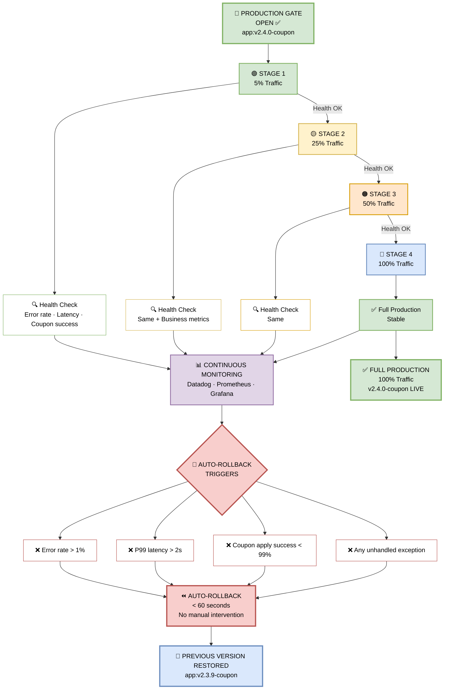

## 🐤 Step 10 — Canary Release to Production

> **The canary release. Traffic ramps 5% → 25% → 50% → 100%. If health checks fail at any stage, automatic rollback in under 60 seconds.**


*Figure 13 — The canary release. Traffic ramps 5% → 25% → 50% → 100%. If health checks fail at any stage, automatic rollback in under 60 seconds.*

---

### 📊 The Ramp

| Stage | Traffic | Health Check |
|-------|---------|--------------|
| **1** | 5% | Error rate, latency, coupon success rate |
| **2** | 25% | Same + business metrics |
| **3** | 50% | Same |
| **4** | 100% | Full production |

---

### 🖼️ Visual Diagram — Canary Flow



---

### 🔍 Deep Dive — The Ramp

#### 🟢 Stage 1 — 5% Traffic (Canary)

**Duration:** 5 minutes  
**What's monitored:**

| Metric | Threshold |
|--------|-----------|
| Error rate | < 1% |
| P99 latency | < 2s |
| Coupon apply success rate | > 99% |

**Coupon Feature Example:**
```
5% of users → coupon-api-canary:v2.4.0-coupon

✓ 250 coupon applies in 5 min
✓ Error rate: 0.2%
✓ P99 latency: 340ms
✓ Coupon success rate: 99.8%
→ Stage 1 PASS → Ramp to 25%
```

---

#### 🟡 Stage 2 — 25% Traffic

**Duration:** 5 minutes  
**Additional checks:** Business metrics

| Metric | Threshold |
|--------|-----------|
| Coupon conversion rate | ≥ baseline |
| Cart abandonment | ≤ baseline + 2% |
| Revenue impact | Neutral or positive |

**Coupon Feature Example:**
```
25% of users → coupon-api-canary:v2.4.0-coupon

✓ 1,250 coupon applies in 5 min
✓ Error rate: 0.3%
✓ P99 latency: 380ms
✓ Conversion rate: +2% vs baseline
✓ Cart abandonment: -1% vs baseline
→ Stage 2 PASS → Ramp to 50%
```

---

#### 🟠 Stage 3 — 50% Traffic

**Duration:** 5 minutes  
**Same checks as Stage 2, but at scale.**

**Coupon Feature Example:**
```
50% of users → coupon-api-canary:v2.4.0-coupon

✓ 2,500 coupon applies in 5 min
✓ Error rate: 0.25%
✓ P99 latency: 350ms
✓ No memory leaks
→ Stage 3 PASS → Ramp to 100%
```

---

#### 🔵 Stage 4 — 100% Traffic

**Duration:** Permanent  
**Action:** Canary becomes the new production baseline.

**Coupon Feature Example:**
```
100% of users → coupon-api:v2.4.0-coupon

✅ v2.4.0-coupon is now LIVE
✅ Previous version (v2.3.9-coupon) kept warm for 24h (fast rollback)
✅ Monitoring continues for 24h
```

---

### 🚨 Auto-Rollback Triggers

If **any** of these fire during the ramp, the pipeline **automatically rolls back** to the previous version:

| # | Trigger | Threshold |
|---|---------|-----------|
| 1 | **Error rate** | > 1% |
| 2 | **P99 latency** | > 2s |
| 3 | **Coupon apply success rate** | < 99% |
| 4 | **Unhandled exception** | Any occurrence |

> ⏪ **Rollback time: < 60 seconds. No manual intervention. Previous version restored automatically.**

---

### ⏪ How Auto-Rollback Works

```yaml
# Rollback steps (automated)
1. Detect trigger breach (Prometheus alert)
2. Stop traffic ramp immediately
3. Route 100% traffic → previous version (v2.3.9-coupon)
4. Verify health of previous version
5. Post Slack alert to #devops-incidents
6. Create Jira incident ticket
7. Preserve canary logs for root cause analysis
```

**SLA:** < 60 seconds from trigger detection to full rollback.

---

### 🎯 Manager-Friendly Summary

| Question | Answer |
|----------|--------|
| **What is a canary release?** | Gradual traffic shift (5% → 100%) to a new version |
| **Why canary?** | Limits blast radius — only 5% of users affected if buggy |
| **How long does the full ramp take?** | ~20 minutes (4 stages × 5 min) |
| **What if something breaks?** | Auto-rollback in < 60 sec — no manual action |
| **What's monitored?** | Error rate, latency, coupon success rate, business metrics |
| **What's the safety net?** | Previous version kept warm for 24h for instant rollback |

---

### 🛠️ Pipeline Configuration Snippet

```yaml
name: Canary Release

on:
  workflow_run:
    workflows: ["Production Deploy"]
    types: [completed]
    branches: [main]

jobs:
  canary:
    runs-on: ubuntu-latest
    steps:
      - name: Deploy Canary (5%)
        run: |
          kubectl apply -f canary-5.yaml

      - name: Monitor Stage 1 (5 min)
        run: |
          ./scripts/monitor.sh \
            --error-threshold 0.01 \
            --latency-threshold 2.0 \
            --success-threshold 0.99 \
            --duration 300

      - name: Ramp to 25%
        run: kubectl apply -f canary-25.yaml

      - name: Monitor Stage 2 (5 min)
        run: ./scripts/monitor.sh --duration 300

      - name: Ramp to 50%
        run: kubectl apply -f canary-50.yaml

      - name: Monitor Stage 3 (5 min)
        run: ./scripts/monitor.sh --duration 300

      - name: Ramp to 100%
        run: kubectl apply -f canary-100.yaml

      - name: Verify Full Production
        run: ./scripts/verify.sh --duration 300

      - name: Rollback on Failure
        if: failure()
        run: |
          kubectl apply -f rollback.yaml
          ./scripts/notify.sh --channel devops-incidents
```

---

### 🛠️ Troubleshooting Canary Failures

| Error | Cause | Fix |
|-------|-------|-----|
| `Error rate > 1%` | New code has bug | Auto-rollback; fix; re-promote |
| `P99 latency > 2s` | Performance regression | Auto-rollback; optimize; re-promote |
| `Coupon success < 99%` | Coupon logic broken | Auto-rollback; debug; re-promote |
| `Unhandled exception` | Edge case missed | Auto-rollback; add test; re-promote |
| `Rollback failed` | Previous version unhealthy | Manual intervention; escalate to on-call |

---

> 📝 **Note:** The canary release is your **safety net in production**. It limits blast radius, catches regressions early, and rolls back automatically. Never deploy without it.