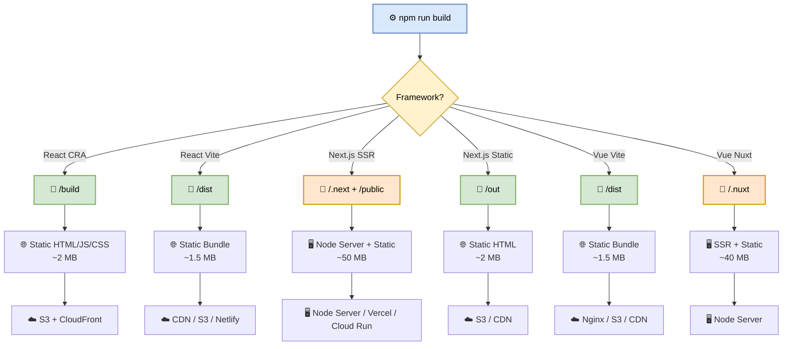

# PR-CI-Pipeline
## STAGE - 2 

**Author:** Shubham Tripathi  
**Repository:** `ecom-frontend` (Next.js 14 · App Router · TypeScript)  
**Last Updated:** 2026-09-18  
**Audience:** Frontend Engineers, Reviewers, Tech Leads, QA, DevOps

---

## 📑 Table of Contents

1. [The Trigger — Ticket → PR → Pipeline](#-the-trigger--ticket--pr--pipeline)
2. [The Four Parallel Jobs](#-the-four-parallel-jobs)
   - [Build Stage](#-build-stage)
   - [Lint Stage](#-lint-stage)
   - [Security Scans](#-security-scans)
   - [Unit & Integration Tests](#-unit--integration-tests)
3. [Quality Gate](#-quality-gate)
4. [Framework-Specific Build Steps (Stage 2)](#-framework-specific-build-steps-stage-2)
5. [Merge & Official CI Build](#-merge--official-ci-build)
6. [Promotion Ladder — DEV → QA → STAGING](#-promotion-ladder--dev--qa--staging)
7. [Canary Release to Production](#-canary-release-to-production)
8. [Reference Tables](#-reference-tables)
9. [Troubleshooting](#-troubleshooting)
10. [Governance](#-governance)
11. [Repository Structure](#-repository-structure)

---

## 🔄 The Flow, at a Glance

> **Ticket → Branch → Code → Push → PR → Pipeline fires → Gates pass → Merge → Deploy → Live.**

That's it. Let me walk through each part.

---

## 🚦 Before You Push

Do this **every time**. It saves CI runs and saves you waiting.

```bash
git checkout main
git pull origin main
git checkout -b feature/coupon-checkout

# write your code

npm ci
npm run lint
npx tsc --noEmit
npm test
npm run build

# only push when everything is green
git add .
git commit -m "feat(coupon): add coupon input to checkout"
git push origin feature/coupon-checkout
```

> ⚠️ **If it fails locally, it'll fail in CI too. Fix it before pushing.**

---

## 📬 Opening the PR

When you open the PR, **two things happen in parallel**:

1. A **human reviewer** looks at your code.
2. The **PR-CI-Pipeline** starts automatically.

You don't click anything. **GitHub fires a webhook**, Azure DevOps picks it up, and the pipeline begins **in under 5 seconds**.

---

## 🧩 The Four Parallel Jobs

The pipeline runs **four jobs in parallel**:

| Job | Purpose | Duration |
|-----|---------|----------|
| **Build** | Compiles the app | ~90 sec |
| **Lint** | Checks code style | ~45 sec |
| **Scans** | Six security layers | ~2 min |
| **Tests** | Unit and integration | ~3 min |

> ⏱️ **Total: about 7 minutes.**  
> If they ran sequentially, it'd be closer to **20 minutes**.

Each job runs on its **own fresh agent**, so nothing leaks between them.

> ❌ If any job fails, **the PR is blocked**. Fix it, push again, pipeline re-runs.

---

### 🏗️ Build Stage

Runs `npm ci` then `npm run build`. Output depends on the framework:

| Framework | Output Directory |
|-----------|------------------|
| React (CRA) | `build/` |
| React (Vite) | `dist/` |
| Next.js (SSR) | `.next/` |
| Next.js (static export) | `out/` |
| Vue | `dist/` |
| Nuxt | `.nuxt/` |

For the **coupon feature**, the build takes about **90 seconds** and produces a **~48 MB `.next/` folder**. That gets uploaded as an **artifact**.

> ⚠️ If the build fails, the pipeline stops. Usually it's a **TypeScript error**, a **missing dep**, or a **bad import path**.

---

### 🧹 Lint Stage

Every file type gets its own linter:

| File Type | Linter |
|-----------|--------|
| `.js` `.ts` `.tsx` | ESLint + Biome |
| `.py` | pylint + flake8 |
| `.yml` | yamllint |
| `.json` | jsonlint |
| `.css` `.scss` | csslint |
| `.md` | markdownlint |
| `.java` | checkstyle |

> ⏱️ Takes about **45 seconds**.  
> ❌ Any **error** blocks the merge.  
> ⚠️ **Warnings** are logged but don't block.

**Tip:** Run `npm run lint --fix` locally to auto-fix most issues.

---

### 🔐 Security Scans

**Six layers** run in parallel. Each one targets something different:

| # | Scan | Purpose |
|---|------|---------|
| 1 | **Secret scan** (gitleaks) | Catches hardcoded API keys |
| 2 | **SCA** (BlackDuck, Snyk) | Checks dependencies for CVEs |
| 3 | **SAST** (SonarQube, Checkmarx) | Finds insecure code patterns |
| 4 | **Container scan** (trivy) | Checks the Docker base image |
| 5 | **IAC scan** (checkov) | Checks infrastructure config |
| 6 | **DAST** (ZED Proxy) | Runs against staging, finds runtime exploits |

**Severity gate:**

| Severity | Action |
|----------|--------|
| 🔴 Critical / High | **Blocks merge** — must fix |
| 🟡 Medium | Warning, logged |
| 🟢 Low | Logged to dashboard |

> 💡 **Real example from a past PR:** SAST caught a **SQL injection** in the coupon lookup query. That's the kind of thing these scans exist for.

---

### 🧪 Unit & Integration Tests

Framework-specific runners:

| Framework | Test Runner |
|-----------|-------------|
| React | Jest + React Testing Library |
| Next.js | Jest + RTL + next-router-mock |
| Vue | Vitest + Vue Test Utils |
| Nuxt | Vitest + @nuxt/test-utils |

**E2E tests** run via **Cypress** or **Playwright**.

**Coverage thresholds:**

| Metric | Threshold |
|--------|-----------|
| Line | 80% |
| Branch | 70% |
| Function | 85% |
| Critical path | **100% (blocking)** |

> ⏱️ Takes about **3 minutes**.

---

## 🚧 Quality Gate

This is the **decision point**. All four jobs must pass:

- ✅ **Build**
- ✅ **Lint**
- ✅ **Scans** (no Critical/High)
- ✅ **Tests**

If everything's green, **the PR can merge**.  
If not, you get a **comment on the PR** telling you exactly what failed.

> 🛑 **Do not try to bypass the gate.** Branch protection will stop you anyway.

---

## 🖼️ Framework-Specific Build Steps (Stage 2)

> **Why this stage matters:** A React build is ~2MB of static files.  
> A Next.js SSR build is a Node server + `.next` directory (~50MB).  
> They deploy to **completely different targets**.  
> **Your pipeline must handle both.**

### 📊 Framework Build Matrix

Here's what `npm run build` actually produces per framework — critical for your manager to understand **why the artifact paths differ**.

| Framework | Build Command | Output Dir | Artifact Type | Deploy Target |
|-----------|---------------|------------|---------------|---------------|
| **React (CRA)** | `npm run build` | `/build` | Static HTML/JS/CSS | S3 + CloudFront, Azure Storage, Nginx |
| **React (Vite)** | `npm run build` | `/dist` | Static bundle | CDN, S3, Netlify |
| **Next.js (SSR)** | `npm run build` | `/.next` + `/public` | Server + static | Node server, Vercel, Cloud Run |
| **Next.js (Static Export)** | `next build && next export` | `/out` | Static HTML | S3, CDN |
| **Vue (Vite)** | `npm run build` | `/dist` | Static bundle | Nginx, S3, CDN |
| **Vue (Nuxt)** | `npm run build` | `/.nuxt` | SSR + static | Node server |

---

### 🖼️ Visual Diagram — Build Output Flow



---

### 🧠 Deep Dive — Why Output Paths Differ

#### 1️⃣ Static Builds (React, Vue, Next.js Static)

These produce **plain HTML/CSS/JS** that can be dropped onto any CDN or static host.

- **Size:** ~1.5 – 2 MB (after minification + gzip)
- **Deploy:** Just upload the folder
- **Rollback:** Swap the folder — instant
- **Cost:** Cheap (CDN pennies)

```bash
# React (CRA)
npm run build          # → /build

# React (Vite)
npm run build          # → /dist

# Vue (Vite)
npm run build          # → /dist

# Next.js (Static Export)
next build && next export   # → /out
```

#### 2️⃣ SSR Builds (Next.js SSR, Nuxt)

These produce a **Node.js server** plus a static asset folder. You can't just drop them on S3 — they need a **running process**.

- **Size:** ~40 – 50 MB (server + assets)
- **Deploy:** Node server (Vercel, Cloud Run, EC2, Docker)
- **Rollback:** Redeploy previous container image
- **Cost:** Higher (compute + memory)

```bash
# Next.js (SSR)
npm run build          # → /.next + /public

# Vue (Nuxt)
npm run build          # → /.nuxt
```

---

### 📦 Artifact Handling in CI/CD

Each framework's artifact must be **uploaded with a unique name** so the deploy stage knows what it's dealing with:

```yaml
- name: Upload Build Artifact
  uses: actions/upload-artifact@v4
  with:
    name: ${{ matrix.framework }}-artifact-${{ github.sha }}
    path: ${{ matrix.output_dir }}
    retention-days: 7
    if-no-files-found: error
```

**Example artifact names:**

| Framework | Artifact Name |
|-----------|---------------|
| React CRA | `react-cra-artifact-a1b2c3d` |
| React Vite | `react-vite-artifact-a1b2c3d` |
| Next.js SSR | `nextjs-ssr-artifact-a1b2c3d` |
| Next.js Static | `nextjs-static-artifact-a1b2c3d` |
| Vue Vite | `vue-vite-artifact-a1b2c3d` |
| Vue Nuxt | `vue-nuxt-artifact-a1b2c3d` |

---

### 🎯 Manager-Friendly Summary

| Question | Answer |
|----------|--------|
| **Why do artifact paths differ?** | Each framework compiles to a different output structure — static vs server |
| **Why does size vary?** | Static = ~2 MB, SSR = ~50 MB (includes Node server + deps) |
| **Why do deploy targets differ?** | Static goes to CDN/S3, SSR needs a running Node process |
| **Can one pipeline handle all?** | Yes — with a **matrix strategy** and framework-aware artifact naming |
| **What if the build fails?** | Pipeline stops, PR is blocked, developer fixes and re-pushes |

---

### 🛠️ Pipeline Snippet — Matrix Build Across Frameworks

```yaml
jobs:
  build:
    runs-on: ubuntu-latest
    strategy:
      matrix:
        include:
          - framework: react-cra
            output_dir: build
          - framework: react-vite
            output_dir: dist
          - framework: nextjs-ssr
            output_dir: .next
          - framework: nextjs-static
            output_dir: out
          - framework: vue-vite
            output_dir: dist
          - framework: vue-nuxt
            output_dir: .nuxt

    steps:
      - uses: actions/checkout@v4
      - uses: actions/setup-node@v4
        with:
          node-version: '20.x'
          cache: 'npm'
      - run: npm ci
      - run: npm run build
      - uses: actions/upload-artifact@v4
        with:
          name: ${{ matrix.framework }}-artifact-${{ github.sha }}
          path: ${{ matrix.output_dir }}
          if-no-files-found: error
```

---

## 🔀 Merge & Official CI Build

Once the PR is approved and all **four jobs pass**, the developer merges into `develop`.

**What happens on merge:**

1. GitHub fires a `push` event on `develop`.
2. The **official CI build** runs (same 4 jobs, plus a **deploy-to-staging** stage).
3. Artifact is stored with the commit SHA for traceability.
4. Staging environment is updated automatically.
5. QA team gets a Slack notification with the staging URL.

```yaml
on:
  push:
    branches: [develop, main]
```

> 🛑 **Only the official pipeline can deploy.** Feature branches can build and test, but never deploy.

---

## 🪜 Promotion Ladder — DEV → QA → STAGING

| Environment | Trigger | Approval | Purpose |
|-------------|---------|----------|---------|
| **DEV** | Push to `feature/*` | None | Developer testing |
| **QA** | Push to `develop` | None | QA team validation |
| **STAGING** | Manual promote from QA | Tech Lead | Pre-production soak test |
| **PRODUCTION** | Merge to `main` + tag | Release Manager | Live users |

Each promotion runs:

- Full build
- Smoke tests
- Health checks
- Rollback readiness check

> 🚦 **No skipping stages.** DEV → QA → STAGING → PROD is the only path.

---

## 🐤 Canary Release to Production

When a release is tagged on `main`, the pipeline performs a **canary deployment**:

1. **5% traffic** → new version
2. Monitor for **10 minutes** (error rate, latency, CPU)
3. If healthy → **25% → 50% → 100%**
4. If unhealthy → **automatic rollback**

**Rollback triggers:**

| Metric | Threshold |
|--------|-----------|
| Error rate | > 1% |
| P95 latency | > 500ms |
| CPU usage | > 80% |
| Crash rate | > 0.5% |

> 🛡️ Rollback is a **single command**: `kubectl rollout undo` or revert the tag and re-run the pipeline.

---

## 📊 Reference Tables

### Pipeline Job Durations

| Job | Duration | Parallel? |
|-----|----------|-----------|
| Build | ~90 sec | ✅ |
| Lint | ~45 sec | ✅ |
| Scans | ~2 min | ✅ |
| Tests | ~3 min | ✅ |
| **Total** | **~7 min** | — |

### Tooling Reference

| Category | Tools |
|----------|-------|
| CI/CD | GitHub Actions, Azure DevOps |
| Linting | ESLint, Biome, pylint, yamllint, markdownlint |
| Security | gitleaks, Snyk, BlackDuck, SonarQube, trivy, checkov |
| Testing | Jest, Vitest, Cypress, Playwright |
| Deployment | Vercel, Cloud Run, S3, CloudFront, ArgoCD |

---

## 🛠️ Troubleshooting

| Problem | Likely Cause | Fix |
|---------|--------------|-----|
| Build fails | TypeScript error | Run `npx tsc --noEmit` locally |
| Lint fails | Formatting issue | Run `npm run lint --fix` |
| Tests fail | Missing mock | Check `__mocks__/` folder |
| Scan fails | CVE in dependency | Run `npm audit fix` |
| Artifact missing | Wrong output dir | Check framework output path |
| Pipeline not triggering | Branch name mismatch | Use `feature/*` convention |

> 💬 Still stuck? Ping **#devops-support** on Slack.

---

## 🏛️ Governance

- **Branch protection** is enforced on `main` and `develop`.
- **Minimum 2 approvals** required for merge.
- **No force-push** to protected branches.
- **All checks must pass** before merge.
- **Pipeline config changes** require DevOps approval.
- **Secrets** are stored in GitHub Secrets / Azure Key Vault — never in code.

---

## 📁 Repository Structure

```
ecom-frontend/
├── .github/
│   └── workflows/
│       ├── pr-ci.yml            # PR pipeline (4 parallel jobs)
│       ├── ci.yml               # Official CI (merge to develop)
│       ├── deploy-staging.yml   # Staging deploy
│       └── deploy-prod.yml      # Canary prod deploy
├── src/
│   ├── app/
│   │   ├── checkout/
│   │   │   ├── page.tsx
│   │   │   ├── CouponCode.tsx
│   │   │   └── CouponCode.test.tsx
│   │   └── layout.tsx
│   ├── components/
│   ├── lib/
│   └── styles/
├── public/
├── tests/
│   ├── unit/
│   ├── integration/
│   └── e2e/
├── package.json
├── tsconfig.json
├── next.config.js
└── README.md
```

---

> 📝 **Note:** This README is a living document. It evolves as the pipeline evolves.  
> For questions, ping **#devops-support** on Slack or open an issue in the `ecom-frontend` repository.

---

**Last Updated:** 2026-09-18  
**Maintained by:** Shubham Tripathi & DevOps Team