# PR-CI-Pipeline
## STAGE - 4

> **Purpose:** Catch security vulnerabilities **before** code reaches production.  
> Six independent scanners run in parallel, each targeting a different attack surface.

This stage is **non-negotiable**. If a **Critical** or **High** severity issue is found, the PR is **BLOCKED** — no exceptions, no overrides.

---

### 📊 What Each Scan Catches

| Scan | Tool | Coupon Feature Example |
|------|------|------------------------|
| **Secret Scan** | gitleaks | `COUPON_API_KEY=sk_live_xxx` hardcoded in `couponAPI.ts` |
| **SCA** | BlackDuck, Snyk | Vulnerable `axios@0.21` used for coupon API calls |
| **SAST** | SonarQube, Checkmarx | SQL injection in `SELECT * FROM coupons WHERE code = '${input}'` |
| **Container Scan** | trivy | Base `node:14` image has **47 CVEs** |
| **IAC Scan** | checkov | S3 bucket storing coupon images is **publicly writable** |
| **DAST** | ZED Proxy | XSS in `<input value="${couponCode}">` on live staging |

---

### 🖼️ Visual Diagram — Scan Flow

```mermaid
graph TD
    SCANS["🔐 SECURITY SCANS<br>Stage 4"]
    style SCANS fill:#dae8fc,stroke:#6c8ebf,stroke-width:3px,color:#000

    SECRET["🔑 Secret Scan<br>gitleaks"]
    SCA["📦 SCA<br>BlackDuck · Snyk"]
    SAST["🧠 SAST<br>SonarQube · Checkmarx"]
    CONTAINER["🐳 Container Scan<br>trivy"]
    IAC["🏗️ IAC Scan<br>checkov"]
    DAST["🌐 DAST<br>ZED Proxy"]

    style SECRET fill:#f8cecc,stroke:#b85450,stroke-width:2px,color:#000
    style SCA fill:#ffe6cc,stroke:#d79b00,stroke-width:2px,color:#000
    style SAST fill:#fff2cc,stroke:#d6b656,stroke-width:2px,color:#000
    style CONTAINER fill:#d5e8d4,stroke:#82b366,stroke-width:2px,color:#000
    style IAC fill:#e1d5e7,stroke:#9673a6,stroke-width:2px,color:#000
    style DAST fill:#dae8fc,stroke:#6c8ebf,stroke-width:2px,color:#000

    SCANS --> SECRET
    SCANS --> SCA
    SCANS --> SAST
    SCANS --> CONTAINER
    SCANS --> IAC
    SCANS --> DAST

    EX1["❌ COUPON_API_KEY=sk_live_xxx<br>hardcoded in couponAPI.ts"]
    EX2["❌ Vulnerable axios@0.21<br>used for coupon API calls"]
    EX3["❌ SQL injection in<br>SELECT * FROM coupons<br>WHERE code = '${input}'"]
    EX4["❌ Base node:14 image<br>has 47 CVEs"]
    EX5["❌ S3 bucket storing<br>coupon images is<br>publicly writable"]
    EX6["❌ XSS in <input value='${couponCode}'><br>on live staging"]

    style EX1 fill:#ffffff,stroke:#b85450,stroke-width:1px,color:#000
    style EX2 fill:#ffffff,stroke:#d79b00,stroke-width:1px,color:#000
    style EX3 fill:#ffffff,stroke:#d6b656,stroke-width:1px,color:#000
    style EX4 fill:#ffffff,stroke:#82b366,stroke-width:1px,color:#000
    style EX5 fill:#ffffff,stroke:#9673a6,stroke-width:1px,color:#000
    style EX6 fill:#ffffff,stroke:#6c8ebf,stroke-width:1px,color:#000

    SECRET --> EX1
    SCA --> EX2
    SAST --> EX3
    CONTAINER --> EX4
    IAC --> EX5
    DAST --> EX6

    SEVERITY{"🚦 SEVERITY GATE"}
    style SEVERITY fill:#fff2cc,stroke:#d6b656,stroke-width:3px,color:#000

    EX1 --> SEVERITY
    EX2 --> SEVERITY
    EX3 --> SEVERITY
    EX4 --> SEVERITY
    EX5 --> SEVERITY
    EX6 --> SEVERITY

    BLOCK["🔴 BLOCK MERGE<br>Critical / High"]
    WARN["🟡 WARNING<br>Medium"]
    LOG["🟢 LOGGED<br>Low"]

    style BLOCK fill:#f8cecc,stroke:#b85450,stroke-width:2px,color:#000
    style WARN fill:#ffe6cc,stroke:#d79b00,stroke-width:2px,color:#000
    style LOG fill:#d5e8d4,stroke:#82b366,stroke-width:2px,color:#000

    SEVERITY --> BLOCK
    SEVERITY --> WARN
    SEVERITY --> LOG
```



---

### 🔍 Deep Dive — Each Scan Explained

#### 1️⃣ Secret Scan — gitleaks

**What it does:** Scans the entire git history and current code for hardcoded secrets, API keys, tokens, and passwords.

**Coupon Feature Example:**
```typescript
// ❌ BAD — couponAPI.ts
const COUPON_API_KEY = "sk_live_51H8x..."; // hardcoded Stripe key

// ✅ GOOD — use environment variable
const COUPON_API_KEY = process.env.COUPON_API_KEY;
```

**Why it matters:** A leaked API key can be used to generate unlimited coupons, drain your Stripe account, or expose customer data.

---

#### 2️⃣ SCA — BlackDuck / Snyk

**What it does:** Software Composition Analysis — checks all `package.json` dependencies against known CVE databases.

**Coupon Feature Example:**
```
❌ axios@0.21.1 → CVE-2021-3749 (SSRF vulnerability)
   Used in: src/features/coupon/couponAPI.ts
   Fix: Upgrade to axios@1.7.0+
```

**Why it matters:** A vulnerable `axios` used for coupon API calls could allow an attacker to redirect requests to a malicious server.

---

#### 3️⃣ SAST — SonarQube / Checkmarx

**What it does:** Static Application Security Testing — analyzes source code for insecure patterns **without running it**.

**Coupon Feature Example:**
```typescript
// ❌ BAD — SQL injection
const query = `SELECT * FROM coupons WHERE code = '${userInput}'`;
db.query(query);

// ✅ GOOD — parameterized query
db.query('SELECT * FROM coupons WHERE code = ?', [userInput]);
```

**Why it matters:** An attacker could enter `' OR '1'='1` as a coupon code and get **all coupons** for free.

---

#### 4️⃣ Container Scan — trivy

**What it does:** Scans the Docker base image and installed packages for known CVEs.

**Coupon Feature Example:**
```
❌ Base image: node:14-alpine
   → 47 CVEs found (12 Critical, 20 High, 15 Medium)
   Fix: Upgrade to node:20-alpine (0 Critical, 2 High)
```

**Why it matters:** An outdated Node.js runtime has known RCE (Remote Code Execution) vulnerabilities — an attacker could compromise the entire coupon service.

---

#### 5️⃣ IAC Scan — checkov

**What it does:** Infrastructure as Code scan — checks Terraform, CloudFormation, Kubernetes manifests for misconfigurations.

**Coupon Feature Example:**
```hcl
# ❌ BAD — Terraform
resource "aws_s3_bucket" "coupon_images" {
  bucket = "ecom-coupon-images"
  acl    = "public-read-write"   # ← DANGER!
}

# ✅ GOOD
resource "aws_s3_bucket" "coupon_images" {
  bucket = "ecom-coupon-images"
  acl    = "private"
}
```

**Why it matters:** A publicly writable S3 bucket means anyone can upload malware, replace coupon images, or delete data.

---

#### 6️⃣ DAST — ZED Proxy

**What it does:** Dynamic Application Security Testing — runs against the **live staging environment** to find runtime exploits.

**Coupon Feature Example:**
```html
<!-- ❌ BAD — XSS vulnerability -->
<input value="${couponCode}">

<!-- Attacker enters: "><script>stealCookies()</script> -->
<!-- Result: Script executes in victim's browser -->
```

**Why it matters:** XSS on the coupon input could steal user session tokens, credit card data, or redirect to a phishing site.

---

### 🚦 Severity Gate — The Rules

| Severity | CVSS Score | Action | Who Fixes |
|----------|------------|--------|-----------|
| 🔴 **Critical** | 9.0 – 10.0 | **BLOCK MERGE** — must fix now | Developer |
| 🔴 **High** | 7.0 – 8.9 | **BLOCK MERGE** — must fix now | Developer |
| 🟡 **Medium** | 4.0 – 6.9 | Warning, logged, tracked | Developer (next sprint) |
| 🟢 **Low** | 0.1 – 3.9 | Logged to dashboard | Backlog |

> 🛑 **No overrides.** Branch protection enforces this. Even Tech Leads cannot merge a PR with Critical/High findings.

---

### 🛠️ Pipeline Configuration Snippet

```yaml
security-scans:
  runs-on: ubuntu-latest
  steps:
    - uses: actions/checkout@v4
      with:
        fetch-depth: 0  # gitleaks needs full history

    # 1. Secret Scan
    - name: gitleaks
      uses: gitleaks/gitleaks-action@v2
      env:
        GITHUB_TOKEN: ${{ secrets.GITHUB_TOKEN }}

    # 2. SCA
    - name: Snyk Dependency Scan
      uses: snyk/actions/node@master
      env:
        SNYK_TOKEN: ${{ secrets.SNYK_TOKEN }}
      with:
        args: --severity-threshold=high

    # 3. SAST
    - name: SonarQube Scan
      uses: sonarsource/sonarqube-scan-action@master
      env:
        SONAR_TOKEN: ${{ secrets.SONAR_TOKEN }}

    # 4. Container Scan
    - name: Trivy Container Scan
      uses: aquasecurity/trivy-action@master
      with:
        image-ref: 'ecom-frontend:${{ github.sha }}'
        severity: 'CRITICAL,HIGH'
        exit-code: '1'

    # 5. IAC Scan
    - name: Checkov IAC Scan
      uses: bridgecrewio/checkov-action@master
      with:
        directory: ./terraform
        framework: all
        soft_fail: false

    # 6. DAST (runs against staging URL)
    - name: ZED Proxy DAST
      run: |
        docker run --rm \
          -v $(pwd):/zap/wrk \
          ghcr.io/zaproxy/zaproxy:stable \
          zap-baseline.py \
          -t https://staging.ecom.com \
          -r dast-report.html
```

---

### 🎯 Manager-Friendly Summary

| Question | Answer |
|----------|--------|
| **How many scanners?** | 6 — covering secrets, deps, code, containers, infra, runtime |
| **How long does it take?** | ~2 minutes (all parallel) |
| **What blocks the merge?** | Any Critical or High severity finding |
| **Can we bypass?** | No — branch protection prevents it |
| **What's the cost?** | Free tiers available for all tools; enterprise plans for scale |
| **Real value?** | Caught a SQL injection in coupon lookup in a past PR — saved us from a major breach |

---

### 🔗 Integration with Other Stages

- **Runs in parallel** with Build, Lint, and Tests (Stage 1–3)
- **Feeds into** the overall Quality Gate
- **Blocks merge** if Critical/High found
- **DAST runs post-deploy** to staging — catches runtime issues that static tools miss

---

> 📝 **Note:** Security is everyone's responsibility, but this stage ensures nothing slips through. If a scan fails, **fix the root cause** — don't just suppress the warning.