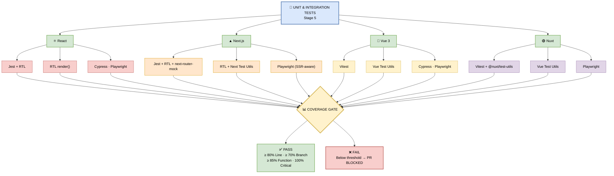

## 🧪 Stage 5 — Unit & Integration Tests (Per Framework)

> **Purpose:** Verify that the **coupon feature** works correctly across every supported framework — from unit logic to full end-to-end user flows.

This stage runs **three layers of testing** per framework:
1. **Unit Tests** — pure logic (e.g., coupon validation, discount calculation)
2. **Component Tests** — isolated UI (e.g., `<CouponCode />` input rendering)
3. **E2E Tests** — full user journey (e.g., apply coupon → see discounted total)

---

### 📊 What Unit Testing Runs (Per Framework)

| Framework | Unit Test Runner | Component Test | E2E Test |
|-----------|------------------|----------------|----------|
| **React** | Jest + React Testing Library | RTL `render()` | Cypress, Playwright |
| **Next.js** | Jest + RTL + `next-router-mock` | RTL + Next Test Utils | Playwright (SSR-aware) |
| **Vue 3** | Vitest | Vue Test Utils | Cypress, Playwright |
| **Nuxt** | Vitest + `@nuxt/test-utils` | Vue Test Utils | Playwright |

---

### 🖼️ Visual Diagram — Testing Layers



---

### 🔍 Deep Dive — Test Layers Explained (Coupon Feature Context)

#### 1️⃣ Unit Tests — Pure Logic

**What it does:** Tests individual functions in isolation — no DOM, no network.

**Coupon Feature Example:**
```typescript
// couponValidator.test.ts
import { validateCoupon } from './couponValidator';

describe('validateCoupon', () => {
  it('should return true for valid coupon code', () => {
    expect(validateCoupon('SAVE20')).toBe(true);
  });

  it('should return false for expired coupon', () => {
    expect(validateCoupon('EXPIRED2024')).toBe(false);
  });

  it('should calculate 20% discount correctly', () => {
    expect(calculateDiscount(100, 'SAVE20')).toBe(80);
  });
});
```

**Framework-specific runners:**

| Framework | Command | Runner |
|-----------|---------|--------|
| React | `npm test` | Jest |
| Next.js | `npm test` | Jest |
| Vue 3 | `npm test` | Vitest |
| Nuxt | `npm test` | Vitest |

---

#### 2️⃣ Component Tests — Isolated UI

**What it does:** Renders a single component in a virtual DOM and tests its behavior.

**Coupon Feature Example:**
```typescript
// CouponCode.test.tsx
import { render, screen, fireEvent } from '@testing-library/react';
import { CouponCode } from './CouponCode';

describe('<CouponCode />', () => {
  it('should render input field', () => {
    render(<CouponCode onApply={jest.fn()} />);
    expect(screen.getByPlaceholderText('Enter coupon code')).toBeInTheDocument();
  });

  it('should call onApply when button clicked', () => {
    const onApply = jest.fn();
    render(<CouponCode onApply={onApply} />);
    fireEvent.change(screen.getByRole('textbox'), {
      target: { value: 'SAVE20' },
    });
    fireEvent.click(screen.getByText('Apply'));
    expect(onApply).toHaveBeenCalledWith('SAVE20');
  });
});
```

**Framework-specific runners:**

| Framework | Component Test Tool |
|-----------|---------------------|
| React | React Testing Library (`render()`) |
| Next.js | RTL + Next Test Utils |
| Vue 3 | Vue Test Utils |
| Nuxt | Vue Test Utils |

---

#### 3️⃣ E2E Tests — Full User Journey

**What it does:** Spins up a real browser, navigates the app, and simulates a real user.

**Coupon Feature Example (Playwright):**
```typescript
// coupon-checkout.spec.ts
import { test, expect } from '@playwright/test';

test('user applies coupon and sees discounted total', async ({ page }) => {
  await page.goto('/checkout');
  await page.fill('[data-testid="coupon-input"]', 'SAVE20');
  await page.click('[data-testid="apply-coupon"]');
  await expect(page.locator('[data-testid="total"]')).toHaveText('$80.00');
});

test('invalid coupon shows error message', async ({ page }) => {
  await page.goto('/checkout');
  await page.fill('[data-testid="coupon-input"]', 'INVALID');
  await page.click('[data-testid="apply-coupon"]');
  await expect(page.locator('.error')).toHaveText('Invalid coupon code');
});
```

**Framework-specific runners:**

| Framework | E2E Tool |
|-----------|----------|
| React | Cypress or Playwright |
| Next.js | Playwright (SSR-aware) |
| Vue 3 | Cypress or Playwright |
| Nuxt | Playwright |

---

### 📊 Coverage Thresholds (Blocking)

| Metric | Threshold | Blocks Merge? |
|--------|-----------|---------------|
| **Line** | 80% | ✅ Yes |
| **Branch** | 70% | ✅ Yes |
| **Function** | 85% | ✅ Yes |
| **Critical Path** | **100%** | ✅ Yes (strictest) |

**Critical Path = Coupon apply → validate → discount calculation → checkout total**

> ❌ If coverage drops below any threshold → **PR is BLOCKED**.

---

### ⏱️ Runtime Breakdown

| Layer | Duration | Parallel? |
|-------|----------|-----------|
| Unit Tests | ~1 min | ✅ |
| Component Tests | ~1 min | ✅ |
| E2E Tests | ~1 min | ✅ |
| **Total** | **~3 min** | — |

E2E tests run **after** unit + component pass, in the same job — so failures are caught early.

---

### 🛠️ Pipeline Configuration Snippet

```yaml
tests:
  runs-on: ubuntu-latest
  steps:
    - uses: actions/checkout@v4
    - uses: actions/setup-node@v4
      with:
        node-version: '20.x'
        cache: 'npm'
    - run: npm ci

    # Unit + Component Tests with Coverage
    - name: Run Unit & Component Tests
      run: npm test -- --coverage --ci --maxWorkers=2

    # E2E Tests (Playwright)
    - name: Install Playwright Browsers
      run: npx playwright install --with-deps

    - name: Run E2E Tests
      run: npx playwright test

    # Upload Coverage Report
    - name: Upload Coverage
      uses: actions/upload-artifact@v4
      with:
        name: coverage-${{ github.sha }}
        path: coverage/

    # Post Coverage Comment on PR
    - name: Post Coverage Comment
      uses: romeovs/lcov-reporter-action@v0.3.1
      with:
        lcov-file: ./coverage/lcov.info
        github-token: ${{ secrets.GITHUB_TOKEN }}
```

---

### 🎯 Manager-Friendly Summary

| Question | Answer |
|----------|--------|
| **How many test layers?** | 3 — Unit, Component, E2E |
| **Which frameworks covered?** | React, Next.js, Vue 3, Nuxt |
| **How long does it take?** | ~3 minutes total |
| **What blocks the merge?** | Coverage below threshold OR any test failure |
| **Is critical path 100%?** | Yes — coupon apply → discount → checkout must be fully covered |
| **Can developers run locally?** | Yes — `npm test` and `npx playwright test` |

---

### 📁 Test Files in Repo

```
ecom-frontend/
├── src/
│   └── features/
│       └── coupon/
│           ├── couponValidator.ts
│           ├── couponValidator.test.ts        # Unit
│           ├── CouponCode.tsx
│           ├── CouponCode.test.tsx            # Component
│           └── CouponCode.e2e.spec.ts         # E2E (Playwright)
├── tests/
│   ├── unit/
│   ├── integration/
│   └── e2e/
│       └── coupon-checkout.spec.ts
├── jest.config.js
├── vitest.config.ts
├── playwright.config.ts
└── package.json
```

---

### 🛠️ Troubleshooting Test Failures

| Error | Cause | Fix |
|-------|-------|-----|
| `Cannot find module 'next-router-mock'` | Missing mock dep | `npm install -D next-router-mock` |
| `Coverage threshold not met` | Untested new code | Add tests for coupon logic |
| `Playwright: browser not installed` | Missing browser binary | `npx playwright install --with-deps` |
| `Test timeout` | Slow SSR render | Increase `testTimeout` in config |
| `Flaky E2E test` | Race condition | Use `waitFor` / `expect.poll` |

> 💡 **Pro tip:** Run `npm test -- --watch` locally during development to catch failures immediately.

---

### 🔗 Integration with Other Stages

- **Runs in parallel** with Build, Lint, and Scans (Stage 1–4)
- **Feeds into** the overall Quality Gate
- **Blocks merge** if any test fails or coverage drops
- **Critical path tests** are non-negotiable — coupon flow must be 100% covered

---

> 📝 **Note:** Tests are your safety net. Every bug caught here is a bug that **never reaches production**. Treat test failures as seriously as production incidents.