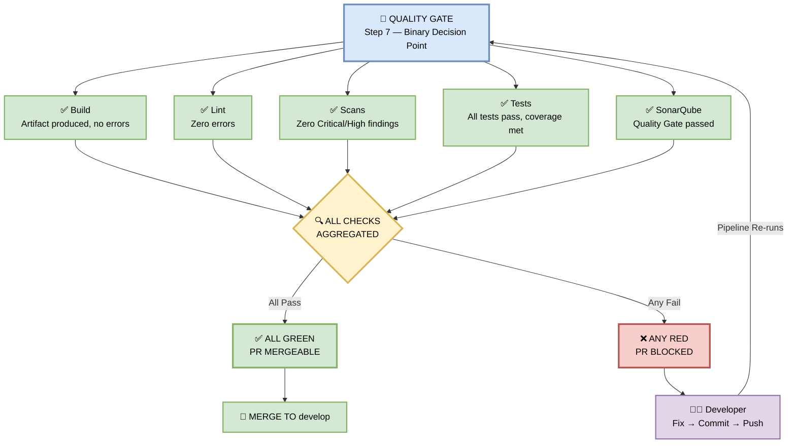

## 🚦 Stage 6 — Quality Gate

> **The Quality Gate is the binary decision point.**  
> All four jobs (plus SonarQube) must pass.  
> Any failure sends the PR back to the developer.


*Figure 9 — The Quality Gate is the binary decision point. All four jobs must pass. Any failure sends the PR back to the developer.*

---

### 📊 The Gate Checks

| Check | Pass Condition |
|-------|----------------|
| ✅ **Build** | Artifact produced, no errors |
| ✅ **Lint** | Zero errors |
| ✅ **Scans** | Zero Critical/High findings |
| ✅ **Tests** | All tests pass, coverage thresholds met |
| ✅ **SonarQube** | Quality Gate passed |

---

### 🖼️ Visual Diagram — Gate Flow



---

### 🔍 Deep Dive — What Each Check Means (Coupon Feature Context)

#### 1️⃣ ✅ Build — Artifact Produced

**Pass Condition:** `npm run build` completes with exit code 0, and the expected output directory exists.

**Coupon Feature Example:**
```
✓ CouponCode.tsx compiled successfully
✓ couponValidator.ts type-checked
✓ .next/ folder created (48 MB)
✓ Artifact uploaded: nextjs-ssr-artifact-a1b2c3d
```

**Fail Scenario:**
```
✗ Type error in couponValidator.ts line 42:
  Property 'discount' does not exist on type 'Coupon'
```

---

#### 2️⃣ ✅ Lint — Zero Errors

**Pass Condition:** All 7 linters return zero errors. Warnings are allowed.

**Coupon Feature Example:**
```
✓ ESLint: 0 errors (2 warnings)
✓ TypeScript: 0 errors
✓ markdownlint: 0 errors
```

**Fail Scenario:**
```
✗ ESLint: 1 error
  react-hooks/rules-of-hooks: useState called conditionally
  → CouponCode.tsx:28
```

---

#### 3️⃣ ✅ Scans — Zero Critical/High

**Pass Condition:** All 6 security scanners report zero Critical or High severity findings.

**Coupon Feature Example:**
```
✓ gitleaks: 0 secrets found
✓ Snyk: 0 high CVEs
✓ SonarQube: 0 critical issues
✓ trivy: 0 critical container CVEs
✓ checkov: 0 IAC misconfigurations
✓ ZED Proxy: 0 high XSS/SQLi
```

**Fail Scenario:**
```
✗ SonarQube: 1 CRITICAL
  SQL Injection in couponValidator.ts:56
  → PR BLOCKED
```

---

#### 4️⃣ ✅ Tests — All Pass + Coverage

**Pass Condition:** All unit, component, and E2E tests pass. Coverage meets thresholds.

**Coupon Feature Example:**
```
✓ Unit Tests: 24 passed, 0 failed
✓ Component Tests: 12 passed, 0 failed
✓ E2E Tests: 4 passed, 0 failed

Coverage:
  Lines:      87% (threshold: 80%) ✅
  Branches:   74% (threshold: 70%) ✅
  Functions:  89% (threshold: 85%) ✅
  Critical:  100% (threshold: 100%) ✅
```

**Fail Scenario:**
```
✗ E2E Test failed: "user applies coupon and sees discounted total"
  Expected: $80.00
  Received: $100.00
  → PR BLOCKED
```

---

#### 5️⃣ ✅ SonarQube — Quality Gate Passed

**Pass Condition:** SonarQube's built-in Quality Gate returns PASSED.

**SonarQube Checks:**

| Metric | Threshold | Coupon Feature |
|--------|-----------|----------------|
| New Code Coverage | ≥ 80% | 87% ✅ |
| Duplicated Lines | ≤ 3% | 1.2% ✅ |
| Maintainability Rating | A | A ✅ |
| Reliability Rating | A | A ✅ |
| Security Rating | A | A ✅ |
| Security Hotspots Reviewed | 100% | 100% ✅ |

**Fail Scenario:**
```
✗ SonarQube Quality Gate: FAILED
  Reason: New Code Coverage is 62% (required: 80%)
  → PR BLOCKED
```

---

### 🚦 Binary Outcome — The Rule

```
IF  Build ✅ AND Lint ✅ AND Scans ✅ AND Tests ✅ AND SonarQube ✅
THEN  PR is mergeable → proceeds to Merge & Official CI Build
ELSE  PR is BLOCKED → developer must fix and re-push
```

> 🛑 **No overrides. No exceptions.** Branch protection enforces this at the GitHub level.

---

### 🔄 The Developer Feedback Loop

When the gate fails, the developer sees:

1. **PR comment** — auto-posted by the pipeline bot with the exact failure reason
2. **Slack notification** — sent to `#dev-alerts` channel
3. **Email** — to the PR author
4. **GitHub Check** — red ❌ next to the PR

**Developer action:**
```bash
# Fix the issue locally
npm run lint --fix
npm test
npm run build

# Push the fix
git add .
git commit -m "fix(coupon): resolve SQL injection in validator"
git push origin feature/coupon-checkout
```

**Pipeline re-runs automatically** — the cycle continues until all checks are green.

---

### 🎯 Manager-Friendly Summary

| Question | Answer |
|----------|--------|
| **What is the Quality Gate?** | A binary pass/fail decision point before merge |
| **How many checks?** | 5 — Build, Lint, Scans, Tests, SonarQube |
| **What happens on failure?** | PR is blocked; developer gets notified and must fix |
| **Can it be bypassed?** | No — branch protection prevents it |
| **How long does it take?** | Checks run in parallel; total ~7 minutes |
| **What's the business value?** | Zero broken builds, zero security holes, zero regressions reach production |

---

### 📊 Gate Status Dashboard (Example)

| PR | Build | Lint | Scans | Tests | SonarQube | Gate |
|----|-------|------|-------|-------|-----------|------|
| #1421 (coupon) | ✅ | ✅ | ✅ | ✅ | ✅ | 🟢 **PASS** |
| #1422 (bugfix) | ✅ | ❌ | ✅ | ✅ | ✅ | 🔴 **BLOCK** |
| #1423 (feature) | ✅ | ✅ | ❌ | ✅ | ✅ | 🔴 **BLOCK** |
| #1424 (refactor) | ✅ | ✅ | ✅ | ❌ | ✅ | 🔴 **BLOCK** |
| #1425 (docs) | ✅ | ✅ | ✅ | ✅ | ❌ | 🔴 **BLOCK** |

> Only PR #1421 is mergeable. All others must be fixed.

---

### 🛠️ Pipeline Configuration Snippet

```yaml
quality-gate:
  runs-on: ubuntu-latest
  needs: [build, lint, security-scans, tests, sonarqube]
  if: always()   # run even if some jobs failed, to report status

  steps:
    - name: Check All Jobs Passed
      run: |
        if [ "${{ needs.build.result }}" != "success" ] || \
           [ "${{ needs.lint.result }}" != "success" ] || \
           [ "${{ needs.security-scans.result }}" != "success" ] || \
           [ "${{ needs.tests.result }}" != "success" ] || \
           [ "${{ needs.sonarqube.result }}" != "success" ]; then
          echo "❌ Quality Gate FAILED"
          exit 1
        fi
        echo "✅ Quality Gate PASSED"

    - name: Post PR Comment on Failure
      if: failure()
      uses: actions/github-script@v7
      with:
        script: |
          github.rest.issues.createComment({
            issue_number: context.issue.number,
            owner: context.repo.owner,
            repo: context.repo.repo,
            body: '❌ **Quality Gate Failed**\n\nCheck the failed job above and fix before merging.'
          })
```

---

### 🔗 Integration with Other Stages

- **Consumes output** from Stages 1–6 (Build, Lint, Scans, Tests, SonarQube)
- **Gates** the merge to `develop`
- **Blocks** any PR with a red check
- **Feeds** the Promotion Ladder (DEV → QA → STAGING → PROD)

---

> 📝 **Note:** The Quality Gate exists to protect production. Every check that fails here is a bug, vulnerability, or regression that **never reaches your users**. Respect the gate.