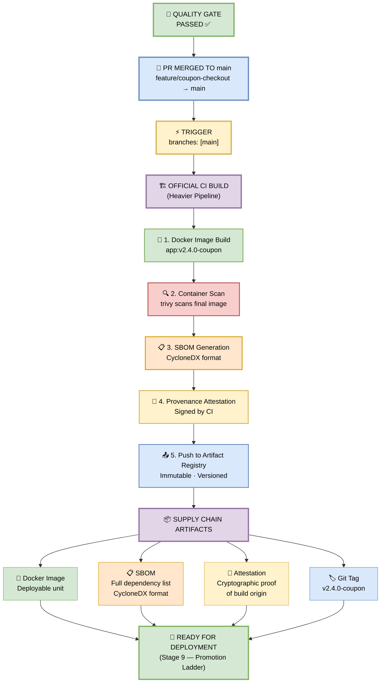

## 🔀 Step 8 — Merge & Official CI Build

> **Once the gate passes, the PR merges to `main`. This triggers the official CI build — a separate, heavier pipeline.**


*Figure 10 — Once the gate passes, the PR merges to main. This triggers the official CI build — a separate, heavier pipeline.*

---

### 🎯 What Happens on Merge

When the PR is merged into `main`, the official CI pipeline is triggered by:

```yaml
trigger:
  branches: [main]
```

This is **different from the PR pipeline**. The PR pipeline is fast (~7 min) and validates code. The **official CI build** is heavier (~15–20 min) and produces **deployable artifacts** with full supply chain attestation.

---

### 🖼️ Visual Diagram — Official CI Pipeline Flow



---

### 🔍 Deep Dive — Official CI Pipeline Steps

#### 1️⃣ Docker Image Build — `app:v2.4.0-coupon`

**What it does:** Builds a production-ready Docker image with a **multi-stage build** (smaller size, no dev dependencies).

**Coupon Feature Example:**
```dockerfile
# Stage 1: Build
FROM node:20-alpine AS builder
WORKDIR /app
COPY package*.json ./
RUN npm ci --only=production
COPY . .
RUN npm run build

# Stage 2: Runtime
FROM node:20-alpine
WORKDIR /app
COPY --from=builder /app/.next ./.next
COPY --from=builder /app/public ./public
COPY --from=builder /app/package.json ./
EXPOSE 3000
CMD ["npm", "start"]
```

**Output:**
```
✓ Image built: app:v2.4.0-coupon
✓ Size: 142 MB (optimized)
✓ Layers: 8
```

---

#### 2️⃣ Container Scan — trivy

**What it does:** Scans the **final Docker image** for CVEs in the base image, OS packages, and application dependencies.

**Coupon Feature Example:**
```
trivy image app:v2.4.0-coupon

✓ Base image: node:20-alpine (0 Critical)
✓ OS packages: 0 High
✓ Node modules: 0 High
✓ TOTAL: 0 Critical, 0 High, 3 Medium
```

**Fail Scenario:**
```
✗ CRITICAL: CVE-2024-XXXX in openssl@3.0.1
  → Build FAILS, image not pushed
```

---

#### 3️⃣ SBOM Generation — Software Bill of Materials

**What it does:** Produces a **complete list of every dependency** in the image, in **CycloneDX** format. This is required for supply chain security and compliance.

**Coupon Feature Example:**
```json
{
  "bomFormat": "CycloneDX",
  "specVersion": "1.5",
  "components": [
    { "name": "next", "version": "14.2.0", "purl": "pkg:npm/next@14.2.0" },
    { "name": "react", "version": "18.3.0", "purl": "pkg:npm/react@18.3.0" },
    { "name": "axios", "version": "1.7.0", "purl": "pkg:npm/axios@1.7.0" },
    { "name": "coupon-validator", "version": "1.0.0", "purl": "pkg:npm/coupon-validator@1.0.0" }
  ]
}
```

**Why it matters:** If a new CVE drops tomorrow (e.g., in `axios@1.7.0`), you can **instantly query the SBOM** to know which images are affected.

---

#### 4️⃣ Provenance Attestation — Signed by CI

**What it does:** Creates a **cryptographic proof** that this image was built by **your CI system**, from **this specific commit**, using **this specific Dockerfile**.

**Coupon Feature Example:**
```json
{
  "_type": "https://in-toto.io/Statement/v0.1",
  "subject": [
    { "name": "app", "digest": { "sha256": "abc123..." } }
  ],
  "predicateType": "https://slsa.dev/provenance/v0.2",
  "predicate": {
    "builder": { "id": "https://github.com/actions/runner" },
    "buildType": "https://github.com/actions/workflow",
    "invocation": {
      "configSource": {
        "uri": "git+https://github.com/ecom/frontend@refs/heads/main",
        "digest": { "sha1": "a1b2c3d..." }
      }
    }
  }
}
```

**Why it matters:** Prevents **supply chain attacks** — anyone can verify the image came from your CI, not a compromised laptop.

---

#### 5️⃣ Push to Artifact Registry — Immutable, Versioned

**What it does:** Pushes the image + SBOM + attestation to a **secure, immutable registry** (GCP Artifact Registry, AWS ECR, Azure ACR, or Harbor).

**Coupon Feature Example:**
```bash
docker push gcr.io/ecom/frontend:v2.4.0-coupon

✓ Pushed: gcr.io/ecom/frontend:v2.4.0-coupon
✓ Digest: sha256:abc123...
✓ Immutable: ✅ (cannot be overwritten)
✓ Signed: ✅ (cosign attestation)
```

**Immutability:** Once pushed, `v2.4.0-coupon` can **never be overwritten**. If you need a fix, you push `v2.4.1-coupon`.

---

### 📦 Supply Chain Artifacts — The Full Set

| Artifact | Purpose |
|----------|---------|
| **Docker Image** | Deployable unit |
| **SBOM** | Full dependency list (CycloneDX format) |
| **Attestation** | Cryptographic proof of build origin |
| **Git Tag** | `v2.4.0-coupon` |

---

### 🎯 Manager-Friendly Summary

| Question | Answer |
|----------|--------|
| **What triggers this step?** | Merge to `main` |
| **How is it different from PR pipeline?** | Heavier — builds Docker image + SBOM + attestation |
| **How long does it take?** | ~15–20 minutes |
| **What's produced?** | Docker image, SBOM, attestation, git tag |
| **Where does it go?** | Artifact Registry (immutable, versioned) |
| **Why supply chain artifacts?** | Compliance, traceability, CVE response, SLSA Level 3 |

---

### 🛠️ Pipeline Configuration Snippet

```yaml
name: Official CI Build

on:
  push:
    branches: [main]
    tags: ['v*']

jobs:
  official-build:
    runs-on: ubuntu-latest
    permissions:
      contents: read
      packages: write
      id-token: write   # for attestation
      attestations: write

    steps:
      - uses: actions/checkout@v4

      # 1. Docker Build
      - name: Build Docker Image
        run: |
          docker build \
            -t gcr.io/ecom/frontend:${{ github.ref_name }}-coupon \
            -t gcr.io/ecom/frontend:latest \
            .

      # 2. Container Scan
      - name: Trivy Container Scan
        uses: aquasecurity/trivy-action@master
        with:
          image-ref: 'gcr.io/ecom/frontend:${{ github.ref_name }}-coupon'
          severity: 'CRITICAL,HIGH'
          exit-code: '1'

      # 3. SBOM Generation
      - name: Generate SBOM
        uses: anchore/sbom-action@v0
        with:
          image: 'gcr.io/ecom/frontend:${{ github.ref_name }}-coupon'
          format: cyclonedx-json
          output-file: sbom.json

      # 4. Provenance Attestation
      - name: Attest Build Provenance
        uses: actions/attest-build-provenance@v1
        with:
          subject-name: gcr.io/ecom/frontend
          subject-digest: ${{ steps.build.outputs.digest }}
          push-to-registry: true

      # 5. Push to Artifact Registry
      - name: Push to GCP Artifact Registry
        run: |
          gcloud auth configure-docker
          docker push gcr.io/ecom/frontend:${{ github.ref_name }}-coupon

      # 6. Git Tag
      - name: Create Git Tag
        run: |
          git tag v2.4.0-coupon
          git push origin v2.4.0-coupon
```

---

### 🔗 Integration with Other Stages

- **Consumes output** from Stage 7 (Quality Gate PASS)
- **Produces** Docker image + SBOM + attestation
- **Feeds** Stage 9 (Promotion Ladder — DEV → QA → STAGING)
- **Enables** Stage 10 (Canary Release to Production)

---

### 🛠️ Troubleshooting Official CI Failures

| Error | Cause | Fix |
|-------|-------|-----|
| `Docker build failed` | Missing dependency | Check `package.json` and Dockerfile |
| `Trivy: CRITICAL found` | Base image CVE | Upgrade base image (`node:20-alpine`) |
| `SBOM generation failed` | Image not found | Ensure image was built first |
| `Attestation failed` | Missing `id-token: write` | Add permissions to workflow |
| `Push rejected` | Immutability conflict | Use a new tag (e.g., `v2.4.1-coupon`) |

---

> 📝 **Note:** The Official CI Build is your **supply chain fortress**. Every artifact is scanned, signed, and versioned — so you always know exactly what's running in production, and you can prove it.