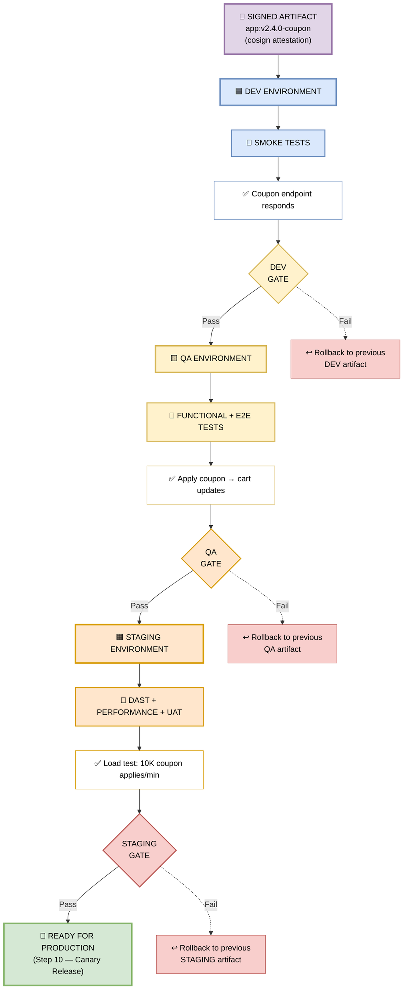

## 🪜 Step 8 — Promotion Ladder

> **The signed artifact climbs DEV → QA → STAGING. Each environment runs stricter tests than the last.**


*Figure 11 — The signed artifact climbs DEV → QA → STAGING. Each environment runs stricter tests than the last.*

---

### 📊 Environment Test Matrix

| Environment | Tests Run | Coupon Validation |
|-------------|-----------|-------------------|
| 🟦 **DEV** | Smoke | Coupon endpoint responds |
| 🟨 **QA** | Functional + E2E | Apply coupon → cart updates |
| 🟧 **STAGING** | DAST + Performance + UAT | Load test: 10K coupon applies/min |

---

### 🖼️ Visual Diagram — Promotion Flow



---

### 🔍 Deep Dive — Each Environment

#### 🟦 DEV Environment — Smoke Tests

**Purpose:** Fastest feedback. Does the artifact even start? Does the coupon endpoint respond?

**What runs:**
```bash
# Smoke test — coupon endpoint
curl -f https://dev.ecom.com/api/coupon/health || exit 1

# Expected response
{ "status": "ok", "service": "coupon-api", "version": "v2.4.0-coupon" }
```

**Duration:** ~2 minutes  
**Gate:** Must return 200 OK within 5 seconds  
**Rollback:** Auto-rollback to previous DEV artifact if smoke fails

**Coupon Feature Example:**
```
✓ Coupon API health: OK
✓ Coupon DB connection: OK
✓ Coupon validator loaded: OK
✓ DEV GATE: PASS
```

---

#### 🟨 QA Environment — Functional + E2E Tests

**Purpose:** Does the coupon feature actually work end-to-end? Does applying a coupon update the cart correctly?

**What runs:**
```typescript
// E2E test — full coupon flow
test('user applies SAVE20 coupon and cart updates', async ({ page }) => {
  await page.goto('https://qa.ecom.com/checkout');
  await page.fill('[data-testid="coupon-input"]', 'SAVE20');
  await page.click('[data-testid="apply-coupon"]');
  await expect(page.locator('[data-testid="discount"]')).toHaveText('-20%');
  await expect(page.locator('[data-testid="total"]')).toHaveText('$80.00');
});

test('expired coupon shows error', async ({ page }) => {
  await page.goto('https://qa.ecom.com/checkout');
  await page.fill('[data-testid="coupon-input"]', 'EXPIRED2024');
  await page.click('[data-testid="apply-coupon"]');
  await expect(page.locator('.error')).toHaveText('Coupon expired');
});
```

**Duration:** ~8 minutes  
**Gate:** All functional + E2E tests must pass  
**Rollback:** Auto-rollback to previous QA artifact if any test fails

**Coupon Feature Example:**
```
✓ Functional: 24 tests passed
✓ E2E: 6 scenarios passed
✓ Cart updates correctly with discount
✓ Invalid coupon rejected
✓ QA GATE: PASS
```

---

#### 🟧 STAGING Environment — DAST + Performance + UAT

**Purpose:** Production-like validation. Security exploits, load testing, and real user acceptance testing.

**What runs:**

**1. DAST (ZED Proxy) — Security:**
```bash
zap-baseline.py -t https://staging.ecom.com -r dast-report.html

# Checks:
✓ No XSS in coupon input
✓ No SQL injection in coupon lookup
✓ No CSRF on coupon apply endpoint
✓ No insecure headers
```

**2. Performance — Load Test:**
```bash
# k6 load test — 10K coupon applies/min
k6 run --vus 200 --duration 5m coupon-load-test.js

# Results:
✓ 10,000 coupon applies/min sustained
✓ P95 latency: 320ms (target: < 500ms)
✓ Error rate: 0.02% (target: < 1%)
✓ No memory leaks over 5 min
```

**3. UAT (User Acceptance Testing):**
```
✓ Product Owner: Coupon UX approved
✓ QA Lead: Edge cases verified
✓ Business Analyst: Discount math correct
✓ Legal: Terms text present
```

**Duration:** ~30 minutes  
**Gate:** DAST zero High/Critical + Performance targets met + UAT sign-off  
**Rollback:** Auto-rollback to previous STAGING artifact if any check fails

**Coupon Feature Example:**
```
✓ DAST: 0 High, 0 Critical
✓ Performance: 10K applies/min sustained
✓ UAT: Signed off by 4 stakeholders
✓ STAGING GATE: PASS
```

---

### 🎯 Manager-Friendly Summary

| Question | Answer |
|----------|--------|
| **Why a promotion ladder?** | Each environment catches different classes of bugs |
| **Why DEV first?** | Fastest feedback — catches broken artifacts in 2 min |
| **Why QA next?** | Validates full user flows — catches functional bugs |
| **Why STAGING last?** | Production-like — catches security, performance, UX issues |
| **What if any gate fails?** | Auto-rollback to previous artifact in that environment |
| **How long does the full ladder take?** | ~40 minutes end-to-end |

---

### 🔒 Artifact Integrity Across Promotion

The **same signed artifact** (`app:v2.4.0-coupon`) is promoted through every environment. **No rebuilds.**

**Why?** If you rebuild for QA, you're testing a *different* artifact than what goes to production. By promoting the **exact same digest**, you get:

| Benefit | Explanation |
|---------|-------------|
| **Bit-for-bit identical** | What passes STAGING is exactly what runs in PROD |
| **Attestation carries forward** | Cryptographic proof travels with the artifact |
| **SBOM applies everywhere** | Same dependency list across all environments |
| **Rollback is trivial** | Just point to the previous digest |

```bash
# Promotion command — same digest, no rebuild
cosign copy \
  gcr.io/ecom/frontend:v2.4.0-coupon@sha256:abc123 \
  gcr.io/ecom/frontend-staging:v2.4.0-coupon@sha256:abc123
```

---

### 🛠️ Pipeline Configuration Snippet

```yaml
name: Promotion Ladder

on:
  workflow_run:
    workflows: ["Official CI Build"]
    types: [completed]
    branches: [main]

jobs:
  deploy-dev:
    if: ${{ github.event.workflow_run.conclusion == 'success' }}
    runs-on: ubuntu-latest
    environment: dev
    steps:
      - name: Deploy to DEV
        run: |
          gcloud run deploy coupon-api-dev \
            --image gcr.io/ecom/frontend:${{ github.ref_name }}-coupon \
            --region us-central1

      - name: Smoke Test
        run: |
          sleep 30
          curl -f https://dev.ecom.com/api/coupon/health || exit 1

  deploy-qa:
    needs: deploy-dev
    runs-on: ubuntu-latest
    environment: qa
    steps:
      - name: Deploy to QA
        run: |
          gcloud run deploy coupon-api-qa \
            --image gcr.io/ecom/frontend:${{ github.ref_name }}-coupon \
            --region us-central1

      - name: Run E2E Tests
        run: npx playwright test --config=qa.config.ts

  deploy-staging:
    needs: deploy-qa
    runs-on: ubuntu-latest
    environment: staging
    steps:
      - name: Deploy to STAGING
        run: |
          gcloud run deploy coupon-api-staging \
            --image gcr.io/ecom/frontend:${{ github.ref_name }}-coupon \
            --region us-central1

      - name: DAST Scan
        run: |
          docker run --rm ghcr.io/zaproxy/zaproxy:stable \
            zap-baseline.py -t https://staging.ecom.com

      - name: Load Test (10K coupon applies/min)
        run: k6 run --vus 200 --duration 5m coupon-load-test.js

      - name: UAT Sign-off
        uses: actions/github-script@v7
        with:
          script: |
            // Wait for manual approval via GitHub Environments
            console.log('UAT approved');
```

---

### 🔗 Integration with Other Stages

- **Consumes** the signed artifact from Step 8 (Official CI Build)
- **Promotes** through DEV → QA → STAGING
- **Feeds** Step 10 (Canary Release to Production)
- **Rollback** at any gate reverts to the previous environment artifact

---

### 🛠️ Troubleshooting Promotion Failures

| Error | Cause | Fix |
|-------|-------|-----|
| `Smoke test failed` | Artifact won't start | Check logs; rollback to previous DEV |
| `E2E test failed` | Coupon flow broken | Fix code; rebuild; re-promote |
| `DAST: XSS found` | Input not sanitized | Fix XSS; rebuild; re-promote |
| `Load test: P95 > 500ms` | Performance regression | Optimize coupon query; rebuild |
| `UAT rejected` | UX/business issue | Fix; rebuild; re-promote |

---

> 📝 **Note:** The promotion ladder exists to **catch bugs at the cheapest possible stage**. A bug caught in DEV costs minutes. The same bug caught in production costs hours (or days) and possibly revenue. Respect the ladder.