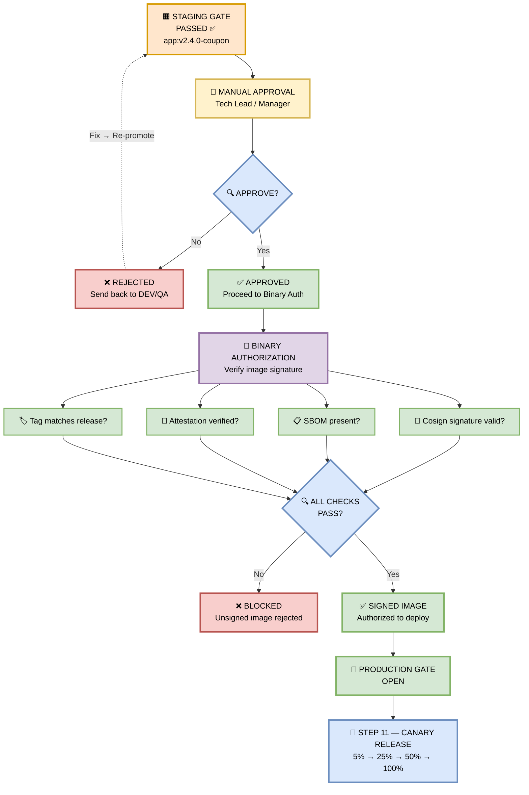

## 🚀 Production Gate — Manual Approval + Binary Authorization

> **Before production, a manual approval is required from a tech lead or manager.**


*Figure 12 — The Production Gate. Binary Authorization ensures only signed images can deploy.*

---

### 🎯 The Two-Layer Defense

Production deployment is protected by **two independent gates**:

| Layer | Type | Who/What Approves |
|-------|------|-------------------|
| **1. Manual Approval** | Human | Tech Lead / Manager |
| **2. Binary Authorization** | Automated | GCP Binary Auth / Cosign |

**Both must pass** before an image can reach production. If either fails, the deployment is **blocked**.

---

### 🖼️ Visual Diagram — Production Gate Flow



---

### 🔍 Deep Dive — Layer 1: Manual Approval

**Who approves?** Tech Lead or Engineering Manager  
**Where?** GitHub Environments → `production` (or Azure DevOps Approvals, or Jira Service Management)  
**What they see:**

```
┌─────────────────────────────────────────────────┐
│  🚀 PRODUCTION DEPLOYMENT APPROVAL              │
├─────────────────────────────────────────────────┤
│  Artifact:  app:v2.4.0-coupon                   │
│  Digest:    sha256:abc123...                    │
│  Commit:    a1b2c3d (feature/coupon-checkout)   │
│  Author:    @frontend-dev                       │
│  Reviewer:  @tech-lead                          │
│                                                 │
│  STAGING Results:                               │
│  ✅ DAST: 0 High, 0 Critical                    │
│  ✅ Load test: 10K coupon applies/min           │
│  ✅ UAT: Signed off by 4 stakeholders           │
│                                                 │
│  [ ✅ Approve ]  [ ❌ Reject ]                  │
└─────────────────────────────────────────────────┘
```

**Approval Rules:**

| Rule | Value |
|------|-------|
| **Approvers** | Tech Lead OR Engineering Manager |
| **Minimum approvals** | 1 |
| **Timeout** | 24 hours (auto-reject if no action) |
| **Audit log** | Every approval logged to Splunk/Datadog |
| **Rejection reason** | Required (free-text field) |

**Approval Slack Notification:**
```
🚀 Production Deployment Awaiting Approval

Artifact: app:v2.4.0-coupon
Author: @frontend-dev
Staging: ✅ All checks passed

👉 Approve: https://github.com/ecom/frontend/actions/runs/12345
```

---

### 🔐 Deep Dive — Layer 2: Binary Authorization

**What is Binary Authorization?**  
A GCP service (also available on AWS/Azure via tools like `cosign` + OPA) that **only allows signed container images** to deploy to production.

**The 4 Signature Checks:**

#### 1️⃣ Cosign Signature Valid?

```bash
cosign verify \
  --key gcpkms://projects/ecom/locations/global/keyRings/ci/cryptoKeys/cosign \
  gcr.io/ecom/frontend:v2.4.0-coupon

# Output:
✓ Verified signature for gcr.io/ecom/frontend:v2.4.0-coupon
✓ Signed by: CI Pipeline (ci@ecom.iam.gserviceaccount.com)
✓ Timestamp: 2026-09-18T10:32:00Z
```

**Fail Scenario:**
```
✗ Error: no matching signatures
→ Image was NOT signed by CI
→ Deployment BLOCKED
```

---

#### 2️⃣ SBOM Present?

```bash
cosign download sbom gcr.io/ecom/frontend:v2.4.0-coupon

# Output:
✓ SBOM found: CycloneDX 1.5
✓ 247 components listed
✓ No tampering detected
```

**Fail Scenario:**
```
✗ Error: no SBOM attestation found
→ Cannot verify dependency list
→ Deployment BLOCKED
```

---

#### 3️⃣ Attestation Verified?

```bash
cosign verify-attestation \
  --type slsaprovenance \
  --key gcpkms://... \
  gcr.io/ecom/frontend:v2.4.0-coupon

# Output:
✓ Attestation verified
✓ Built by: GitHub Actions
✓ Source: github.com/ecom/frontend@a1b2c3d
✓ Builder identity: trusted
```

**Fail Scenario:**
```
✗ Error: attestation signature invalid
→ Image may have been tampered with
→ Deployment BLOCKED
```

---

#### 4️⃣ Tag Matches Release?

```bash
# Ensure the deployed tag matches the approved release
EXPECTED_TAG="v2.4.0-coupon"
ACTUAL_TAG=$(gcloud artifacts docker tags list \
  gcr.io/ecom/frontend:v2.4.0-coupon --format="value(tag)")

[ "$EXPECTED_TAG" == "$ACTUAL_TAG" ] || exit 1

# Output:
✓ Tag matches: v2.4.0-coupon
```

**Fail Scenario:**
```
✗ Error: tag mismatch
  Expected: v2.4.0-coupon
  Actual:   v2.4.0-coupon-hotfix
→ Unauthorized tag
→ Deployment BLOCKED
```

---

### 🚦 The Gate Rules

| Rule | Enforcement |
|------|-------------|
| **Manual approval required** | GitHub Environments (required reviewers) |
| **Only signed images** | Binary Authorization policy |
| **Only from trusted CI** | Attestation builder identity check |
| **Only approved tags** | Tag allowlist (`v*.*.*-*`) |
| **No unsigned deploys** | Binary Auth `enforce` mode (not dry-run) |
| **Audit everything** | All approvals + deploys logged to SIEM |

---

### 🎯 Manager-Friendly Summary

| Question | Answer |
|----------|--------|
| **Why manual approval?** | Human judgment — business context, timing, risk |
| **Who can approve?** | Tech Lead or Engineering Manager |
| **Why Binary Authorization?** | Prevents unsigned/tampered images from deploying |
| **What if approval is skipped?** | Deployment blocked — no bypass exists |
| **What if image is unsigned?** | Binary Auth rejects it — even if manually approved |
| **Audit trail?** | Every approval + deploy logged to Splunk/Datadog |
| **Time to approve?** | ~2 minutes (Slack notification → click approve) |

---

### 🛠️ Pipeline Configuration Snippet

```yaml
name: Production Deploy

on:
  workflow_run:
    workflows: ["Promotion Ladder"]
    types: [completed]
    branches: [main]

jobs:
  production-gate:
    runs-on: ubuntu-latest
    environment:
      name: production
      url: https://ecom.com
    steps:
      # Layer 1: Manual approval happens here (GitHub Environment gate)

      # Layer 2: Binary Authorization check
      - name: Verify Image Signature
        run: |
          cosign verify \
            --key gcpkms://projects/ecom/locations/global/keyRings/ci/cryptoKeys/cosign \
            gcr.io/ecom/frontend:${{ github.ref_name }}-coupon

      - name: Verify SBOM
        run: cosign download sbom gcr.io/ecom/frontend:${{ github.ref_name }}-coupon

      - name: Verify Attestation
        run: |
          cosign verify-attestation \
            --type slsaprovenance \
            --key gcpkms://projects/ecom/locations/global/keyRings/ci/cryptoKeys/cosign \
            gcr.io/ecom/frontend:${{ github.ref_name }}-coupon

      - name: Deploy to Production (Canary)
        run: |
          kubectl set image deployment/coupon-api \
            coupon-api=gcr.io/ecom/frontend:${{ github.ref_name }}-coupon
```

**GCP Binary Authorization Policy:**
```yaml
name: production-policy
admissionWhitelistPatterns:
  - namePattern: gcr.io/ecom/frontend:*
clusterAdmissionRules:
  us-central1.prod-cluster:
    evaluationMode: REQUIRE_ATTESTATION
    requireAttestationsBy:
      - projects/ecom/attestors/ci-attestor
      - projects/ecom/attestors/security-attestor
```

---

### 🔗 Integration with Other Stages

- **Consumes** the signed artifact from Step 9 (Promotion Ladder — STAGING PASS)
- **Gates** the transition to production
- **Feeds** Step 11 (Canary Release)
- **Enforces** supply chain security end-to-end

---

### 🛠️ Troubleshooting Gate Failures

| Error | Cause | Fix |
|-------|-------|-----|
| `Approval timeout` | No approver action in 24h | Re-trigger; ping approver on Slack |
| `Signature verification failed` | Image not signed | Re-run Official CI Build with signing |
| `No SBOM found` | SBOM step skipped | Re-run Official CI Build |
| `Attestation invalid` | Tampered image | Investigate; rebuild from clean source |
| `Binary Auth denied` | Policy mismatch | Check policy + attestor config |

---

> 📝 **Note:** The Production Gate is your **last line of defense**. A manual approval ensures human judgment; Binary Authorization ensures only cryptographically verified artifacts reach production. Together, they make unauthorized deployments **impossible**.