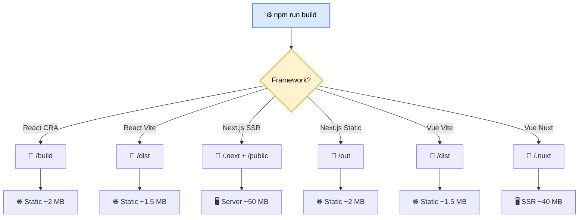
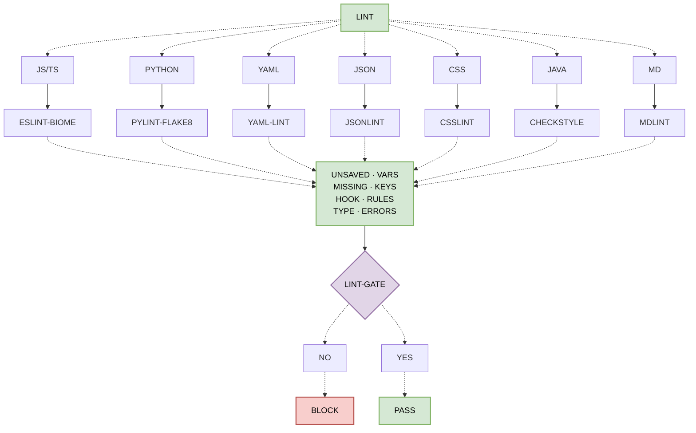
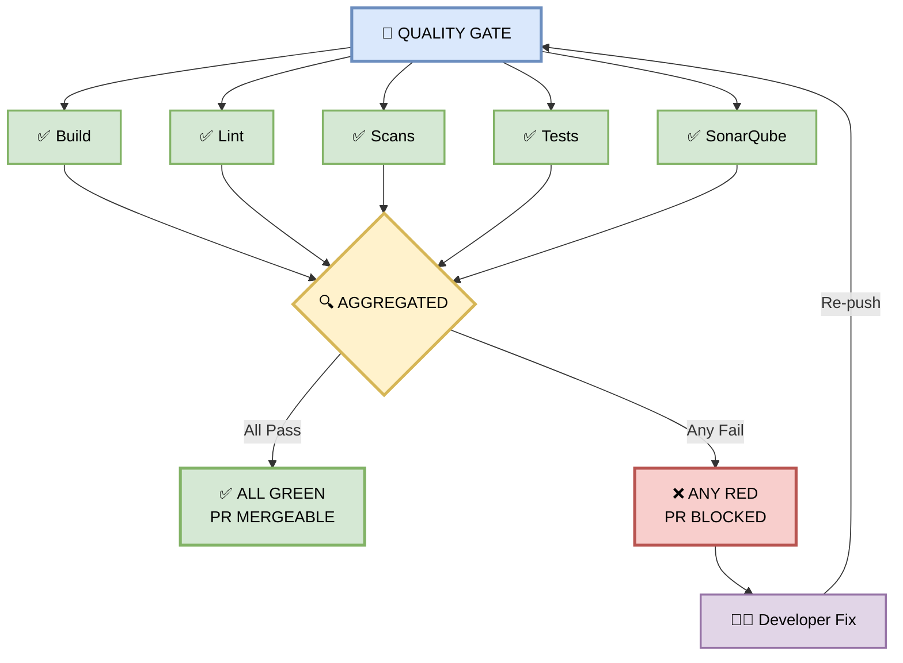
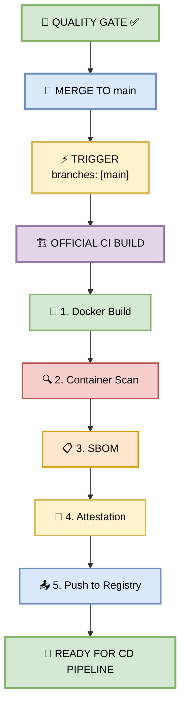

# Part 1 — CI Pipeline (Continuous Integration)

**Author:** Shubham Tripathi  
**Repository:** `ecom-frontend` (Next.js 14 · App Router · TypeScript)  
**Last Updated:** 2026-09-18  
**Audience:** Frontend Engineers, Reviewers, Tech Leads, QA, DevOps

---

## 📑 Table of Contents — Part 1

1. [The Trigger — Ticket → PR → Pipeline](#-the-trigger--ticket--pr--pipeline)
2. [The Four Parallel Jobs](#-the-four-parallel-jobs)
   - [Build Stage](#-build-stage)
   - [Lint Stage](#-lint-stage)
   - [Security Scans](#-security-scans)
   - [Unit & Integration Tests](#-unit--integration-tests)
3. [Stage 2 — Framework-Specific Build Steps](#-stage-2--framework-specific-build-steps)
4. [Stage 3 — Lint Pipeline](#-stage-3--lint-pipeline)
5. [Stage 4 — Security Scans](#-stage-4--security-scans)
6. [Stage 5 — Unit & Integration Tests](#-stage-5--unit--integration-tests)
7. [Stage 7 — Quality Gate](#-stage-7--quality-gate)
8. [Step 8 — Merge & Official CI Build](#-step-8--merge--official-ci-build)

---

## 🔄 The Flow, at a Glance

> **Ticket → Branch → Code → Push → PR → Pipeline fires → Gates pass → Merge → Deploy → Live.**

---

## 🚦 Before You Push

```bash
git checkout main
git pull origin main
git checkout -b feature/coupon-checkout

npm ci
npm run lint
npx tsc --noEmit
npm test
npm run build

git add .
git commit -m "feat(coupon): add coupon input to checkout"
git push origin feature/coupon-checkout
```

> ⚠️ **If it fails locally, it'll fail in CI too. Fix it before pushing.**

---

## 📬 Opening the PR

Two things happen in parallel:
1. Human reviewer looks at your code
2. PR-CI-Pipeline starts automatically

**GitHub fires a webhook → Azure DevOps picks it up → pipeline begins in < 5 seconds.**

---

## 🧩 The Four Parallel Jobs

| Job | Purpose | Duration |
|-----|---------|----------|
| **Build** | Compiles the app | ~90 sec |
| **Lint** | Checks code style | ~45 sec |
| **Scans** | Six security layers | ~2 min |
| **Tests** | Unit and integration | ~3 min |

> ⏱️ **Total: ~7 minutes** (vs ~20 min sequential)

---

### 🏗️ Build Stage

| Framework | Output Directory |
|-----------|------------------|
| React (CRA) | `build/` |
| React (Vite) | `dist/` |
| Next.js (SSR) | `.next/` |
| Next.js (static export) | `out/` |
| Vue | `dist/` |
| Nuxt | `.nuxt/` |

For the coupon feature, build takes **~90 sec**, produces **~48 MB `.next/` folder**, uploaded as an artifact.

---

### 🧹 Lint Stage

| File Type | Linter |
|-----------|--------|
| `.js` `.ts` `.tsx` | ESLint + Biome |
| `.py` | pylint + flake8 |
| `.yml` | yamllint |
| `.json` | jsonlint |
| `.css` `.scss` | csslint |
| `.md` | markdownlint |
| `.java` | checkstyle |

> ⏱️ ~45 sec. Errors block merge. Warnings logged.

---

### 🔐 Security Scans

| # | Scan | Purpose |
|---|------|---------|
| 1 | Secret scan (gitleaks) | Hardcoded API keys |
| 2 | SCA (BlackDuck, Snyk) | Dependency CVEs |
| 3 | SAST (SonarQube) | Insecure code patterns |
| 4 | Container scan (trivy) | Docker base image |
| 5 | IAC scan (checkov) | Infrastructure config |
| 6 | DAST (ZED Proxy) | Runtime exploits |

**Severity gate:** Critical/High → Block · Medium → Warning · Low → Logged

---

### 🧪 Unit & Integration Tests

| Metric | Threshold |
|--------|-----------|
| Line | 80% |
| Branch | 70% |
| Function | 85% |
| Critical path | **100%** |

> ⏱️ ~3 minutes.

---

## 🖼️ Stage 2 — Framework-Specific Build Steps

### 📊 Framework Build Matrix

| Framework | Build Command | Output Dir | Artifact Type | Deploy Target |
|-----------|---------------|------------|---------------|---------------|
| React (CRA) | `npm run build` | `/build` | Static HTML/JS/CSS | S3 + CloudFront |
| React (Vite) | `npm run build` | `/dist` | Static bundle | CDN, S3, Netlify |
| Next.js (SSR) | `npm run build` | `/.next` + `/public` | Server + static | Node server, Vercel |
| Next.js (Static) | `next build && next export` | `/out` | Static HTML | S3, CDN |
| Vue (Vite) | `npm run build` | `/dist` | Static bundle | Nginx, S3, CDN |
| Vue (Nuxt) | `npm run build` | `/.nuxt` | SSR + static | Node server |

### 🖼️ Visual Diagram — Build Output Flow



### 📦 Artifact Handling

```yaml
- name: Upload Build Artifact
  uses: actions/upload-artifact@v4
  with:
    name: ${{ matrix.framework }}-artifact-${{ github.sha }}
    path: ${{ matrix.output_dir }}
    retention-days: 7
    if-no-files-found: error
```

---

## 🧹 Stage 3 — Lint Pipeline

### 🖼️ Visual Diagram — Lint Pipeline Flow



---

## 🔐 Stage 4 — Security Scans (Ecom Coupon Context)

| Scan | Tool | Coupon Feature Example |
|------|------|------------------------|
| **Secret Scan** | gitleaks | `COUPON_API_KEY=sk_live_xxx` hardcoded in `couponAPI.ts` |
| **SCA** | BlackDuck, Snyk | Vulnerable `axios@0.21` used for coupon API calls |
| **SAST** | SonarQube | SQL injection in `SELECT * FROM coupons WHERE code = '${input}'` |
| **Container Scan** | trivy | Base `node:14` image has **47 CVEs** |
| **IAC Scan** | checkov | S3 bucket storing coupon images is **publicly writable** |
| **DAST** | ZED Proxy | XSS in `<input value="${couponCode}">` on live staging |

### 🚦 Severity Gate

| Severity | Action |
|----------|--------|
| 🔴 Critical / High | **BLOCK MERGE** |
| 🟡 Medium | Warning, logged |
| 🟢 Low | Logged to dashboard |

---

## 🧪 Stage 5 — Unit & Integration Tests (Per Framework)

| Framework | Unit Test Runner | Component Test | E2E Test |
|-----------|------------------|----------------|----------|
| **React** | Jest + React Testing Library | RTL `render()` | Cypress, Playwright |
| **Next.js** | Jest + RTL + `next-router-mock` | RTL + Next Test Utils | Playwright (SSR-aware) |
| **Vue 3** | Vitest | Vue Test Utils | Cypress, Playwright |
| **Nuxt** | Vitest + `@nuxt/test-utils` | Vue Test Utils | Playwright |

### 📊 Coverage Thresholds (Blocking)

| Metric | Threshold |
|--------|-----------|
| Line | 80% |
| Branch | 70% |
| Function | 85% |
| Critical Path | **100%** |

**Critical Path = Coupon apply → validate → discount → checkout total**

---

## 🚦 Stage 7 — Quality Gate

> **The Quality Gate is the binary decision point.**  
> All four jobs (plus SonarQube) must pass.

### 📊 The Gate Checks

| Check | Pass Condition |
|-------|----------------|
| ✅ **Build** | Artifact produced, no errors |
| ✅ **Lint** | Zero errors |
| ✅ **Scans** | Zero Critical/High findings |
| ✅ **Tests** | All tests pass, coverage met |
| ✅ **SonarQube** | Quality Gate passed |

### 🖼️ Visual Diagram — Gate Flow



### 🚦 Binary Outcome

```
IF Build ✅ AND Lint ✅ AND Scans ✅ AND Tests ✅ AND SonarQube ✅
THEN PR mergeable
ELSE PR BLOCKED → developer fixes → re-push → re-run
```

---

## 🔀 Step 8 — Merge & Official CI Build

> **Once the gate passes, the PR merges to `main`. This triggers the official CI build — a separate, heavier pipeline.**

### 🎯 What Happens on Merge

```yaml
trigger:
  branches: [main]
```

**5 Steps:**
1. **Docker image build** — `app:v2.4.0-coupon`
2. **Container scan** — trivy scans final image
3. **SBOM generation** — Software Bill of Materials
4. **Provenance attestation** — signed by CI
5. **Push to Artifact Registry** — immutable, versioned

### 📦 Supply Chain Artifacts

| Artifact | Purpose |
|----------|---------|
| Docker image | Deployable unit |
| SBOM | Full dependency list (CycloneDX format) |
| Attestation | Cryptographic proof of build origin |
| Git tag | `v2.4.0-coupon` |

### 🖼️ Visual Diagram — Official CI Flow



---

**End of Part 1 — CI Pipeline**

➡️ Continue to **[Part 2 — CD Pipeline](#part-2--cd-pipeline-continuous-deployment)**