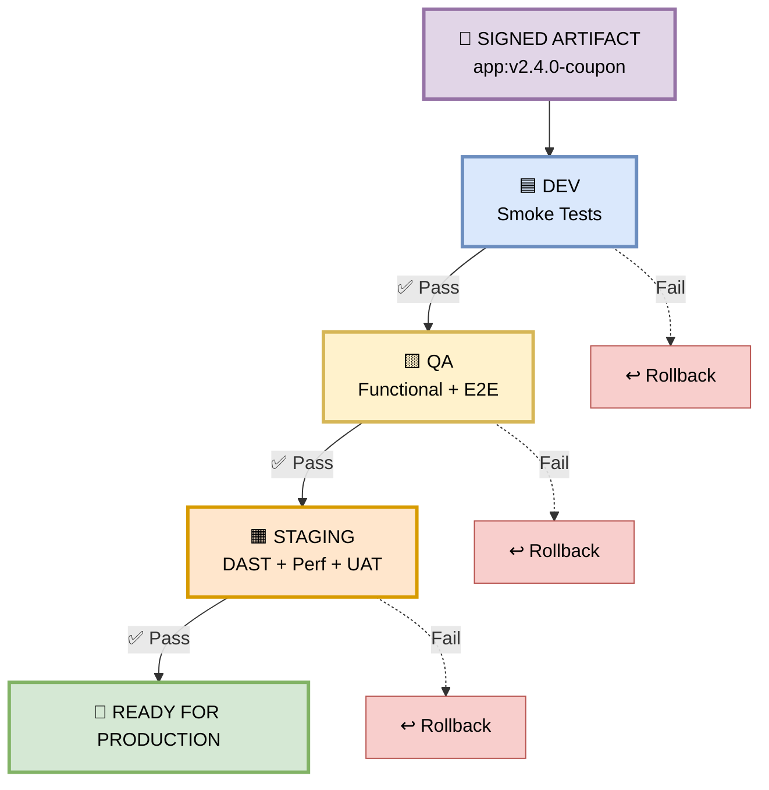
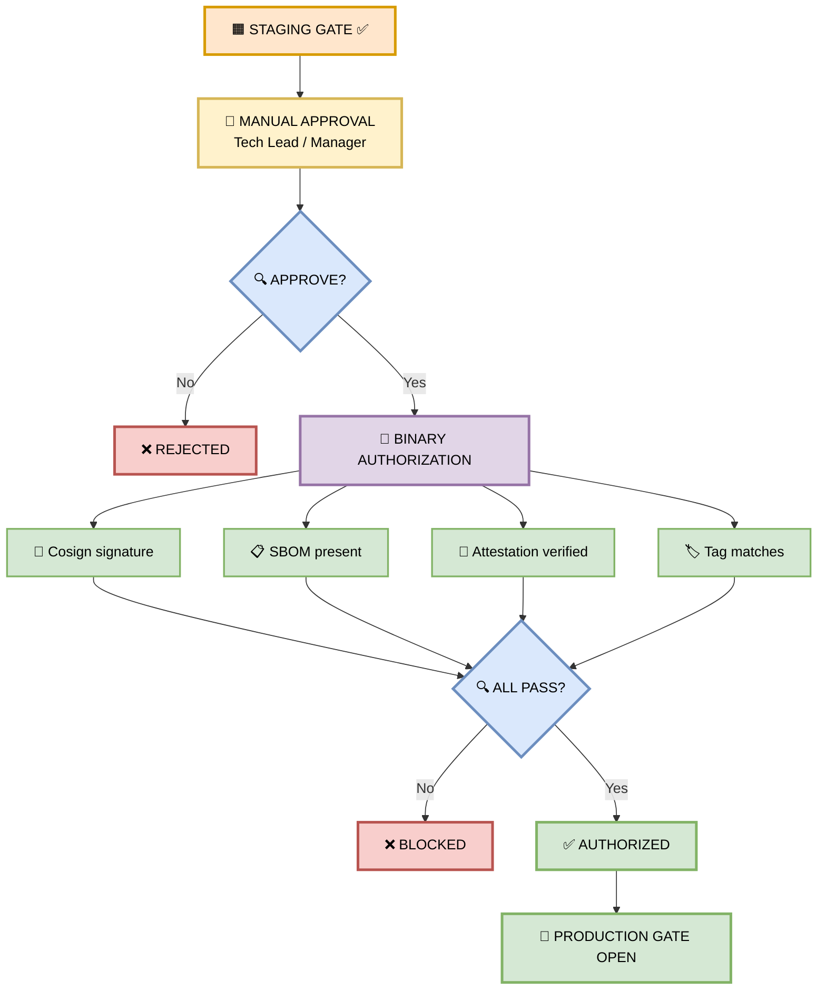
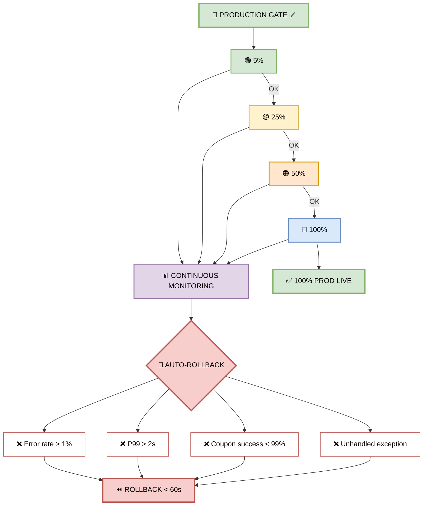

# Part 2 — CD Pipeline (Continuous Deployment)

**Author:** Shubham Tripathi  
**Repository:** `ecom-frontend` (Next.js 14 · App Router · TypeScript)  
**Last Updated:** 2026-09-18  
**Audience:** Frontend Engineers, Reviewers, Tech Leads, QA, DevOps

---

## 📑 Table of Contents — Part 2

1. [Step 9 — Promotion Ladder (DEV → QA → STAGING)](#-step-9--promotion-ladder)
2. [Production Gate — Manual Approval + Binary Authorization](#-production-gate--manual-approval--binary-authorization)
3. [Step 10 — Canary Release to Production](#-step-10--canary-release-to-production)
4. [CD Pipeline — CD-01 → CD-19](#-cd-pipeline--cd-01--cd-19)
5. [Reference Tables](#-reference-tables)

---

## 🪜 Step 9 — Promotion Ladder

> **The signed artifact climbs DEV → QA → STAGING. Each environment runs stricter tests than the last.**

### 📊 Environment Test Matrix

| Environment | Tests Run | Coupon Validation |
|-------------|-----------|-------------------|
| 🟦 **DEV** | Smoke | Coupon endpoint responds |
| 🟨 **QA** | Functional + E2E | Apply coupon → cart updates |
| 🟧 **STAGING** | DAST + Performance + UAT | Load test: 10K coupon applies/min |

### 🖼️ Visual Diagram — Promotion Flow



### 🔒 Artifact Integrity

**Same signed artifact** (`app:v2.4.0-coupon`) promoted through every environment. **No rebuilds.**

| Benefit | Explanation |
|---------|-------------|
| Bit-for-bit identical | What passes STAGING = what runs in PROD |
| Attestation carries forward | Cryptographic proof travels with artifact |
| SBOM applies everywhere | Same dependency list across environments |
| Rollback is trivial | Just point to previous digest |

---

## 🚀 Production Gate — Manual Approval + Binary Authorization

> **Before production, a manual approval is required from a tech lead or manager.**

### 🎯 Two-Layer Defense

| Layer | Type | Who/What Approves |
|-------|------|-------------------|
| **1. Manual Approval** | Human | Tech Lead / Manager |
| **2. Binary Authorization** | Automated | GCP Binary Auth / Cosign |

### 🖼️ Visual Diagram — Production Gate



---

## 🐤 Step 10 — Canary Release to Production

> **The canary release. Traffic ramps 5% → 25% → 50% → 100%. If health checks fail at any stage, automatic rollback in under 60 seconds.**

### 📊 The Ramp

| Stage | Traffic | Health Check |
|-------|---------|--------------|
| **1** | 5% | Error rate, latency, coupon success rate |
| **2** | 25% | Same + business metrics |
| **3** | 50% | Same |
| **4** | 100% | Full production |

### 🖼️ Visual Diagram — Canary Flow



### 🚨 Auto-Rollback Triggers

| # | Trigger | Threshold |
|---|---------|-----------|
| 1 | Error rate | > 1% |
| 2 | P99 latency | > 2s |
| 3 | Coupon apply success rate | < 99% |
| 4 | Unhandled exception | Any |

> ⏪ **Rollback time: < 60 seconds. No manual intervention.**

---

## 🚀 CD Pipeline — CD-01 → CD-19

> **From Release Preparation to 100% Production — with automatic rollback safety net.**

### 🗺️ The Full CD Flow

```
CD-01 Release Preparation
        ↓
CD-02 Artifact Verification
        ↓
CD-03 DEV Deployment
        ↓
CD-04 Smoke Test
        ↓
CD-05 Health Check
        ↓
CD-06 QA Deployment
        ↓
CD-07 Functional Test
        ↓
CD-08 Integration Test
        ↓
CD-09 Regression Test
        ↓
CD-10 STAGING Deployment
        ↓
CD-11 DAST
        ↓
CD-12 Performance Test
        ↓
CD-13 UAT
        ↓
CD-14 Production Gate
        ↓
CD-15 Artifact Authorization
        ↓
CD-16 Production Canary
        ↓
CD-17 Health Validation
        ↓
       ┌───────────────┐
       │               │
    HEALTHY        UNHEALTHY
       │               │
       ↓               ↓
CD-18 Rollout      CD-20 Rollback
       │
       ↓
CD-19 100% PROD
```

### 🖼️ Visual Diagram — Full CD Pipeline

```mermaid
graph TD
    CD01["📦 CD-01 Release Prep"] --> CD02["🔏 CD-02 Artifact Verify"]
    style CD01 fill:#dae8fc,stroke:#6c8ebf,stroke-width:2px,color:#000
    style CD02 fill:#e1d5e7,stroke:#9673a6,stroke-width:2px,color:#000

    CD02 --> CD03["🟦 CD-03 DEV Deploy"]
    CD03 --> CD04["🧪 CD-04 Smoke"]
    CD04 --> CD05["❤️ CD-05 Health"]
    style CD03 fill:#d5e8d4,stroke:#82b366,stroke-width:2px,color:#000
    style CD04 fill:#d5e8d4,stroke:#82b366,stroke-width:2px,color:#000
    style CD05 fill:#d5e8d4,stroke:#82b366,stroke-width:2px,color:#000

    CD05 --> CD06["🟨 CD-06 QA Deploy"]
    CD06 --> CD07["🧪 CD-07 Functional"]
    CD07 --> CD08["🔗 CD-08 Integration"]
    CD08 --> CD09["♻️ CD-09 Regression"]
    style CD06 fill:#fff2cc,stroke:#d6b656,stroke-width:2px,color:#000
    style CD07 fill:#fff2cc,stroke:#d6b656,stroke-width:2px,color:#000
    style CD08 fill:#fff2cc,stroke:#d6b656,stroke-width:2px,color:#000
    style CD09 fill:#fff2cc,stroke:#d6b656,stroke-width:2px,color:#000

    CD09 --> CD10["🟧 CD-10 STAGING Deploy"]
    CD10 --> CD11["🔐 CD-11 DAST"]
    CD11 --> CD12["⚡ CD-12 Performance"]
    CD12 --> CD13["👥 CD-13 UAT"]
    style CD10 fill:#ffe6cc,stroke:#d79b00,stroke-width:2px,color:#000
    style CD11 fill:#ffe6cc,stroke:#d79b00,stroke-width:2px,color:#000
    style CD12 fill:#ffe6cc,stroke:#d79b00,stroke-width:2px,color:#000
    style CD13 fill:#ffe6cc,stroke:#d79b00,stroke-width:2px,color:#000

    CD13 --> CD14["🚦 CD-14 Production Gate"]
    CD14 --> CD15["🔐 CD-15 Artifact Auth"]
    style CD14 fill:#f8cecc,stroke:#b85450,stroke-width:3px,color:#000
    style CD15 fill:#f8cecc,stroke:#b85450,stroke-width:3px,color:#000

    CD15 --> CD16["🐤 CD-16 Canary"]
    CD16 --> CD17["📊 CD-17 Health Check"]
    style CD16 fill:#dae8fc,stroke:#6c8ebf,stroke-width:3px,color:#000
    style CD17 fill:#dae8fc,stroke:#6c8ebf,stroke-width:3px,color:#000

    DECISION{"🔍 HEALTH?"}
    style DECISION fill:#fff2cc,stroke:#d6b656,stroke-width:3px,color:#000
    CD17 --> DECISION

    DECISION -->|HEALTHY| CD18["🚀 CD-18 Rollout"]
    CD18 --> CD19["🎉 CD-19 100% PROD"]
    style CD18 fill:#d5e8d4,stroke:#82b366,stroke-width:3px,color:#000
    style CD19 fill:#d5e8d4,stroke:#82b366,stroke-width:3px,color:#000

    DECISION -->|UNHEALTHY| CD20["⏪ CD-20 Rollback < 60s"]
    style CD20 fill:#f8cecc,stroke:#b85450,stroke-width:3px,color:#000
    CD20 --> PREV["🔄 v2.3.9 restored"]
    style PREV fill:#dae8fc,stroke:#6c8ebf,stroke-width:2px,color:#000
```



### 📋 CD Step-by-Step Reference

| Step | Name | Environment | Action | Duration |
|------|------|-------------|--------|----------|
| **CD-01** | Release Preparation | — | Freeze code, tag release | ~1 min |
| **CD-02** | Artifact Verification | — | Verify cosign, SBOM, attestation | ~30 sec |
| **CD-03** | DEV Deployment | 🟦 DEV | Deploy artifact | ~2 min |
| **CD-04** | Smoke Test | 🟦 DEV | Coupon endpoint responds | ~2 min |
| **CD-05** | Health Check | 🟦 DEV | DB, cache, deps healthy | ~1 min |
| **CD-06** | QA Deployment | 🟨 QA | Deploy artifact | ~2 min |
| **CD-07** | Functional Test | 🟨 QA | Apply coupon → cart updates | ~3 min |
| **CD-08** | Integration Test | 🟨 QA | Coupon + Cart + Payment | ~3 min |
| **CD-09** | Regression Test | 🟨 QA | Full suite — no breakage | ~5 min |
| **CD-10** | STAGING Deployment | 🟧 STAGING | Deploy artifact | ~2 min |
| **CD-11** | DAST | 🟧 STAGING | ZED Proxy | ~5 min |
| **CD-12** | Performance Test | 🟧 STAGING | k6 load test | ~10 min |
| **CD-13** | UAT | 🟧 STAGING | Stakeholder sign-off | ~15 min |
| **CD-14** | Production Gate | 🚦 GATE | Manual approval | Variable |
| **CD-15** | Artifact Authorization | 🚦 GATE | Binary Auth | ~1 min |
| **CD-16** | Production Canary | 🚀 PROD | 5% → 25% → 50% | ~15 min |
| **CD-17** | Health Validation | 🚀 PROD | Monitor metrics | ~5 min |
| **CD-18** | Rollout | 🚀 PROD | Ramp to 100% | ~5 min |
| **CD-19** | 100% PROD | 🚀 PROD | Full production LIVE | — |
| **CD-20** | Rollback | 🚀 PROD | Auto-rollback | < 1 min |

---

## 📊 Reference Tables

### ⏱️ Pipeline Timing

| Stage | Duration |
|-------|----------|
| **Lint** | ~45 sec |
| **Build** | ~90 sec |
| **Scans (parallel)** | ~2 min |
| **Tests (parallel)** | ~3 min |
| **Total PR pipeline** | **~7 min** |
| **Official CI build** | **~12 min** |
| **Full promotion (DEV→PROD)** | **~45 min** (with approvals) |

### 👤 Required Approvals

| Environment | Approver |
|-------------|----------|
| **DEV** | Automatic |
| **QA** | Automatic |
| **STAGING** | Automatic |
| **PROD** | Tech Lead + Manager |

### 📞 Contact

| Role | Person | Slack |
|------|--------|-------|
| **Pipeline Owner** | Shubham Tripathi | @shubham |
| **Security Lead** | TBD | #security |
| **On-call** | Rotation | #oncall |

---

**End of Part 2 — CD Pipeline**

⬅️ Back to **[Part 1 — CI Pipeline](#part-1--ci-pipeline-continuous-integration)**