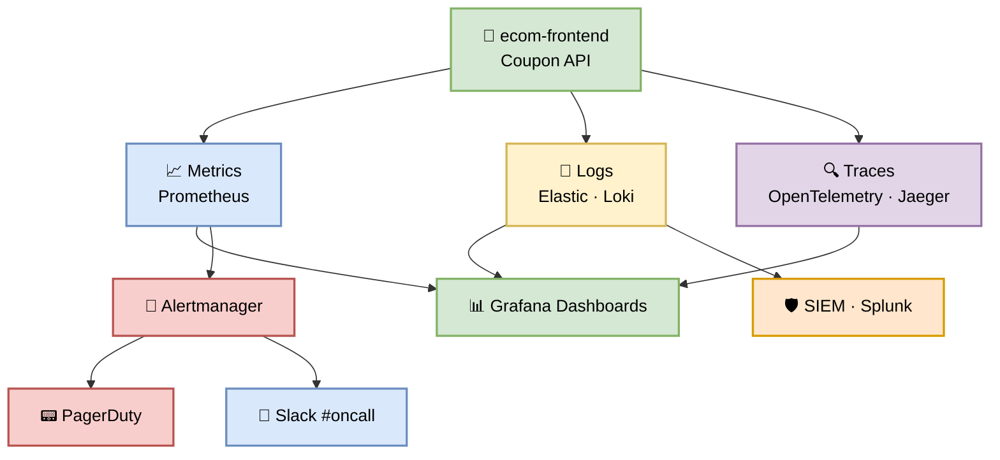
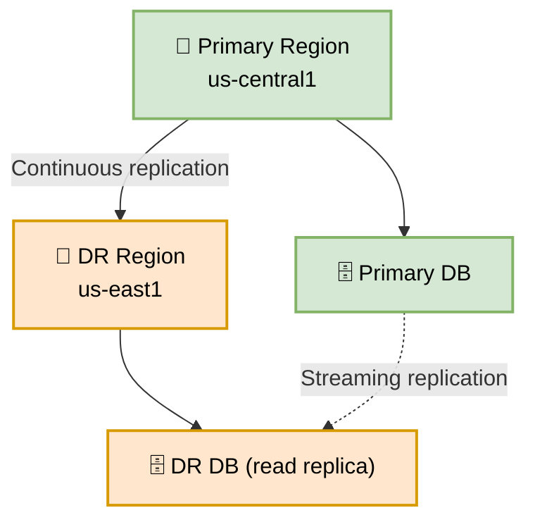

# Part 3 — Operations, Observability & Governance

**Author:** Shubham Tripathi  
**Repository:** `ecom-frontend` (Next.js 14 · App Router · TypeScript)  
**Last Updated:** 2026-09-18  
**Audience:** Frontend Engineers, Reviewers, Tech Leads, QA, DevOps, SRE, Security

---

## 📑 Table of Contents — Part 3

1. [Observability Stack](#-observability-stack)
   - [Metrics](#-metrics-prometheus--grafana)
   - [Logging](#-logging-elastic--loki)
   - [Tracing](#-tracing-opentelemetry--jaeger)
   - [Alerting](#-alerting-alertmanager--pagerduty)
2. [SLOs & SLIs](#-slos--slis)
3. [Incident Response](#-incident-response)
   - [Severity Levels](#-severity-levels)
   - [On-Call Rotation](#-on-call-rotation)
   - [Runbooks](#-runbooks)
4. [Rollback Playbook](#-rollback-playbook)
5. [Disaster Recovery](#-disaster-recovery)
6. [Security & Compliance](#-security--compliance)
7. [Cost Optimization](#-cost-optimization)
8. [Governance & Policies](#-governance--policies)
9. [Appendix — Quick Reference](#-appendix--quick-reference)

---

## 📊 Observability Stack

> **You can't fix what you can't see.** Every stage of the CI/CD pipeline emits metrics, logs, and traces that feed into a unified observability platform.

### 🏗️ Architecture Overview



---

### 📈 Metrics (Prometheus + Grafana)

**What we track:**

| Category | Metric | Example |
|----------|--------|---------|
| **HTTP** | Request rate, error rate, latency | `http_requests_total{path="/api/coupon"}` |
| **Business** | Coupon applies, success rate | `coupon_apply_success_total` |
| **Infra** | CPU, memory, disk, network | `container_cpu_usage_seconds_total` |
| **Runtime** | Event loop lag, GC pauses | `nodejs_eventloop_lag_seconds` |
| **DB** | Query latency, connection pool | `pg_query_duration_seconds` |
| **Cache** | Hit rate, eviction rate | `redis_cache_hits_total` |

**Coupon Feature Example:**

```promql
# Coupon apply success rate (last 5 min)
sum(rate(coupon_apply_success_total[5m]))
/
sum(rate(coupon_apply_total[5m]))
* 100

# P99 latency for coupon endpoint
histogram_quantile(0.99,
  rate(http_request_duration_seconds_bucket{path="/api/coupon"}[5m])
)
```

**Grafana Dashboards:**

| Dashboard | Purpose | Owner |
|-----------|---------|-------|
| **Service Overview** | RED metrics (Rate, Errors, Duration) | SRE |
| **Coupon Funnel** | Apply → Validate → Discount → Checkout | Product |
| **Infra Health** | CPU, memory, disk, network | SRE |
| **DB Performance** | Query latency, slow queries | DBA |
| **Business KPIs** | Conversion, revenue, coupon usage | Product |

---

### 📝 Logging (Elastic + Loki)

**Log Levels:**

| Level | When to Use | Example |
|-------|-------------|---------|
| **ERROR** | Something broke | `Coupon apply failed: invalid signature` |
| **WARN** | Something suspicious | `Coupon expired: SAVE20 (attempted 3x)` |
| **INFO** | Normal operations | `Coupon SAVE20 applied: -20%` |
| **DEBUG** | Development only | `Coupon validation payload: {...}` |

**Structured Log Format (JSON):**

```json
{
  "timestamp": "2026-09-18T10:32:45.123Z",
  "level": "INFO",
  "service": "coupon-api",
  "version": "v2.4.0-coupon",
  "trace_id": "abc123def456",
  "user_id": "u_98765",
  "coupon_code": "SAVE20",
  "discount_pct": 20,
  "cart_total": 100.00,
  "final_total": 80.00,
  "duration_ms": 45,
  "message": "Coupon applied successfully"
}
```

**Log Retention:**

| Tier | Retention | Storage |
|------|-----------|---------|
| Hot (searchable) | 7 days | Elasticsearch |
| Warm | 30 days | S3 |
| Cold (archive) | 1 year | Glacier |
| Audit logs | 7 years | Splunk (compliance) |

---

### 🔍 Tracing (OpenTelemetry + Jaeger)

**Distributed tracing** across all services for the coupon flow:

```
User clicks "Apply Coupon"
    ↓ [trace_id: abc123]
Frontend (Next.js)
    ↓
API Gateway
    ↓
Coupon Service
    ↓
Database (PostgreSQL)
    ↓
Response → User
```

**Span attributes for coupon flow:**

| Span | Attributes |
|------|------------|
| `coupon.apply` | `user_id`, `coupon_code`, `cart_total` |
| `coupon.validate` | `coupon_code`, `valid: true/false` |
| `coupon.discount` | `discount_pct`, `final_total` |
| `db.query` | `query`, `duration_ms` |

**Sampling strategy:**

| Environment | Sample Rate |
|-------------|-------------|
| DEV | 100% |
| QA | 50% |
| STAGING | 20% |
| PROD | 5% (100% for errors) |

---

### 🚨 Alerting (Alertmanager + PagerDuty)

**Alert Routing:**

| Severity | Channel | Response |
|----------|---------|----------|
| **P1 (Critical)** | PagerDuty + Slack #oncall | Page on-call, 5 min SLA |
| **P2 (High)** | Slack #devops-alerts | Notify team, 30 min SLA |
| **P3 (Medium)** | Slack #devops-info | Log only, next business day |
| **P4 (Low)** | Dashboard only | Review weekly |

**Alert Examples:**

```yaml
# Coupon apply success rate < 99%
- alert: CouponSuccessRateLow
  expr: |
    sum(rate(coupon_apply_success_total[5m]))
    /
    sum(rate(coupon_apply_total[5m])) < 0.99
  for: 2m
  labels:
    severity: P1
  annotations:
    summary: "Coupon apply success rate dropped below 99%"
    runbook: "https://runbooks.ecom.com/coupon-success-rate"

# P99 latency > 2s
- alert: CouponLatencyHigh
  expr: |
    histogram_quantile(0.99,
      rate(http_request_duration_seconds_bucket{path="/api/coupon"}[5m])
    ) > 2
  for: 5m
  labels:
    severity: P2
```

---

## 🎯 SLOs & SLIs

> **SLOs define what "good" looks like. SLIs measure it. Error budgets tell us when to stop shipping features and fix reliability.**

### 📊 Service Level Objectives (SLOs)

| Service | SLI | SLO Target | Error Budget (30d) |
|---------|-----|------------|---------------------|
| **Coupon API** | Availability | 99.9% | 43 min downtime |
| **Coupon API** | Latency (P99) | < 500ms | 1% of requests > 500ms |
| **Coupon Apply** | Success rate | 99.5% | 0.5% failures |
| **Checkout** | End-to-end success | 99.0% | 1% failures |
| **Frontend** | Page load (P95) | < 2s | 5% of loads > 2s |

### 🚦 Error Budget Policy

| Error Budget Remaining | Action |
|------------------------|--------|
| **> 50%** | 🟢 Ship features freely |
| **25–50%** | 🟡 Slow down — review changes carefully |
| **10–25%** | 🟠 Feature freeze — focus on reliability |
| **< 10%** | 🔴 Full freeze — only reliability fixes |

**Monthly SLO Review:**

- **When:** First Monday of every month
- **Who:** SRE + Tech Lead + Product
- **What:** Review SLO adherence, error budget, and action items

---

## 🚑 Incident Response

### 🔥 Severity Levels

| Sev | Impact | Examples | Response Time |
|-----|--------|----------|---------------|
| **P1** | Complete outage | Coupon API down, checkout broken | **5 min** — page on-call |
| **P2** | Partial outage | 50% coupon failures, slow checkout | **30 min** — Slack alert |
| **P3** | Degraded | Slow coupon validation, UI glitch | **4 hours** — ticket |
| **P4** | Minor | Typo in error message | **Next sprint** |

### 🧑‍🚒 On-Call Rotation

```yaml
primary_oncall:
  week_1: shubham
  week_2: alice
  week_3: bob
  week_4: charlie

secondary_oncall:
  week_1: alice
  week_2: bob
  week_3: charlie
  week_4: shubham

escalation:
  - primary (5 min SLA)
  - secondary (15 min SLA)
  - tech_lead (30 min SLA)
  - engineering_manager (1 hr SLA)
```

**Handoff:** Every Monday 10:00 AM IST

**On-call responsibilities:**

- Respond to P1/P2 alerts within SLA
- Triage incidents, update status page
- Hand off unresolved incidents to next on-call
- Post-incident: write RCA within 48 hours

### 📖 Runbooks

Every critical alert has a **runbook** with step-by-step remediation:

| Runbook | Link | Owner |
|---------|------|-------|
| Coupon API Down | [runbook](https://runbooks.ecom.com/coupon-down) | SRE |
| Coupon Success Rate Low | [runbook](https://runbooks.ecom.com/coupon-success) | SRE |
| High Latency | [runbook](https://runbooks.ecom.com/latency) | SRE |
| DB Connection Pool Exhausted | [runbook](https://runbooks.ecom.com/db-pool) | DBA |
| Canary Failure | [runbook](https://runbooks.ecom.com/canary-fail) | DevOps |

**Runbook Template:**

```markdown
## Alert: Coupon Success Rate Low

### Symptoms
- Coupon apply success rate < 99%
- Slack alert in #devops-alerts
- Grafana: Coupon Funnel dashboard shows drop

### Diagnosis
1. Check Grafana: Coupon Funnel dashboard
2. Check logs: `kubectl logs -l app=coupon-api --tail=100`
3. Check DB: `SELECT count(*) FROM coupons WHERE expired = false;`
4. Check upstream: Stripe API status page

### Remediation
1. If DB issue → failover to replica
2. If upstream issue → enable circuit breaker
3. If code issue → trigger rollback
   ```bash
   kubectl rollout undo deployment/coupon-api
   ```

### Escalation
- If not resolved in 15 min → page secondary on-call
- If not resolved in 30 min → page tech lead
```

---

## ⏪ Rollback Playbook

> **Every deployment is reversible.** Rollback is a single command, takes < 60 seconds, and requires no manual intervention during canary.

### 🚦 Rollback Triggers

| Trigger | Auto-Rollback? | Action |
|---------|----------------|--------|
| Error rate > 1% | ✅ Yes | Instant rollback |
| P99 latency > 2s | ✅ Yes | Instant rollback |
| Coupon success < 99% | ✅ Yes | Instant rollback |
| Unhandled exception | ✅ Yes | Instant rollback |
| Manual decision | ❌ No | On-call triggers |

### ⏪ Rollback Commands

**Kubernetes (primary):**
```bash
kubectl rollout undo deployment/coupon-api
kubectl rollout status deployment/coupon-api
```

**GCP Cloud Run:**
```bash
gcloud run services update-traffic coupon-api \
  --to-revisions=coupon-api-v2.3.9=100
```

**Vercel:**
```bash
vercel rollback coupon-api
```

**Manual (via pipeline):**
```bash
# Trigger rollback workflow
gh workflow run rollback.yml \
  -f service=coupon-api \
  -f version=v2.3.9-coupon
```

### 📊 Rollback Metrics

| Metric | Target |
|--------|--------|
| **Detection time** | < 30 sec |
| **Decision time** | < 10 sec (auto) |
| **Execution time** | < 60 sec |
| **Total MTTR** | < 2 min |
| **Success rate** | 100% |

---

## 💥 Disaster Recovery

### 🗺️ RTO / RPO Targets

| Component | RTO | RPO |
|-----------|-----|-----|
| **Coupon API** | 15 min | 5 min |
| **Database (PostgreSQL)** | 30 min | 5 min |
| **Cache (Redis)** | 5 min | 1 min |
| **Artifact Registry** | 1 hr | 24 hr |

### 🛡️ DR Strategy



**Failover procedure:**

1. Detect primary region outage (automated health checks)
2. Promote DR read replica to primary
3. Update DNS to point to DR region
4. Scale up DR region
5. Verify coupon flow works
6. Notify stakeholders

**DR Drills:** Quarterly, scheduled, announced 1 week in advance.

---

## 🔐 Security & Compliance

### 🛡️ Security Controls

| Layer | Control |
|-------|---------|
| **Code** | SAST (SonarQube), secret scan (gitleaks) |
| **Dependencies** | SCA (Snyk), SBOM (CycloneDX) |
| **Container** | Trivy, distroless base images |
| **Infra** | Checkov, least-privilege IAM |
| **Runtime** | DAST (ZED), WAF, rate limiting |
| **Supply Chain** | Cosign signatures, SLSA Level 3 |
| **Access** | SSO, MFA, RBAC, audit logs |

### 📋 Compliance

| Standard | Status | Owner |
|----------|--------|-------|
| **SOC 2 Type II** | ✅ Certified | Security |
| **GDPR** | ✅ Compliant | Legal |
| **PCI-DSS** | ✅ Compliant | Security |
| **ISO 27001** | ✅ Certified | Security |

### 🔍 Audit Trail

Every production action is logged to **Splunk** (7-year retention):

- Who deployed what, when, from which commit
- Who approved production gates
- Who triggered rollbacks
- Who accessed secrets
- Who modified IAM policies

---

## 💰 Cost Optimization

### 📊 Cost Visibility

| Resource | Monthly Cost | Owner |
|----------|--------------|-------|
| **Compute (Cloud Run)** | $2,400 | SRE |
| **Database (PostgreSQL)** | $1,800 | DBA |
| **Cache (Redis)** | $400 | SRE |
| **CDN (CloudFront)** | $600 | SRE |
| **Artifact Registry** | $120 | DevOps |
| **Observability (Datadog)** | $1,500 | SRE |
| **CI/CD (GitHub Actions)** | $800 | DevOps |
| **Total** | **~$7,620** | — |

### 🎯 Optimization Wins

| Optimization | Savings |
|--------------|---------|
| **Right-sizing compute** | 25% on Cloud Run |
| **Spot instances for CI** | 40% on GitHub Actions |
| **Reserved DB capacity** | 30% on PostgreSQL |
| **Log sampling (5% prod)** | 20% on Datadog |
| **S3 lifecycle policies** | 15% on storage |
| **Total** | **~$1,900/mo (25%)** |

---

## 🏛️ Governance & Policies

### 📜 Branch Protection

| Branch | Protection |
|--------|------------|
| `main` | 2 approvals + all checks pass + no force-push |
| `develop` | 1 approval + all checks pass |
| `feature/*` | No protection (but pipeline runs) |
| `hotfix/*` | Fast-track, 1 approval, all checks |

### 🔐 Secrets Management

| Secret Type | Storage | Access |
|-------------|---------|--------|
| **API keys** | GCP Secret Manager | Service accounts only |
| **DB passwords** | GCP Secret Manager | Rotation every 90 days |
| **CI tokens** | GitHub Secrets | Encrypted at rest |
| **Signing keys** | GCP KMS | HSM-backed, non-exportable |

**Rules:**
- ❌ Never commit secrets to git
- ❌ Never log secrets
- ✅ Rotate secrets every 90 days
- ✅ Use short-lived tokens where possible
- ✅ Audit secret access monthly

### 👥 Access Control (RBAC)

| Role | Permissions |
|------|-------------|
| **Developer** | Read code, push to feature/*, view CI logs |
| **Reviewer** | + Approve PRs |
| **Tech Lead** | + Approve production, manage branch protection |
| **DevOps** | + Manage pipelines, secrets, IAM |
| **SRE** | + On-call, rollback, incident command |
| **Admin** | + Full access (break-glass, audited) |

### 📝 Change Management

| Change Type | Approval | Testing | Rollback Plan |
|-------------|----------|---------|---------------|
| **Feature** | 2 reviewers + QA | Full pipeline | Automatic |
| **Bugfix** | 1 reviewer | Full pipeline | Automatic |
| **Hotfix** | 1 reviewer + TL | Fast pipeline | Manual + auto |
| **Config** | DevOps | Staging test | Config revert |
| **Schema** | DBA + TL | Dry run + staging | Migration rollback |

---

## 📎 Appendix — Quick Reference

### 🔗 Useful Links

| Resource | URL |
|----------|-----|
| **Pipeline Dashboard** | https://ci.ecom.com/pipelines |
| **Grafana** | https://grafana.ecom.com |
| **Kibana Logs** | https://kibana.ecom.com |
| **Jaeger Traces** | https://jaeger.ecom.com |
| **PagerDuty** | https://ecom.pagerduty.com |
| **Runbooks** | https://runbooks.ecom.com |
| **Status Page** | https://status.ecom.com |
| **Artifact Registry** | https://console.cloud.google.com/artifacts |

### 📞 Escalation Matrix

| Severity | Primary | Secondary | Escalation |
|----------|---------|-----------|------------|
| **P1** | On-call (5 min) | Tech Lead (15 min) | Eng Manager (30 min) |
| **P2** | On-call (30 min) | Tech Lead (1 hr) | Eng Manager (2 hr) |
| **P3** | Team (4 hr) | Tech Lead (1 day) | — |
| **P4** | Backlog | — | — |

### 🧑‍💻 Key Contacts

| Role | Person | Slack | Email |
|------|--------|-------|-------|
| **Pipeline Owner** | Shubham Tripathi | @shubham | shubham@ecom.com |
| **Security Lead** | TBD | @security-lead | security@ecom.com |
| **SRE Lead** | TBD | @sre-lead | sre@ecom.com |
| **Tech Lead** | TBD | @tech-lead | techlead@ecom.com |
| **On-call** | Rotation | @oncall | oncall@ecom.com |

### 📅 Regular Rituals

| Ritual | Frequency | Owner | Duration |
|--------|-----------|-------|----------|
| **Daily Standup** | Daily 10:00 | Team | 15 min |
| **Pipeline Review** | Weekly Mon 11:00 | DevOps | 30 min |
| **SLO Review** | Monthly 1st Mon | SRE + TL | 1 hr |
| **Incident Postmortem** | After P1/P2 | Incident Commander | 1 hr |
| **DR Drill** | Quarterly | SRE | 4 hrs |
| **Security Audit** | Quarterly | Security | 2 days |
| **Cost Review** | Monthly | SRE + Finance | 1 hr |

---

> 📝 **Note:** Part 3 is the **operations bible** for the CI/CD pipeline. It covers what happens **after** deployment — how we monitor, alert, respond, rollback, and govern. Every production system needs this layer.