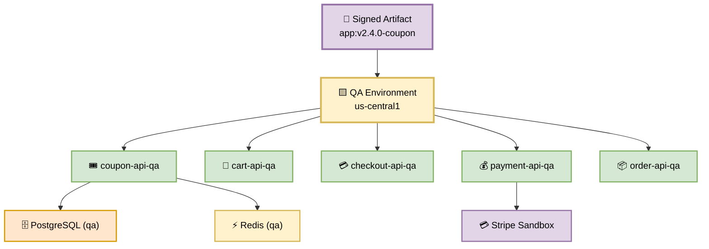
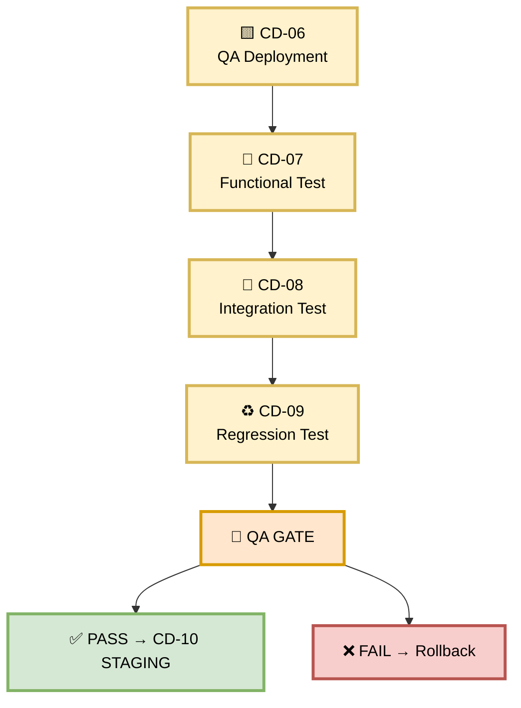
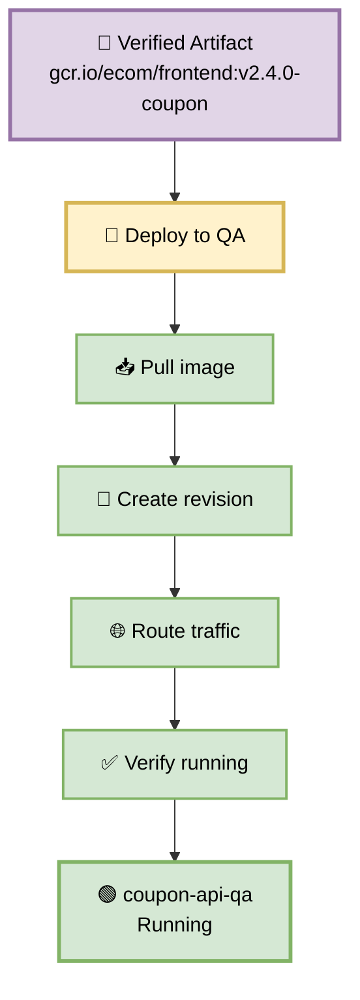
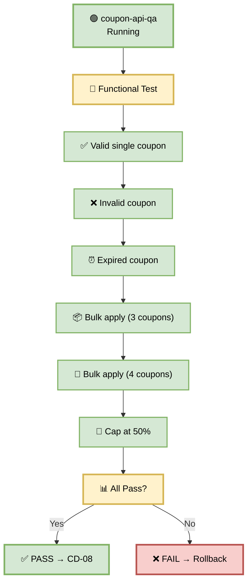
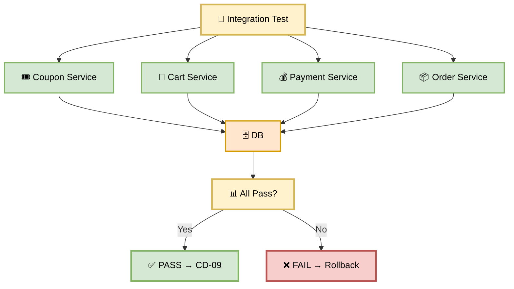
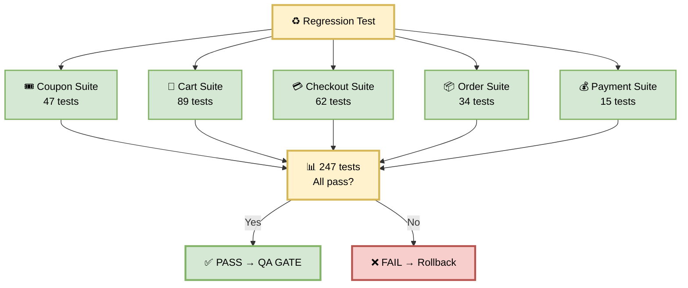
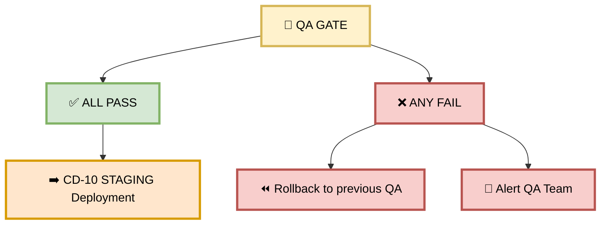

# Part 4 — QA Deployment (CD-06 → CD-09)

**Author:** Shubham Tripathi  
**Repository:** `ecom-frontend` (Next.js 14 · App Router · TypeScript)  
**Last Updated:** 2026-09-18  
**Audience:** DevOps, SRE, QA Engineers, Frontend Engineers, Tech Leads

---

## 📑 Table of Contents — Part 4

1. [QA Environment Overview](#-qa-environment-overview)
2. [CD-06 — QA Deployment](#-cd-06--qa-deployment)
3. [CD-07 — Functional Test](#-cd-07--functional-test)
4. [CD-08 — Integration Test](#-cd-08--integration-test)
5. [CD-09 — Regression Test](#-cd-09--regression-test)
6. [QA Gate — Pass/Fail Rules](#-qa-gate--passfail-rules)
7. [Rollback from QA](#-rollback-from-qa)
8. [QA Environment Reference](#-qa-environment-reference)
9. [Troubleshooting QA](#-troubleshooting-qa)

---

## 🟨 QA Environment Overview

> **QA is where the coupon feature gets validated end-to-end.**  
> Its job: **does the feature actually work** for real user scenarios?

### 🎯 Purpose

| Goal | Description |
|------|-------------|
| **Validate functionality** | Does the coupon feature match the spec? |
| **Test user flows** | Apply → validate → discount → checkout |
| **Catch logic bugs** | Edge cases, invalid inputs, race conditions |
| **Integration coverage** | Coupon + Cart + Payment + Order |
| **Fast feedback** | Total QA stage: **~13 minutes** |

### 🏗️ QA Environment Architecture



### 📊 Environment Details

| Property | Value |
|----------|-------|
| **GCP Project** | `ecom-qa` |
| **Region** | `us-central1` |
| **URL** | `https://qa.ecom.com` |
| **DB** | `postgres-qa` (seeded with test data) |
| **Cache** | `redis-qa` (2 GB) |
| **Replicas** | 2 (min), 6 (max) |
| **Auto-scaling** | Enabled |
| **Payment** | Stripe Sandbox (no real charges) |
| **Cost** | ~$500/month |

### 🔄 QA Stage Flow

```
CD-06 QA Deployment
        ↓
CD-07 Functional Test
        ↓
CD-08 Integration Test
        ↓
CD-09 Regression Test
        ↓
    QA GATE
        ↓
    ✅ PASS → CD-10 STAGING Deployment
    ❌ FAIL → Rollback / Fix
```

### 🖼️ Visual Diagram — QA Stage



---

## 🚀 CD-06 — QA Deployment

> **Deploy the verified artifact to QA.**

### 🎯 Purpose

Take the **same signed artifact** that passed DEV and deploy it to QA — where functional, integration, and regression tests will run.

### 🖼️ Visual Diagram



### 🛠️ Deployment Steps

**Step 1 — Pull the image:**

```bash
docker pull gcr.io/ecom/frontend:v2.4.0-coupon
```

**Step 2 — Deploy to Cloud Run (QA):**

```bash
gcloud run deploy coupon-api-qa \
  --image gcr.io/ecom/frontend:v2.4.0-coupon \
  --region us-central1 \
  --platform managed \
  --allow-unauthenticated \
  --memory 1Gi \
  --cpu 2 \
  --min-instances 2 \
  --max-instances 6 \
  --set-env-vars NODE_ENV=qa,LOG_LEVEL=info,STRIPE_MODE=sandbox
```

**Step 3 — Get the service URL:**

```bash
gcloud run services describe coupon-api-qa \
  --region us-central1 \
  --format="value(status.url)"
# → https://coupon-api-qa-xyz.a.run.app
```

**Step 4 — Verify the revision:**

```bash
gcloud run revisions list \
  --service coupon-api-qa \
  --region us-central1 \
  --limit 1
# → coupon-api-qa-00058 (active, 100% traffic)
```

**Step 5 — Confirm image digest:**

```bash
gcloud run services describe coupon-api-qa \
  --region us-central1 \
  --format="value(spec.template.spec.containers[0].image)"
# → gcr.io/ecom/frontend:v2.4.0-coupon@sha256:abc123...
```

### 📊 Deployment Configuration

| Setting | Value | Why |
|---------|-------|-----|
| **Memory** | 1 Gi | Handle test load |
| **CPU** | 2 vCPU | Faster test execution |
| **Min instances** | 2 | No cold starts during tests |
| **Max instances** | 6 | Handle test parallelism |
| **Timeout** | 60s | Match API gateway |
| **Env** | `NODE_ENV=qa` | QA-appropriate logging |
| **Stripe** | `STRIPE_MODE=sandbox` | No real charges |

### ⏱️ Duration

**~2 minutes**

### ✅ Success Criteria

| Check | Expected |
|-------|----------|
| Deployment status | `Ready` |
| Revision active | 100% traffic |
| Image digest | Matches CD-02 verified digest |
| Health endpoint | 200 OK |
| Startup logs | No errors |

### 📋 Coupon Feature Example

```
✓ Image pulled: gcr.io/ecom/frontend:v2.4.0-coupon
✓ Revision created: coupon-api-qa-00058
✓ Traffic routed: 100% to new revision
✓ Service URL: https://coupon-api-qa-xyz.a.run.app
✓ Digest verified: sha256:abc123...
✓ Stripe sandbox mode: enabled
→ CD-06 PASSED
```

### 🚨 Failure Scenarios

| Error | Cause | Fix |
|-------|-------|-----|
| `Image not found` | Wrong tag | Verify in Artifact Registry |
| `Permission denied` | IAM missing | Grant `run.developer` role |
| `Quota exceeded` | Too many revisions | Delete old revisions |
| `Startup timeout` | App slow to boot | Increase timeout |
| `DB connection refused` | Wrong DB URL | Check env vars |
| `Stripe auth failed` | Wrong sandbox key | Check `STRIPE_SECRET_KEY` |

### 🛠️ Pipeline Configuration Snippet

```yaml
- name: CD-06 QA Deployment
  run: |
    gcloud run deploy coupon-api-qa \
      --image gcr.io/ecom/frontend:${{ github.ref_name }}-coupon \
      --region us-central1 \
      --platform managed \
      --allow-unauthenticated \
      --memory 1Gi \
      --cpu 2 \
      --min-instances 2 \
      --max-instances 6 \
      --set-env-vars NODE_ENV=qa,LOG_LEVEL=info,STRIPE_MODE=sandbox \
      --quiet

    SERVICE_URL=$(gcloud run services describe coupon-api-qa \
      --region us-central1 \
      --format="value(status.url)")
    echo "QA_SERVICE_URL=$SERVICE_URL" >> $GITHUB_ENV
```

---

## 🧪 CD-07 — Functional Test

> **Does the coupon feature work as specified?**

### 🎯 Purpose

Verify every functional requirement from the ticket — from applying a single coupon to bulk apply with caps.

### 🖼️ Visual Diagram



### 🧪 Functional Test Cases

| # | Test | Input | Expected Output |
|---|------|-------|-----------------|
| 1 | **Valid single coupon** | `SAVE20`, cart=$100 | Discount = 20%, total = $80 |
| 2 | **Invalid coupon** | `INVALID123` | Error: "Coupon not found" |
| 3 | **Expired coupon** | `EXPIRED2024` | Error: "Coupon expired" |
| 4 | **Bulk apply (3 coupons)** | `SAVE20`, `WELCOME10`, `SAVE5` | Total discount = 35% |
| 5 | **Bulk apply (4 coupons)** | 4 codes | Error: "Max 3 coupons" |
| 6 | **Cap at 50%** | `SAVE20`, `SAVE20`, `SAVE20` | Total discount = 50% (not 60%) |
| 7 | **Empty coupon** | `""` | Error: "Coupon required" |
| 8 | **Whitespace coupon** | `"  SAVE20  "` | Trimmed, applied |
| 9 | **Case insensitive** | `save20` | Applied (same as SAVE20) |
| 10 | **Duplicate coupon** | `SAVE20`, `SAVE20` | Error: "Duplicate coupon" |
| 11 | **Coupon on empty cart** | `SAVE20`, cart=$0 | Error: "Cart is empty" |
| 12 | **Coupon min purchase** | `SAVE20`, cart=$5 (min $50) | Error: "Min purchase $50" |

### 🛠️ Playwright Test Script

```typescript
// tests/functional/coupon.spec.ts
import { test, expect } from '@playwright/test';

const QA_URL = 'https://qa.ecom.com';

test.describe('Coupon Functional Tests', () => {
  test('applies valid coupon', async ({ page }) => {
    await page.goto(`${QA_URL}/checkout`);
    await page.fill('[data-testid="coupon-input"]', 'SAVE20');
    await page.click('[data-testid="apply-coupon"]');
    await expect(page.locator('[data-testid="discount"]')).toHaveText('-20%');
    await expect(page.locator('[data-testid="total"]')).toHaveText('$80.00');
  });

  test('rejects invalid coupon', async ({ page }) => {
    await page.goto(`${QA_URL}/checkout`);
    await page.fill('[data-testid="coupon-input"]', 'INVALID123');
    await page.click('[data-testid="apply-coupon"]');
    await expect(page.locator('.error')).toHaveText('Coupon not found');
  });

  test('rejects expired coupon', async ({ page }) => {
    await page.goto(`${QA_URL}/checkout`);
    await page.fill('[data-testid="coupon-input"]', 'EXPIRED2024');
    await page.click('[data-testid="apply-coupon"]');
    await expect(page.locator('.error')).toHaveText('Coupon expired');
  });

  test('bulk applies 3 coupons', async ({ page }) => {
    await page.goto(`${QA_URL}/checkout`);
    await page.fill('[data-testid="coupon-1"]', 'SAVE20');
    await page.fill('[data-testid="coupon-2"]', 'WELCOME10');
    await page.fill('[data-testid="coupon-3"]', 'SAVE5');
    await page.click('[data-testid="apply-all"]');
    await expect(page.locator('[data-testid="discount"]')).toHaveText('-35%');
  });

  test('bulk apply caps at 50%', async ({ page }) => {
    await page.goto(`${QA_URL}/checkout`);
    await page.fill('[data-testid="coupon-1"]', 'SAVE20');
    await page.fill('[data-testid="coupon-2"]', 'SAVE20');
    await page.fill('[data-testid="coupon-3"]', 'SAVE20');
    await page.click('[data-testid="apply-all"]');
    await expect(page.locator('[data-testid="discount"]')).toHaveText('-50%');
  });

  test('rejects 4th coupon', async ({ page }) => {
    await page.goto(`${QA_URL}/checkout`);
    await page.fill('[data-testid="coupon-1"]', 'SAVE20');
    await page.fill('[data-testid="coupon-2"]', 'WELCOME10');
    await page.fill('[data-testid="coupon-3"]', 'SAVE5');
    await page.click('[data-testid="add-coupon"]');
    await expect(page.locator('.error')).toHaveText('Maximum 3 coupons allowed');
  });
});
```

### ⏱️ Duration

**~3 minutes**

### ✅ Success Criteria

| Test | Pass Condition |
|------|----------------|
| Valid single coupon | Discount applied correctly |
| Invalid coupon | Error message shown |
| Expired coupon | Error message shown |
| Bulk apply (3) | Total discount = sum |
| Bulk apply (4) | Error message shown |
| Cap at 50% | Total capped at 50% |
| Empty/whitespace | Handled correctly |
| Case insensitive | Works with lowercase |
| Duplicate coupon | Error message shown |
| Coupon on empty cart | Error message shown |
| Min purchase | Error message shown |

### 📋 Coupon Feature Example

```
🧪 Running functional tests
→ Test 1: Valid single coupon ✅
→ Test 2: Invalid coupon ✅
→ Test 3: Expired coupon ✅
→ Test 4: Bulk apply (3) ✅
→ Test 5: Bulk apply (4) ✅
→ Test 6: Cap at 50% ✅
→ Test 7: Empty coupon ✅
→ Test 8: Whitespace ✅
→ Test 9: Case insensitive ✅
→ Test 10: Duplicate ✅
→ Test 11: Empty cart ✅
→ Test 12: Min purchase ✅
🎉 12/12 functional tests passed
→ CD-07 PASSED
```

### 🚨 Failure Scenarios

| Error | Cause | Fix |
|-------|-------|-----|
| Discount not applied | Logic bug | Fix `applyCoupon()` |
| Wrong discount % | Calculation error | Fix math |
| Error message missing | UI bug | Fix error rendering |
| Bulk apply fails | Loop logic broken | Fix `bulkApply()` |
| Cap not enforced | Missing `Math.min()` | Add cap check |

### 🛠️ Pipeline Configuration Snippet

```yaml
- name: CD-07 Functional Test
  run: |
    export QA_URL="${{ env.QA_SERVICE_URL }}"
    npx playwright test tests/functional/coupon.spec.ts \
      --reporter=html \
      --reporter=junit \
      --output=test-results/functional

- name: Upload Functional Test Results
  if: always()
  uses: actions/upload-artifact@v4
  with:
    name: functional-test-results
    path: test-results/functional/
```

---

## 🔗 CD-08 — Integration Test

> **Does coupon work with other services?**

### 🎯 Purpose

Verify that the coupon feature integrates correctly with **cart, payment, and order** services.

### 🖼️ Visual Diagram



### 🧪 Integration Test Scenarios

| # | Scenario | Services Involved | Expected |
|---|----------|-------------------|----------|
| 1 | **Coupon + Cart** | Coupon, Cart | Cart total updated with discount |
| 2 | **Coupon + Payment** | Coupon, Payment | Payment charged = discounted total |
| 3 | **Coupon + Order** | Coupon, Order | Order history shows coupon + discount |
| 4 | **Coupon + Tax** | Coupon, Tax | Tax calculated on discounted total |
| 5 | **Coupon + Shipping** | Coupon, Shipping | Shipping free above threshold (post-discount) |
| 6 | **Coupon rollback** | Coupon, Cart | Remove coupon → cart reverts |
| 7 | **Multiple coupons + Payment** | Coupon, Payment | Correct total charged |
| 8 | **Coupon + Refund** | Coupon, Order, Payment | Refund accounts for discount |

### 🛠️ Integration Test Script

```typescript
// tests/integration/coupon-integration.spec.ts
import { test, expect } from '@playwright/test';

const QA_API = 'https://qa.ecom.com/api';

test.describe('Coupon Integration Tests', () => {
  test('coupon + cart: total updated', async ({ request }) => {
    const cart = await request.post(`${QA_API}/cart`, {
      data: { items: [{ productId: 'p-123', qty: 1, price: 100 }] },
    });
    const cartId = (await cart.json()).id;

    const apply = await request.post(`${QA_API}/coupon/apply`, {
      data: { cartId, code: 'SAVE20' },
    });
    const result = await apply.json();

    expect(result.total).toBe(80);
    expect(result.discount).toBe(20);
  });

  test('coupon + payment: correct charge', async ({ request }) => {
    const order = await request.post(`${QA_API}/orders`, {
      data: { cartId: 'c-123', coupon: 'SAVE20' },
    });
    const orderId = (await order.json()).id;

    const payment = await request.post(`${QA_API}/payments`, {
      data: { orderId, method: 'card_test' },
    });
    const result = await payment.json();

    expect(result.amount).toBe(80);
    expect(result.status).toBe('succeeded');
  });

  test('coupon + order history', async ({ request }) => {
    const order = await request.get(`${QA_API}/orders/o-123`);
    const result = await order.json();

    expect(result.coupon).toBe('SAVE20');
    expect(result.discount).toBe(20);
    expect(result.total).toBe(80);
  });

  test('coupon rollback: cart reverts', async ({ request }) => {
    const remove = await request.post(`${QA_API}/coupon/remove`, {
      data: { cartId: 'c-123' },
    });
    const result = await remove.json();

    expect(result.total).toBe(100); // Back to original
    expect(result.discount).toBe(0);
  });

  test('coupon + tax: tax on discounted total', async ({ request }) => {
    const order = await request.post(`${QA_API}/orders`, {
      data: { cartId: 'c-123', coupon: 'SAVE20', taxRate: 0.1 },
    });
    const result = await order.json();

    expect(result.subtotal).toBe(80);
    expect(result.tax).toBe(8); // 10% of 80
    expect(result.total).toBe(88);
  });

  test('coupon + shipping: free above threshold', async ({ request }) => {
    const order = await request.post(`${QA_API}/orders`, {
      data: { cartId: 'c-123', coupon: 'SAVE20' },
    });
    const result = await order.json();

    // Cart was $100, after 20% discount = $80
    // Free shipping threshold is $75
    expect(result.shipping).toBe(0);
  });
});
```

### ⏱️ Duration

**~3 minutes**

### ✅ Success Criteria

| Scenario | Pass Condition |
|----------|----------------|
| Coupon + Cart | Cart total updated correctly |
| Coupon + Payment | Payment = discounted total |
| Coupon + Order | Order history shows coupon |
| Coupon + Tax | Tax on discounted total |
| Coupon + Shipping | Free shipping if above threshold |
| Coupon rollback | Cart reverts to original |
| Multiple coupons + Payment | Correct total charged |
| Coupon + Refund | Refund accounts for discount |

### 📋 Coupon Feature Example

```
🔗 Running integration tests
→ Test 1: Coupon + Cart ✅
→ Test 2: Coupon + Payment ✅
→ Test 3: Coupon + Order ✅
→ Test 4: Coupon + Tax ✅
→ Test 5: Coupon + Shipping ✅
→ Test 6: Coupon rollback ✅
→ Test 7: Multiple coupons + Payment ✅
→ Test 8: Coupon + Refund ✅
🎉 8/8 integration tests passed
→ CD-08 PASSED
```

### 🚨 Failure Scenarios

| Error | Cause | Fix |
|-------|-------|-----|
| Cart total wrong | Coupon not propagated | Fix cart service integration |
| Payment amount wrong | Discount not applied | Fix payment integration |
| Order history missing coupon | Order service not saving | Fix order service |
| Tax wrong | Tax on original total | Fix tax calculation |
| Shipping not free | Threshold logic broken | Fix shipping threshold |
| Rollback fails | Remove not working | Fix remove endpoint |

### 🛠️ Pipeline Configuration Snippet

```yaml
- name: CD-08 Integration Test
  run: |
    export QA_API="${{ env.QA_SERVICE_URL }}/api"
    npx playwright test tests/integration/coupon-integration.spec.ts \
      --reporter=html \
      --reporter=junit \
      --output=test-results/integration

- name: Upload Integration Test Results
  if: always()
  uses: actions/upload-artifact@v4
  with:
    name: integration-test-results
    path: test-results/integration/
```

---

## ♻️ CD-09 — Regression Test

> **Does the new coupon feature break existing functionality?**

### 🎯 Purpose

Run the **full test suite** to ensure nothing is broken — no existing feature regressed.

### 🖼️ Visual Diagram



### 🧪 Test Suites

| # | Suite | Tests | Purpose |
|---|-------|-------|---------|
| 1 | **Coupon Suite** | 47 | Existing coupon functionality |
| 2 | **Cart Suite** | 89 | Add/remove/update cart |
| 3 | **Checkout Suite** | 62 | Full checkout flow |
| 4 | **Order Suite** | 34 | Order creation, history, cancellation |
| 5 | **Payment Suite** | 15 | Payment processing, refunds |
| **Total** | | **247** | |

### 🛠️ Regression Test Script

```bash
#!/bin/bash
set -e

export QA_API="${QA_SERVICE_URL}/api"

echo "♻️ Running regression tests"
echo ""

# Run full test suite with coverage
npm run test:regression \
  -- --reporter=junit \
  --reporter=html \
  --coverage \
  --coverageThreshold='{
    "global": {
      "lines": 80,
      "branches": 70,
      "functions": 85,
      "statements": 80
    }
  }'

echo ""
echo "🎉 All regression tests passed"
```

### ⏱️ Duration

**~5 minutes**

### ✅ Success Criteria

| Check | Pass Condition |
|-------|----------------|
| All tests pass | 247/247 |
| No skipped tests | 0 skipped |
| Coverage (Lines) | ≥ 80% |
| Coverage (Branches) | ≥ 70% |
| Coverage (Functions) | ≥ 85% |
| No flaky tests | 0 retries |

### 📋 Coupon Feature Example

```
♻️ Running regression tests
→ Coupon Suite: 47/47 ✅
→ Cart Suite: 89/89 ✅
→ Checkout Suite: 62/62 ✅
→ Order Suite: 34/34 ✅
→ Payment Suite: 15/15 ✅
🎉 247/247 tests passed

Coverage:
  Lines: 87% ✅
  Branches: 74% ✅
  Functions: 89% ✅
  Statements: 85% ✅
→ CD-09 PASSED
```

### 🚨 Failure Scenarios

| Error | Cause | Fix |
|-------|-------|-----|
| Coupon test failed | New code broke coupon | Fix regression |
| Cart test failed | Cart integration broken | Fix cart service |
| Checkout failed | Coupon affects checkout | Fix checkout flow |
| Coverage below threshold | Untested code | Add tests |
| Flaky test | Race condition | Fix test or code |

### 🛠️ Pipeline Configuration Snippet

```yaml
- name: CD-09 Regression Test
  run: |
    export QA_API="${{ env.QA_SERVICE_URL }}/api"
    npm run test:regression \
      -- --reporter=junit \
      --reporter=html \
      --coverage

- name: Check Coverage Thresholds
  run: |
    npx nyc check-coverage \
      --lines 80 \
      --branches 70 \
      --functions 85 \
      --statements 80

- name: Upload Regression Test Results
  if: always()
  uses: actions/upload-artifact@v4
  with:
    name: regression-test-results
    path: |
      test-results/regression/
      coverage/
```

---

## 🚦 QA Gate — Pass/Fail Rules

> **The QA Gate validates that the coupon feature works and nothing is broken.**

### 📊 Gate Criteria

| Check | Pass Condition | Blocks? |
|-------|----------------|---------|
| ✅ CD-06 QA Deployment | Revision active, 100% traffic | ✅ Yes |
| ✅ CD-07 Functional Test | All functional tests pass | ✅ Yes |
| ✅ CD-08 Integration Test | All integration tests pass | ✅ Yes |
| ✅ CD-09 Regression Test | 247/247 tests pass, coverage met | ✅ Yes |

### 🚦 Gate Outcome



### ⏱️ Total QA Stage Duration

| Step | Duration |
|------|----------|
| CD-06 QA Deployment | ~2 min |
| CD-07 Functional Test | ~3 min |
| CD-08 Integration Test | ~3 min |
| CD-09 Regression Test | ~5 min |
| **Total** | **~13 min** |

---

## ⏪ Rollback from QA

> **If QA fails, rollback to the previous QA revision.**

### 🛠️ Rollback Steps

```bash
# 1. Get previous revision
PREVIOUS=$(gcloud run revisions list \
  --service coupon-api-qa \
  --region us-central1 \
  --format="value(name)" \
  --limit 2 | tail -1)

# 2. Route 100% traffic to previous
gcloud run services update-traffic coupon-api-qa \
  --to-revisions $PREVIOUS=100 \
  --region us-central1

# 3. Verify
curl -sf https://qa.ecom.com/api/coupon/health

# 4. Notify
curl -X POST $SLACK_WEBHOOK \
  -d '{"text":"⏪ QA rollback: v2.4.0 → previous"}'
```

### ⏱️ Rollback Time

**< 1 minute** — fast, since QA has no real users.

### 📋 Coupon Feature Example

```
🚨 QA deployment failed (functional test)
⏪ Rolling back...
🔄 Traffic → previous revision
✅ Rollback complete in 42 seconds
📢 Slack: #devops-alerts notified
🔧 Developer: fix and re-push
```

---

## 📊 QA Environment Reference

### 🔗 Useful URLs

| Resource | URL |
|----------|-----|
| **QA Service** | https://qa.ecom.com |
| **Coupon API** | https://coupon-api-qa-xyz.a.run.app |
| **GCP Console** | https://console.cloud.google.com/run?project=ecom-qa |
| **Test Reports** | https://ci.ecom.com/qa-reports |
| **Logs** | https://console.cloud.google.com/logs?project=ecom-qa |
| **Metrics** | https://grafana.ecom.com/d/qa |

### 🔑 Access

| Role | Access |
|------|--------|
| **Developer** | Read logs, view metrics |
| **QA Engineer** | Full access, run tests |
| **DevOps** | Deploy, rollback, manage revisions |
| **SRE** | Full access, on-call |

### 📞 Contacts

| Role | Person | Slack |
|------|--------|-------|
| **QA Owner** | QA Team | #qa-team |
| **DevOps Support** | DevOps Team | #devops-support |
| **On-call** | Rotation | #oncall |

---

## 🛠️ Troubleshooting QA

| Problem | Cause | Fix |
|---------|-------|-----|
| **Deployment failed** | IAM permissions | Grant `run.developer` role |
| **Image not found** | Wrong tag | Verify in Artifact Registry |
| **Functional test failed** | Logic bug | Fix code, rebuild |
| **Integration test failed** | Service integration broken | Fix integration |
| **Regression test failed** | Existing feature broken | Fix regression |
| **Coverage below threshold** | Untested code | Add tests |
| **DB connection refused** | Wrong DB URL | Check env vars |
| **Stripe auth failed** | Wrong sandbox key | Check `STRIPE_SECRET_KEY` |
| **Test timeout** | Slow response | Increase timeout, optimize |
| **Flaky test** | Race condition | Fix test or code |

### 🔍 Debugging Commands

```bash
# View logs
gcloud run services logs read coupon-api-qa \
  --region us-central1 \
  --limit 100

# Describe service
gcloud run services describe coupon-api-qa \
  --region us-central1

# List revisions
gcloud run revisions list \
  --service coupon-api-qa \
  --region us-central1

# Run a specific test locally against QA
QA_URL=https://qa.ecom.com npx playwright test \
  tests/functional/coupon.spec.ts --headed

# Rollback to previous
gcloud run services update-traffic coupon-api-qa \
  --to-latest \
  --region us-central1
```

---

## 🎯 Summary — QA Stage

| Aspect | Details |
|--------|---------|
| **Purpose** | Validate coupon feature works end-to-end |
| **Duration** | ~13 minutes |
| **Steps** | CD-06 (deploy), CD-07 (functional), CD-08 (integration), CD-09 (regression) |
| **Gate** | All 4 must pass |
| **Rollback** | < 1 minute |
| **Cost** | ~$500/month |
| **Users** | QA engineers, developers |
| **Next** | CD-10 STAGING Deployment |

---

> 📝 **Note:** QA is your **functional safety net**. Bugs caught here cost minutes; bugs caught in production cost hours. Every test you add here is a bug that never reaches a user.