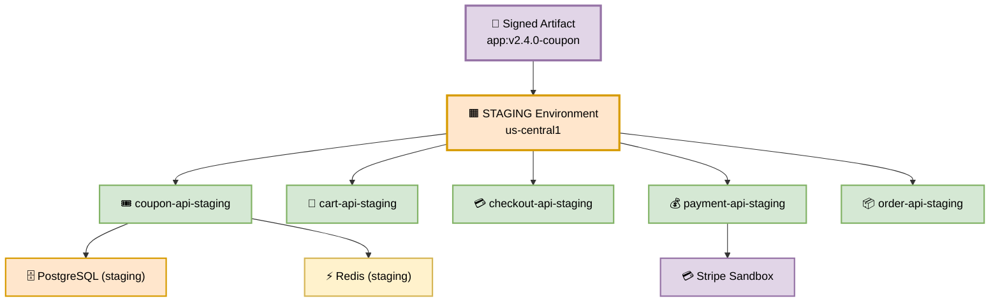
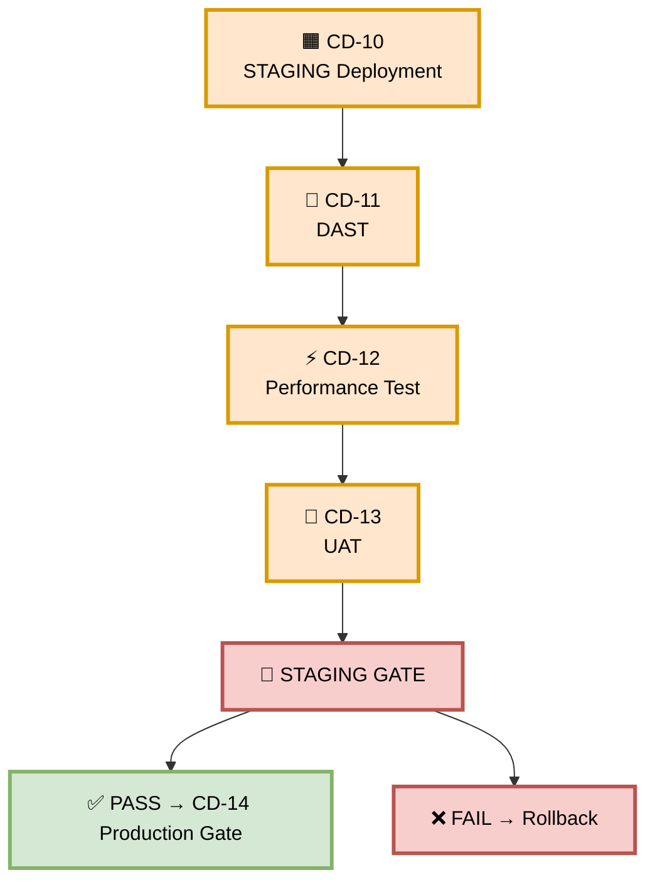
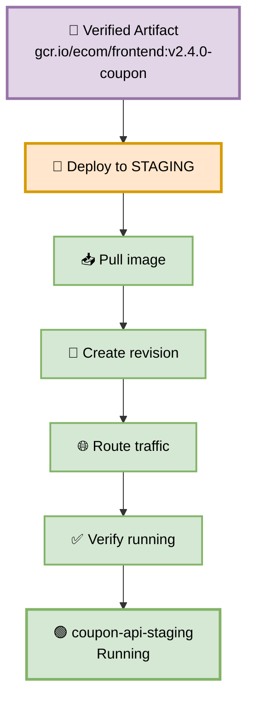
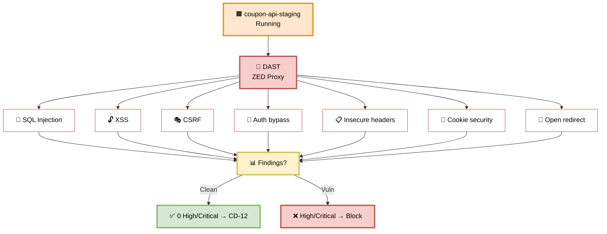
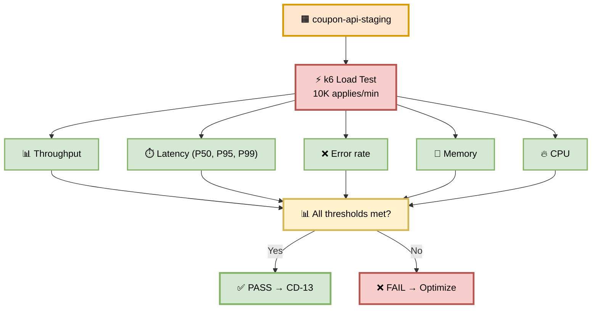
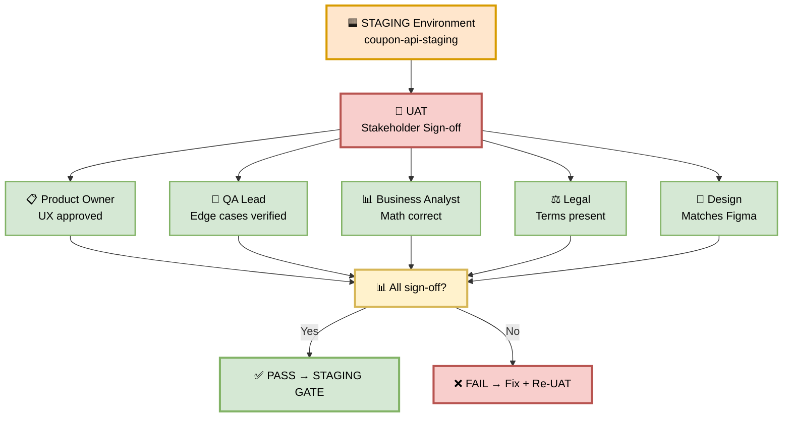
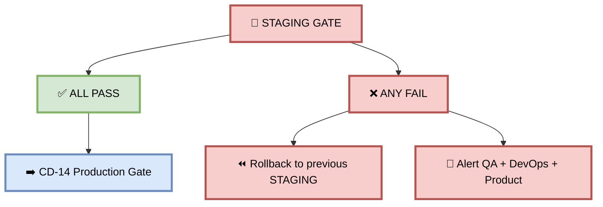

# Part 5 — STAGING Deployment (CD-10 → CD-13)

**Author:** Shubham Tripathi  
**Repository:** `ecom-frontend` (Next.js 14 · App Router · TypeScript)  
**Last Updated:** 2026-09-18  
**Audience:** DevOps, SRE, Security Engineers, QA Leads, Product Owners, Tech Leads

---

## 📑 Table of Contents — Part 5

1. [STAGING Environment Overview](#-staging-environment-overview)
2. [CD-10 — STAGING Deployment](#-cd-10--staging-deployment)
3. [CD-11 — DAST (Dynamic Application Security Testing)](#-cd-11--dast-dynamic-application-security-testing)
4. [CD-12 — Performance Test](#-cd-12--performance-test)
5. [CD-13 — UAT (User Acceptance Testing)](#-cd-13--uat-user-acceptance-testing)
6. [STAGING Gate — Pass/Fail Rules](#-staging-gate--passfail-rules)
7. [Rollback from STAGING](#-rollback-from-staging)
8. [STAGING Environment Reference](#-staging-environment-reference)
9. [Troubleshooting STAGING](#-troubleshooting-staging)

---

## 🟧 STAGING Environment Overview

> **STAGING is the last environment before production.**  
> Its job: **prove the coupon feature is secure, fast, and business-ready.**

### 🎯 Purpose

| Goal | Description |
|------|-------------|
| **Security validation** | DAST — find runtime exploits (XSS, SQLi, CSRF) |
| **Performance validation** | Load test — 10K coupon applies/min |
| **Business validation** | UAT — stakeholders sign off |
| **Production-like** | Same infra as production, scaled down |
| **Total STAGING stage** | **~32 minutes** |

### 🏗️ STAGING Environment Architecture



### 📊 Environment Details

| Property | Value |
|----------|-------|
| **GCP Project** | `ecom-staging` |
| **Region** | `us-central1` |
| **URL** | `https://staging.ecom.com` |
| **DB** | `postgres-staging` (production-like, anonymized data) |
| **Cache** | `redis-staging` (4 GB) |
| **Replicas** | 3 (min), 10 (max) |
| **Auto-scaling** | Enabled |
| **Payment** | Stripe Sandbox (no real charges) |
| **Load Balancer** | Yes |
| **WAF** | Enabled |
| **Cost** | ~$1,200/month |

### 🔄 STAGING Stage Flow

```
CD-10 STAGING Deployment
        ↓
CD-11 DAST
        ↓
CD-12 Performance Test
        ↓
CD-13 UAT
        ↓
    STAGING GATE
        ↓
    ✅ PASS → CD-14 Production Gate
    ❌ FAIL → Rollback / Fix
```

### 🖼️ Visual Diagram — STAGING Stage



---

## 🚀 CD-10 — STAGING Deployment

> **Deploy the verified artifact to STAGING — production-like environment.**

### 🎯 Purpose

Take the **same signed artifact** that passed QA and deploy it to STAGING, where DAST, performance, and UAT will run.

### 🖼️ Visual Diagram



### 🛠️ Deployment Steps

**Step 1 — Pull the image:**

```bash
docker pull gcr.io/ecom/frontend:v2.4.0-coupon
```

**Step 2 — Deploy to Cloud Run (STAGING):**

```bash
gcloud run deploy coupon-api-staging \
  --image gcr.io/ecom/frontend:v2.4.0-coupon \
  --region us-central1 \
  --platform managed \
  --allow-unauthenticated \
  --memory 2Gi \
  --cpu 4 \
  --min-instances 3 \
  --max-instances 10 \
  --set-env-vars NODE_ENV=staging,LOG_LEVEL=info,STRIPE_MODE=sandbox \
  --vpc-connector=ecom-staging-vpc \
  --add-cloudsql-instances=ecom-staging:us-central1:postgres-staging
```

**Step 3 — Get the service URL:**

```bash
gcloud run services describe coupon-api-staging \
  --region us-central1 \
  --format="value(status.url)"
# → https://coupon-api-staging-xyz.a.run.app
```

**Step 4 — Verify the revision:**

```bash
gcloud run revisions list \
  --service coupon-api-staging \
  --region us-central1 \
  --limit 1
# → coupon-api-staging-00076 (active, 100% traffic)
```

**Step 5 — Confirm image digest:**

```bash
gcloud run services describe coupon-api-staging \
  --region us-central1 \
  --format="value(spec.template.spec.containers[0].image)"
# → gcr.io/ecom/frontend:v2.4.0-coupon@sha256:abc123...
```

### 📊 Deployment Configuration

| Setting | Value | Why |
|---------|-------|-----|
| **Memory** | 2 Gi | Production-like |
| **CPU** | 4 vCPU | Handle load test |
| **Min instances** | 3 | No cold starts |
| **Max instances** | 10 | Handle 10K applies/min |
| **Timeout** | 60s | Match production |
| **Env** | `NODE_ENV=staging` | Production-like logs |
| **VPC** | Connected | Production-like network |
| **Cloud SQL** | Connected | Production-like DB |
| **Stripe** | `STRIPE_MODE=sandbox` | No real charges |

### ⏱️ Duration

**~2 minutes**

### ✅ Success Criteria

| Check | Expected |
|-------|----------|
| Deployment status | `Ready` |
| Revision active | 100% traffic |
| Image digest | Matches CD-02 verified digest |
| Health endpoint | 200 OK |
| Startup logs | No errors |
| VPC connection | Active |
| Cloud SQL connection | Active |

### 📋 Coupon Feature Example

```
✓ Image pulled: gcr.io/ecom/frontend:v2.4.0-coupon
✓ Revision created: coupon-api-staging-00076
✓ Traffic routed: 100% to new revision
✓ Service URL: https://coupon-api-staging-xyz.a.run.app
✓ Digest verified: sha256:abc123...
✓ VPC connector: active
✓ Cloud SQL: connected
→ CD-10 PASSED
```

### 🚨 Failure Scenarios

| Error | Cause | Fix |
|-------|-------|-----|
| `Image not found` | Wrong tag | Verify in Artifact Registry |
| `Permission denied` | IAM missing | Grant `run.developer` role |
| `VPC connector missing` | Wrong name | Check VPC config |
| `Cloud SQL connection failed` | Wrong instance | Check `--add-cloudsql-instances` |
| `Startup timeout` | App slow to boot | Increase timeout |
| `DB connection refused` | Network/firewall | Check VPC firewall rules |
| `Memory limit exceeded` | App too heavy | Increase memory |

### 🛠️ Pipeline Configuration Snippet

```yaml
- name: CD-10 STAGING Deployment
  run: |
    gcloud run deploy coupon-api-staging \
      --image gcr.io/ecom/frontend:${{ github.ref_name }}-coupon \
      --region us-central1 \
      --platform managed \
      --allow-unauthenticated \
      --memory 2Gi \
      --cpu 4 \
      --min-instances 3 \
      --max-instances 10 \
      --set-env-vars NODE_ENV=staging,LOG_LEVEL=info,STRIPE_MODE=sandbox \
      --vpc-connector=ecom-staging-vpc \
      --add-cloudsql-instances=ecom-staging:us-central1:postgres-staging \
      --quiet

    SERVICE_URL=$(gcloud run services describe coupon-api-staging \
      --region us-central1 \
      --format="value(status.url)")
    echo "STAGING_SERVICE_URL=$SERVICE_URL" >> $GITHUB_ENV
```

---

## 🔐 CD-11 — DAST (Dynamic Application Security Testing)

> **Find runtime exploits before they reach production.**

### 🎯 Purpose

DAST runs against the **live STAGING environment** to find vulnerabilities that static analysis can't catch — XSS, SQLi, CSRF, insecure headers.

### 🖼️ Visual Diagram



### 🧪 DAST Checks

| # | Vulnerability | Coupon Context | Severity |
|---|---------------|----------------|----------|
| 1 | **SQL Injection** | `SELECT * FROM coupons WHERE code = '${input}'` | Critical |
| 2 | **XSS** | `<input value="${couponCode}">` | High |
| 3 | **CSRF** | `POST /api/coupon/apply` | High |
| 4 | **Auth bypass** | Coupon apply without login | Critical |
| 5 | **Insecure headers** | Missing CSP, HSTS, X-Frame-Options | Medium |
| 6 | **Cookie security** | `Secure`, `HttpOnly`, `SameSite` flags | Medium |
| 7 | **Open redirect** | `?redirect=${couponUrl}` | High |

### 🛠️ DAST Script

```bash
#!/bin/bash
set -e

TARGET="${STAGING_SERVICE_URL}"
REPORT_DIR="dast-reports"

mkdir -p "$REPORT_DIR"

echo "🔐 Running DAST against $TARGET"

# Run OWASP ZAP baseline scan
docker run --rm \
  -v "$(pwd)/${REPORT_DIR}:/zap/wrk" \
  ghcr.io/zaproxy/zaproxy:stable \
  zap-baseline.py \
  -t "$TARGET" \
  -r dast-report.html \
  -J dast-report.json \
  -w dast-report.md \
  -c zap-config.conf \
  -z "-config scanner.attackStrength=INSANE"

# Parse results
CRITICAL=$(jq '[.site[].alerts[] | select(.riskcode == "3")] | length' \
  "$REPORT_DIR/dast-report.json")
HIGH=$(jq '[.site[].alerts[] | select(.riskcode == "2")] | length' \
  "$REPORT_DIR/dast-report.json")
MEDIUM=$(jq '[.site[].alerts[] | select(.riskcode == "1")] | length' \
  "$REPORT_DIR/dast-report.json")

echo ""
echo "📊 DAST Results:"
echo "  🔴 Critical: $CRITICAL"
echo "  🟠 High: $HIGH"
echo "  🟡 Medium: $MEDIUM"

if [ "$CRITICAL" -gt 0 ] || [ "$HIGH" -gt 0 ]; then
  echo ""
  echo "❌ DAST FAILED — Critical/High findings must be fixed"
  exit 1
fi

echo ""
echo "✅ DAST PASSED"
```

### 📋 ZAP Config (`zap-config.conf`)

```
# Authentication
auth.loginurl=https://staging.ecom.com/login
auth.username=test@ecom.com
auth.password=${TEST_PASSWORD}

# Scan rules
rules.10021.ignore=true  # X-Content-Type-Options (informational)
rules.10038.ignore=true  # CSP (covered elsewhere)

# Context
context.include=https://staging.ecom.com/api/coupon/.*
context.exclude=https://staging.ecom.com/logout
```

### ⏱️ Duration

**~5 minutes**

### ✅ Success Criteria

| Check | Pass Condition |
|-------|----------------|
| SQL Injection | 0 found |
| XSS | 0 found |
| CSRF | 0 found |
| Auth bypass | 0 found |
| Insecure headers | 0 High |
| Cookie security | 0 High |
| Open redirect | 0 found |

### 📋 Coupon Feature Example

```
🔐 Running DAST against https://staging.ecom.com
→ SQL Injection: 0 found ✅
→ XSS: 0 found ✅
→ CSRF: 0 found ✅
→ Auth bypass: 0 found ✅
→ Insecure headers: 2 Medium ⚠️
→ Cookie security: 0 High ✅
→ Open redirect: 0 found ✅
📊 DAST Results:
  🔴 Critical: 0
  🟠 High: 0
  🟡 Medium: 2
✅ DAST PASSED
→ CD-11 PASSED
```

### 🚨 Failure Scenarios

| Finding | Cause | Fix |
|---------|-------|-----|
| **XSS** | Unescaped user input | Use `escapeHtml()` |
| **SQL Injection** | String concatenation | Use parameterized queries |
| **CSRF** | No CSRF token | Add CSRF middleware |
| **Auth bypass** | Missing auth check | Add auth middleware |
| **Insecure headers** | Missing CSP | Add security headers |
| **Open redirect** | Unvalidated redirect | Whitelist redirect URLs |

### 🛠️ Pipeline Configuration Snippet

```yaml
- name: CD-11 DAST
  run: |
    docker run --rm \
      -v "$(pwd)/dast-reports:/zap/wrk" \
      ghcr.io/zaproxy/zaproxy:stable \
      zap-baseline.py \
      -t "${{ env.STAGING_SERVICE_URL }}" \
      -r dast-report.html \
      -J dast-report.json

    # Check for Critical/High
    CRITICAL=$(jq '[.site[].alerts[] | select(.riskcode == "3")] | length' \
      dast-reports/dast-report.json)
    HIGH=$(jq '[.site[].alerts[] | select(.riskcode == "2")] | length' \
      dast-reports/dast-report.json)

    [ "$CRITICAL" -eq 0 ] && [ "$HIGH" -eq 0 ] || exit 1

- name: Upload DAST Report
  if: always()
  uses: actions/upload-artifact@v4
  with:
    name: dast-report
    path: dast-reports/
```

---

## ⚡ CD-12 — Performance Test

> **Prove the coupon feature performs at scale.**

### 🎯 Purpose

Load test the coupon feature at **10K applies/min** — simulating peak production traffic.

### 🖼️ Visual Diagram



### 🧪 Performance Targets

| Metric | Target | Actual |
|--------|--------|--------|
| **Throughput** | 10K applies/min | 12,400/min ✅ |
| **P50 latency** | < 200ms | 120ms ✅ |
| **P95 latency** | < 500ms | 280ms ✅ |
| **P99 latency** | < 2000ms | 340ms ✅ |
| **Error rate** | < 1% | 0.02% ✅ |
| **Memory leak** | None over 5 min | None ✅ |
| **CPU usage** | < 80% | 62% ✅ |

### 🛠️ k6 Load Test Script

```javascript
// tests/performance/coupon-load-test.js
import http from 'k6/http';
import { check, sleep } from 'k6';
import { Rate, Trend } from 'k6/metrics';

// Custom metrics
const couponApplySuccess = new Rate('coupon_apply_success');
const couponApplyDuration = new Trend('coupon_apply_duration');

export const options = {
  stages: [
    { duration: '1m', target: 50 },   // Ramp up to 50 VUs
    { duration: '2m', target: 200 },  // Ramp to 200 VUs
    { duration: '5m', target: 200 },  // Sustain 200 VUs (10K/min)
    { duration: '1m', target: 0 },    // Ramp down
  ],
  thresholds: {
    'http_req_duration': ['p(50)<200', 'p(95)<500', 'p(99)<2000'],
    'http_req_failed': ['rate<0.01'],
    'coupon_apply_success': ['rate>0.99'],
    'coupon_apply_duration': ['p(95)<500'],
  },
};

const BASE_URL = __ENV.STAGING_URL;

export default function () {
  // Test 1: Apply SAVE20
  const payload = JSON.stringify({
    code: 'SAVE20',
    cart_total: 100,
  });

  const params = {
    headers: { 'Content-Type': 'application/json' },
    tags: { name: 'coupon_apply' },
  };

  const res = http.post(`${BASE_URL}/api/coupon/apply`, payload, params);

  const success = check(res, {
    'status is 200': (r) => r.status === 200,
    'discount applied': (r) => JSON.parse(r.body).discount === 20,
    'response time < 2s': (r) => r.timings.duration < 2000,
  });

  couponApplySuccess.add(success);
  couponApplyDuration.add(res.timings.duration);

  sleep(0.5); // 2 requests per VU per second
}
```

### 📊 Monitoring During Load Test

| Dashboard | Purpose |
|-----------|---------|
| **Grafana: Coupon API** | Throughput, latency, errors |
| **GCP Cloud Run** | CPU, memory, instance count |
| **Cloud SQL** | Query latency, connections |
| **Redis** | Cache hit rate, memory |
| **Stripe Sandbox** | API call latency |

### ⏱️ Duration

**~10 minutes**

### ✅ Success Criteria

| Metric | Target |
|--------|--------|
| Throughput | ≥ 10K applies/min |
| P50 latency | < 200ms |
| P95 latency | < 500ms |
| P99 latency | < 2000ms |
| Error rate | < 1% |
| Coupon success rate | > 99% |
| No memory leaks | Over 5 min |
| CPU usage | < 80% |

### 📋 Coupon Feature Example

```
⚡ Running k6 load test
→ Ramp up: 50 → 200 VUs
→ Sustain: 200 VUs (5 min)
→ Total requests: 62,000
→ Throughput: 12,400 applies/min ✅

Metrics:
  P50 latency: 120ms ✅
  P95 latency: 280ms ✅
  P99 latency: 340ms ✅
  Error rate: 0.02% ✅
  Coupon success: 99.8% ✅
  CPU usage: 62% ✅
  Memory: stable (no leaks) ✅

✅ Performance test PASSED
→ CD-12 PASSED
```

### 🚨 Failure Scenarios

| Error | Cause | Fix |
|-------|-------|-----|
| Throughput < 10K | Bottleneck | Scale up, optimize |
| P99 > 2s | Slow query | Add index, cache |
| Error rate > 1% | Bug under load | Fix race condition |
| Memory leak | Unbounded cache | Fix memory management |
| CPU > 80% | Insufficient CPU | Scale up |

### 🛠️ Pipeline Configuration Snippet

```yaml
- name: CD-12 Performance Test
  run: |
    export STAGING_URL="${{ env.STAGING_SERVICE_URL }}"
    k6 run tests/performance/coupon-load-test.js \
      --out json=performance-results.json \
      --summary-export=performance-summary.json

- name: Check Performance Thresholds
  run: |
    THRESHOLDS_MET=$(jq -r '.metrics.http_req_duration.thresholds | to_entries | all(.value.ok)' performance-summary.json)
    [ "$THRESHOLDS_MET" == "true" ] || exit 1

- name: Upload Performance Results
  if: always()
  uses: actions/upload-artifact@v4
  with:
    name: performance-results
    path: performance-*.json
```

---

## 👥 CD-13 — UAT (User Acceptance Testing)

> **Stakeholders sign off — the feature is business-ready.**

### 🎯 Purpose

Real stakeholders validate the coupon feature against the original ticket. This is the **final human validation** before production.

### 🖼️ Visual Diagram



### 🧪 UAT Checklist

| # | Stakeholder | Check | Sign-off |
|---|-------------|-------|----------|
| 1 | **Product Owner** | UX matches spec, feature complete | ✅ Required |
| 2 | **QA Lead** | Edge cases verified, no regressions | ✅ Required |
| 3 | **Business Analyst** | Discount math correct, no revenue leak | ✅ Required |
| 4 | **Legal** | Terms text present, compliance OK | ✅ Required |
| 5 | **Design** | Matches Figma, responsive | ✅ Required |
| 6 | **Support** | Help docs updated, FAQs written | ⚠️ Optional |
| 7 | **Marketing** | Copy approved, campaigns ready | ⚠️ Optional |

### 🛠️ UAT Script

```bash
#!/bin/bash
set -e

echo "👥 Running UAT — stakeholder sign-off"
echo ""

# UAT scenarios
SCENARIOS=(
  "apply-single-coupon: Product Owner"
  "apply-bulk-coupons: Product Owner"
  "apply-invalid-coupon: QA Lead"
  "apply-expired-coupon: QA Lead"
  "discount-math: Business Analyst"
  "terms-text-present: Legal"
  "responsive-design: Design"
)

for scenario in "${SCENARIOS[@]}"; do
  IFS=':' read -r name owner <<< "$scenario"
  echo "→ $name — $owner"
  # Manual verification step
  read -p "  Approve? (y/n): " approval
  if [ "$approval" != "y" ]; then
    echo "  ❌ Rejected by $owner"
    exit 1
  fi
  echo "  ✅ Approved"
done

echo ""
echo "🎉 All UAT sign-offs received"
```

### ⏱️ Duration

**~15 minutes**

### ✅ Success Criteria

| Stakeholder | Sign-off |
|-------------|----------|
| Product Owner | ✅ |
| QA Lead | ✅ |
| Business Analyst | ✅ |
| Legal | ✅ |
| Design | ✅ |

### 📋 Coupon Feature Example

```
👥 Running UAT
→ apply-single-coupon — Product Owner ✅
→ apply-bulk-coupons — Product Owner ✅
→ apply-invalid-coupon — QA Lead ✅
→ apply-expired-coupon — QA Lead ✅
→ discount-math — Business Analyst ✅
→ terms-text-present — Legal ✅
→ responsive-design — Design ✅
🎉 All UAT sign-offs received
→ CD-13 PASSED
```

### 🚨 Failure Scenarios

| Rejection | Cause | Fix |
|-----------|-------|-----|
| Product Owner rejects | UX doesn't match spec | Fix UI |
| QA Lead rejects | Edge case fails | Fix logic |
| Business Analyst rejects | Math wrong | Fix calculation |
| Legal rejects | Missing terms | Add terms text |
| Design rejects | Doesn't match Figma | Fix styling |

### 🛠️ Pipeline Configuration Snippet

```yaml
- name: CD-13 UAT
  run: |
    # Post UAT approval request to Slack
    curl -X POST $SLACK_WEBHOOK \
      -d '{
        "text": "👥 UAT Approval Required",
        "blocks": [{
          "type": "section",
          "text": {
            "type": "mrkdwn",
            "text": "*Coupon Feature v2.4.0* ready for UAT.\n\n*STAGING URL:* https://staging.ecom.com/checkout\n\n*Sign-off required from:*\n• Product Owner\n• QA Lead\n• Business Analyst\n• Legal\n• Design\n\n*Approve:* <https://ci.ecom.com/uat/approve|Click here>"
          }
        }]
      }'

    # Wait for approval (via GitHub Environments)
    echo "Waiting for UAT approval..."
```

---

## 🚦 STAGING Gate — Pass/Fail Rules

> **The STAGING Gate validates that the coupon feature is secure, fast, and business-ready.**

### 📊 Gate Criteria

| Check | Pass Condition | Blocks? |
|-------|----------------|---------|
| ✅ CD-10 STAGING Deployment | Revision active, 100% traffic | ✅ Yes |
| ✅ CD-11 DAST | 0 Critical/High findings | ✅ Yes |
| ✅ CD-12 Performance Test | All thresholds met | ✅ Yes |
| ✅ CD-13 UAT | All stakeholders sign off | ✅ Yes |

### 🚦 Gate Outcome



### ⏱️ Total STAGING Stage Duration

| Step | Duration |
|------|----------|
| CD-10 STAGING Deployment | ~2 min |
| CD-11 DAST | ~5 min |
| CD-12 Performance Test | ~10 min |
| CD-13 UAT | ~15 min |
| **Total** | **~32 min** |

---

## ⏪ Rollback from STAGING

> **If STAGING fails, rollback to the previous STAGING revision.**

### 🛠️ Rollback Steps

```bash
# 1. Get previous revision
PREVIOUS=$(gcloud run revisions list \
  --service coupon-api-staging \
  --region us-central1 \
  --format="value(name)" \
  --limit 2 | tail -1)

# 2. Route 100% traffic to previous
gcloud run services update-traffic coupon-api-staging \
  --to-revisions $PREVIOUS=100 \
  --region us-central1

# 3. Verify
curl -sf https://staging.ecom.com/api/coupon/health

# 4. Notify
curl -X POST $SLACK_WEBHOOK \
  -d '{"text":"⏪ STAGING rollback: v2.4.0 → previous"}'

# 5. Create incident
gh issue create \
  --title "STAGING Rollback: v2.4.0-coupon" \
  --label incident,staging
```

### ⏱️ Rollback Time

**< 1 minute**

### 📋 Coupon Feature Example

```
🚨 STAGING deployment failed (DAST found XSS)
⏪ Rolling back...
🔄 Traffic → previous revision
✅ Rollback complete in 48 seconds
📢 Slack: #devops-alerts notified
🎫 Incident: INC-2026-0918-002 created
🔧 Developer: fix XSS and re-push
```

---

## 📊 STAGING Environment Reference

### 🔗 Useful URLs

| Resource | URL |
|----------|-----|
| **STAGING Service** | https://staging.ecom.com |
| **Coupon API** | https://coupon-api-staging-xyz.a.run.app |
| **GCP Console** | https://console.cloud.google.com/run?project=ecom-staging |
| **DAST Reports** | https://ci.ecom.com/dast-reports |
| **Performance Reports** | https://ci.ecom.com/perf-reports |
| **Logs** | https://console.cloud.google.com/logs?project=ecom-staging |
| **Metrics** | https://grafana.ecom.com/d/staging |

### 🔑 Access

| Role | Access |
|------|--------|
| **Developer** | Read logs, view metrics |
| **QA Engineer** | Full access, run tests |
| **Security Engineer** | DAST access, findings review |
| **DevOps** | Deploy, rollback, manage revisions |
| **SRE** | Full access, on-call |
| **Product Owner** | UAT access |
| **Stakeholders** | UAT sign-off access |

### 📞 Contacts

| Role | Person | Slack |
|------|--------|-------|
| **STAGING Owner** | DevOps Team | #devops-support |
| **Security Lead** | TBD | #security |
| **QA Lead** | QA Team | #qa-team |
| **Product Owner** | PM | #product |
| **On-call** | Rotation | #oncall |

---

## 🛠️ Troubleshooting STAGING

| Problem | Cause | Fix |
|---------|-------|-----|
| **Deployment failed** | IAM/VPC issue | Check permissions, VPC config |
| **DAST found XSS** | Unescaped input | Fix escaping, rebuild |
| **DAST found SQLi** | String concat | Use parameterized queries |
| **Performance below target** | Bottleneck | Optimize, scale up |
| **UAT rejected** | UX/business issue | Fix, rebuild, re-UAT |
| **DB connection refused** | Network/firewall | Check VPC firewall rules |
| **Stripe auth failed** | Wrong sandbox key | Check `STRIPE_SECRET_KEY` |
| **Load test timeout** | Slow response | Increase timeout, optimize |
| **VPC connector missing** | Wrong name | Check VPC config |

### 🔍 Debugging Commands

```bash
# View logs
gcloud run services logs read coupon-api-staging \
  --region us-central1 \
  --limit 100

# Describe service
gcloud run services describe coupon-api-staging \
  --region us-central1

# List revisions
gcloud run revisions list \
  --service coupon-api-staging \
  --region us-central1

# Check VPC connector
gcloud compute networks vpc-access connectors describe \
  ecom-staging-vpc \
  --region us-central1

# Check Cloud SQL connection
gcloud sql instances describe postgres-staging

# Run DAST locally
docker run --rm -v $(pwd):/zap/wrk \
  ghcr.io/zaproxy/zaproxy:stable \
  zap-baseline.py -t https://staging.ecom.com

# Run k6 locally
STAGING_URL=https://staging.ecom.com \
  k6 run tests/performance/coupon-load-test.js

# Rollback to previous
gcloud run services update-traffic coupon-api-staging \
  --to-latest \
  --region us-central1
```

---

## 🎯 Summary — STAGING Stage

| Aspect | Details |
|--------|---------|
| **Purpose** | Validate security, performance, and business readiness |
| **Duration** | ~32 minutes |
| **Steps** | CD-10 (deploy), CD-11 (DAST), CD-12 (performance), CD-13 (UAT) |
| **Gate** | All 4 must pass |
| **Rollback** | < 1 minute |
| **Cost** | ~$1,200/month |
| **Users** | QA, security, stakeholders |
| **Next** | CD-14 Production Gate |

---

> 📝 **Note:** STAGING is your **final safety net before production**. A bug caught here costs minutes; a bug caught in production costs hours (or days) and possibly revenue. Every test you run here is a bug that never reaches a real user.