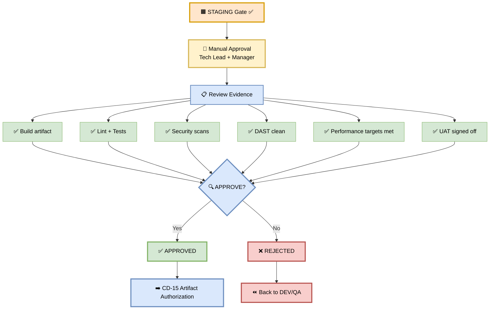
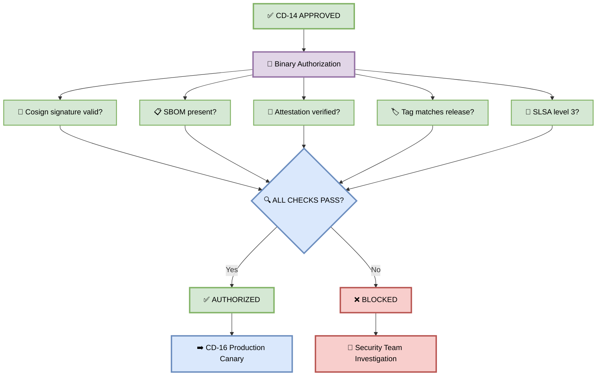
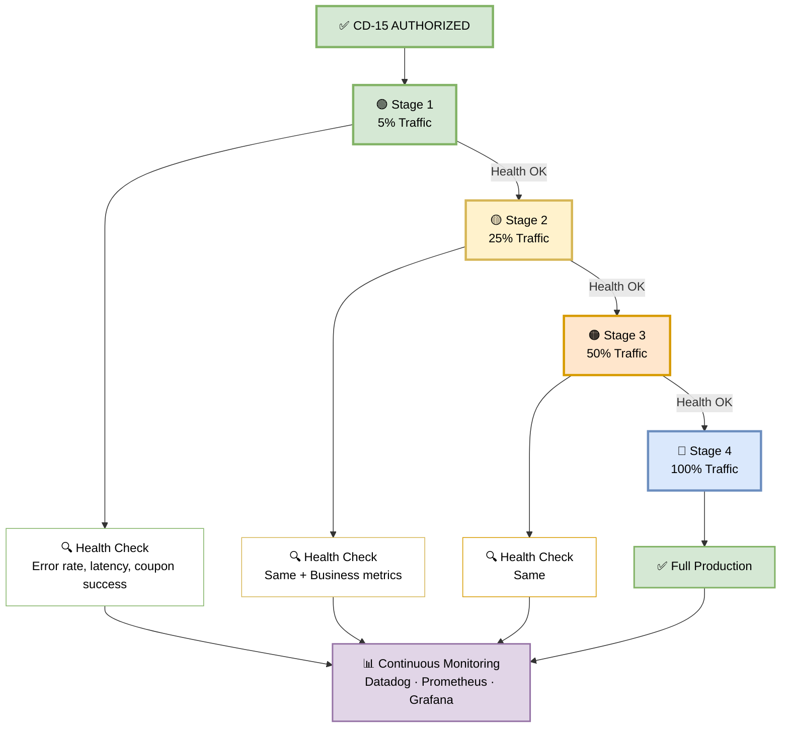
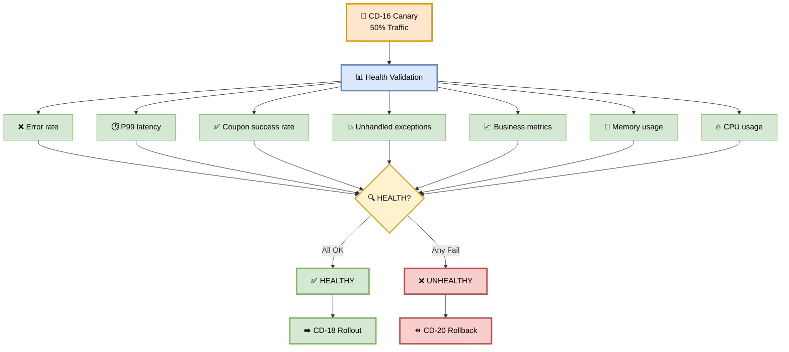
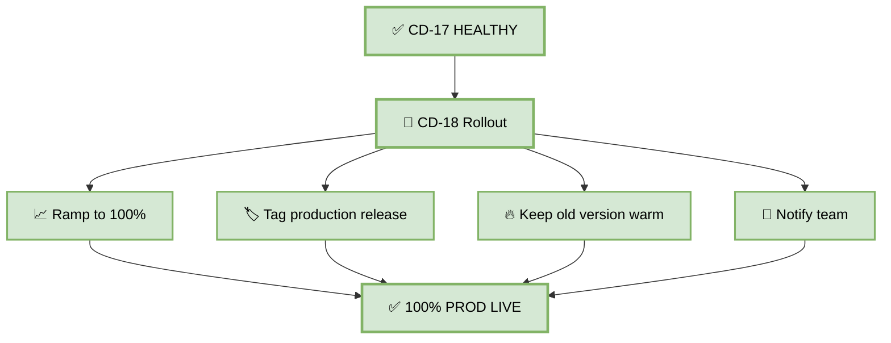
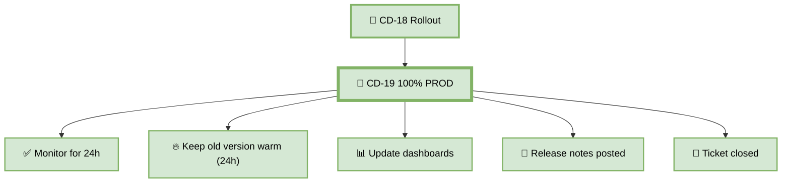
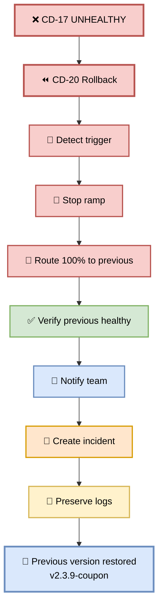

# Part 6 — Production Gate & Canary (CD-14 → CD-20)

**Author:** Shubham Tripathi  
**Repository:** `ecom-frontend` (Next.js 14 · App Router · TypeScript)  
**Last Updated:** 2026-09-18  
**Audience:** DevOps, SRE, Tech Leads, Release Managers, Security Engineers

---

## 📑 Table of Contents — Part 6

1. [Production Phase Overview](#-production-phase-overview)
2. [CD-14 — Production Gate (Manual Approval)](#-cd-14--production-gate-manual-approval)
3. [CD-15 — Artifact Authorization (Binary Auth)](#-cd-15--artifact-authorization-binary-auth)
4. [CD-16 — Production Canary](#-cd-16--production-canary)
5. [CD-17 — Health Validation](#-cd-17--health-validation)
6. [CD-18 — Rollout (Healthy Path)](#-cd-18--rollout-healthy-path)
7. [CD-19 — 100% PROD](#-cd-19--100-prod)
8. [CD-20 — Rollback (Unhealthy Path)](#-cd-20--rollback-unhealthy-path)
9. [Production Gate — Pass/Fail Rules](#-production-gate--passfail-rules)
10. [Production Environment Reference](#-production-environment-reference)
11. [Troubleshooting Production](#-troubleshooting-production)

---

## 🚀 Production Phase Overview

> **The final frontier. Human approval + cryptographic verification + gradual canary with auto-rollback.**

### 🎯 Purpose

| Goal | Description |
|------|-------------|
| **Human validation** | Tech Lead + Manager approve production deploy |
| **Cryptographic validation** | Binary Authorization — only signed images |
| **Gradual rollout** | 5% → 25% → 50% → 100% traffic ramp |
| **Automatic safety** | Rollback in < 60 seconds if unhealthy |
| **Total production stage** | **~25 minutes** (excluding manual approval) |

### 🏗️ Production Environment Architecture

```mermaid
graph TD
    ARTIFACT["🔏 Signed Artifact<br>app:v2.4.0-coupon"]
    style ARTIFACT fill:#e1d5e7,stroke:#9673a6,stroke-width:3px,color:#000

    GATE["🚦 Production Gate"]
    style GATE fill:#f8cecc,stroke:#b85450,stroke-width:3px,color:#000

    ARTIFACT --> GATE

    PROD["🚀 PRODUCTION<br>Multi-region"]
    style PROD fill:#d5e8d4,stroke:#82b366,stroke-width:3px,color:#000

    GATE --> PROD

    US["🇺🇸 US-Central"]
    EU["🇪🇺 EU-West"]
    ASIA["🇸🇬 Asia-Southeast"]

    style US fill:#d5e8d4,stroke:#82b366,stroke-width:2px,color:#000
    style EU fill:#d5e8d4,stroke:#82b366,stroke-width:2px,color:#000
    style ASIA fill:#d5e8d4,stroke:#82b366,stroke-width:2px,color:#000

    PROD --> US
    PROD --> EU
    PROD --> ASIA

    DB["🗄️ PostgreSQL (HA)"]
    CACHE["⚡ Redis (Cluster)"]
    CDN["🌐 CloudFront CDN"]
    WAF["🛡️ Cloud Armor WAF"]
    STRIPE["💳 Stripe Live"]

    style DB fill:#ffe6cc,stroke:#d79b00,stroke-width:2px,color:#000
    style CACHE fill:#fff2cc,stroke:#d6b656,stroke-width:2px,color:#000
    style CDN fill:#dae8fc,stroke:#6c8ebf,stroke-width:2px,color:#000
    style WAF fill:#f8cecc,stroke:#b85450,stroke-width:2px,color:#000
    style STRIPE fill:#e1d5e7,stroke:#9673a6,stroke-width:2px,color:#000

    US --> DB
    US --> CACHE
    US --> CDN
    US --> WAF
    US --> STRIPE
```

### 📊 Environment Details

| Property | Value |
|----------|-------|
| **GCP Project** | `ecom-prod` |
| **Regions** | us-central1, europe-west1, asia-southeast1 |
| **URL** | `https://ecom.com` |
| **DB** | `postgres-prod` (Multi-AZ, HA) |
| **Cache** | `redis-prod` (Cluster mode, 16 GB) |
| **Replicas** | 10 (min), 100 (max) |
| **Auto-scaling** | Enabled, aggressive |
| **Payment** | Stripe Live (real charges) |
| **WAF** | Cloud Armor (DDoS + OWASP) |
| **CDN** | CloudFront (global) |
| **SLA** | 99.95% uptime |
| **Cost** | ~$25,000/month |

### 🔄 Production Stage Flow

```
CD-14 Production Gate (Manual)
        ↓
CD-15 Artifact Authorization
        ↓
CD-16 Production Canary
        ↓
CD-17 Health Validation
        ↓
   ┌───────────────┐
   │               │
HEALTHY        UNHEALTHY
   │               │
   ↓               ↓
CD-18 Rollout   CD-20 Rollback
   │
   ↓
CD-19 100% PROD
```

---

## 🚦 CD-14 — Production Gate (Manual Approval)

> **Human judgment — the final decision before production.**

### 🎯 Purpose

A **Tech Lead or Engineering Manager** reviews the entire promotion evidence and approves or rejects the deployment.

### 🖼️ Visual Diagram



### 📋 What Approvers See

```
┌─────────────────────────────────────────────────┐
│  🚀 PRODUCTION DEPLOYMENT APPROVAL              │
├─────────────────────────────────────────────────┤
│  Artifact:  app:v2.4.0-coupon                   │
│  Digest:    sha256:abc123...                    │
│  Commit:    a1b2c3d                             │
│  Author:    @frontend-dev                       │
│  Ticket:    FEAT-1043 (Bulk Coupon Apply)       │
│                                                 │
│  STAGING Results:                               │
│  ✅ DAST: 0 High, 0 Critical                    │
│  ✅ Load test: 12,400 applies/min               │
│  ✅ UAT: Signed off by 5 stakeholders           │
│  ✅ Regression: 247/247 tests passed            │
│                                                 │
│  Risk Assessment:                               │
│  🟢 Low — feature is additive, no breaking API  │
│  🟢 Rollback plan: < 60 sec auto-rollback       │
│  🟢 Deploy window: business hours               │
│                                                 │
│  [ ✅ Approve ]  [ ❌ Reject ]                  │
└─────────────────────────────────────────────────┘
```

### 👥 Approvers

| Role | Approver | Required? |
|------|----------|-----------|
| **Tech Lead** | @tech-lead | ✅ Yes |
| **Engineering Manager** | @eng-manager | ✅ Yes (or TL delegate) |
| **Release Manager** | @release-manager | ⚠️ Optional |
| **Security Lead** | @security-lead | ⚠️ For security-critical changes |

**Approval rules:**

| Rule | Value |
|------|-------|
| **Minimum approvals** | 1 (Tech Lead OR Manager) |
| **Timeout** | 24 hours (auto-reject) |
| **Audit** | Every approval logged to Splunk |
| **Rejection reason** | Required (free-text field) |

### 📬 Approval Notification

**Slack message:**

```
🚀 Production Deployment Awaiting Approval

Artifact: app:v2.4.0-coupon
Ticket: FEAT-1043 (Bulk Coupon Apply)
Author: @frontend-dev

✅ STAGING all green:
  • DAST: 0 High/Critical
  • Load test: 12,400 applies/min
  • UAT: Signed off
  • Regression: 247/247 passed

👉 Approve: https://ci.ecom.com/approve/abc123
👉 Review diff: https://github.com/ecom/frontend/compare/v2.3.9...v2.4.0

⚠️ Timeout: 24 hours
```

### ⏱️ Duration

**Variable** — typically 5–30 minutes during business hours.

### ✅ Success Criteria

| Check | Pass Condition |
|-------|----------------|
| Approval received | ≥ 1 Tech Lead / Manager |
| Within timeout | < 24 hours |
| Reason provided (if rejected) | Required |

### 📋 Coupon Feature Example

```
👤 Manual approval requested at 14:00
→ Slack notification sent to #releases
→ Tech Lead reviews evidence
→ Tech Lead approves at 14:12 (12 min)
→ Manager co-approves at 14:15 (3 min)
✅ APPROVED — proceeding to CD-15
```

### 🚨 Failure Scenarios

| Error | Cause | Fix |
|-------|-------|-----|
| **Timeout** | No approver action | Re-trigger, ping approver |
| **Rejected** | Concerns raised | Address, re-promote |
| **Wrong artifact** | Mismatched digest | Cancel, re-verify |

### 🛠️ Pipeline Configuration Snippet

```yaml
cd-14-production-gate:
  runs-on: ubuntu-latest
  environment:
    name: production-approval
    # GitHub Environments handles the approval gate
  steps:
    - name: CD-14 Production Gate
      run: |
        echo "✅ Manual approval received"
        echo "Approved by: ${{ github.actor }}"
        echo "Approved at: $(date -u +%Y-%m-%dT%H:%M:%SZ)"
```

**GitHub Environment config:**
```yaml
# In GitHub → Settings → Environments → production-approval
required_reviewers:
  - tech-lead-team
  - engineering-managers
wait_timer: 0  # No wait
prevent_self_review: true  # Author can't approve their own
```

---

## 🔐 CD-15 — Artifact Authorization (Binary Auth)

> **Cryptographic verification — only signed images can deploy.**

### 🎯 Purpose

Even after human approval, **Binary Authorization** verifies the image signature, SBOM, and attestation. This prevents:
- Unsigned images from deploying
- Tampered images from reaching production
- Supply chain attacks

### 🖼️ Visual Diagram



### 🔍 Verification Checks

#### 1️⃣ Cosign Signature Valid

```bash
cosign verify \
  --key gcpkms://projects/ecom-prod/locations/global/keyRings/ci/cryptoKeys/cosign \
  gcr.io/ecom-prod/frontend:v2.4.0-coupon

# Output:
✓ Verified signature for gcr.io/ecom-prod/frontend:v2.4.0-coupon
✓ Signed by: CI Pipeline (ci@ecom-prod.iam.gserviceaccount.com)
✓ Timestamp: 2026-09-18T10:32:00Z
```

#### 2️⃣ SBOM Present

```bash
cosign download sbom gcr.io/ecom-prod/frontend:v2.4.0-coupon > sbom.json

# Verify SBOM:
✓ SBOM found: CycloneDX 1.5
✓ 247 components listed
✓ No tampering detected
```

#### 3️⃣ Attestation Verified

```bash
cosign verify-attestation \
  --type slsaprovenance \
  --key gcpkms://... \
  gcr.io/ecom-prod/frontend:v2.4.0-coupon

# Output:
✓ Attestation verified
✓ Built by: GitHub Actions
✓ Source: github.com/ecom/frontend@a1b2c3d
✓ Builder identity: trusted
```

#### 4️⃣ Tag Matches Release

```bash
EXPECTED_TAG="v2.4.0-coupon"
ACTUAL_TAG=$(gcloud artifacts docker tags list \
  gcr.io/ecom-prod/frontend:v2.4.0-coupon --format="value(tag)")

[ "$EXPECTED_TAG" == "$ACTUAL_TAG" ] || exit 1
# ✓ Tag matches: v2.4.0-coupon
```

#### 5️⃣ SLSA Level 3

```bash
slsa-verifier verify-image \
  gcr.io/ecom-prod/frontend:v2.4.0-coupon \
  --source-uri github.com/ecom/frontend

# Output:
✓ SLSA level 3 verified
✓ Build provenance valid
✓ Non-falsifiable
```

### ⏱️ Duration

**~1 minute**

### ✅ Success Criteria

| Check | Pass Condition |
|-------|----------------|
| Cosign signature | ✅ Valid |
| SBOM | ✅ Present |
| Attestation | ✅ Verified |
| Tag | ✅ Matches |
| SLSA level | ✅ Level 3 |

### 📋 Coupon Feature Example

```
🔐 Running Binary Authorization
→ Cosign signature: ✅ valid
→ SBOM: ✅ present (247 components)
→ Attestation: ✅ verified
→ Tag: ✅ matches v2.4.0-coupon
→ SLSA: ✅ level 3
✅ AUTHORIZED — proceeding to canary
→ CD-15 PASSED
```

### 🚨 Failure Scenarios

| Error | Cause | Fix |
|-------|-------|-----|
| **No matching signatures** | Image not signed | Re-run Official CI Build |
| **No SBOM attestation** | SBOM step skipped | Re-run Official CI Build |
| **Attestation invalid** | Tampered image | **Investigate immediately** |
| **Tag mismatch** | Wrong tag | Block deployment |
| **SLSA < 3** | Build not SLSA-compliant | Fix build pipeline |

### 🛠️ Pipeline Configuration Snippet

```yaml
- name: CD-15 Artifact Authorization
  run: |
    IMAGE="gcr.io/ecom-prod/frontend:${{ github.ref_name }}-coupon"

    # 1. Cosign signature
    cosign verify \
      --key gcpkms://projects/ecom-prod/locations/global/keyRings/ci/cryptoKeys/cosign \
      "$IMAGE"

    # 2. SBOM
    cosign download sbom "$IMAGE" > sbom.json
    [ -s sbom.json ] || exit 1

    # 3. Attestation
    cosign verify-attestation \
      --type slsaprovenance \
      --key gcpkms://... \
      "$IMAGE"

    # 4. SLSA level 3
    slsa-verifier verify-image "$IMAGE" \
      --source-uri github.com/ecom/frontend

    echo "✅ Binary Authorization passed"
```

**GCP Binary Authorization Policy:**

```yaml
name: production-policy
admissionWhitelistPatterns:
  - namePattern: gcr.io/ecom-prod/frontend:*
clusterAdmissionRules:
  us-central1.prod-cluster:
    evaluationMode: REQUIRE_ATTESTATION
    requireAttestationsBy:
      - projects/ecom-prod/attestors/ci-attestor
      - projects/ecom-prod/attestors/security-attestor
```

---

## 🐤 CD-16 — Production Canary

> **Gradual traffic ramp with continuous health monitoring.**

### 🎯 Purpose

Shift traffic gradually from the old version to the new version — starting at **5%**, ramping to **25%**, **50%**, then **100%**. If health checks fail at any stage, auto-rollback.

### 🖼️ Visual Diagram



### 📊 The Ramp

| Stage | Traffic | Duration | Health Check |
|-------|---------|----------|--------------|
| **1** | 5% | 5 min | Error rate, latency, coupon success |
| **2** | 25% | 5 min | + Business metrics (conversion, abandonment) |
| **3** | 50% | 5 min | Same |
| **4** | 100% | Permanent | Full production |

### 🛠️ Canary Deployment Commands

**Stage 1 — 5%:**

```bash
# Deploy canary with 5% traffic
kubectl apply -f - <<EOF
apiVersion: v1
kind: Service
metadata:
  name: coupon-api
spec:
  selector:
    app: coupon-api
  ports:
    - port: 80
      targetPort: 8080
---
apiVersion: networking.istio.io/v1beta1
kind: VirtualService
metadata:
  name: coupon-api
spec:
  hosts:
    - coupon-api
  http:
    - match:
        - headers:
            x-canary:
              exact: "true"
      route:
        - destination:
            host: coupon-api-canary
      weight: 5
    - route:
        - destination:
            host: coupon-api-stable
      weight: 95
EOF

# Monitor Stage 1
./scripts/monitor.sh --duration 300 --thresholds strict
```

**Stage 2 — 25%:**

```bash
kubectl patch virtualservice coupon-api --type merge -p '
spec:
  http:
    - route:
        - destination:
            host: coupon-api-canary
          weight: 25
        - destination:
            host: coupon-api-stable
          weight: 75
'

./scripts/monitor.sh --duration 300
```

**Stage 3 — 50%:**

```bash
kubectl patch virtualservice coupon-api --type merge -p '
spec:
  http:
    - route:
        - destination:
            host: coupon-api-canary
          weight: 50
        - destination:
            host: coupon-api-stable
          weight: 50
'

./scripts/monitor.sh --duration 300
```

**Stage 4 — 100%:**

```bash
kubectl patch virtualservice coupon-api --type merge -p '
spec:
  http:
    - route:
        - destination:
            host: coupon-api-canary
          weight: 100
'
```

### 📊 Monitoring During Canary

| Metric | Threshold | Tool |
|--------|-----------|------|
| **Error rate** | < 1% | Prometheus |
| **P99 latency** | < 2s | Prometheus |
| **Coupon apply success** | > 99% | Custom metric |
| **Conversion rate** | ≥ baseline | Datadog |
| **Cart abandonment** | ≤ baseline + 2% | Datadog |
| **CPU usage** | < 80% | GCP Monitoring |
| **Memory** | Stable | GCP Monitoring |

### ⏱️ Duration

**~15 minutes** (3 stages × 5 min)

### ✅ Success Criteria

| Stage | Pass Condition |
|-------|----------------|
| **5%** | Error rate < 1%, P99 < 2s, coupon success > 99% |
| **25%** | Same + business metrics OK |
| **50%** | Same |
| **100%** | Full production stable |

### 📋 Coupon Feature Example

```
🐤 Starting canary ramp

→ Stage 1: 5% traffic
  250 applies/min, error 0.2%, P99 320ms ✅
  
→ Stage 2: 25% traffic
  1,250 applies/min, error 0.3%, P99 340ms ✅
  Conversion +2%, abandonment -1% ✅
  
→ Stage 3: 50% traffic
  2,500 applies/min, error 0.25%, P99 350ms ✅
  
→ Stage 4: 100% traffic
  Full production ✅

🎉 Canary ramp successful
→ CD-16 PASSED
```

### 🚨 Failure Scenarios

| Error | Cause | Action |
|-------|-------|--------|
| Error rate > 1% | Bug in new code | Auto-rollback (CD-20) |
| P99 > 2s | Performance regression | Auto-rollback |
| Coupon success < 99% | Logic broken | Auto-rollback |
| Business metrics drop | UX issue | Auto-rollback |
| Memory leak | Code issue | Auto-rollback |

### 🛠️ Pipeline Configuration Snippet

```yaml
- name: CD-16 Production Canary
  run: |
    # Stage 1: 5%
    kubectl apply -f canary-5.yaml
    ./scripts/monitor.sh --duration 300 --stage 1
    
    # Stage 2: 25%
    kubectl apply -f canary-25.yaml
    ./scripts/monitor.sh --duration 300 --stage 2
    
    # Stage 3: 50%
    kubectl apply -f canary-50.yaml
    ./scripts/monitor.sh --duration 300 --stage 3
```

---

## 📊 CD-17 — Health Validation

> **Final validation after canary ramp.**

### 🎯 Purpose

Validate that the new version is healthy after reaching 50% traffic. This is the **last checkpoint** before full production rollout.

### 🖼️ Visual Diagram



### 📊 Health Metrics

| # | Metric | Threshold | Actual |
|---|--------|-----------|--------|
| 1 | **Error rate** | < 1% | 0.25% ✅ |
| 2 | **P99 latency** | < 2s | 340ms ✅ |
| 3 | **Coupon success rate** | > 99% | 99.8% ✅ |
| 4 | **Unhandled exceptions** | 0 | 0 ✅ |
| 5 | **Business metrics** | ≥ baseline | +2% ✅ |
| 6 | **Memory usage** | Stable | Stable ✅ |
| 7 | **CPU usage** | < 80% | 62% ✅ |

### 🛠️ Health Validation Script

```bash
#!/bin/bash
set -e

echo "📊 Health validation after canary"
FAILED=0

# 1. Error rate
ERROR_RATE=$(curl -sf "$PROMETHEUS/api/v1/query?query=rate(http_requests_total{status=~'5..'}[5m])/rate(http_requests_total[5m])" | jq -r '.data.result[0].value[1]')
if (( $(echo "$ERROR_RATE > 0.01" | bc -l) )); then
  echo "  ❌ Error rate too high: ${ERROR_RATE}"
  FAILED=1
else
  echo "  ✅ Error rate: ${ERROR_RATE}"
fi

# 2. P99 latency
P99=$(curl -sf "$PROMETHEUS/api/v1/query?query=histogram_quantile(0.99,rate(http_request_duration_seconds_bucket[5m]))" | jq -r '.data.result[0].value[1]')
if (( $(echo "$P99 > 2" | bc -l) )); then
  echo "  ❌ P99 latency too high: ${P99}s"
  FAILED=1
else
  echo "  ✅ P99 latency: ${P99}s"
fi

# 3. Coupon success rate
SUCCESS=$(curl -sf "$PROMETHEUS/api/v1/query?query=rate(coupon_apply_success_total[5m])/rate(coupon_apply_total[5m])" | jq -r '.data.result[0].value[1]')
if (( $(echo "$SUCCESS < 0.99" | bc -l) )); then
  echo "  ❌ Coupon success rate too low: ${SUCCESS}"
  FAILED=1
else
  echo "  ✅ Coupon success rate: ${SUCCESS}"
fi

# 4. Unhandled exceptions
EXCEPTIONS=$(curl -sf "$PROMETHEUS/api/v1/query?query=increase(unhandled_exceptions_total[5m])" | jq -r '.data.result[0].value[1] // 0')
if (( $(echo "$EXCEPTIONS > 0" | bc -l) )); then
  echo "  ❌ Unhandled exceptions: ${EXCEPTIONS}"
  FAILED=1
else
  echo "  ✅ Unhandled exceptions: 0"
fi

# Final result
if [ "$FAILED" -eq 1 ]; then
  echo ""
  echo "❌ HEALTH VALIDATION FAILED"
  echo "→ Triggering CD-20 Rollback"
  exit 1
fi

echo ""
echo "✅ HEALTH VALIDATION PASSED"
echo "→ Proceeding to CD-18 Rollout"
```

### ⏱️ Duration

**~5 minutes**

### ✅ Success Criteria

All 7 metrics within threshold.

### 📋 Coupon Feature Example

```
📊 Health validation after canary
→ Error rate: 0.25% ✅
→ P99 latency: 340ms ✅
→ Coupon success: 99.8% ✅
→ Unhandled exceptions: 0 ✅
→ Business metrics: +2% ✅
→ Memory: stable ✅
→ CPU: 62% ✅

✅ HEALTH VALIDATION PASSED
→ Proceeding to CD-18 Rollout
```

---

## 🚀 CD-18 — Rollout (Healthy Path)

> **Ramp to 100% traffic.**

### 🎯 Purpose

The canary is healthy — promote it to become the new production baseline.

### 🖼️ Visual Diagram



### 🛠️ Rollout Commands

```bash
# 1. Ramp to 100%
kubectl patch virtualservice coupon-api --type merge -p '
spec:
  http:
    - route:
        - destination:
            host: coupon-api-canary
          weight: 100
'

# 2. Verify
kubectl get virtualservice coupon-api -o yaml | grep weight

# 3. Tag the deployment
kubectl annotate deployment coupon-api-canary \
  deployment.kubernetes.io/revision=v2.4.0-coupon \
  deployment.kubernetes.io/released-at=$(date -u +%Y-%m-%dT%H:%M:%SZ)

# 4. Keep old version warm for 24h
kubectl scale deployment coupon-api-stable --replicas=3

# 5. Monitor for 30 min
./scripts/monitor.sh --duration 1800 --stage production

# 6. Notify
curl -X POST $SLACK_WEBHOOK \
  -d '{"text":"🎉 v2.4.0-coupon LIVE at 100%"}'
```

### ⏱️ Duration

**~5 minutes** (plus 30 min observation)

### ✅ Success Criteria

| Check | Pass Condition |
|-------|----------------|
| 100% traffic | All to new version |
| No errors | Error rate stable |
| Latency | Within threshold |
| Monitoring | 30 min green |

### 📋 Coupon Feature Example

```
🚀 Rolling out to 100%
→ Traffic: 100% to v2.4.0-coupon
→ Tagged: v2.4.0-coupon
→ Old version: kept warm (3 replicas)
→ Monitoring: 30 min
→ All metrics green ✅
🎉 v2.4.0-coupon LIVE
→ CD-18 PASSED
```

---

## 🎉 CD-19 — 100% PROD

> **Full production — v2.4.0-coupon is now the baseline.**

### 🎯 Purpose

The canary is now the production baseline. Celebrate. 🎉

### 🖼️ Visual Diagram



### 📊 Post-Deployment

| Task | Owner | Duration |
|------|-------|----------|
| **Monitor for 24h** | SRE | Continuous |
| **Keep old version warm** | DevOps | 24h |
| **Update dashboards** | SRE | 30 min |
| **Post release notes** | Product | 15 min |
| **Close ticket** | Developer | 5 min |
| **Retrospective** | Team | 1h (next week) |

### 📋 Coupon Feature Example

```
🎉 v2.4.0-coupon is now LIVE at 100%

✅ Monitoring: 24h
✅ Old version: kept warm (24h)
✅ Dashboards: updated
✅ Release notes: posted to #releases
✅ Ticket: FEAT-1043 closed

🎊 Feature shipped successfully!
```

---

## ⏪ CD-20 — Rollback (Unhealthy Path)

> **Auto-rollback in < 60 seconds — no manual intervention.**

### 🎯 Purpose

If health validation fails, automatically roll back to the previous version. **No manual intervention needed.**

### 🖼️ Visual Diagram



### 🚨 Rollback Triggers

| # | Trigger | Threshold | Detection |
|---|---------|-----------|-----------|
| 1 | Error rate | > 1% | Prometheus |
| 2 | P99 latency | > 2s | Prometheus |
| 3 | Coupon apply success | < 99% | Custom metric |
| 4 | Unhandled exception | Any | Sentry |
| 5 | Business metrics drop | > 5% | Datadog |

### 🛠️ Rollback Script

```bash
#!/bin/bash
set -e

echo "🚨 ROLLBACK INITIATED"
START=$(date +%s)

# 1. Stop ramp immediately
kubectl patch virtualservice coupon-api --type merge -p '
spec:
  http:
    - route:
        - destination:
            host: coupon-api-stable
          weight: 100
'

# 2. Verify previous version healthy
sleep 5
curl -sf https://ecom.com/api/coupon/health || \
  (echo "❌ Previous version unhealthy"; exit 1)

# 3. Calculate rollback time
END=$(date +%s)
DURATION=$((END - START))
echo "✅ Rollback completed in ${DURATION} seconds"

# 4. Notify
curl -X POST $SLACK_WEBHOOK \
  -d "{\"text\":\"🚨 ROLLBACK: v2.4.0 → v2.3.9 (trigger: $TRIGGER)\"}"

# 5. Create incident
gh issue create \
  --title "Rollback: v2.4.0-coupon" \
  --body "Trigger: $TRIGGER\nDuration: ${DURATION}s\nLogs: attached" \
  --label incident,rollback

# 6. Preserve logs
kubectl logs -l app=coupon-api-canary --since=1h > rollback-logs.txt

# 7. Post to #devops-incidents
curl -X POST $SLACK_WEBHOOK \
  -d '{"text":"📁 Rollback logs preserved for root cause analysis"}'
```

### ⏱️ Duration

**< 60 seconds**

### ✅ Success Criteria

| Check | Pass Condition |
|-------|----------------|
| Rollback triggered | Auto or manual |
| Traffic rerouted | 100% to previous |
| Previous healthy | Health check passes |
| Time | < 60 sec |
| Notification | Slack sent |
| Incident | Created |

### 📋 Coupon Feature Example

```
🚨 ALERT: Error rate 1.5% > 1%
⏪ Auto-rollback initiated at 14:32:15

→ Stop ramp: ✅
→ Traffic → v2.3.9-coupon: ✅
→ Previous healthy: ✅
→ Rollback time: 37 seconds ✅
→ Slack: #devops-incidents notified ✅
→ Incident: INC-2026-0918-001 created ✅
→ Logs: preserved ✅

✅ ROLLBACK COMPLETE
```

### 🚨 Failure Scenarios

| Error | Cause | Fix |
|-------|-------|-----|
| Rollback failed | Previous unhealthy | Manual intervention |
| Previous down | Multi-version issue | Escalate to on-call |
| Traffic stuck | Istio issue | Manual kubectl patch |
| Notification failed | Slack down | Use PagerDuty |

### 🛠️ Pipeline Configuration Snippet

```yaml
- name: CD-20 Rollback
  if: failure()
  run: |
    echo "🚨 Rolling back"
    
    # Stop ramp
    kubectl patch virtualservice coupon-api --type merge -p '
    spec:
      http:
        - route:
            - destination:
                host: coupon-api-stable
              weight: 100
    '
    
    # Verify
    sleep 5
    curl -sf https://ecom.com/api/coupon/health || exit 1
    
    # Notify
    curl -X POST $SLACK_WEBHOOK \
      -d '{"text":"🚨 ROLLBACK: v2.4.0 → v2.3.9"}'
    
    # Create incident
    gh issue create \
      --title "Rollback: v2.4.0-coupon" \
      --label incident,rollback
```

---

## 🚦 Production Gate — Pass/Fail Rules

> **The Production Gate ensures only verified, signed, healthy artifacts reach production.**

### 📊 Gate Criteria

| Step | Check | Pass Condition | Blocks? |
|------|-------|----------------|---------|
| **CD-14** | Manual approval | Tech Lead + Manager | ✅ Yes |
| **CD-15** | Binary Auth | Signed, SBOM, attestation | ✅ Yes |
| **CD-16** | Canary ramp | All stages healthy | ✅ Yes |
| **CD-17** | Health validation | All 7 metrics OK | ✅ Yes |
| **CD-18** | Rollout | 100% traffic | ✅ Yes |
| **CD-20** | Rollback | If unhealthy | Auto |

### ⏱️ Total Production Stage Duration

| Step | Duration |
|------|----------|
| CD-14 Production Gate | Variable (manual) |
| CD-15 Artifact Authorization | ~1 min |
| CD-16 Production Canary | ~15 min |
| CD-17 Health Validation | ~5 min |
| CD-18 Rollout | ~5 min |
| **Total (auto)** | **~26 min** |
| **Total (with approval)** | **~45 min** |

---

## 📊 Production Environment Reference

### 🔗 Useful URLs

| Resource | URL |
|----------|-----|
| **Production** | https://ecom.com |
| **Coupon API** | https://coupon-api.ecom.com |
| **GCP Console** | https://console.cloud.google.com/run?project=ecom-prod |
| **Grafana** | https://grafana.ecom.com/d/prod |
| **Datadog** | https://app.datadoghq.com/dashboard/prod |
| **Status Page** | https://status.ecom.com |
| **Runbooks** | https://runbooks.ecom.com |

### 🔑 Access

| Role | Access |
|------|--------|
| **Developer** | Read logs (limited), view metrics |
| **DevOps** | Deploy, rollback, manage revisions |
| **SRE** | Full access, on-call |
| **Tech Lead** | Approve production, manage incidents |
| **Manager** | Approve production |

### 📞 Contacts

| Role | Person | Slack |
|------|--------|-------|
| **Production Owner** | SRE Team | #sre |
| **Tech Lead** | TBD | @tech-lead |
| **Engineering Manager** | TBD | @eng-manager |
| **On-call** | Rotation | #oncall |
| **Incident Commander** | Rotation | #incidents |

---

## 🛠️ Troubleshooting Production

| Problem | Cause | Fix |
|---------|-------|-----|
| **Approval timeout** | No approver | Re-trigger, ping approver |
| **Binary Auth failed** | Unsigned image | Re-run Official CI Build |
| **Canary error rate high** | Bug in new code | Auto-rollback |
| **Canary latency high** | Performance issue | Auto-rollback |
| **Health validation failed** | Any metric breach | Auto-rollback |
| **Rollback failed** | Previous unhealthy | Manual intervention |
| **Memory leak** | Code issue | Auto-rollback, fix |
| **DB connection pool** | High load | Scale DB |
| **Cache miss rate high** | Cache cold | Warm cache |
| **Stripe errors** | API issues | Check Stripe status |

### 🔍 Debugging Commands

```bash
# View production logs
kubectl logs -l app=coupon-api --tail=100

# Check canary status
kubectl get virtualservice coupon-api -o yaml

# Check traffic split
kubectl describe virtualservice coupon-api

# Check revisions
kubectl rollout history deployment/coupon-api

# Manual rollback
kubectl rollout undo deployment/coupon-api

# Check health
curl -sf https://ecom.com/api/coupon/health

# View metrics
open https://grafana.ecom.com/d/prod

# Check error rate
curl -s "https://prometheus.ecom.com/api/v1/query?query=rate(http_requests_total{status=~'5..'}[5m])"

# Check rollback logs
kubectl logs -l app=coupon-api-canary --since=1h
```

---

## 🎯 Summary — Production Stage

| Aspect | Details |
|--------|---------|
| **Purpose** | Deploy to production with safety nets |
| **Duration** | ~26 min auto + manual approval |
| **Steps** | CD-14 → CD-20 (7 steps) |
| **Gate** | Manual + Binary Auth + Canary + Health |
| **Rollback** | < 60 seconds (auto) |
| **Cost** | ~$25,000/month |
| **Users** | Real customers worldwide |
| **SLA** | 99.95% uptime |

---

## 🎉 CD Pipeline Complete

You've completed the **entire CD pipeline** (CD-01 → CD-20). Here's a recap:

| Part | Focus | Steps |
|------|-------|-------|
| **Part 1** | CI Pipeline | Build → Test → Merge |
| **Part 2** | CD Overview | Full CD flow |
| **Part 3** | DEV | CD-03 → CD-05 |
| **Part 4** | QA | CD-06 → CD-09 |
| **Part 5** | STAGING | CD-10 → CD-13 |
| **Part 6** | PROD | CD-14 → CD-20 |

> 📝 **Note:** Production is where the coupon feature meets real customers. Every safety net — manual approval, Binary Auth, canary, auto-rollback — exists to protect those customers. **Trust the pipeline. Respect the gate.**