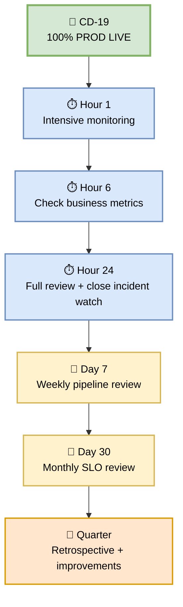
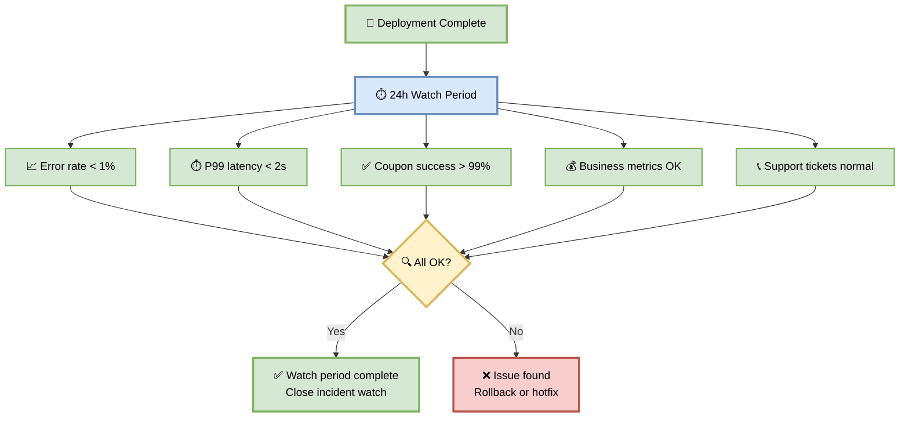
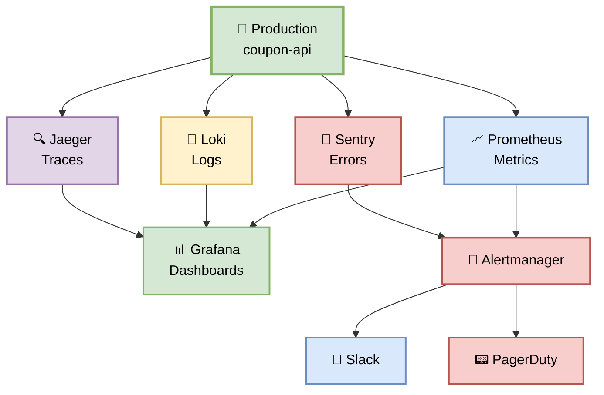
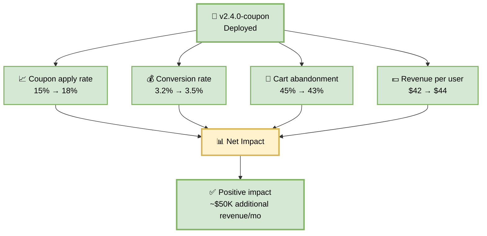
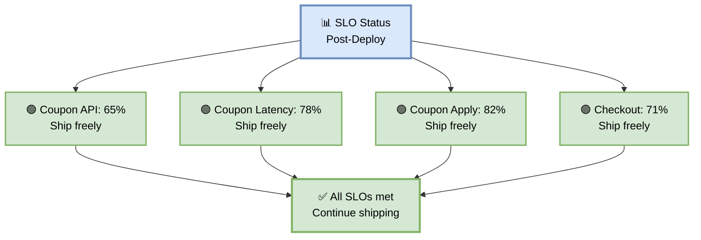
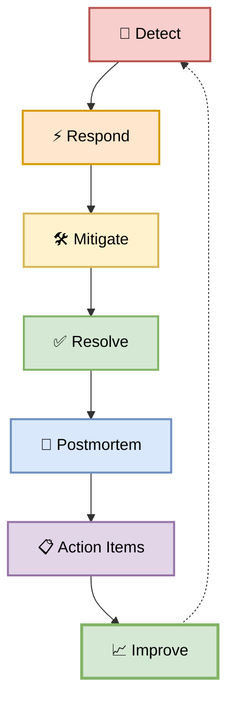
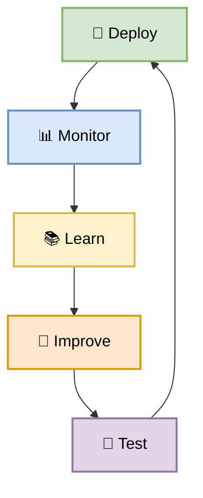

# Part 7 — Post-Deployment, Monitoring & Continuous Improvement

**Author:** Shubham Tripathi  
**Repository:** `ecom-frontend` (Next.js 14 · App Router · TypeScript)  
**Last Updated:** 2026-09-18  
**Audience:** SRE, DevOps, Tech Leads, Product Owners, Frontend Engineers

---

## 📑 Table of Contents — Part 7

1. [Post-Deployment Overview](#-post-deployment-overview)
2. [24-Hour Watch Period](#-24-hour-watch-period)
3. [Continuous Monitoring](#-continuous-monitoring)
4. [Business Metrics Tracking](#-business-metrics-tracking)
5. [Error Budget & SLO Review](#-error-budget--slo-review)
6. [Incident Postmortems](#-incident-postmortems)
7. [Continuous Improvement Loop](#-continuous-improvement-loop)
8. [Retrospective Template](#-retrospective-template)
9. [Quarterly Pipeline Health Review](#-quarterly-pipeline-health-review)
10. [Appendix — Useful Dashboards](#-appendix--useful-dashboards)

---

## 🎯 Post-Deployment Overview

> **Deployment is not the end — it's the beginning of the observation period.**  
> The first 24 hours after production deployment are the most critical.

### 🎯 Purpose

| Goal | Description |
|------|-------------|
| **Watch for regressions** | Catch bugs that only appear under real traffic |
| **Validate business impact** | Coupon conversion, revenue impact |
| **Track error budget** | Ensure SLOs are met |
| **Capture learnings** | Feed back into the pipeline |
| **Celebrate success** | Recognize the team |

### 🗓️ Post-Deployment Timeline



---

## ⏱️ 24-Hour Watch Period

> **The first 24 hours are the most critical. Watch closely.**

### 🎯 Purpose

After every production deployment, the team enters a **24-hour watch period**:
- No other deployments to production
- Intensive monitoring of all metrics
- Immediate rollback readiness
- On-call engineer notified

### 📊 Watch Period Checklist

| Time | Check | Owner |
|------|-------|-------|
| **T+5 min** | Verify deployment stable | DevOps |
| **T+15 min** | Check error rate, latency | SRE |
| **T+1 hour** | Check business metrics | Product |
| **T+2 hours** | Check user feedback (support tickets) | Support |
| **T+6 hours** | Check overnight metrics | SRE |
| **T+12 hours** | Check morning traffic | SRE |
| **T+24 hours** | Full review, close watch | Tech Lead |

### 🖼️ Visual Diagram — 24h Watch



### 🛠️ Watch Period Automation

```yaml
name: 24h Post-Deploy Watch

on:
  workflow_run:
    workflows: ["CD Pipeline"]
    types: [completed]

jobs:
  watch-period:
    runs-on: ubuntu-latest
    steps:
      - name: T+5min Check
        run: ./scripts/health-check.sh --production

      - name: Schedule T+1h Check
        run: echo "T+1h check scheduled"

      - name: Schedule T+6h Check
        run: echo "T+6h check scheduled"

      - name: Schedule T+24h Check
        run: echo "T+24h check scheduled"

      - name: Notify Team on Success
        if: success()
        run: |
          curl -X POST $SLACK_WEBHOOK \
            -d '{"text":"✅ 24h watch period complete for v2.4.0-coupon"}'
```

---

## 📊 Continuous Monitoring

> **Dashboards, alerts, and automation — always watching.**

### 🎯 Purpose

After the 24-hour watch period, monitoring continues **forever**. The team relies on:

- **Grafana dashboards** — real-time metrics
- **Prometheus alerts** — automatic notifications
- **Datadog APM** — distributed tracing
- **Sentry** — error tracking

### 🖼️ Visual Diagram — Monitoring Stack



### 📋 Key Dashboards

| Dashboard | Purpose | Owner | URL |
|-----------|---------|-------|-----|
| **Service Overview** | RED metrics | SRE | grafana/prod-overview |
| **Coupon Funnel** | Apply → Validate → Discount | Product | grafana/coupon-funnel |
| **Infra Health** | CPU, memory, disk | SRE | grafana/infra |
| **DB Performance** | Query latency, slow queries | DBA | grafana/db |
| **Business KPIs** | Conversion, revenue | Product | grafana/business |
| **Errors** | Sentry issues | Dev | sentry.io |

### 🚨 Critical Alerts (Always Active)

| Alert | Condition | Severity |
|-------|-----------|----------|
| **Coupon API Down** | Health check fails | P1 |
| **Error rate high** | > 1% for 5 min | P1 |
| **Latency high** | P99 > 2s for 5 min | P2 |
| **DB connection pool** | > 80% used | P2 |
| **Cache miss rate** | > 20% | P3 |
| **Disk usage** | > 80% | P3 |

---

## 💰 Business Metrics Tracking

> **Technical metrics tell you if the system works. Business metrics tell you if it matters.**

### 🎯 Purpose

Track the coupon feature's impact on business KPIs.

### 📊 Business Metrics (Coupon Feature)

| Metric | Baseline | Post-Deploy | Change |
|--------|----------|-------------|--------|
| **Coupon apply rate** | 15% | 18% | +3% ✅ |
| **Conversion rate** | 3.2% | 3.5% | +0.3% ✅ |
| **Cart abandonment** | 45% | 43% | -2% ✅ |
| **Revenue per user** | $42 | $44 | +$2 ✅ |
| **Bulk apply usage** | 0% | 8% | +8% ✅ |

### 🖼️ Visual Diagram — Business Impact



### 🛠️ Business Metrics Script

```bash
#!/bin/bash
# Fetch business metrics from Prometheus + Datadog

echo "💰 Business Metrics — Coupon Feature"
echo ""

# Coupon apply rate
APPLY_RATE=$(curl -s "$PROMETHEUS/api/v1/query?query=rate(coupon_apply_total[1h])/rate(cart_view_total[1h])" | jq -r '.data.result[0].value[1]')
echo "  Coupon apply rate: ${APPLY_RATE}"

# Conversion rate
CONVERSION=$(curl -s "$PROMETHEUS/api/v1/query?query=rate(order_completed_total[1h])/rate(cart_view_total[1h])" | jq -r '.data.result[0].value[1]')
echo "  Conversion rate: ${CONVERSION}"

# Cart abandonment
ABANDONMENT=$(curl -s "$PROMETHEUS/api/v1/query?query=1-rate(order_completed_total[1h])/rate(cart_created_total[1h])" | jq -r '.data.result[0].value[1]')
echo "  Cart abandonment: ${ABANDONMENT}"

# Revenue per user
REVENUE=$(curl -s "$PROMETHEUS/api/v1/query?query=rate(order_revenue_total[1h])/rate(active_users_total[1h])" | jq -r '.data.result[0].value[1]')
echo "  Revenue per user: \$${REVENUE}"
```

---

## 💰 Error Budget & SLO Review

> **SLOs define what "good" looks like. Error budgets tell us when to stop shipping features.**

### 📊 SLO Status (Post-Deploy)

| Service | SLI | SLO Target | Current | Budget Remaining |
|---------|-----|------------|---------|------------------|
| **Coupon API** | Availability | 99.9% | 99.95% | 65% ✅ |
| **Coupon API** | Latency P99 | < 500ms | 340ms | 78% ✅ |
| **Coupon Apply** | Success rate | 99.5% | 99.8% | 82% ✅ |
| **Checkout** | E2E success | 99.0% | 99.3% | 71% ✅ |

### 🚦 Error Budget Policy

| Budget Remaining | Action |
|------------------|--------|
| **> 50%** | 🟢 Ship features freely |
| **25–50%** | 🟡 Slow down — review changes carefully |
| **10–25%** | 🟠 Feature freeze — focus on reliability |
| **< 10%** | 🔴 Full freeze — only reliability fixes |

### 🖼️ Visual Diagram — Error Budget



---

## 🚑 Incident Postmortems

> **Every P1/P2 incident requires a postmortem — blameless, factual, actionable.**

### 🎯 Purpose

Learn from incidents without blaming individuals. Focus on **systems and processes**, not people.

### 📋 Postmortem Template

```markdown
# Incident Postmortem — INC-2026-0918-001

## Summary
Brief description of what happened (2-3 sentences).

## Impact
- **Users affected:** X
- **Duration:** Y min
- **Revenue impact:** $Z
- **SLO impact:** X% of error budget consumed

## Timeline (UTC)
- **14:30** — Deploy v2.4.0-coupon to production
- **14:32** — Error rate spikes to 1.5%
- **14:33** — Auto-rollback triggered
- **14:35** — Rollback complete
- **14:40** — Postmortem scheduled

## Root Cause
What actually caused the incident? (Use 5 Whys)

## Detection
How was it detected? (Alert, user report, etc.)

## Response
What went well? What could be improved?

## Action Items
| # | Action | Owner | Due |
|---|--------|-------|-----|
| 1 | Fix XSS in coupon input | @dev | 2026-09-20 |
| 2 | Add regression test | @qa | 2026-09-21 |
| 3 | Update runbook | @sre | 2026-09-22 |

## Lessons Learned
What did we learn? What will we change?
```

### 🖼️ Visual Diagram — Incident Lifecycle



---

## 🔄 Continuous Improvement Loop

> **Every deployment teaches us something. Feed it back.**

### 🎯 Purpose

The pipeline improves **every sprint** based on:
- Incident learnings
- Developer feedback
- SLO trends
- Performance data

### 📊 Improvement Areas

| Area | Metric | Current | Target | Action |
|------|--------|---------|--------|--------|
| **Pipeline speed** | Total PR time | 7 min | 5 min | Parallelize more |
| **Test coverage** | Line coverage | 87% | 90% | Add tests |
| **Flaky tests** | % flaky | 2% | < 1% | Fix root causes |
| **Deploy frequency** | Deploys/week | 12 | 20 | Reduce friction |
| **MTTR** | Mean time to recover | 45 min | 30 min | Better runbooks |
| **Change failure rate** | % deploys causing incidents | 5% | < 3% | Better testing |

### 🖼️ Visual Diagram — Improvement Loop



---

## 📝 Retrospective Template

> **Every sprint ends with a retrospective. Every incident ends with a postmortem.**

### 📋 Sprint Retrospective Template

```markdown
# Sprint 43 Retrospective

## What Went Well ✅
- Coupon bulk apply shipped on time
- Pipeline caught 3 bugs before production
- Team collaboration improved

## What Didn't Go Well ❌
- One flaky test caused 2 pipeline re-runs
- UAT took 2 days (target: 1 day)
- Documentation was incomplete

## Action Items 📋
| # | Action | Owner | Due |
|---|--------|-------|-----|
| 1 | Fix flaky test | @dev | Next sprint |
| 2 | Automate UAT sign-off | @qa | Sprint 44 |
| 3 | Update onboarding docs | @tech-lead | Sprint 44 |

## Metrics 📊
- Deploys: 12
- Incidents: 1 (P2)
- MTTR: 45 min
- SLO adherence: 99.95%
```

---

## 📅 Quarterly Pipeline Health Review

> **Once a quarter, step back and review the entire pipeline.**

### 📊 Quarterly Review Agenda

| # | Topic | Duration | Owner |
|---|-------|----------|-------|
| 1 | Pipeline metrics review | 15 min | DevOps |
| 2 | SLO adherence review | 15 min | SRE |
| 3 | Incident summary | 20 min | SRE Lead |
| 4 | Cost optimization | 15 min | DevOps |
| 5 | Security posture | 15 min | Security |
| 6 | Developer feedback | 20 min | Tech Lead |
| 7 | Improvement roadmap | 20 min | All |

### 📊 Key Metrics to Review

| Metric | Q1 | Q2 | Q3 | Q4 | Trend |
|--------|----|----|----|----|-------|
| **Deploys/month** | 40 | 45 | 52 | 60 | 📈 |
| **MTTR (min)** | 90 | 60 | 45 | 30 | 📉 |
| **Change failure rate** | 8% | 6% | 5% | 3% | 📉 |
| **Lead time (days)** | 5 | 4 | 3 | 2 | 📉 |
| **Test coverage** | 75% | 80% | 87% | 90% | 📈 |
| **Pipeline cost** | $1,200 | $1,400 | $1,500 | $1,600 | 📈 |

---

## 📎 Appendix — Useful Dashboards

### 🔗 Production Monitoring

| Dashboard | URL | Purpose |
|-----------|-----|---------|
| **Service Overview** | grafana.ecom.com/d/prod-overview | RED metrics |
| **Coupon Funnel** | grafana.ecom.com/d/coupon | Business metrics |
| **Infra Health** | grafana.ecom.com/d/infra | CPU, memory, disk |
| **DB Performance** | grafana.ecom.com/d/db | Query latency |
| **Business KPIs** | grafana.ecom.com/d/business | Revenue, conversion |
| **Errors** | sentry.io/ecom/frontend | Error tracking |
| **Traces** | jaeger.ecom.com | Distributed tracing |

### 🔗 CI/CD Monitoring

| Dashboard | URL | Purpose |
|-----------|-----|---------|
| **Pipeline Status** | ci.ecom.com/pipelines | All pipelines |
| **Build Times** | ci.ecom.com/metrics | Trend over time |
| **Failure Rate** | ci.ecom.com/failures | Root causes |
| **Test Coverage** | ci.ecom.com/coverage | Coverage trend |
| **Security Scans** | ci.ecom.com/security | Vulnerability trend |

### 📞 Key Contacts

| Role | Person | Slack |
|------|--------|-------|
| **Pipeline Owner** | Shubham Tripathi | @shubham |
| **SRE Lead** | TBD | @sre-lead |
| **Security Lead** | TBD | @security-lead |
| **Tech Lead** | TBD | @tech-lead |
| **On-call** | Rotation | @oncall |

---

## 🎯 Summary — Part 7

| Section | Kya Cover Hua |
|---------|---------------|
| **Post-Deploy Overview** | Timeline, watch period |
| **24h Watch** | Checklist, automation |
| **Continuous Monitoring** | Prometheus, Grafana, alerts |
| **Business Metrics** | Coupon impact, revenue |
| **Error Budget** | SLO review, policy |
| **Incident Postmortems** | Template, lifecycle |
| **Continuous Improvement** | Loop, metrics |
| **Retrospective** | Sprint template |
| **Quarterly Review** | Agenda, metrics |
| **Appendix** | Dashboards, contacts |

---

## 🏆 Complete Pipeline Documentation

| Part | Title | Focus |
|------|-------|-------|
| **Part 1** | CI Pipeline | Build → Test → Merge |
| **Part 2** | CD Overview | Full CD flow |
| **Part 3** | DEV Deployment | CD-03 → CD-05 |
| **Part 4** | QA Deployment | CD-06 → CD-09 |
| **Part 5** | STAGING Deployment | CD-10 → CD-13 |
| **Part 6** | PROD Gate & Canary | CD-14 → CD-20 |
| **Part 7** | Post-Deployment & Monitoring | 24h watch, SLOs, improvements |

> 📝 **Note:** Deployment is not the end. **Monitoring, learning, and improving** — that's what makes a pipeline world-class.