# Part 9 — CD-09 to CD-20: Complete CD Pipeline

**Author:** Shubham Tripathi  
**Repository:** `ecom-frontend` (Next.js 14 · App Router · TypeScript)  
**Last Updated:** 2026-09-19  
**Audience:** DevOps, SRE, QA, Security Engineers, Release Managers, Tech Leads

---

## 📑 Table of Contents — Part 9

1. [Pipeline Overview](#-pipeline-overview)
2. [CD-09 — Regression Test](#-cd-09--regression-test)
3. [CD-10 — STAGING Deployment](#-cd-10--staging-deployment)
4. [CD-11 — DAST](#-cd-11--dast)
5. [CD-12 — Performance Test](#-cd-12--performance-test)
6. [CD-13 — UAT](#-cd-13--uat)
7. [CD-14 — Production Gate](#-cd-14--production-gate)
8. [CD-15 — Artifact Authorization](#-cd-15--artifact-authorization)
9. [CD-16 — Production Canary](#-cd-16--production-canary)
10. [CD-17 — Health Validation](#-cd-17--health-validation)
11. [CD-18 — Rollout](#-cd-18--rollout)
12. [CD-19 — PROD Live](#-cd-19--prod-live)
13. [CD-20 — Rollback](#-cd-20--rollback)
14. [Reference Tables](#-reference-tables)

---

## 🚀 Pipeline Overview

> **CD-09 through CD-20 — from regression testing to full production (or rollback).**

### 🗺️ The Complete Flow

```
CD-09 Regression Test
        ↓
CD-10 STAGING Deployment
        ↓
CD-11 DAST
        ↓
CD-12 Performance Test
        ↓
CD-13 UAT
        ↓
CD-14 Production Gate
        ↓
CD-15 Artifact Authorization
        ↓
CD-16 Production Canary
        ↓
CD-17 Health Validation
        ↓
   ┌───────────────┐
   │               │
HEALTHY        UNHEALTHY
   │               │
   ↓               ↓
CD-18 Rollout   CD-20 Rollback
   │
   ↓
CD-19 PROD Live
```

### 🖼️ Visual Diagram — Full Pipeline

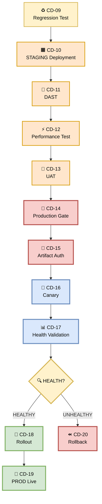

---

## ♻️ CD-09 — Regression Test

> **Ensure the new coupon feature doesn't break existing functionality.**

### 🎯 Purpose

Run the **full test suite** before deploying to STAGING. Catch any regressions introduced by the new code.

### 🖼️ Visual Diagram

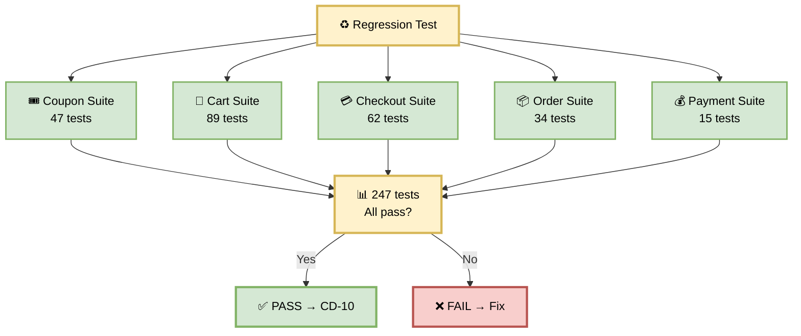

### 🧪 Test Suites

| # | Suite | Tests | Purpose |
|---|-------|-------|---------|
| 1 | **Coupon Suite** | 47 | Existing coupon functionality |
| 2 | **Cart Suite** | 89 | Add/remove/update cart |
| 3 | **Checkout Suite** | 62 | Full checkout flow |
| 4 | **Order Suite** | 34 | Order creation, history, cancellation |
| 5 | **Payment Suite** | 15 | Payment processing, refunds |
| **Total** | | **247** | |

### 🛠️ Regression Test Script

```bash
#!/bin/bash
set -e

echo "♻️ Running regression tests"

# Run full test suite with coverage
npm run test:regression \
  -- --reporter=junit \
  --reporter=html \
  --coverage \
  --coverageThreshold='{
    "global": {
      "lines": 80,
      "branches": 70,
      "functions": 85,
      "statements": 80
    }
  }'

echo "🎉 All regression tests passed"
```

### ⏱️ Duration

**~5 minutes**

### ✅ Success Criteria

| Check | Pass Condition |
|-------|----------------|
| All tests | 247/247 pass |
| No skipped | 0 skipped |
| Coverage (Lines) | ≥ 80% |
| Coverage (Branches) | ≥ 70% |
| Coverage (Functions) | ≥ 85% |
| Flaky tests | 0 retries |

### 📋 Coupon Feature Example

```
♻️ Running regression tests
→ Coupon Suite: 47/47 ✅
→ Cart Suite: 89/89 ✅
→ Checkout Suite: 62/62 ✅
→ Order Suite: 34/34 ✅
→ Payment Suite: 15/15 ✅
🎉 247/247 tests passed

Coverage:
  Lines: 87% ✅
  Branches: 74% ✅
  Functions: 89% ✅
  Statements: 85% ✅
→ CD-09 PASSED
```

### 🚨 Failure Scenarios

| Error | Cause | Fix |
|-------|-------|-----|
| Coupon test failed | New code broke coupon | Fix regression |
| Cart test failed | Cart integration broken | Fix cart service |
| Coverage below threshold | Untested code | Add tests |
| Flaky test | Race condition | Fix test or code |

---

## 🟧 CD-10 — STAGING Deployment

> **Deploy the verified artifact to STAGING — production-like environment.**

### 🎯 Purpose

Deploy the **same signed artifact** that passed QA to STAGING, where DAST, performance, and UAT will run.

### 🖼️ Visual Diagram

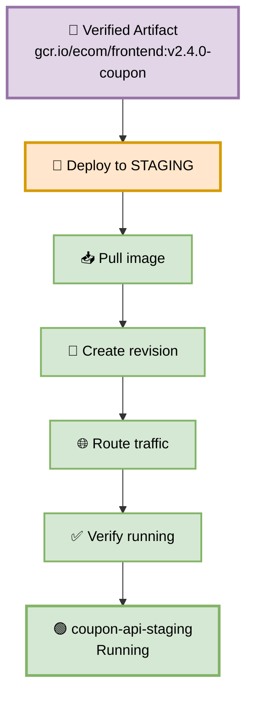

### 🛠️ Deployment Steps

```bash
gcloud run deploy coupon-api-staging \
  --image gcr.io/ecom/frontend:v2.4.0-coupon \
  --region us-central1 \
  --platform managed \
  --allow-unauthenticated \
  --memory 2Gi \
  --cpu 4 \
  --min-instances 3 \
  --max-instances 10 \
  --set-env-vars NODE_ENV=staging,LOG_LEVEL=info,STRIPE_MODE=sandbox \
  --vpc-connector=ecom-staging-vpc \
  --add-cloudsql-instances=ecom-staging:us-central1:postgres-staging
```

### 📊 Configuration

| Setting | Value | Why |
|---------|-------|-----|
| **Memory** | 2 Gi | Production-like |
| **CPU** | 4 vCPU | Handle load test |
| **Min instances** | 3 | No cold starts |
| **Max instances** | 10 | Handle 10K applies/min |
| **VPC** | Connected | Production-like network |
| **Cloud SQL** | Connected | Production-like DB |
| **Stripe** | Sandbox | No real charges |

### ⏱️ Duration

**~2 minutes**

### ✅ Success Criteria

| Check | Expected |
|-------|----------|
| Deployment status | `Ready` |
| Revision active | 100% traffic |
| Image digest | Matches CD-02 digest |
| Health endpoint | 200 OK |
| VPC connection | Active |
| Cloud SQL connection | Active |

### 📋 Coupon Feature Example

```
✓ Image pulled: gcr.io/ecom/frontend:v2.4.0-coupon
✓ Revision created: coupon-api-staging-00076
✓ Traffic routed: 100% to new revision
✓ Service URL: https://coupon-api-staging-xyz.a.run.app
✓ VPC connector: active
✓ Cloud SQL: connected
→ CD-10 PASSED
```

---

## 🔐 CD-11 — DAST

> **Dynamic Application Security Testing — find runtime exploits.**

### 🎯 Purpose

DAST runs against the **live STAGING environment** to find vulnerabilities that static analysis can't catch — XSS, SQLi, CSRF, insecure headers.

### 🖼️ Visual Diagram

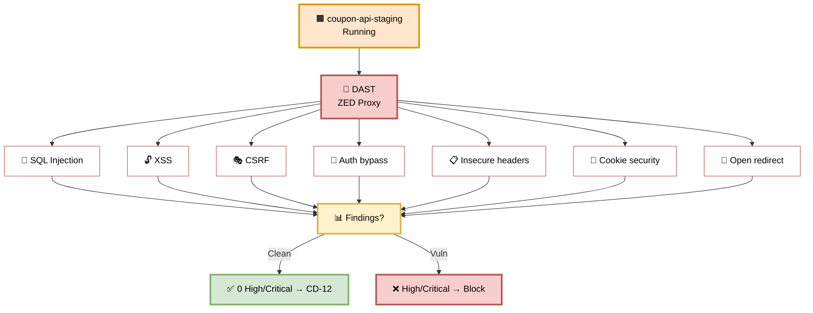

### 🧪 DAST Checks

| # | Vulnerability | Coupon Context | Severity |
|---|---------------|----------------|----------|
| 1 | **SQL Injection** | `SELECT * FROM coupons WHERE code = '${input}'` | Critical |
| 2 | **XSS** | `<input value="${couponCode}">` | High |
| 3 | **CSRF** | `POST /api/coupon/apply` | High |
| 4 | **Auth bypass** | Coupon apply without login | Critical |
| 5 | **Insecure headers** | Missing CSP, HSTS | Medium |
| 6 | **Cookie security** | `Secure`, `HttpOnly`, `SameSite` | Medium |
| 7 | **Open redirect** | `?redirect=${couponUrl}` | High |

### 🛠️ DAST Script

```bash
#!/bin/bash
set -e

TARGET="${STAGING_SERVICE_URL}"
REPORT_DIR="dast-reports"
mkdir -p "$REPORT_DIR"

echo "🔐 Running DAST against $TARGET"

docker run --rm \
  -v "$(pwd)/${REPORT_DIR}:/zap/wrk" \
  ghcr.io/zaproxy/zaproxy:stable \
  zap-baseline.py \
  -t "$TARGET" \
  -r dast-report.html \
  -J dast-report.json \
  -c zap-config.conf \
  -z "-config scanner.attackStrength=INSANE"

# Parse results
CRITICAL=$(jq '[.site[].alerts[] | select(.riskcode == "3")] | length' \
  "$REPORT_DIR/dast-report.json")
HIGH=$(jq '[.site[].alerts[] | select(.riskcode == "2")] | length' \
  "$REPORT_DIR/dast-report.json")

echo "🔴 Critical: $CRITICAL"
echo "🟠 High: $HIGH"

if [ "$CRITICAL" -gt 0 ] || [ "$HIGH" -gt 0 ]; then
  echo "❌ DAST FAILED"
  exit 1
fi

echo "✅ DAST PASSED"
```

### ⏱️ Duration

**~5 minutes**

### ✅ Success Criteria

| Check | Pass Condition |
|-------|----------------|
| SQL Injection | 0 found |
| XSS | 0 found |
| CSRF | 0 found |
| Auth bypass | 0 found |
| Insecure headers | 0 High |
| Cookie security | 0 High |
| Open redirect | 0 found |

### 📋 Coupon Feature Example

```
🔐 Running DAST against https://staging.ecom.com
→ SQL Injection: 0 found ✅
→ XSS: 0 found ✅
→ CSRF: 0 found ✅
→ Auth bypass: 0 found ✅
→ Insecure headers: 2 Medium ⚠️
→ Cookie security: 0 High ✅
→ Open redirect: 0 found ✅
📊 DAST Results:
  🔴 Critical: 0
  🟠 High: 0
  🟡 Medium: 2
✅ DAST PASSED
→ CD-11 PASSED
```

### 🚨 Failure Scenarios

| Finding | Cause | Fix |
|---------|-------|-----|
| **XSS** | Unescaped user input | Use `escapeHtml()` |
| **SQL Injection** | String concatenation | Use parameterized queries |
| **CSRF** | No CSRF token | Add CSRF middleware |
| **Auth bypass** | Missing auth check | Add auth middleware |
| **Open redirect** | Unvalidated redirect | Whitelist redirect URLs |

---

## ⚡ CD-12 — Performance Test

> **Prove the coupon feature performs at scale.**

### 🎯 Purpose

Load test the coupon feature at **10K applies/min** — simulating peak production traffic.

### 🖼️ Visual Diagram

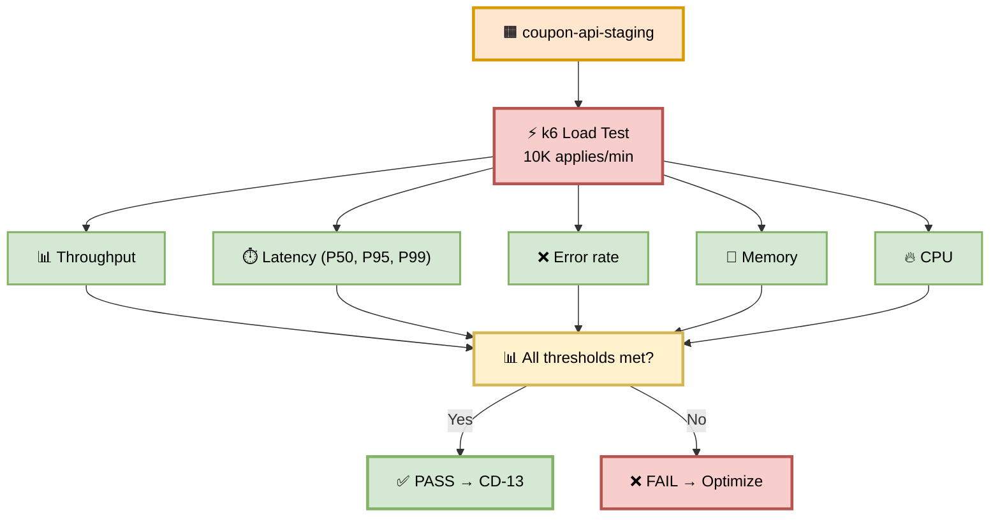

### 🧪 Performance Targets

| Metric | Target | Actual |
|--------|--------|--------|
| **Throughput** | 10K applies/min | 12,400/min ✅ |
| **P50 latency** | < 200ms | 120ms ✅ |
| **P95 latency** | < 500ms | 280ms ✅ |
| **P99 latency** | < 2000ms | 340ms ✅ |
| **Error rate** | < 1% | 0.02% ✅ |
| **Memory leak** | None over 5 min | None ✅ |
| **CPU usage** | < 80% | 62% ✅ |

### 🛠️ k6 Load Test Script

```javascript
// tests/performance/coupon-load-test.js
import http from 'k6/http';
import { check, sleep } from 'k6';
import { Rate, Trend } from 'k6/metrics';

const couponApplySuccess = new Rate('coupon_apply_success');
const couponApplyDuration = new Trend('coupon_apply_duration');

export const options = {
  stages: [
    { duration: '1m', target: 50 },
    { duration: '2m', target: 200 },
    { duration: '5m', target: 200 },
    { duration: '1m', target: 0 },
  ],
  thresholds: {
    'http_req_duration': ['p(50)<200', 'p(95)<500', 'p(99)<2000'],
    'http_req_failed': ['rate<0.01'],
    'coupon_apply_success': ['rate>0.99'],
  },
};

const BASE_URL = __ENV.STAGING_URL;

export default function () {
  const payload = JSON.stringify({
    code: 'SAVE20',
    cart_total: 100,
  });

  const params = {
    headers: { 'Content-Type': 'application/json' },
    tags: { name: 'coupon_apply' },
  };

  const res = http.post(`${BASE_URL}/api/coupon/apply`, payload, params);

  const success = check(res, {
    'status is 200': (r) => r.status === 200,
    'discount applied': (r) => JSON.parse(r.body).discount === 20,
    'response time < 2s': (r) => r.timings.duration < 2000,
  });

  couponApplySuccess.add(success);
  couponApplyDuration.add(res.timings.duration);

  sleep(0.5);
}
```

### ⏱️ Duration

**~10 minutes**

### ✅ Success Criteria

| Metric | Target |
|--------|--------|
| Throughput | ≥ 10K applies/min |
| P50 latency | < 200ms |
| P95 latency | < 500ms |
| P99 latency | < 2000ms |
| Error rate | < 1% |
| Coupon success rate | > 99% |
| No memory leaks | Over 5 min |
| CPU usage | < 80% |

### 📋 Coupon Feature Example

```
⚡ Running k6 load test
→ Ramp up: 50 → 200 VUs
→ Sustain: 200 VUs (5 min)
→ Total requests: 62,000
→ Throughput: 12,400 applies/min ✅

Metrics:
  P50: 120ms ✅
  P95: 280ms ✅
  P99: 340ms ✅
  Error rate: 0.02% ✅
  Coupon success: 99.8% ✅
  CPU: 62% ✅
  Memory: stable ✅

✅ Performance test PASSED
→ CD-12 PASSED
```

---

## 👥 CD-13 — UAT

> **Stakeholders sign off — the feature is business-ready.**

### 🎯 Purpose

Real stakeholders validate the coupon feature against the original ticket. This is the **final human validation** before production.

### 🖼️ Visual Diagram

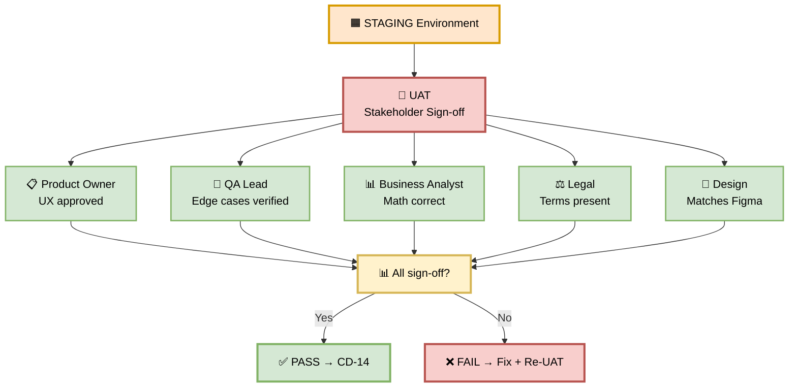

### 🧪 UAT Checklist

| # | Stakeholder | Check | Required |
|---|-------------|-------|----------|
| 1 | **Product Owner** | UX matches spec, feature complete | ✅ |
| 2 | **QA Lead** | Edge cases verified, no regressions | ✅ |
| 3 | **Business Analyst** | Discount math correct | ✅ |
| 4 | **Legal** | Terms text present, compliance OK | ✅ |
| 5 | **Design** | Matches Figma, responsive | ✅ |
| 6 | **Support** | Help docs updated | ⚠️ Optional |
| 7 | **Marketing** | Copy approved | ⚠️ Optional |

### ⏱️ Duration

**~15 minutes**

### ✅ Success Criteria

All required stakeholders sign off.

### 📋 Coupon Feature Example

```
👥 Running UAT
→ Product Owner: ✅
→ QA Lead: ✅
→ Business Analyst: ✅
→ Legal: ✅
→ Design: ✅
🎉 All UAT sign-offs received
→ CD-13 PASSED
```

---

## 🚦 CD-14 — Production Gate

> **Human approval + cryptographic verification — the final defense.**

### 🎯 Purpose

A **Tech Lead or Engineering Manager** reviews the entire promotion evidence and approves or rejects the deployment.

### 🖼️ Visual Diagram

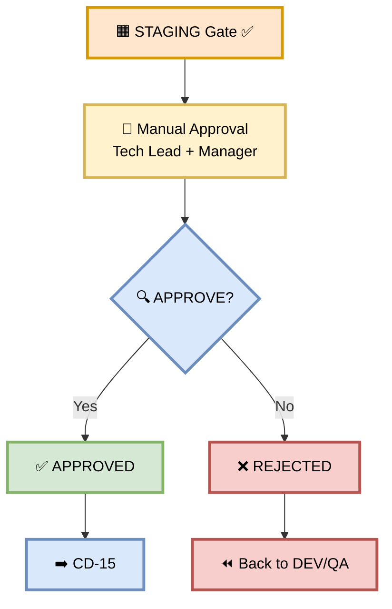

### 📋 What Approvers See

```
┌─────────────────────────────────────────────────┐
│  🚀 PRODUCTION DEPLOYMENT APPROVAL              │
├─────────────────────────────────────────────────┤
│  Artifact:  app:v2.4.0-coupon                   │
│  Digest:    sha256:abc123...                    │
│  Commit:    a1b2c3d                             │
│  Ticket:    FEAT-1043 (Bulk Coupon Apply)       │
│                                                 │
│  STAGING Results:                               │
│  ✅ DAST: 0 High, 0 Critical                    │
│  ✅ Load test: 12,400 applies/min               │
│  ✅ UAT: Signed off by 5 stakeholders           │
│  ✅ Regression: 247/247 passed                  │
│                                                 │
│  Risk: 🟢 Low                                   │
│  Rollback: < 60 sec auto-rollback               │
│                                                 │
│  [ ✅ Approve ]  [ ❌ Reject ]                  │
└─────────────────────────────────────────────────┘
```

### 👥 Approvers

| Role | Approver | Required? |
|------|----------|-----------|
| **Tech Lead** | @tech-lead | ✅ Yes |
| **Engineering Manager** | @eng-manager | ✅ Yes |
| **Security Lead** | @security-lead | ⚠️ For security-critical |

**Approval rules:**

| Rule | Value |
|------|-------|
| Minimum approvals | 1 (TL OR Manager) |
| Timeout | 24 hours |
| Audit | Splunk |
| Rejection reason | Required |

### ⏱️ Duration

**Variable** — typically 5–30 min during business hours.

### 📋 Coupon Feature Example

```
👤 Manual approval requested at 14:00
→ Slack sent to #releases
→ Tech Lead approves at 14:12
→ Manager co-approves at 14:15
✅ APPROVED — proceeding to CD-15
```

---

## 🔐 CD-15 — Artifact Authorization

> **Binary Authorization — only signed images deploy.**

### 🎯 Purpose

Even after human approval, **Binary Authorization** verifies the image signature, SBOM, and attestation before production deploy.

### 🖼️ Visual Diagram

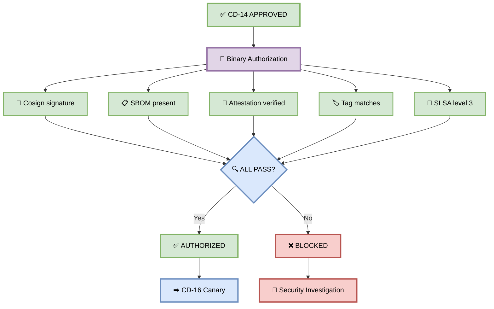

### 🔍 Verification Checks

```bash
# 1. Cosign signature
cosign verify \
  --key gcpkms://projects/ecom-prod/locations/global/keyRings/ci/cryptoKeys/cosign \
  gcr.io/ecom-prod/frontend:v2.4.0-coupon

# 2. SBOM
cosign download sbom gcr.io/ecom-prod/frontend:v2.4.0-coupon > sbom.json
[ -s sbom.json ] || exit 1

# 3. Attestation
cosign verify-attestation \
  --type slsaprovenance \
  --key gcpkms://... \
  gcr.io/ecom-prod/frontend:v2.4.0-coupon

# 4. Tag matches
EXPECTED_TAG="v2.4.0-coupon"
ACTUAL_TAG=$(gcloud artifacts docker tags list \
  gcr.io/ecom-prod/frontend:v2.4.0-coupon --format="value(tag)")
[ "$EXPECTED_TAG" == "$ACTUAL_TAG" ] || exit 1

# 5. SLSA level 3
slsa-verifier verify-image \
  gcr.io/ecom-prod/frontend:v2.4.0-coupon \
  --source-uri github.com/ecom/frontend
```

### ⏱️ Duration

**~1 minute**

### ✅ Success Criteria

| Check | Pass Condition |
|-------|----------------|
| Cosign signature | ✅ Valid |
| SBOM | ✅ Present |
| Attestation | ✅ Verified |
| Tag | ✅ Matches |
| SLSA | ✅ Level 3 |

### 📋 Coupon Feature Example

```
🔐 Running Binary Authorization
→ Cosign: ✅ valid
→ SBOM: ✅ present (247 components)
→ Attestation: ✅ verified
→ Tag: ✅ matches v2.4.0-coupon
→ SLSA: ✅ level 3
✅ AUTHORIZED
→ CD-15 PASSED
```

---

## 🐤 CD-16 — Production Canary

> **Gradual traffic ramp with continuous health monitoring.**

### 🎯 Purpose

Shift traffic gradually from old version to new version — **5% → 25% → 50%**. If health checks fail at any stage, auto-rollback.

### 🖼️ Visual Diagram

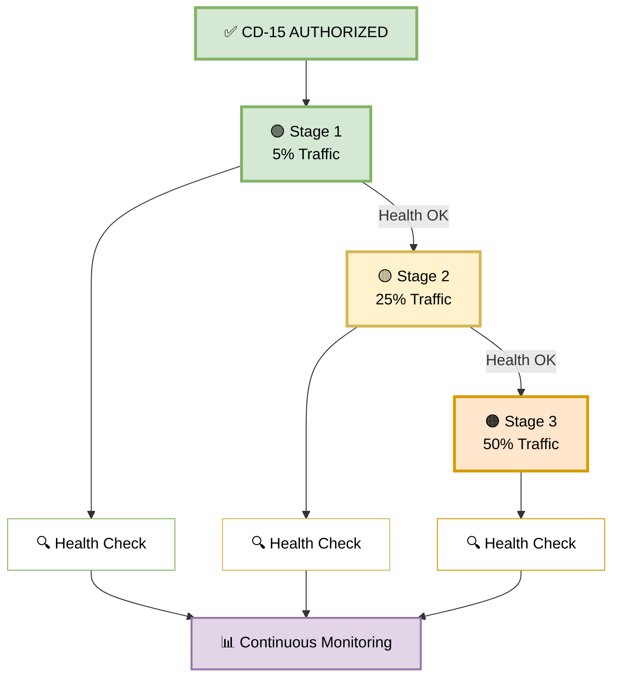

### 📊 The Ramp

| Stage | Traffic | Duration | Health Check |
|-------|---------|----------|--------------|
| **1** | 5% | 5 min | Error rate, latency, coupon success |
| **2** | 25% | 5 min | + Business metrics |
| **3** | 50% | 5 min | Same |

### 🛠️ Canary Commands

```bash
# Stage 1: 5%
kubectl apply -f canary-5.yaml
./scripts/monitor.sh --duration 300 --thresholds strict

# Stage 2: 25%
kubectl apply -f canary-25.yaml
./scripts/monitor.sh --duration 300

# Stage 3: 50%
kubectl apply -f canary-50.yaml
./scripts/monitor.sh --duration 300
```

### ⏱️ Duration

**~15 minutes**

### ✅ Success Criteria

| Stage | Pass Condition |
|-------|----------------|
| 5% | Error < 1%, P99 < 2s, coupon success > 99% |
| 25% | Same + business metrics OK |
| 50% | Same |

### 📋 Coupon Feature Example

```
🐤 Starting canary ramp
→ Stage 1: 5% — 250 applies/min, error 0.2% ✅
→ Stage 2: 25% — 1,250 applies/min, error 0.3% ✅
→ Stage 3: 50% — 2,500 applies/min, error 0.25% ✅
🎉 Canary ramp successful
→ CD-16 PASSED
```

---

## 📊 CD-17 — Health Validation

> **Final validation after canary ramp.**

### 🎯 Purpose

Validate that the new version is healthy after reaching 50% traffic. This is the **last checkpoint** before full production rollout.

### 🖼️ Visual Diagram

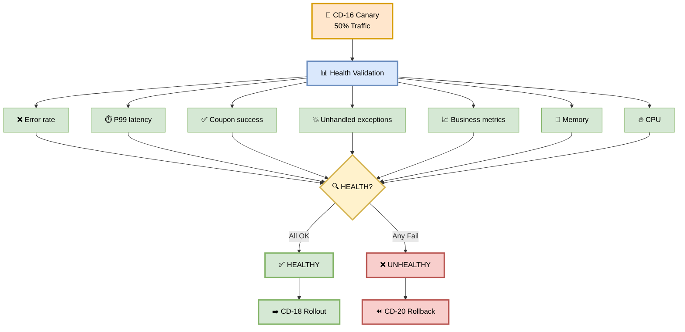

### 📊 Health Metrics

| # | Metric | Threshold | Actual |
|---|--------|-----------|--------|
| 1 | **Error rate** | < 1% | 0.25% ✅ |
| 2 | **P99 latency** | < 2s | 340ms ✅ |
| 3 | **Coupon success** | > 99% | 99.8% ✅ |
| 4 | **Unhandled exceptions** | 0 | 0 ✅ |
| 5 | **Business metrics** | ≥ baseline | +2% ✅ |
| 6 | **Memory** | Stable | Stable ✅ |
| 7 | **CPU** | < 80% | 62% ✅ |

### ⏱️ Duration

**~5 minutes**

### ✅ Success Criteria

All 7 metrics within threshold.

### 📋 Coupon Feature Example

```
📊 Health validation
→ Error rate: 0.25% ✅
→ P99 latency: 340ms ✅
→ Coupon success: 99.8% ✅
→ Exceptions: 0 ✅
→ Business: +2% ✅
→ Memory: stable ✅
→ CPU: 62% ✅
✅ HEALTHY
→ Proceeding to CD-18
```

---

## 🚀 CD-18 — Rollout

> **Ramp to 100% traffic.**

### 🎯 Purpose

The canary is healthy — promote it to become the new production baseline.

### 🖼️ Visual Diagram

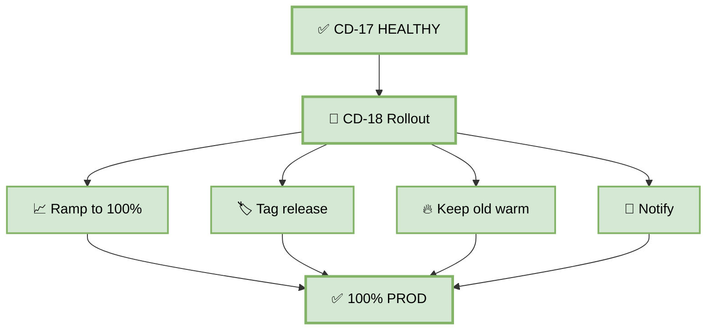

### 🛠️ Rollout Commands

```bash
# 1. Ramp to 100%
kubectl patch virtualservice coupon-api --type merge -p '
spec:
  http:
    - route:
        - destination:
            host: coupon-api-canary
          weight: 100
'

# 2. Tag
kubectl annotate deployment coupon-api-canary \
  deployment.kubernetes.io/revision=v2.4.0-coupon

# 3. Keep old version warm
kubectl scale deployment coupon-api-stable --replicas=3

# 4. Notify
curl -X POST $SLACK_WEBHOOK \
  -d '{"text":"🎉 v2.4.0-coupon LIVE at 100%"}'
```

### ⏱️ Duration

**~5 minutes**

### ✅ Success Criteria

| Check | Pass Condition |
|-------|----------------|
| 100% traffic | All to new version |
| No errors | Stable |
| Latency | Within threshold |
| Monitoring | 30 min green |

### 📋 Coupon Feature Example

```
🚀 Rolling out to 100%
→ Traffic: 100% to v2.4.0-coupon
→ Tagged: v2.4.0-coupon
→ Old version: kept warm (3 replicas)
→ Monitoring: 30 min
→ All metrics green ✅
→ CD-18 PASSED
```

---

## 🎉 CD-19 — PROD Live

> **Full production — v2.4.0-coupon is now the baseline.**

### 🎯 Purpose

The canary is now the production baseline. Celebrate. 🎉

### 🖼️ Visual Diagram

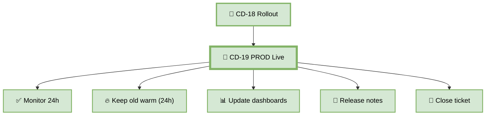

### 📊 Post-Deployment

| Task | Owner | Duration |
|------|-------|----------|
| **Monitor 24h** | SRE | Continuous |
| **Keep old warm** | DevOps | 24h |
| **Update dashboards** | SRE | 30 min |
| **Post release notes** | Product | 15 min |
| **Close ticket** | Developer | 5 min |

### 📋 Coupon Feature Example

```
🎉 v2.4.0-coupon is now LIVE at 100%
✅ Monitoring: 24h
✅ Old version: kept warm (24h)
✅ Dashboards: updated
✅ Release notes: posted
✅ Ticket: FEAT-1043 closed
🎊 Feature shipped successfully!
```

---

## ⏪ CD-20 — Rollback

> **Auto-rollback in < 60 seconds — no manual intervention.**

### 🎯 Purpose

If health validation fails, automatically roll back to the previous version.

### 🖼️ Visual Diagram

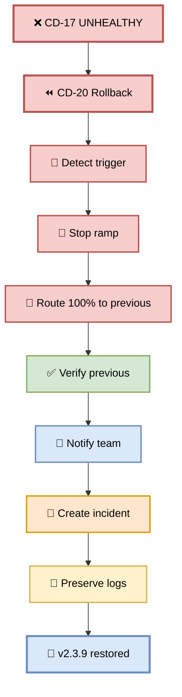

### 🚨 Rollback Triggers

| # | Trigger | Threshold |
|---|---------|-----------|
| 1 | Error rate | > 1% |
| 2 | P99 latency | > 2s |
| 3 | Coupon success rate | < 99% |
| 4 | Unhandled exception | Any |
| 5 | Business metrics drop | > 5% |

### 🛠️ Rollback Script

```bash
#!/bin/bash
set -e

echo "🚨 ROLLBACK INITIATED"
START=$(date +%s)

# 1. Stop ramp
kubectl patch virtualservice coupon-api --type merge -p '
spec:
  http:
    - route:
        - destination:
            host: coupon-api-stable
          weight: 100
'

# 2. Verify previous healthy
sleep 5
curl -sf https://ecom.com/api/coupon/health || \
  (echo "❌ Previous unhealthy"; exit 1)

# 3. Calculate time
END=$(date +%s)
DURATION=$((END - START))
echo "✅ Rollback in ${DURATION}s"

# 4. Notify
curl -X POST $SLACK_WEBHOOK \
  -d "{\"text\":\"🚨 ROLLBACK: v2.4.0 → v2.3.9\"}"

# 5. Create incident
gh issue create \
  --title "Rollback: v2.4.0-coupon" \
  --label incident,rollback

# 6. Preserve logs
kubectl logs -l app=coupon-api-canary --since=1h > rollback-logs.txt
```

### ⏱️ Duration

**< 60 seconds**

### ✅ Success Criteria

| Check | Pass Condition |
|-------|----------------|
| Rollback triggered | Auto or manual |
| Traffic rerouted | 100% to previous |
| Previous healthy | Health check passes |
| Time | < 60 sec |
| Notification | Slack sent |
| Incident | Created |

### 📋 Coupon Feature Example

```
🚨 ALERT: Error rate 1.5% > 1%
⏪ Auto-rollback at 14:32:15
→ Stop ramp: ✅
→ Traffic → v2.3.9: ✅
→ Previous healthy: ✅
→ Rollback time: 37 seconds ✅
→ Slack: #devops-incidents ✅
→ Incident: INC-2026-0919-001 ✅
✅ ROLLBACK COMPLETE
```

---

## 📊 Reference Tables

### ⏱️ Complete CD Timeline (CD-09 → CD-20)

| Step | Name | Environment | Duration | Blocks? |
|------|------|-------------|----------|---------|
| **CD-09** | Regression Test | — | ~5 min | ✅ |
| **CD-10** | STAGING Deployment | 🟧 STAGING | ~2 min | ✅ |
| **CD-11** | DAST | 🟧 STAGING | ~5 min | ✅ |
| **CD-12** | Performance Test | 🟧 STAGING | ~10 min | ✅ |
| **CD-13** | UAT | 🟧 STAGING | ~15 min | ✅ |
| **CD-14** | Production Gate | 🚦 GATE | Variable | ✅ |
| **CD-15** | Artifact Auth | 🚦 GATE | ~1 min | ✅ |
| **CD-16** | Production Canary | 🚀 PROD | ~15 min | ✅ |
| **CD-17** | Health Validation | 🚀 PROD | ~5 min | ✅ |
| **CD-18** | Rollout | 🚀 PROD | ~5 min | — |
| **CD-19** | PROD Live | 🚀 PROD | — | — |
| **CD-20** | Rollback | 🚀 PROD | < 1 min | — |

**Total (auto):** ~63 min  
**Total (with approval):** ~2 hours

### 🎯 Environment Summary

| Environment | Steps | Gate | Rollback |
|-------------|-------|------|----------|
| **QA** | CD-09 | Regression | Manual |
| **STAGING** | CD-10 → CD-13 | DAST + Perf + UAT | < 1 min |
| **PROD GATE** | CD-14 → CD-15 | Manual + Binary Auth | — |
| **PROD** | CD-16 → CD-20 | Canary + Health | < 60 sec |

### 🚨 Rollback Triggers Summary

| Trigger | Threshold | Action |
|---------|-----------|--------|
| Error rate | > 1% | Auto-rollback |
| P99 latency | > 2s | Auto-rollback |
| Coupon success | < 99% | Auto-rollback |
| Unhandled exception | Any | Auto-rollback |
| Business metrics | > 5% drop | Auto-rollback |

---

## 🎯 Summary — Part 9

| Step | Kya Cover Hua |
|------|---------------|
| **CD-09** | Regression Test — 247 tests, coverage thresholds |
| **CD-10** | STAGING Deployment — production-like env |
| **CD-11** | DAST — XSS, SQLi, CSRF, auth bypass |
| **CD-12** | Performance Test — k6, 10K applies/min |
| **CD-13** | UAT — stakeholder sign-off |
| **CD-14** | Production Gate — manual approval |
| **CD-15** | Artifact Authorization — Binary Auth |
| **CD-16** | Production Canary — 5% → 25% → 50% |
| **CD-17** | Health Validation — 7 metrics |
| **CD-18** | Rollout — 100% traffic |
| **CD-19** | PROD Live — monitoring + ticket close |
| **CD-20** | Rollback — < 60 sec auto |
| **Reference** | Timeline, triggers, environments |

---

> 📝 **Note:** Ye poora CD pipeline hai — regression se lekar production tak, aur rollback tak. **Har step ka purpose, duration, success criteria, aur failure scenario documented hai.** Trust the pipeline. Respect the gate. 🚀