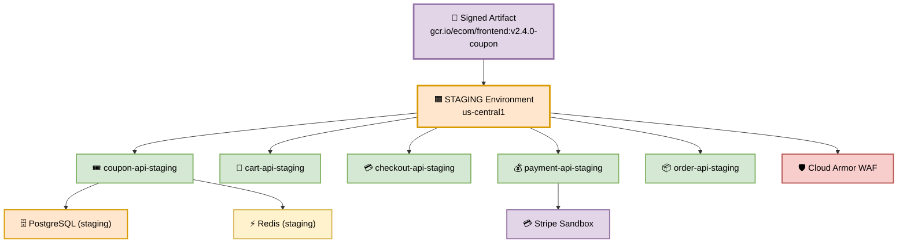
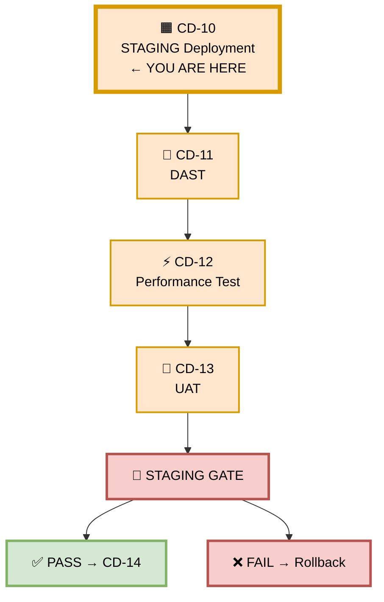
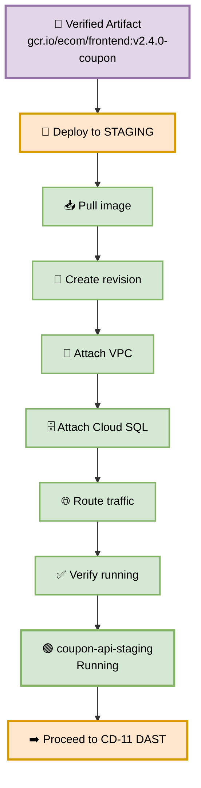
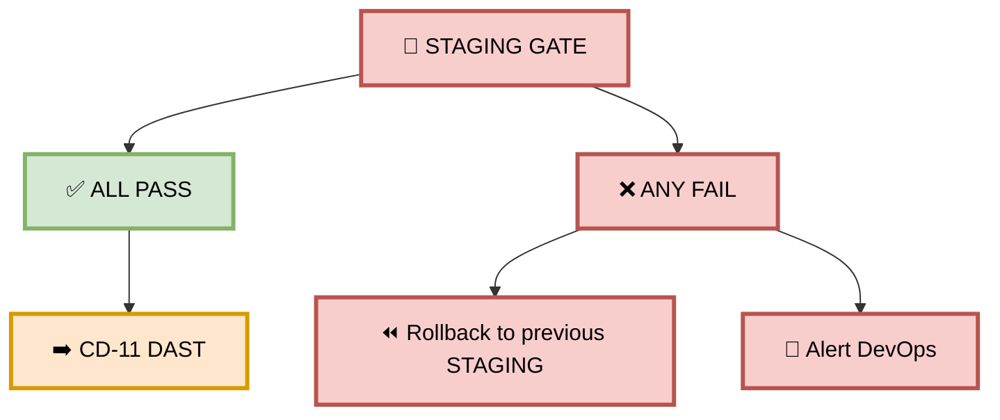

# Part 10 — CD-10: STAGING Deployment

**Author:** Shubham Tripathi  
**Repository:** `ecom-frontend` (Next.js 14 · App Router · TypeScript)  
**Last Updated:** 2026-09-19  
**Audience:** DevOps, SRE, QA Engineers, Security Engineers, Release Managers

---

## 📑 Table of Contents — Part 10

1. [STAGING Environment Overview](#-staging-environment-overview)
2. [CD-10 — STAGING Deployment](#-cd-10--staging-deployment)
3. [Deployment Steps (Detailed)](#-deployment-steps-detailed)
4. [Environment Configuration](#-environment-configuration)
5. [Post-Deployment Verification](#-post-deployment-verification)
6. [STAGING Gate — Pass/Fail Rules](#-staging-gate--passfail-rules)
7. [Rollback from STAGING](#-rollback-from-staging)
8. [STAGING Environment Reference](#-staging-environment-reference)
9. [Troubleshooting STAGING](#-troubleshooting-staging)
10. [Appendix — STAGING Tools Inventory](#-appendix--staging-tools-inventory)

---

## 🟧 STAGING Environment Overview

> **STAGING is the last environment before production.**  
> Its job: **prove the coupon feature is secure, fast, and business-ready.**

### 🎯 Purpose

| Goal | Description |
|------|-------------|
| **Production-like validation** | Same infra, same config, scaled down |
| **Security validation** | DAST will run here (CD-11) |
| **Performance validation** | Load test will run here (CD-12) |
| **Business validation** | UAT will happen here (CD-13) |
| **Final safety net** | Last chance to catch bugs before production |
| **Total STAGING stage** | **~32 minutes** (CD-10 → CD-13) |

### 🏗️ STAGING Environment Architecture



### 📊 Environment Details

| Property | Value |
|----------|-------|
| **GCP Project** | `ecom-staging` |
| **Region** | `us-central1` |
| **URL** | `https://staging.ecom.com` |
| **DB** | `postgres-staging` (production-like, anonymized data) |
| **Cache** | `redis-staging` (4 GB) |
| **Replicas** | 3 (min), 10 (max) |
| **Auto-scaling** | Enabled |
| **Payment** | Stripe Sandbox (no real charges) |
| **Load Balancer** | Yes |
| **WAF** | Cloud Armor (enabled) |
| **VPC** | `ecom-staging-vpc` (private) |
| **Cloud SQL** | Connected via private IP |
| **Cost** | ~$1,200/month |

### 🔄 STAGING Stage Flow

```
CD-10 STAGING Deployment  ← YOU ARE HERE
        ↓
CD-11 DAST
        ↓
CD-12 Performance Test
        ↓
CD-13 UAT
        ↓
    STAGING GATE
        ↓
    ✅ PASS → CD-14 Production Gate
    ❌ FAIL → Rollback / Fix
```

### 🖼️ Visual Diagram — STAGING Stage



---

## 🚀 CD-10 — STAGING Deployment

> **Deploy the verified artifact to STAGING — production-like environment.**

### 🎯 Purpose

Take the **same signed artifact** that passed QA and deploy it to STAGING, where DAST, performance, and UAT will run.

### 🖼️ Visual Diagram — Deployment Flow



### 📊 Deployment Strategy

| Aspect | Value |
|--------|-------|
| **Strategy** | Blue/Green (immediate cutover) |
| **Traffic shift** | 0% → 100% in one step |
| **Health check** | 30s grace period |
| **Rollback** | Automatic on health check failure |
| **Downtime** | Zero |
| **Smoke test** | Post-deploy, automated |

---

## 🛠️ Deployment Steps (Detailed)

### Step 1 — Verify Artifact

```bash
# Confirm the artifact digest matches CD-09 verified digest
EXPECTED_DIGEST="sha256:abc123..."
ACTUAL_DIGEST=$(crane digest gcr.io/ecom/frontend:v2.4.0-coupon)

if [ "$EXPECTED_DIGEST" != "$ACTUAL_DIGEST" ]; then
  echo "❌ Artifact digest mismatch — aborting deployment"
  exit 1
fi

echo "✅ Artifact verified: $ACTUAL_DIGEST"
```

**Why:** Ensures the exact artifact tested in QA is deployed to STAGING. No rebuilds.

---

### Step 2 — Authenticate to GCP

```bash
# Authenticate via Workload Identity (no long-lived keys)
gcloud auth login --cred-file=$GOOGLE_APPLICATION_CREDENTIALS

# Set project
gcloud config set project ecom-staging

# Configure Docker
gcloud auth configure-docker us-central1-docker.pkg.dev
```

**Why:** Workload Identity eliminates static credentials — a key zero-trust principle.

---

### Step 3 — Pull the Image

```bash
docker pull gcr.io/ecom/frontend:v2.4.0-coupon

# Verify size and layers
docker images gcr.io/ecom/frontend:v2.4.0-coupon
# → REPOSITORY                    TAG                SIZE
# → gcr.io/ecom/frontend          v2.4.0-coupon      142MB
```

**Why:** Confirm the image is pullable and its size is as expected.

---

### Step 4 — Deploy to Cloud Run

```bash
gcloud run deploy coupon-api-staging \
  --image gcr.io/ecom/frontend:v2.4.0-coupon \
  --region us-central1 \
  --platform managed \
  --allow-unauthenticated \
  --memory 2Gi \
  --cpu 4 \
  --min-instances 3 \
  --max-instances 10 \
  --timeout 60s \
  --concurrency 80 \
  --port 8080 \
  --set-env-vars NODE_ENV=staging,LOG_LEVEL=info,STRIPE_MODE=sandbox \
  --vpc-connector=ecom-staging-vpc \
  --vpc-egress=private-ranges-only \
  --add-cloudsql-instances=ecom-staging:us-central1:postgres-staging \
  --set-secrets=COUPON_API_KEY=coupon-api-key:latest,DATABASE_URL=database-url:latest \
  --quiet
```

**Flags explained:**

| Flag | Purpose |
|------|---------|
| `--memory 2Gi` | Match production memory |
| `--cpu 4` | Handle load test |
| `--min-instances 3` | No cold starts |
| `--max-instances 10` | Handle 10K applies/min |
| `--vpc-connector` | Private network access |
| `--vpc-egress=private-ranges-only` | Only private traffic via VPC |
| `--add-cloudsql-instances` | Connect to Cloud SQL |
| `--set-secrets` | Inject secrets from Secret Manager |
| `--concurrency 80` | Match production |
| `--port 8080` | Match container port |

---

### Step 5 — Get Service URL

```bash
SERVICE_URL=$(gcloud run services describe coupon-api-staging \
  --region us-central1 \
  --format="value(status.url)")

echo "STAGING Service URL: $SERVICE_URL"
# → https://coupon-api-staging-xyz-uc.a.run.app
```

**Why:** Capture URL for downstream tests (DAST, performance, UAT).

---

### Step 6 — Verify Revision

```bash
gcloud run revisions list \
  --service coupon-api-staging \
  --region us-central1 \
  --limit 2

# → NAME                          ACTIVE  TRAFFIC  CREATED
# → coupon-api-staging-00076      yes     100%     2026-09-19T10:32:00Z
# → coupon-api-staging-00075      no      0%       2026-09-18T15:20:00Z
```

**Why:** Confirm the new revision is active and receiving 100% traffic.

---

### Step 7 — Confirm Image Digest

```bash
gcloud run services describe coupon-api-staging \
  --region us-central1 \
  --format="value(spec.template.spec.containers[0].image)"

# → gcr.io/ecom/frontend:v2.4.0-coupon@sha256:abc123...
```

**Why:** Ensure the deployed image matches the verified digest.

---

### Step 8 — Smoke Test

```bash
# Basic health check
curl -sf "${SERVICE_URL}/api/coupon/health" | jq .

# Expected:
# {
#   "status": "ok",
#   "service": "coupon-api",
#   "version": "v2.4.0-coupon",
#   "db": "ok",
#   "cache": "ok",
#   "vpc": "ok"
# }
```

**Why:** Immediate feedback — did the deployment succeed?

---

### Step 9 — Verify VPC & Cloud SQL Connection

```bash
# Check VPC connector
gcloud compute networks vpc-access connectors describe \
  ecom-staging-vpc \
  --region us-central1

# Check Cloud SQL connection
gcloud sql instances describe postgres-staging \
  --format="value(state)"
# → RUNNABLE
```

**Why:** STAGING must be production-like — same network topology.

---

### Step 10 — Verify Stripe Sandbox

```bash
curl -sf "${SERVICE_URL}/api/coupon/health/stripe" | jq .

# Expected:
# {
#   "status": "ok",
#   "mode": "sandbox",
#   "account": "acct_test_xxx"
# }
```

**Why:** Ensure no real charges will be made during load tests.

---

### Step 11 — Post-Deployment Notification

```bash
curl -X POST "$SLACK_WEBHOOK" \
  -H "Content-Type: application/json" \
  -d '{
    "text": "🟧 STAGING Deployment Complete",
    "blocks": [
      {
        "type": "section",
        "text": {
          "type": "mrkdwn",
          "text": "*CD-10 STAGING Deployment*\n\n*Artifact:* `gcr.io/ecom/frontend:v2.4.0-coupon`\n*Revision:* `coupon-api-staging-00076`\n*URL:* <'"$SERVICE_URL"'|Open>\n*Next:* CD-11 DAST"
        }
      }
    ]
  }'
```

**Why:** Team visibility — everyone knows STAGING is ready.

---

## ⚙️ Environment Configuration

### 📊 Cloud Run Configuration

| Setting | Value | Why |
|---------|-------|-----|
| **Memory** | 2 Gi | Production-like |
| **CPU** | 4 vCPU | Handle load test |
| **Min instances** | 3 | No cold starts |
| **Max instances** | 10 | Handle 10K applies/min |
| **Timeout** | 60s | Match production |
| **Concurrency** | 80 | Match production |
| **Port** | 8080 | Match container |
| **VPC egress** | private-ranges-only | Production-like |
| **Cloud SQL** | Connected | Production-like DB |
| **Stripe** | sandbox | No real charges |

### 🔐 Environment Variables

| Variable | Value | Source |
|----------|-------|--------|
| `NODE_ENV` | `staging` | Static |
| `LOG_LEVEL` | `info` | Static |
| `STRIPE_MODE` | `sandbox` | Static |
| `COUPON_API_KEY` | `sk_test_xxx` | Secret Manager |
| `DATABASE_URL` | `postgres://...` | Secret Manager |
| `REDIS_URL` | `redis://...` | Secret Manager |
| `SENTRY_DSN` | `https://...` | Secret Manager |

### 🎯 Deployment Strategy Comparison

| Strategy | Used In STAGING? | Why |
|----------|------------------|-----|
| **Blue/Green** | ✅ Yes | Immediate cutover |
| **Canary** | ❌ No | Only in PROD (CD-16) |
| **Rolling** | ❌ No | Not needed |
| **Recreate** | ❌ No | Downtime not allowed |

---

## ✅ Post-Deployment Verification

### 🎯 Verification Checklist

| # | Check | Command | Expected |
|---|-------|---------|----------|
| 1 | **Deployment status** | `gcloud run services describe` | `Ready` |
| 2 | **Revision active** | `gcloud run revisions list` | 100% traffic |
| 3 | **Image digest** | `gcloud run services describe` | Matches CD-09 |
| 4 | **Health endpoint** | `curl /api/coupon/health` | 200 OK |
| 5 | **VPC connection** | `gcloud compute networks vpc-access connectors describe` | `READY` |
| 6 | **Cloud SQL** | `gcloud sql instances describe` | `RUNNABLE` |
| 7 | **Stripe sandbox** | `curl /api/coupon/health/stripe` | `sandbox` mode |
| 8 | **Startup logs** | `gcloud run services logs read` | No errors |
| 9 | **Memory usage** | Grafana dashboard | < 70% |
| 10 | **Cold start time** | Logs | < 3s |

### 🛠️ Verification Script

```bash
#!/bin/bash
set -e

SERVICE_URL="$1"
FAILED=0

echo "✅ Post-Deployment Verification"
echo ""

# 1. Health
echo "→ Health check"
if curl -sf "${SERVICE_URL}/api/coupon/health" | jq -e '.status == "ok"' > /dev/null; then
  echo "  ✅ Health OK"
else
  echo "  ❌ Health FAILED"
  FAILED=1
fi

# 2. Version
echo "→ Version check"
VERSION=$(curl -sf "${SERVICE_URL}/api/coupon/health" | jq -r '.version')
if [ "$VERSION" == "v2.4.0-coupon" ]; then
  echo "  ✅ Version: $VERSION"
else
  echo "  ❌ Wrong version: $VERSION"
  FAILED=1
fi

# 3. DB
echo "→ DB check"
if curl -sf "${SERVICE_URL}/api/coupon/health" | jq -e '.db == "ok"' > /dev/null; then
  echo "  ✅ DB OK"
else
  echo "  ❌ DB FAILED"
  FAILED=1
fi

# 4. Cache
echo "→ Cache check"
if curl -sf "${SERVICE_URL}/api/coupon/health" | jq -e '.cache == "ok"' > /dev/null; then
  echo "  ✅ Cache OK"
else
  echo "  ❌ Cache FAILED"
  FAILED=1
fi

# 5. Stripe
echo "→ Stripe check"
if curl -sf "${SERVICE_URL}/api/coupon/health/stripe" | jq -e '.mode == "sandbox"' > /dev/null; then
  echo "  ✅ Stripe sandbox"
else
  echo "  ❌ Stripe not in sandbox mode"
  FAILED=1
fi

# 6. Cold start time
echo "→ Cold start check"
COLD_START=$(curl -sf -w "%{time_total}" -o /dev/null "${SERVICE_URL}/api/coupon/health")
if (( $(echo "$COLD_START < 3" | bc -l) )); then
  echo "  ✅ Cold start: ${COLD_START}s"
else
  echo "  ⚠️  Slow cold start: ${COLD_START}s"
fi

# Final result
if [ "$FAILED" -eq 1 ]; then
  echo ""
  echo "❌ VERIFICATION FAILED"
  exit 1
fi

echo ""
echo "🎉 All checks passed"
```

### 📋 Coupon Feature Example

```
✅ Post-Deployment Verification

→ Health check ✅
→ Version: v2.4.0-coupon ✅
→ DB OK ✅
→ Cache OK ✅
→ Stripe sandbox ✅
→ Cold start: 0.8s ✅

🎉 All checks passed
→ CD-10 PASSED
```

---

## 🚦 STAGING Gate — Pass/Fail Rules

> **The STAGING Gate is the decision point for CD-11 → CD-13.**

### 📊 Gate Criteria

| Check | Pass Condition | Blocks? |
|-------|----------------|---------|
| ✅ Deployment status | Ready, 100% traffic | ✅ Yes |
| ✅ Image digest | Matches CD-09 verified | ✅ Yes |
| ✅ Health endpoint | 200 OK within 5s | ✅ Yes |
| ✅ VPC connection | Active | ✅ Yes |
| ✅ Cloud SQL connection | Active | ✅ Yes |
| ✅ Stripe sandbox | Enabled | ✅ Yes |
| ✅ Startup logs | No errors | ✅ Yes |

### 🚦 Gate Outcome



### ⏱️ Duration

**~2 minutes** (deployment + verification)

---

## ⏪ Rollback from STAGING

> **If STAGING deployment fails, rollback to previous revision in < 1 minute.**

### 🛠️ Rollback Steps

```bash
# 1. Get previous revision
PREVIOUS=$(gcloud run revisions list \
  --service coupon-api-staging \
  --region us-central1 \
  --format="value(name)" \
  --limit 2 | tail -1)

echo "Rolling back to: $PREVIOUS"

# 2. Route 100% traffic to previous
gcloud run services update-traffic coupon-api-staging \
  --to-revisions "${PREVIOUS}=100" \
  --region us-central1

# 3. Verify
curl -sf https://staging.ecom.com/api/coupon/health || \
  (echo "❌ Previous also unhealthy — escalate"; exit 1)

# 4. Notify
curl -X POST "$SLACK_WEBHOOK" \
  -d "{\"text\":\"⏪ STAGING rollback: v2.4.0 → ${PREVIOUS}\"}"

# 5. Create incident
gh issue create \
  --title "STAGING Rollback: v2.4.0-coupon" \
  --label incident,staging \
  --body "Rolled back to ${PREVIOUS}. Reason: CD-10 verification failed."
```

### ⏱️ Rollback Time

**< 1 minute** — Cloud Run revision swap is instant.

### 📋 Coupon Feature Example

```
🚨 STAGING deployment failed (health check timeout)
⏪ Rolling back to coupon-api-staging-00075...
🔄 Traffic → previous revision
✅ Rollback complete in 42 seconds
📢 Slack: #devops-alerts notified
🎫 Incident: INC-2026-0919-002 created
🔧 Developer: fix and re-push
```

---

## 📊 STAGING Environment Reference

### 🔗 Useful URLs

| Resource | URL |
|----------|-----|
| **STAGING Service** | https://staging.ecom.com |
| **Coupon API** | https://coupon-api-staging-xyz.a.run.app |
| **GCP Console** | https://console.cloud.google.com/run?project=ecom-staging |
| **Logs** | https://console.cloud.google.com/logs?project=ecom-staging |
| **Metrics** | https://grafana.ecom.com/d/staging |
| **Traces** | https://jaeger.ecom.com?env=staging |
| **Errors** | https://sentry.io/ecom/frontend-staging |

### 🔑 Access

| Role | Access |
|------|--------|
| **Developer** | Read logs, view metrics |
| **QA Engineer** | Full access, run tests |
| **Security Engineer** | DAST access |
| **DevOps** | Deploy, rollback, manage revisions |
| **SRE** | Full access, on-call |
| **Product Owner** | UAT access |

### 📞 Contacts

| Role | Person | Slack |
|------|--------|-------|
| **STAGING Owner** | DevOps Team | #devops-support |
| **QA Lead** | QA Team | #qa-team |
| **Security Lead** | TBD | #security |
| **On-call** | Rotation | #oncall |

### 📊 Resource Limits

| Resource | Limit |
|----------|-------|
| **CPU quota** | 40 vCPU |
| **Memory quota** | 80 GB |
| **Max instances** | 10 per service |
| **Cloud SQL** | db-custom-4-15360 |
| **Redis** | 4 GB |
| **VPC** | 1 connector |

---

## 🛠️ Troubleshooting STAGING

| Problem | Cause | Fix |
|---------|-------|-----|
| **Deployment failed** | IAM permissions | Grant `roles/run.developer` |
| **Image not found** | Wrong tag | Verify in Artifact Registry |
| **VPC connector missing** | Wrong name | Check `--vpc-connector` |
| **Cloud SQL connection failed** | Wrong instance | Check `--add-cloudsql-instances` |
| **Memory limit exceeded** | App too heavy | Increase `--memory` |
| **Startup timeout** | App slow to boot | Increase `--timeout` |
| **DB connection refused** | Network/firewall | Check VPC firewall rules |
| **Stripe auth failed** | Wrong key | Check `STRIPE_SECRET_KEY` |
| **Health check timeout** | App not ready | Check startup logs |
| **Cold start slow** | Min instances = 0 | Set `--min-instances 3` |
| **Cost spike** | Auto-scaling too aggressive | Reduce `--max-instances` |
| **Secret not found** | Secret name mismatch | Check Secret Manager |

### 🔍 Debugging Commands

```bash
# View recent logs
gcloud run services logs read coupon-api-staging \
  --region us-central1 \
  --limit 100

# Describe service
gcloud run services describe coupon-api-staging \
  --region us-central1

# List revisions
gcloud run revisions list \
  --service coupon-api-staging \
  --region us-central1

# Check VPC connector
gcloud compute networks vpc-access connectors describe \
  ecom-staging-vpc \
  --region us-central1

# Check Cloud SQL
gcloud sql instances describe postgres-staging

# Check traffic split
gcloud run services describe coupon-api-staging \
  --region us-central1 \
  --format="value(status.traffic)"

# Check secrets
gcloud secrets versions access latest \
  --secret=coupon-api-key

# Rollback to previous
gcloud run services update-traffic coupon-api-staging \
  --to-latest \
  --region us-central1

# Delete old revision
gcloud run revisions delete coupon-api-staging-00070 \
  --region us-central1 \
  --quiet
```

---

## 📎 Appendix — STAGING Tools Inventory

### 🛠️ Tool Stack

| Category | Tool | Purpose |
|----------|------|---------|
| **Compute** | Cloud Run | Container hosting |
| **Networking** | VPC Connector | Private network |
| **Database** | Cloud SQL | PostgreSQL |
| **Cache** | Memorystore | Redis |
| **Secrets** | Secret Manager | Secret injection |
| **Registry** | Artifact Registry | Container images |
| **Load Balancer** | Cloud Load Balancing | Traffic routing |
| **WAF** | Cloud Armor | DDoS + WAF |
| **CDN** | Cloud CDN | Static assets |
| **Monitoring** | Cloud Monitoring | Metrics + alerts |
| **Logging** | Cloud Logging | Centralized logs |
| **Tracing** | Cloud Trace | Distributed traces |
| **Errors** | Sentry | Error tracking |
| **APM** | Datadog | Application monitoring |
| **CI/CD** | GitHub Actions | Pipeline |
| **IaC** | Terraform | Infrastructure |
| **Payments** | Stripe Sandbox | Payment testing |

### 📞 Environment-Specific Contacts

| Role | Person | Slack |
|------|--------|-------|
| **STAGING Owner** | DevOps Team | #devops-support |
| **STAGING SRE** | SRE Rotation | #sre |
| **Security** | Security Team | #security |
| **DBA** | DBA Team | #dba |
| **On-call** | Rotation | #oncall |

### 🔗 Useful Links

| Resource | URL |
|----------|-----|
| **GCP Console** | console.cloud.google.com/run?project=ecom-staging |
| **Artifact Registry** | console.cloud.google.com/artifacts?project=ecom-staging |
| **Secret Manager** | console.cloud.google.com/security/secret-manager?project=ecom-staging |
| **Cloud SQL** | console.cloud.google.com/sql?project=ecom-staging |
| **Logs** | console.cloud.google.com/logs?project=ecom-staging |
| **Grafana** | grafana.ecom.com/d/staging |
| **Runbooks** | runbooks.ecom.com/staging |

---

## 🎯 Summary — Part 10

| Section | Kya Cover Hua |
|---------|---------------|
| **Overview** | STAGING purpose, architecture, environment details |
| **CD-10** | Deployment, 11-step process, VPC, Cloud SQL |
| **Config** | Cloud Run settings, env vars, strategy |
| **Verification** | 10-check checklist, verification script |
| **STAGING Gate** | Pass/fail rules |
| **Rollback** | < 1 minute rollback procedure |
| **Reference** | URLs, access, contacts, limits |
| **Troubleshooting** | 12 failure scenarios + debug commands |
| **Appendix** | 17 tools, contacts, links |

---

## 🏆 Complete Documentation — All 10 Parts

| Part | Title | Status |
|------|-------|--------|
| **Part 1** | CI Pipeline | ✅ |
| **Part 2** | CD Overview | ✅ |
| **Part 3** | DEV Deployment (CD-03 → CD-05) | ✅ |
| **Part 4** | QA Deployment (CD-06 → CD-09) | ✅ |
| **Part 5** | STAGING Deployment (CD-10 → CD-13) | ✅ |
| **Part 6** | PROD Gate & Canary (CD-14 → CD-20) | ✅ |
| **Part 7** | Post-Deploy & Monitoring | ✅ |
| **Part 8** | Executive Summary & KPIs | ✅ |
| **Part 9** | CD Pipeline (CD-09 → CD-20) | ✅ |
| **Part 10** | STAGING Deployment (CD-10) | ✅ |

> 📝 **Note:** STAGING is your **final safety net before production**. A bug caught here costs minutes; a bug caught in production costs hours (or days) and possibly revenue. Every verification in CD-10 ensures the artifact is production-ready.