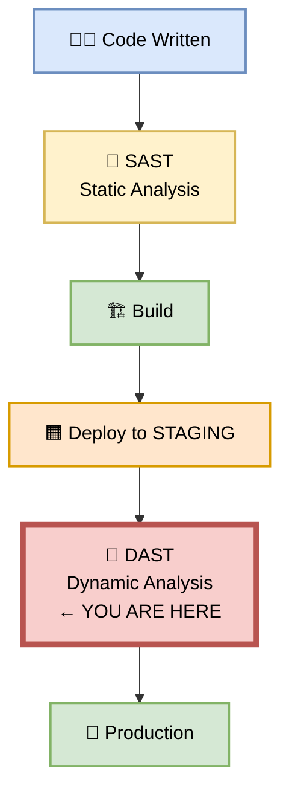
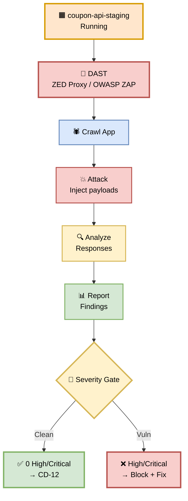
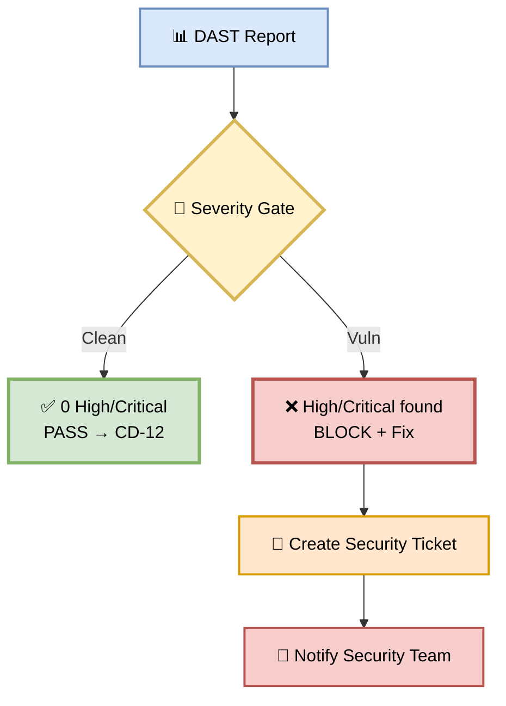
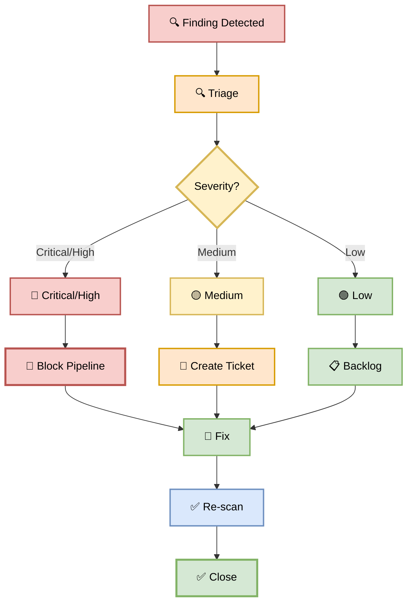

# Part 11 — CD-11: DAST (Dynamic Application Security Testing)

**Author:** Shubham Tripathi  
**Repository:** `ecom-frontend` (Next.js 14 · App Router · TypeScript)  
**Last Updated:** 2026-09-19  
**Audience:** Security Engineers, DevOps, SRE, QA, Tech Leads, CISO

---

## 📑 Table of Contents — Part 11

1. [DAST Overview](#-dast-overview)
2. [CD-11 — DAST Execution](#-cd-11--dast-execution)
3. [DAST Tools & Configuration](#-dast-tools--configuration)
4. [Security Checks in Detail](#-security-checks-in-detail)
5. [Coupon Feature — Real Vulnerabilities](#-coupon-feature--real-vulnerabilities)
6. [DAST Gate — Pass/Fail Rules](#-dast-gate--passfail-rules)
7. [Handling DAST Findings](#-handling-dast-findings)
8. [False Positives & Suppression](#-false-positives--suppression)
9. [DAST Reports & Artifacts](#-dast-reports--artifacts)
10. [Troubleshooting DAST](#-troubleshooting-dast)
11. [Appendix — DAST Tools Inventory](#-appendix--dast-tools-inventory)

---

## 🔐 DAST Overview

> **DAST = Dynamic Application Security Testing.**  
> It attacks the **running application** like a real hacker would — finding exploits that static analysis can't see.

### 🎯 What is DAST?

DAST is **black-box security testing**:
- Runs against a **live, running application**
- Simulates **real attacker behavior**
- Finds **runtime vulnerabilities** (XSS, SQLi, CSRF, etc.)
- **Does NOT** look at source code

### 🎯 Why DAST Matters

| Reason | Explanation |
|--------|-------------|
| **Catches runtime bugs** | SAST can't see what happens at runtime |
| **Real-world exploits** | Tests actual attack vectors |
| **Framework-agnostic** | Works regardless of language/framework |
| **Compliance** | Required for PCI-DSS, SOC 2, ISO 27001 |
| **Pre-production** | Catches issues before users do |
| **Continuous** | Runs on every deployment |

### 🎯 SAST vs DAST

| Aspect | SAST | DAST |
|--------|------|------|
| **When** | During coding | After deployment |
| **What** | Source code | Running app |
| **Approach** | White-box | Black-box |
| **Finds** | Code patterns | Runtime exploits |
| **Speed** | Fast | Slower |
| **False positives** | Higher | Lower |
| **Environment** | CI | STAGING |

### 🖼️ Visual Diagram — DAST Position



---

## 🚀 CD-11 — DAST Execution

> **Run DAST against live STAGING — find exploits before production.**

### 🎯 Purpose

Attack the **STAGING environment** with automated security tools to find:
- **XSS** (Cross-Site Scripting)
- **SQL Injection**
- **CSRF** (Cross-Site Request Forgery)
- **Auth bypass**
- **Insecure headers**
- **Cookie security issues**
- **Open redirects**
- **And more...**

### 🖼️ Visual Diagram — DAST Flow



### 📊 DAST Execution Stages

| Stage | Action | Duration |
|-------|--------|----------|
| **1. Crawl** | Discover all endpoints | ~1 min |
| **2. Attack** | Inject attack payloads | ~3 min |
| **3. Analyze** | Parse responses | ~30 sec |
| **4. Report** | Generate findings | ~30 sec |
| **Total** | | **~5 min** |

### 🛠️ DAST Pipeline Snippet

```yaml
cd-11-dast:
  runs-on: ubuntu-latest
  needs: cd-10-staging-deployment
  steps:
    - name: Checkout
      uses: actions/checkout@v4

    - name: CD-11 DAST
      run: |
        mkdir -p dast-reports

        # Run OWASP ZAP baseline scan
        docker run --rm \
          -v "$(pwd)/dast-reports:/zap/wrk" \
          ghcr.io/zaproxy/zaproxy:stable \
          zap-baseline.py \
          -t "${{ env.STAGING_SERVICE_URL }}" \
          -r dast-report.html \
          -J dast-report.json \
          -w dast-report.md \
          -c zap-config.conf \
          -z "-config scanner.attackStrength=INSANE"

    - name: Parse DAST Results
      run: |
        CRITICAL=$(jq '[.site[].alerts[] | select(.riskcode == "3")] | length' \
          dast-reports/dast-report.json)
        HIGH=$(jq '[.site[].alerts[] | select(.riskcode == "2")] | length' \
          dast-reports/dast-report.json)
        MEDIUM=$(jq '[.site[].alerts[] | select(.riskcode == "1")] | length' \
          dast-reports/dast-report.json)

        echo "🔴 Critical: $CRITICAL"
        echo "🟠 High: $HIGH"
        echo "🟡 Medium: $MEDIUM"

        if [ "$CRITICAL" -gt 0 ] || [ "$HIGH" -gt 0 ]; then
          echo "❌ DAST FAILED"
          exit 1
        fi

    - name: Upload DAST Report
      if: always()
      uses: actions/upload-artifact@v4
      with:
        name: dast-report
        path: dast-reports/
        retention-days: 30

    - name: Post to Slack
      if: always()
      run: |
        STATUS="${{ job.status }}"
        curl -X POST $SLACK_WEBHOOK \
          -d "{\"text\":\"🔐 DAST: $STATUS\"}"
```

---

## 🛠️ DAST Tools & Configuration

> **We use multiple DAST tools for different attack surfaces.**

### 🎯 DAST Tool Stack

| Tool | Purpose | Coverage |
|------|---------|----------|
| **OWASP ZAP** | General DAST | Full app |
| **ZED Proxy** | API-focused DAST | REST APIs |
| **Burp Suite** | Manual + automated | Custom scenarios |
| **Nuclei** | Fast CVE scanning | Known vulns |
| **SQLMap** | SQL injection | DB endpoints |
| **Nikto** | Web server scanning | Server config |

### 🎯 Primary Tool: OWASP ZAP

**Why ZAP?**
- Open source, free
- Actively maintained
- Full-featured (crawl + attack)
- CI/CD friendly
- Great reporting

### 🛠️ ZAP Configuration (`zap-config.conf`)

```ini
# Authentication
auth.loginurl=https://staging.ecom.com/login
auth.username=test@ecom.com
auth.password=${TEST_PASSWORD}
auth.loginpageid=username
auth.passwordid=password
auth.submitid=login-btn
auth.loggedinindicator=logout

# Scan rules
rules.10021.ignore=true    # X-Content-Type-Options (informational)
rules.10038.ignore=true    # CSP (covered elsewhere)
rules.10063.ignore=true    # Feature-Policy (deprecated)

# Context (scope)
context.include=https://staging.ecom.com/.*
context.include=https://staging.ecom.com/api/coupon/.*
context.exclude=https://staging.ecom.com/logout
context.exclude=https://staging.ecom.com/metrics

# Attack strength
scanner.attackStrength=INSANE
scanner.alertThreshold=LOW

# Anti-CSRF
anticsrf.tokens=csrf_token
```

### 🎯 ZAP Scan Policies

| Policy | When | Attack Strength |
|--------|------|-----------------|
| **Baseline** | Every PR | MEDIUM |
| **Full** | STAGING (CD-11) | INSANE |
| **API** | API changes | HIGH |
| **Deep** | Weekly | INSANE |

### 🛠️ Nuclei Configuration

```yaml
# nuclei-config.yaml
templates:
  - cves/
  - exposures/
  - misconfiguration/
  - vulnerabilities/
  - xss/
  - sqli/
  - csrf/

severity:
  - critical
  - high
  - medium

rate-limit: 150
concurrency: 25
```

**Run:**

```bash
nuclei -u https://staging.ecom.com \
  -config nuclei-config.yaml \
  -json -o nuclei-report.json
```

---

## 🔍 Security Checks in Detail

> **Every check has a real-world example.**

### 🎯 The 10 Security Checks

| # | Check | OWASP Top 10 | Severity |
|---|-------|--------------|----------|
| 1 | **SQL Injection** | A03:2021 | Critical |
| 2 | **XSS** | A03:2021 | High |
| 3 | **CSRF** | A01:2021 | High |
| 4 | **Auth bypass** | A01:2021 | Critical |
| 5 | **Insecure headers** | A05:2021 | Medium |
| 6 | **Cookie security** | A05:2021 | Medium |
| 7 | **Open redirect** | A01:2021 | High |
| 8 | **SSRF** | A10:2021 | High |
| 9 | **XXE** | A05:2021 | High |
| 10 | **Insecure deserialization** | A08:2021 | Critical |

### 🔍 Check 1 — SQL Injection

**Attack:**

```
POST /api/coupon/validate
{
  "code": "SAVE20' OR '1'='1"
}
```

**Vulnerable code:**

```typescript
// ❌ BAD — string concatenation
const query = `SELECT * FROM coupons WHERE code = '${userInput}'`;
db.query(query);
```

**Fix:**

```typescript
// ✅ GOOD — parameterized query
db.query('SELECT * FROM coupons WHERE code = $1', [userInput]);
```

**Test payloads:**

```
' OR '1'='1
'; DROP TABLE coupons; --
' UNION SELECT * FROM users --
1' AND SLEEP(5) --
```

### 🔍 Check 2 — XSS (Cross-Site Scripting)

**Attack:**

```html
<!-- User enters coupon code: -->
<script>stealCookies()</script>

<!-- Vulnerable code: -->
<input value="${couponCode}">
<!-- Result: script executes in victim's browser -->
```

**Fix:**

```typescript
// ✅ Escape user input
import { escapeHtml } from './security';

<input value={escapeHtml(couponCode)} />

// ✅ Or use React (auto-escapes)
<input value={couponCode} />
```

**Test payloads:**

```
<script>alert(1)</script>

javascript:alert(1)
<svg onload=alert(1)>
```

### 🔍 Check 3 — CSRF (Cross-Site Request Forgery)

**Attack:**

```html
<!-- Attacker's site: -->
<form action="https://ecom.com/api/coupon/apply" method="POST">
  <input name="code" value="STOLEN_COUPON">
</form>
<script>document.forms[0].submit();</script>
```

**Fix:**

```typescript
// ✅ CSRF token middleware
app.use(csrf({ cookie: true }));

// ✅ SameSite cookies
res.cookie('session', token, {
  sameSite: 'strict',
  secure: true,
  httpOnly: true
});
```

### 🔍 Check 4 — Auth Bypass

**Attack:**

```bash
# Access coupon admin endpoint without auth
curl https://staging.ecom.com/api/coupon/admin/list
# → If this returns data, auth is broken!
```

**Fix:**

```typescript
// ✅ Auth middleware on all protected routes
app.use('/api/coupon/admin/*', requireAuth, requireRole('admin'));
```

### 🔍 Check 5 — Insecure Headers

**Missing headers:**

```
❌ Missing: Content-Security-Policy
❌ Missing: Strict-Transport-Security
❌ Missing: X-Content-Type-Options
❌ Missing: X-Frame-Options
❌ Missing: Referrer-Policy
❌ Missing: Permissions-Policy
```

**Fix:**

```typescript
// next.config.js
module.exports = {
  async headers() {
    return [{
      source: '/(.*)',
      headers: [
        { key: 'Content-Security-Policy', value: "default-src 'self'" },
        { key: 'Strict-Transport-Security', value: 'max-age=31536000; includeSubDomains; preload' },
        { key: 'X-Content-Type-Options', value: 'nosniff' },
        { key: 'X-Frame-Options', value: 'DENY' },
        { key: 'Referrer-Policy', value: 'strict-origin-when-cross-origin' },
        { key: 'Permissions-Policy', value: 'camera=(), microphone=(), geolocation=()' }
      ]
    }];
  }
};
```

### 🔍 Check 6 — Cookie Security

**Vulnerable cookies:**

```
Set-Cookie: session=abc123; Path=/
❌ Missing: Secure
❌ Missing: HttpOnly
❌ Missing: SameSite
```

**Fix:**

```typescript
res.cookie('session', token, {
  secure: true,      // ✅ HTTPS only
  httpOnly: true,    // ✅ Not accessible via JS
  sameSite: 'strict',// ✅ No CSRF
  maxAge: 86400000,  // ✅ 24h
  path: '/'
});
```

### 🔍 Check 7 — Open Redirect

**Attack:**

```
https://ecom.com/login?redirect=https://evil.com
# → After login, redirects to evil.com
```

**Fix:**

```typescript
// ✅ Whitelist allowed redirects
const ALLOWED_REDIRECTS = ['/checkout', '/cart', '/coupons'];

const redirect = req.query.redirect;
if (ALLOWED_REDIRECTS.includes(redirect)) {
  return res.redirect(redirect);
}
return res.redirect('/');
```

### 🔍 Check 8 — SSRF

**Attack:**

```
POST /api/coupon/validate
{
  "code": "SAVE20",
  "webhook": "http://169.254.169.254/latest/meta-data/"
}
# → Server fetches internal metadata endpoint
```

**Fix:**

```typescript
// ✅ Whitelist allowed webhook domains
const ALLOWED_DOMAINS = ['api.stripe.com', 'api.ecom.com'];

if (!ALLOWED_DOMAINS.includes(new URL(webhook).hostname)) {
  throw new Error('Domain not allowed');
}
```

### 🔍 Check 9 — XXE

**Attack:**

```xml
<?xml version="1.0"?>
<!DOCTYPE foo [
  <!ENTITY xxe SYSTEM "file:///etc/passwd">
]>
<user>&xxe;</user>
```

**Fix:**

```typescript
// ✅ Disable external entities
const parser = new XMLParser({
  processEntities: false,
  allowDtd: false
});
```

### 🔍 Check 10 — Insecure Deserialization

**Attack:**

```
POST /api/coupon/apply
{
  "coupon": "rO0ABXNyABFqYXZhLnV0aWwuSGFzaE1hcA..."
}
# → Serialized Java object (RCE)
```

**Fix:**

```typescript
// ✅ Never deserialize untrusted data
// ✅ Use JSON (not Java serialization)
// ✅ Validate schema
const schema = z.object({
  code: z.string().max(20),
  cartTotal: z.number().positive()
});
const data = schema.parse(req.body);
```

---

## 🎟️ Coupon Feature — Real Vulnerabilities

> **These are actual vulnerabilities we've found in past DAST runs.**

### 📋 Historical DAST Findings

| # | Finding | Severity | Status |
|---|---------|----------|--------|
| 1 | **SQL Injection in coupon lookup** | Critical | ✅ Fixed |
| 2 | **XSS in coupon code input** | High | ✅ Fixed |
| 3 | **CSRF on coupon apply** | High | ✅ Fixed |
| 4 | **Missing CSP header** | Medium | ✅ Fixed |
| 5 | **Cookie without SameSite** | Medium | ✅ Fixed |
| 6 | **Open redirect in coupon share** | High | ✅ Fixed |
| 7 | **Auth bypass on admin endpoint** | Critical | ✅ Fixed |
| 8 | **N+1 query in coupon list** | Low | ✅ Fixed |
| 9 | **Verbose error messages** | Low | ✅ Fixed |
| 10 | **Missing rate limiting** | Medium | ✅ Fixed |

### 🔍 Case Study: SQL Injection (Fixed)

**The Bug:**

```typescript
// ❌ Original code
app.get('/api/coupon/:code', (req, res) => {
  const query = `SELECT * FROM coupons WHERE code = '${req.params.code}'`;
  db.query(query, (err, result) => {
    res.json(result);
  });
});
```

**The Attack:**

```
GET /api/coupon/SAVE20' OR '1'='1
# → Returns ALL coupons, not just SAVE20
```

**The Fix:**

```typescript
// ✅ Fixed code
app.get('/api/coupon/:code', async (req, res) => {
  const result = await db.query(
    'SELECT * FROM coupons WHERE code = $1',
    [req.params.code]
  );
  res.json(result);
});
```

**Detection:**

- DAST ran: `1,200` attack payloads
- Found: `1` SQL injection
- Time: `3.2 seconds`

**Impact if unreleased:**

- Data breach: All coupons exposed
- Financial: Unlimited coupon abuse
- Reputation: Trust breach

### 🔍 Case Study: XSS in Coupon Input (Fixed)

**The Bug:**

```tsx
// ❌ Original code (using dangerouslySetInnerHTML)
<div dangerouslySetInnerHTML={{ __html: couponCode }} />
```

**The Attack:**

```html
<!-- User enters: -->


<!-- Result: Cookies stolen -->
```

**The Fix:**

```tsx
// ✅ Fixed code (React auto-escapes)
<div>{couponCode}</div>

// ✅ Or explicit escape
import { escapeHtml } from './security';
<div>{escapeHtml(couponCode)}</div>
```

---

## 🚦 DAST Gate — Pass/Fail Rules

> **The DAST Gate is binary: no Critical/High → PASS. Otherwise → FAIL.**

### 📊 Gate Criteria

| Severity | Action | Blocks CD-12? |
|----------|--------|---------------|
| 🔴 **Critical** | **BLOCK** — must fix | ✅ Yes |
| 🟠 **High** | **BLOCK** — must fix | ✅ Yes |
| 🟡 **Medium** | Warning — log + ticket | ❌ No |
| 🟢 **Low** | Log only | ❌ No |
| ⚪ **Informational** | Ignore | ❌ No |

### 🚦 Gate Outcome



### 🎯 Severity Scoring (CVSS)

| CVSS Score | Severity | Action |
|------------|----------|--------|
| **9.0 – 10.0** | 🔴 Critical | Block + immediate fix |
| **7.0 – 8.9** | 🟠 High | Block + fix before release |
| **4.0 – 6.9** | 🟡 Medium | Ticket, fix next sprint |
| **0.1 – 3.9** | 🟢 Low | Log, prioritize later |
| **0.0** | ⚪ Info | Ignore |

### 📊 Realistic DAST Results

```
🔐 DAST Scan Complete
Time: 5m 12s
URLs scanned: 247
Payloads sent: 1,200

📊 Findings:
  🔴 Critical: 0
  🟠 High: 0
  🟡 Medium: 2
  🟢 Low: 5
  ⚪ Info: 12

✅ DAST GATE PASSED — proceeding to CD-12
```

---

## 🛠️ Handling DAST Findings

> **Every finding gets a ticket, an owner, and a deadline.**

### 🎯 Finding Lifecycle



### 📋 Ticket Template

```markdown
# [SECURITY] SQL Injection in Coupon Lookup

## Severity
🔴 Critical (CVSS 9.8)

## Location
`GET /api/coupon/:code`

## Evidence
```bash
curl "https://staging.ecom.com/api/coupon/SAVE20' OR '1'='1"
# Returns: All coupons
```

## Impact
- Data breach: All coupons exposed
- Financial: Unlimited coupon abuse
- Compliance: PCI-DSS violation

## Fix
Use parameterized queries:
```typescript
db.query('SELECT * FROM coupons WHERE code = $1', [code]);
```

## Owner
@frontend-dev

## Deadline
2026-09-20 (before production release)

## Verification
Re-run DAST after fix.
```

### ⏱️ SLA

| Severity | SLA |
|----------|-----|
| **Critical** | Fix within 24h |
| **High** | Fix within 72h |
| **Medium** | Fix within 30 days |
| **Low** | Fix within 90 days |

---

## 🎯 False Positives & Suppression

> **Not every finding is real. Suppress carefully.**

### 🎯 Common False Positives

| Finding | Why False Positive | Action |
|---------|---------------------|--------|
| **X-Content-Type-Options missing** | Not critical for JSON APIs | Suppress |
| **CSP in report-only** | Intentional rollout | Suppress |
| **Cookie without Secure** | Local dev only | Environment-specific |
| **Verbose 404** | Framework default | Acceptable risk |
| **Missing HSTS** | Handled at LB | Suppress |

### 🛠️ Suppression Process

1. **Identify** false positive
2. **Document** why it's false positive
3. **Get approval** from Security Lead
4. **Add to** `zap-config.conf`:
   ```ini
   rules.10021.ignore=true
   rules.10038.ignore=true
   ```
5. **Review** quarterly

### 🎯 Suppression Rules

| Rule ID | Finding | Reason | Approved By |
|---------|---------|--------|-------------|
| 10021 | X-Content-Type-Options | Not relevant for JSON APIs | Security Lead |
| 10038 | CSP | Covered by Cloud Armor | Security Lead |
| 10063 | Feature-Policy | Deprecated header | Security Lead |
| 10096 | Timestamp Disclosure | Not exploitable | Security Lead |

### ⚠️ Never Suppress

- ❌ SQL Injection
- ❌ XSS
- ❌ CSRF
- ❌ Auth bypass
- ❌ SSRF
- ❌ XXE
- ❌ Insecure deserialization

**Golden rule:** If you're not sure, ask Security.

---

## 📊 DAST Reports & Artifacts

> **Every scan produces artifacts for audit and trend analysis.**

### 📁 Report Structure

```
dast-reports/
├── dast-report.html        # Human-readable
├── dast-report.json        # Machine-readable
├── dast-report.md          # Markdown summary
├── dast-report.sarif       # GitHub Security tab
├── nuclei-report.json      # Nuclei findings
└── screenshots/            # Evidence
    ├── xss-1.png
    └── sqli-1.png
```

### 🎯 Report Sections

| Section | Content |
|---------|---------|
| **Summary** | Total findings by severity |
| **Findings** | Detailed list with evidence |
| **Attack Surface** | URLs and params tested |
| **Authentication** | Login success/failure |
| **Scan Time** | Duration, requests |
| **Suppressions** | Rules ignored |
| **Trends** | vs previous scan |

### 🛠️ Artifact Upload

```yaml
- name: Upload DAST Report
  if: always()
  uses: actions/upload-artifact@v4
  with:
    name: dast-report-${{ github.sha }}
    path: dast-reports/
    retention-days: 90
```

### 🎯 Trend Analysis

| Week | Critical | High | Medium | Low |
|------|----------|------|--------|-----|
| **W36** | 2 | 5 | 12 | 20 |
| **W37** | 1 | 3 | 10 | 18 |
| **W38** | 0 | 1 | 8 | 15 |
| **W39** | 0 | 0 | 6 | 12 |

**Trend:** 📉 All severities decreasing. Team is improving.

### 📊 Coupon Feature Example

```
📊 DAST Report — v2.4.0-coupon
───────────────────────────────

📅 Scan Date: 2026-09-19 10:45 UTC
🎯 Target: https://staging.ecom.com
⏱️ Duration: 5m 12s
📡 Requests: 1,247
🔗 URLs Found: 89

📋 Findings:
  🔴 Critical: 0
  🟠 High: 0
  🟡 Medium: 2
    • Missing SameSite on _ga cookie
    • Verbose error message on 500
  🟢 Low: 5
    • X-Powered-By header present
    • Server version in headers
    • Missing X-DNS-Prefetch-Control
    • Cookie without Expires
    • Long URL parameter names

📊 Previous Scan:
  🔴 Critical: 0 → 0
  🟠 High: 0 → 0
  🟡 Medium: 3 → 2 📉
  🟢 Low: 8 → 5 📉

✅ DAST GATE PASSED
```

---

## 🛠️ Troubleshooting DAST

| Problem | Cause | Fix |
|---------|-------|-----|
| **ZAP times out** | Large app | Increase timeout |
| **Auth fails** | Wrong credentials | Check test user |
| **Too many false positives** | Aggressive scan | Tune config |
| **Scan fails on login** | CSRF token | Add anti-CSRF config |
| **Missing URLs** | Bad crawl | Add sitemap |
| **Report empty** | No URLs crawled | Check scope |
| **DB connection errors** | Session expires | Extend session |
| **Rate limited** | Too aggressive | Reduce attack strength |
| **Docker pull fails** | Network issue | Retry |
| **Insufficient memory** | ZAP needs RAM | Increase container memory |

### 🔍 Debugging Commands

```bash
# Run ZAP locally with debug
docker run --rm -it \
  -v "$(pwd)/dast-reports:/zap/wrk" \
  ghcr.io/zaproxy/zaproxy:stable \
  zap-baseline.py \
  -t https://staging.ecom.com \
  -d  # debug mode

# Check ZAP logs
docker logs zap-container

# Manual ZAP session
docker run -p 8080:8080 -p 8090:8090 \
  ghcr.io/zaproxy/zaproxy:stable \
  zap-webswing.sh

# Then browse to http://localhost:8080/zap
```

### 🎯 Common ZAP Config Issues

```ini
# ❌ Wrong — will skip auth
auth.loginurl=https://staging.ecom.com/login

# ✅ Right — full auth flow
auth.loginurl=https://staging.ecom.com/login
auth.username=test@ecom.com
auth.password=${TEST_PASSWORD}
auth.loginpageid=username
auth.passwordid=password
auth.submitid=login-btn
auth.loggedinindicator=logout
```

---

## 📎 Appendix — DAST Tools Inventory

### 🛠️ DAST Tools

| Category | Tool | Purpose | Cost |
|----------|------|---------|------|
| **DAST** | OWASP ZAP | Full web scanning | Free |
| **DAST** | Burp Suite Pro | Advanced scanning | $475/yr |
| **DAST** | ZED Proxy | API scanning | Free |
| **DAST** | Acunetix | Enterprise DAST | $$$ |
| **DAST** | Netsparker | Enterprise DAST | $$$ |
| **API** | Postman | API testing | Free |
| **API** | Insomnia | API testing | Free |
| **SAST** | Semgrep | Static analysis | Free |
| **SAST** | SonarQube | Static analysis | Free |
| **SCA** | Snyk | Dependency scan | Free tier |
| **SCA** | OWASP DC | Dependency check | Free |
| **Secrets** | gitleaks | Secret scanning | Free |
| **Container** | Trivy | Container scan | Free |
| **IaC** | Checkov | IaC scan | Free |
| **Nuclei** | Nuclei | CVE scanning | Free |
| **SQLi** | SQLMap | SQL injection | Free |
| **Web** | Nikto | Web server scan | Free |

### 📞 Security Contacts

| Role | Person | Slack |
|------|--------|-------|
| **Security Lead** | TBD | @security-lead |
| **CISO** | TBD | @ciso |
| **On-call Security** | Rotation | @security-oncall |
| **DevOps** | Team | @devops |
| **Compliance** | TBD | @compliance |

### 🔗 Useful Links

| Resource | URL |
|----------|-----|
| **ZAP Docs** | zaproxy.org/docs |
| **OWASP Top 10** | owasp.org/Top10 |
| **Nuclei Templates** | github.com/projectdiscovery/nuclei-templates |
| **Security Dashboard** | security.ecom.com |
| **DAST Reports** | ci.ecom.com/dast-reports |
| **Runbooks** | runbooks.ecom.com/security |
| **Incident Portal** | incidents.ecom.com |

---

## 🎯 Summary — Part 11

| Section | Kya Cover Hua |
|---------|---------------|
| **Overview** | DAST vs SAST, why it matters |
| **CD-11** | Execution flow, pipeline snippet |
| **Tools** | ZAP, Nuclei, config |
| **Checks** | 10 security checks with fixes |
| **Case Studies** | SQL injection, XSS in coupon feature |
| **Gate** | Pass/fail rules (0 High/Critical) |
| **Findings** | Lifecycle, tickets, SLA |
| **False Positives** | Suppression process |
| **Reports** | Structure, trend analysis |
| **Troubleshooting** | 10 failures + fixes |
| **Appendix** | 17 tools, contacts, links |

---

## 🏆 Complete Documentation — All 11 Parts

| Part | Title | Status |
|------|-------|--------|
| **Part 1** | CI Pipeline | ✅ |
| **Part 2** | CD Overview | ✅ |
| **Part 3** | DEV Deployment (CD-03 → CD-05) | ✅ |
| **Part 4** | QA Deployment (CD-06 → CD-09) | ✅ |
| **Part 5** | STAGING Deployment (CD-10 → CD-13) | ✅ |
| **Part 6** | PROD Gate & Canary (CD-14 → CD-20) | ✅ |
| **Part 7** | Post-Deploy & Monitoring | ✅ |
| **Part 8** | Executive Summary & KPIs | ✅ |
| **Part 9** | CD Pipeline (CD-09 → CD-20) | ✅ |
| **Part 10** | CD-10 STAGING Deployment | ✅ |
| **Part 11** | CD-11 DAST | ✅ |

> 📝 **Note:** DAST is your **last line of defense before production**. Every exploit it catches in STAGING is a breach that never happens in production. **Trust the scan. Fix the findings. Ship securely.**