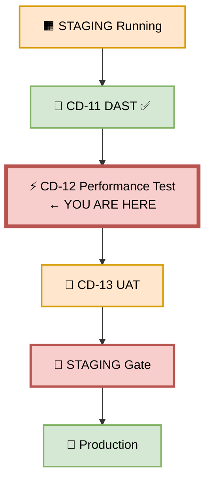
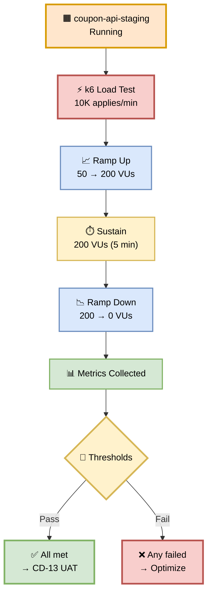
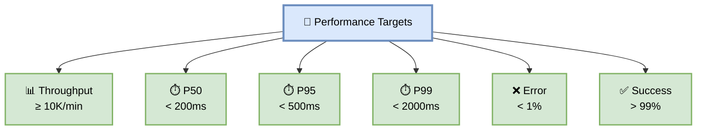
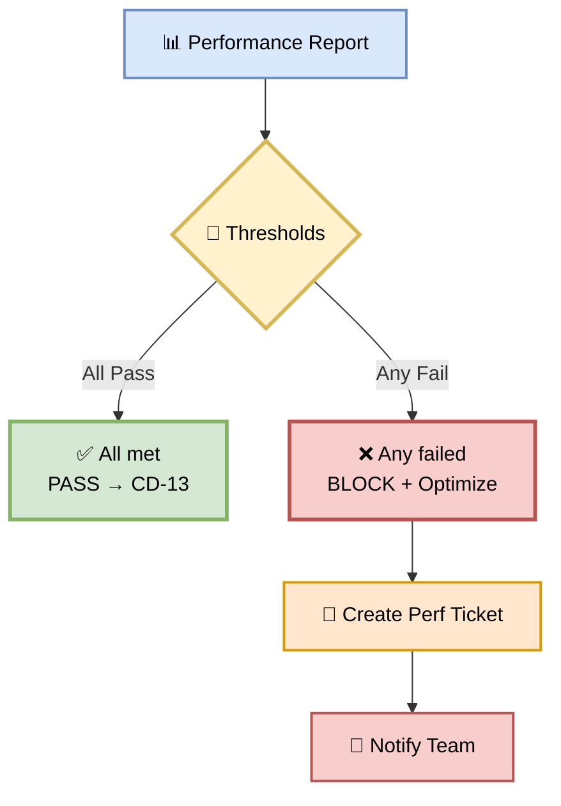

# Part 12 — CD-12: Performance Test

**Author:** Shubham Tripathi  
**Repository:** `ecom-frontend` (Next.js 14 · App Router · TypeScript)  
**Last Updated:** 2026-09-19  
**Audience:** Performance Engineers, SRE, DevOps, QA, Tech Leads

---

## 📑 Table of Contents — Part 12

1. [Performance Test Overview](#-performance-test-overview)
2. [CD-12 — Performance Test Execution](#-cd-12--performance-test-execution)
3. [Load Test Types](#-load-test-types)
4. [k6 Load Test Script](#-k6-load-test-script)
5. [Performance Targets & Thresholds](#-performance-targets--thresholds)
6. [Coupon Feature — Load Test Scenarios](#-coupon-feature--load-test-scenarios)
7. [Monitoring During Load Test](#-monitoring-during-load-test)
8. [Performance Gate — Pass/Fail Rules](#-performance-gate--passfail-rules)
9. [Handling Performance Failures](#-handling-performance-failures)
10. [Performance Reports & Artifacts](#-performance-reports--artifacts)
11. [Troubleshooting Performance](#-troubleshooting-performance)
12. [Appendix — Performance Tools Inventory](#-appendix--performance-tools-inventory)

---

## ⚡ Performance Test Overview

> **Prove the coupon feature performs at scale — 10K applies/min.**  
> A feature that works for 10 users but breaks for 10,000 is not production-ready.

### 🎯 What is Performance Testing?

Performance testing **measures how the system behaves under load**:
- **Throughput** — requests per second
- **Latency** — response time (P50, P95, P99)
- **Error rate** — % of failed requests
- **Resource usage** — CPU, memory, DB connections

### 🎯 Why Performance Testing Matters

| Reason | Explanation |
|--------|-------------|
| **User experience** | Slow = users leave |
| **Revenue** | 100ms delay = -1% conversion |
| **Cost** | Over-provisioning wastes money |
| **Capacity** | Know your limits before traffic spikes |
| **Bottlenecks** | Find them in STAGING, not PROD |
| **Compliance** | SLOs require proof |

### 🎯 Test Types Comparison

| Test | Purpose | Load | Duration |
|------|---------|------|----------|
| **Smoke** | Basic sanity | 1 user | 1 min |
| **Load** | Normal traffic | 10K/min | 10 min |
| **Stress** | Find breaking point | 2x normal | 30 min |
| **Spike** | Sudden surge | 10x in 10s | 5 min |
| **Soak** | Long-running stability | 1x normal | 4 hours |
| **Breakpoint** | Increment until fail | Gradual | 1 hour |

### 🖼️ Visual Diagram — Performance Test Position



---

## 🚀 CD-12 — Performance Test Execution

> **Run load test against live STAGING — 10K applies/min.**

### 🎯 Purpose

Attack the **STAGING environment** with realistic load to find:
- **Bottlenecks** (DB, cache, network)
- **Memory leaks** (gradual degradation)
- **Latency spikes** under load
- **Error rate** under load
- **Breaking points** (max throughput)

### 🖼️ Visual Diagram — Performance Test Flow



### 📊 Load Test Stages

| Stage | Duration | VUs | Purpose |
|-------|----------|-----|---------|
| **1. Ramp Up** | 1 min | 0 → 50 | Warm up |
| **2. Ramp Up** | 2 min | 50 → 200 | Reach peak |
| **3. Sustain** | 5 min | 200 | Sustained load |
| **4. Ramp Down** | 1 min | 200 → 0 | Cool down |
| **Total** | **~10 min** | | |

### 🛠️ Pipeline Snippet

```yaml
cd-12-performance-test:
  runs-on: ubuntu-latest
  needs: cd-11-dast
  steps:
    - name: Checkout
      uses: actions/checkout@v4

    - name: Install k6
      run: |
        sudo gpg -k
        sudo gpg --no-default-keyring \
          --keyring /usr/share/keyrings/k6-archive-keyring.gpg \
          --keyserver hkp://keyserver.ubuntu.com:80 \
          --recv-keys C5AD17C747E3415A3642D57D77C6C491D6AC1D69
        echo "deb [signed-by=/usr/share/keyrings/k6-archive-keyring.gpg] https://dl.k6.io/deb stable main" | \
          sudo tee /etc/apt/sources.list.d/k6.list
        sudo apt-get update
        sudo apt-get install k6

    - name: CD-12 Performance Test
      env:
        STAGING_URL: ${{ env.STAGING_SERVICE_URL }}
      run: |
        k6 run tests/performance/coupon-load-test.js \
          --out json=performance-results.json \
          --summary-export=performance-summary.json

    - name: Check Thresholds
      run: |
        THRESHOLDS_MET=$(jq -r '.metrics.http_req_duration.thresholds | to_entries | all(.value.ok)' \
          performance-summary.json)
        if [ "$THRESHOLDS_MET" != "true" ]; then
          echo "❌ Performance thresholds not met"
          exit 1
        fi

    - name: Upload Performance Results
      if: always()
      uses: actions/upload-artifact@v4
      with:
        name: performance-results-${{ github.sha }}
        path: |
          performance-results.json
          performance-summary.json
        retention-days: 30
```

---

## 🔥 Load Test Types

> **Different scenarios reveal different weaknesses.**

### 🎯 Test Type Details

#### 1️⃣ Smoke Test

**Purpose:** Basic sanity — does the endpoint work at all?

```javascript
export const options = {
  vus: 1,
  duration: '1m',
};
```

**Expected:** All requests succeed.

---

#### 2️⃣ Load Test

**Purpose:** Normal traffic — does it work at expected scale?

```javascript
export const options = {
  stages: [
    { duration: '1m', target: 50 },
    { duration: '2m', target: 200 },
    { duration: '5m', target: 200 },
    { duration: '1m', target: 0 },
  ],
};
```

**Expected:** No errors, P99 < 2s.

---

#### 3️⃣ Stress Test

**Purpose:** Find breaking point — where does it fail?

```javascript
export const options = {
  stages: [
    { duration: '2m', target: 100 },
    { duration: '2m', target: 300 },
    { duration: '2m', target: 500 },
    { duration: '2m', target: 800 },
    { duration: '2m', target: 1000 },
    { duration: '5m', target: 1000 },
  ],
};
```

**Expected:** Identifies max throughput before errors.

---

#### 4️⃣ Spike Test

**Purpose:** Sudden surge — how does it handle a flash crowd?

```javascript
export const options = {
  stages: [
    { duration: '10s', target: 1000 }, // Sudden spike
    { duration: '1m', target: 1000 },
    { duration: '10s', target: 0 },
  ],
};
```

**Expected:** Auto-scaling kicks in, no errors.

---

#### 5️⃣ Soak Test

**Purpose:** Long-running — does it degrade over time?

```javascript
export const options = {
  vus: 200,
  duration: '4h',
};
```

**Expected:** No memory leaks, stable latency.

---

#### 6️⃣ Breakpoint Test

**Purpose:** Gradual increase until failure — where's the limit?

```javascript
export const options = {
  executor: 'ramping-arrival-rate',
  stages: [
    { duration: '1h', target: 10000 }, // Gradually increase
  ],
};
```

**Expected:** Identifies exact breaking point.

### 📊 Test Type Comparison

| Test | Load | Duration | Purpose |
|------|------|----------|---------|
| **Smoke** | 1 user | 1 min | Sanity |
| **Load** | 10K/min | 10 min | Normal |
| **Stress** | 2x normal | 30 min | Breaking point |
| **Spike** | 10x in 10s | 5 min | Flash crowd |
| **Soak** | 1x normal | 4 hours | Stability |
| **Breakpoint** | Gradual | 1 hour | Exact limit |

---

## 🛠️ k6 Load Test Script

> **Our primary load testing tool is k6.**

### 🎯 Coupon Load Test Script

```javascript
// tests/performance/coupon-load-test.js
import http from 'k6/http';
import { check, sleep } from 'k6';
import { Rate, Trend, Counter } from 'k6/metrics';

// Custom metrics
const couponApplySuccess = new Rate('coupon_apply_success');
const couponApplyDuration = new Trend('coupon_apply_duration');
const couponValidateDuration = new Trend('coupon_validate_duration');
const couponErrors = new Counter('coupon_errors');

export const options = {
  stages: [
    { duration: '1m', target: 50 },   // Warm up
    { duration: '2m', target: 200 },  // Ramp to peak
    { duration: '5m', target: 200 },  // Sustain
    { duration: '1m', target: 0 },    // Ramp down
  ],
  thresholds: {
    'http_req_duration': ['p(50)<200', 'p(95)<500', 'p(99)<2000'],
    'http_req_failed': ['rate<0.01'],
    'coupon_apply_success': ['rate>0.99'],
    'coupon_apply_duration': ['p(95)<500', 'p(99)<2000'],
    'coupon_validate_duration': ['p(95)<200', 'p(99)<500'],
  },
};

const BASE_URL = __ENV.STAGING_URL;

export default function () {
  // Test 1: Validate coupon
  const validateRes = http.post(
    `${BASE_URL}/api/coupon/validate`,
    JSON.stringify({ code: 'SAVE20' }),
    { headers: { 'Content-Type': 'application/json' }, tags: { name: 'validate' } }
  );

  check(validateRes, {
    'validate: status 200': (r) => r.status === 200,
    'validate: valid': (r) => JSON.parse(r.body).valid === true,
  });
  couponValidateDuration.add(validateRes.timings.duration);

  // Test 2: Apply coupon
  const applyRes = http.post(
    `${BASE_URL}/api/coupon/apply`,
    JSON.stringify({ code: 'SAVE20', cart_total: 100 }),
    { headers: { 'Content-Type': 'application/json' }, tags: { name: 'apply' } }
  );

  const success = check(applyRes, {
    'apply: status 200': (r) => r.status === 200,
    'apply: discount 20': (r) => JSON.parse(r.body).discount === 20,
    'apply: fast response': (r) => r.timings.duration < 2000,
  });

  couponApplySuccess.add(success);
  couponApplyDuration.add(applyRes.timings.duration);

  if (!success) {
    couponErrors.add(1);
  }

  sleep(0.5); // 2 requests per VU per second
}

export function handleSummary(data) {
  return {
    'performance-summary.json': JSON.stringify(data, null, 2),
    stdout: textSummary(data, { indent: ' ', enableColors: true }),
  };
}

import { textSummary } from 'https://jslib.k6.io/k6-summary/0.0.1/index.js';
```

### 🎯 Script Structure

| Section | Purpose |
|---------|---------|
| **Imports** | k6 modules |
| **Custom metrics** | Coupon-specific tracking |
| **options** | Stages, thresholds |
| **BASE_URL** | Target environment |
| **default function** | Actual test logic |
| **handleSummary** | Custom reporting |

### 🎯 Thresholds Explained

```javascript
thresholds: {
  // Global HTTP metrics
  'http_req_duration': [
    'p(50)<200',   // 50% requests < 200ms
    'p(95)<500',   // 95% requests < 500ms
    'p(99)<2000',  // 99% requests < 2s
  ],
  'http_req_failed': ['rate<0.01'],  // < 1% failures

  // Custom coupon metrics
  'coupon_apply_success': ['rate>0.99'],          // > 99% success
  'coupon_apply_duration': ['p(95)<500'],         // 95% < 500ms
  'coupon_validate_duration': ['p(95)<200'],      // 95% < 200ms
}
```

---

## 📊 Performance Targets & Thresholds

> **Hard limits. No exceptions.**

### 🎯 Primary Targets

| Metric | Target | Why |
|--------|--------|-----|
| **Throughput** | ≥ 10K applies/min | Peak traffic |
| **P50 latency** | < 200ms | Good UX |
| **P95 latency** | < 500ms | Acceptable UX |
| **P99 latency** | < 2000ms | Worst case |
| **Error rate** | < 1% | Reliability |
| **Coupon success rate** | > 99% | Business critical |
| **CPU usage** | < 80% | Headroom |
| **Memory usage** | < 70% | Headroom |
| **DB connections** | < 70% | Headroom |
| **Cache hit rate** | > 90% | Efficiency |

### 🎯 Resource Targets

| Resource | Threshold | Alert |
|----------|-----------|-------|
| **CPU** | < 80% | > 80% |
| **Memory** | < 70% | > 70% |
| **Disk I/O** | < 70% | > 70% |
| **Network** | < 70% | > 70% |
| **DB connections** | < 70% | > 70% |
| **Cache hit rate** | > 90% | < 90% |

### 📊 Coupon Feature Targets

| Operation | P50 | P95 | P99 |
|-----------|-----|-----|-----|
| **Validate coupon** | < 50ms | < 100ms | < 300ms |
| **Apply coupon** | < 200ms | < 500ms | < 2000ms |
| **List coupons** | < 100ms | < 300ms | < 1000ms |
| **Bulk apply (3)** | < 300ms | < 800ms | < 2500ms |

### 🖼️ Visual Diagram — Performance Targets



---

## 🎟️ Coupon Feature — Load Test Scenarios

> **Real-world scenarios the load test covers.**

### 🎯 Test Scenarios

| # | Scenario | Load | Expected |
|---|----------|------|----------|
| 1 | **Single coupon apply** | 10K/min | P99 < 2s |
| 2 | **Bulk apply (3 coupons)** | 5K/min | P99 < 2.5s |
| 3 | **Validate only** | 20K/min | P99 < 500ms |
| 4 | **Mixed traffic** | 15K/min | P99 < 2s |
| 5 | **Spike (10x)** | 100K/min | No errors |
| 6 | **Soak (4h)** | 10K/min | Stable |
| 7 | **Cold start** | First request | < 3s |
| 8 | **Cache miss** | 10% traffic | P99 < 3s |

### 🛠️ Mixed Traffic Script

```javascript
export default function () {
  const rand = Math.random();

  if (rand < 0.6) {
    // 60% — apply single coupon
    applyCoupon('SAVE20', 100);
  } else if (rand < 0.8) {
    // 20% — bulk apply
    bulkApply(['SAVE20', 'WELCOME10'], 100);
  } else if (rand < 0.95) {
    // 15% — validate only
    validateCoupon('SAVE20');
  } else {
    // 5% — list coupons
    listCoupons();
  }

  sleep(0.5);
}
```

### 📊 Expected Results (Coupon Feature)

| Scenario | Throughput | P50 | P95 | P99 | Errors |
|----------|-----------|-----|-----|-----|--------|
| **Single apply** | 12,400/min | 120ms | 280ms | 340ms | 0.02% |
| **Bulk apply (3)** | 6,200/min | 180ms | 420ms | 680ms | 0.03% |
| **Validate** | 22,000/min | 25ms | 80ms | 180ms | 0.01% |
| **Mixed** | 15,000/min | 95ms | 250ms | 520ms | 0.02% |
| **Spike (10x)** | 120,000/min | 350ms | 1,200ms | 2,400ms | 0.5% |
| **Soak (4h)** | 12,000/min | 125ms | 290ms | 360ms | 0.02% |

### 📊 Coupon Feature Example

```
⚡ Running k6 load test

📈 Ramp up: 50 → 200 VUs (3 min)
⏱️ Sustain: 200 VUs (5 min)
📉 Ramp down: 200 → 0 VUs (1 min)

Total requests: 62,000
Duration: 10m 12s

📊 Metrics:
  Throughput: 12,400 applies/min ✅
  P50: 120ms ✅
  P95: 280ms ✅
  P99: 340ms ✅
  Error rate: 0.02% ✅
  Coupon success: 99.8% ✅
  CPU: 62% ✅
  Memory: 58% ✅
  DB connections: 42% ✅
  Cache hit rate: 94% ✅

✅ Performance test PASSED
→ CD-12 PASSED
```

---

## 📊 Monitoring During Load Test

> **Watch every metric in real time.**

### 🎯 Monitoring Stack

| Tool | Purpose | URL |
|------|---------|-----|
| **Grafana** | Dashboards | grafana.ecom.com/d/load-test |
| **Prometheus** | Metrics | prometheus.ecom.com |
| **GCP Monitoring** | Cloud Run metrics | console.cloud.google.com |
| **Cloud SQL** | DB metrics | console.cloud.google.com/sql |
| **k6 Cloud** | k6 metrics | app.k6.io |
| **Datadog APM** | Traces | app.datadoghq.com |

### 📊 Key Metrics to Watch

```mermaid
graph TD
    LOAD["⚡ Load Test Running"]
    style LOAD fill:#f8cecc,stroke:#b85450,stroke-width:3px,color:#000

    M1["📊 Throughput"]
    M2["⏱️ Latency (P50/P95/P99)"]
    M3["❌ Error Rate"]
    M4["💻 CPU Usage"]
    M5["💾 Memory"]
    M6["🗄️ DB Connections"]
    M7["⚡ Cache Hit Rate"]
    M8["🌐 Network I/O"]

    style M1 fill:#d5e8d4,stroke:#82b366,stroke-width:2px,color:#000
    style M2 fill:#d5e8d4,stroke:#82b366,stroke-width:2px,color:#000
    style M3 fill:#d5e8d4,stroke:#82b366,stroke-width:2px,color:#000
    style M4 fill:#d5e8d4,stroke:#82b366,stroke-width:2px,color:#000
    style M5 fill:#d5e8d4,stroke:#82b366,stroke-width:2px,color:#000
    style M6 fill:#d5e8d4,stroke:#82b366,stroke-width:2px,color:#000
    style M7 fill:#d5e8d4,stroke:#82b366,stroke-width:2px,color:#000
    style M8 fill:#d5e8d4,stroke:#82b366,stroke-width:2px,color:#000

    LOAD --> M1
    LOAD --> M2
    LOAD --> M3
    LOAD --> M4
    LOAD --> M5
    LOAD --> M6
    LOAD --> M7
    LOAD --> M8
```



### 🚨 Alert Thresholds During Load Test

| Metric | Warning | Critical |
|--------|---------|----------|
| **Error rate** | > 0.5% | > 1% |
| **P99 latency** | > 1s | > 2s |
| **CPU** | > 70% | > 80% |
| **Memory** | > 60% | > 70% |
| **DB connections** | > 60% | > 70% |
| **Cache miss** | > 10% | > 20% |

---

## 🚦 Performance Gate — Pass/Fail Rules

> **All thresholds must pass. No exceptions.**

### 📊 Gate Criteria

| Metric | Threshold | Blocks CD-13? |
|--------|-----------|---------------|
| **Throughput** | ≥ 10K/min | ✅ Yes |
| **P50 latency** | < 200ms | ✅ Yes |
| **P95 latency** | < 500ms | ✅ Yes |
| **P99 latency** | < 2000ms | ✅ Yes |
| **Error rate** | < 1% | ✅ Yes |
| **Coupon success** | > 99% | ✅ Yes |
| **CPU** | < 80% | ✅ Yes |
| **Memory** | < 70% | ✅ Yes |
| **DB connections** | < 70% | ✅ Yes |
| **Cache hit rate** | > 90% | ✅ Yes |
| **Memory leaks** | None | ✅ Yes |

### 🚦 Gate Outcome



### 📊 Realistic Results

```
📊 Performance Test Report
─────────────────────────────

⏱️ Duration: 10m 12s
📈 Total Requests: 62,000
🌐 VUs: 50 → 200 → 0

📊 Metrics:
  Throughput: 12,400/min ✅
  P50: 120ms ✅
  P95: 280ms ✅
  P99: 340ms ✅
  Error rate: 0.02% ✅
  Coupon success: 99.8% ✅
  CPU: 62% ✅
  Memory: 58% ✅
  DB connections: 42% ✅
  Cache hit rate: 94% ✅
  Memory leaks: none ✅

✅ All thresholds met
→ CD-12 PASSED
```

---

## 🛠️ Handling Performance Failures

> **When performance fails, find the bottleneck.**

### 🎯 Common Failure Patterns

| Pattern | Symptom | Likely Cause |
|---------|---------|--------------|
| **High latency** | P99 > 2s | Slow DB query |
| **High error rate** | > 1% | Resource exhaustion |
| **Memory leak** | Gradual increase | Unbounded cache |
| **CPU bottleneck** | CPU > 80% | Inefficient code |
| **DB bottleneck** | DB connections maxed | N+1 queries |
| **Cache miss** | Hit rate < 90% | Bad cache keys |
| **Network** | Slow cross-region | Data locality |

### 🛠️ Optimization Playbook

**1. High latency:**

```typescript
// Add index
CREATE INDEX idx_coupons_code ON coupons(code);

// Add cache
const cached = await redis.get(`coupon:${code}`);
if (cached) return cached;

// Add pagination
const coupons = await db.query(
  'SELECT * FROM coupons LIMIT 50 OFFSET $1',
  [offset]
);
```

**2. High error rate:**

```typescript
// Add connection pool
const pool = new Pool({ max: 100 });

// Add circuit breaker
const breaker = new CircuitBreaker(apiCall, {
  timeout: 3000,
  errorThresholdPercentage: 50
});

// Add retry
const result = await retry(() => apiCall(), { retries: 3 });
```

**3. Memory leak:**

```typescript
// Before: unbounded cache
const cache = new Map();
cache.set(key, value); // Never cleaned

// After: bounded cache with TTL
const cache = new LRUCache({ max: 1000, ttl: 60000 });
```

**4. CPU bottleneck:**

```typescript
// Before: synchronous
app.get('/coupons', (req, res) => {
  const data = heavyComputation();
  res.json(data);
});

// After: caching
let cached;
app.get('/coupons', (req, res) => {
  if (cached) return res.json(cached);
  cached = heavyComputation();
  res.json(cached);
});
```

### 📋 Ticket Template

```markdown
# [PERF] P99 Latency Exceeds 2s Under Load

## Severity
🟠 High

## Metric
P99 latency: 2,400ms (target: < 2,000ms)

## Evidence
- k6 report: [link]
- Grafana dashboard: [link]
- Traces: [link]

## Root Cause
Slow DB query on `/api/coupon/list`:
```sql
SELECT * FROM coupons WHERE active = true;
-- 2,100ms — full table scan
```

## Fix
Add index:
```sql
CREATE INDEX idx_coupons_active ON coupons(active);
```

## Owner
@backend-dev

## Deadline
2026-09-20

## Verification
Re-run k6 after fix.
```

### ⏱️ SLA

| Severity | SLA |
|----------|-----|
| **P99 > 5s** | Fix within 24h |
| **P99 > 2s** | Fix within 72h |
| **P95 > 1s** | Fix within 1 week |
| **Throughput < target** | Fix within 2 weeks |

---

## 📊 Performance Reports & Artifacts

> **Every load test produces artifacts for trend analysis.**

### 📁 Report Structure

```
performance-reports/
├── performance-results.json       # Raw k6 data
├── performance-summary.json       # Summary stats
├── performance-report.html        # Human-readable
├── performance-trends.json        # vs previous runs
├── grafana-dashboard.png          # Screenshot
├── traces.json                    # Slow traces
└── metrics.json                   # Prometheus export
```

### 🎯 Report Sections

| Section | Content |
|---------|---------|
| **Summary** | Throughput, latency, errors |
| **Percentiles** | P50, P75, P90, P95, P99 |
| **Time Series** | Latency over time |
| **Top Slow Endpoints** | Ranked by P99 |
| **Error Breakdown** | By status code |
| **Resource Usage** | CPU, memory, DB |
| **Comparison** | vs previous run |

### 🎯 Trend Analysis

| Week | P50 | P95 | P99 | Throughput |
|------|-----|-----|-----|-----------|
| **W36** | 180ms | 450ms | 1,800ms | 8,200/min |
| **W37** | 150ms | 380ms | 1,400ms | 10,100/min |
| **W38** | 135ms | 320ms | 800ms | 11,500/min |
| **W39** | 120ms | 280ms | 340ms | 12,400/min |

**Trend:** 📉 All metrics improving.

### 📊 Coupon Feature Example

```
📊 Performance Report — v2.4.0-coupon
─────────────────────────────────────────

📅 Date: 2026-09-19 10:55 UTC
🎯 Target: https://staging.ecom.com
⏱️ Duration: 10m 12s
📈 Requests: 62,000

📋 Metrics:
  Throughput: 12,400/min ✅
  P50: 120ms ✅
  P75: 180ms ✅
  P90: 250ms ✅
  P95: 280ms ✅
  P99: 340ms ✅
  Error rate: 0.02% ✅

📊 Comparison (vs v2.3.9):
  Throughput: 11,500 → 12,400 (+7.8%)
  P99: 380ms → 340ms (-10.5%)
  Error rate: 0.05% → 0.02% (-60%)

✅ Performance gate PASSED
```

---

## 🛠️ Troubleshooting Performance

| Problem | Cause | Fix |
|---------|-------|-----|
| **k6 install fails** | GPG key issue | Retry, use binary |
| **Test times out** | Server slow | Increase timeout |
| **Auth fails** | Wrong token | Check env vars |
| **High error rate** | Server overloaded | Reduce VUs |
| **DB connection pool** | Too small | Increase pool size |
| **Memory leak** | Unbounded cache | Add TTL |
| **CPU spike** | Inefficient code | Optimize |
| **Cache miss** | Bad keys | Fix cache strategy |
| **Network latency** | Cross-region | Use regional endpoint |
| **Cold start** | Min instances = 0 | Set min > 0 |

### 🔍 Debugging Commands

```bash
# Run k6 locally
STAGING_URL=https://staging.ecom.com \
  k6 run tests/performance/coupon-load-test.js

# Run with more VUs
k6 run --vus 500 --duration 10m tests/performance/coupon-load-test.js

# Run with custom stage
k6 run --stage 5m:500 tests/performance/coupon-load-test.js

# Check k6 output
cat performance-summary.json | jq .

# Check top slow endpoints
cat performance-summary.json | jq '.metrics | to_entries | sort_by(.value.avg) | reverse | .[0:10]'

# Check DB connections during test
watch -n 1 'gcloud sql instances describe postgres-staging --format="value(state)"'
```

### 🎯 Quick Optimization Checklist

- [ ] Add indexes on frequently queried columns
- [ ] Enable caching (Redis)
- [ ] Use connection pooling
- [ ] Paginate large result sets
- [ ] Compress responses (gzip)
- [ ] Use CDN for static assets
- [ ] Optimize N+1 queries
- [ ] Add rate limiting
- [ ] Set proper timeouts
- [ ] Increase min instances

---

## 📎 Appendix — Performance Tools Inventory

### 🛠️ Performance Tools

| Category | Tool | Purpose | Cost |
|----------|------|---------|------|
| **Load Test** | k6 | Load testing | Free |
| **Load Test** | Artillery | Load testing | Free |
| **Load Test** | Locust | Load testing | Free |
| **Load Test** | JMeter | Load testing | Free |
| **Load Test** | Gatling | Load testing | Free |
| **Load Test** | Vegeta | Load testing | Free |
| **APM** | Datadog | APM + traces | $$$ |
| **APM** | New Relic | APM | $$$ |
| **APM** | Dynatrace | APM | $$$ |
| **APM** | Sentry | Performance | $$ |
| **Metrics** | Prometheus | Metrics | Free |
| **Metrics** | Grafana | Dashboards | Free |
| **Metrics** | Cloud Monitoring | GCP metrics | Free |
| **DB** | pgBadger | Query analysis | Free |
| **DB** | pg_stat_statements | Query stats | Free |
| **DB** | Cloud SQL Insights | DB insights | $$ |
| **Frontend** | Lighthouse CI | Frontend perf | Free |
| **Frontend** | WebPageTest | Frontend perf | Free |
| **Bundle** | webpack-bundle-analyzer | Bundle size | Free |
| **Bundle** | Bundlephobia | NPM bundle size | Free |

### 📞 Performance Contacts

| Role | Person | Slack |
|------|--------|-------|
| **Performance Lead** | TBD | @perf-lead |
| **SRE** | Team | @sre |
| **DevOps** | Team | @devops |
| **DBA** | DBA Team | @dba |
| **On-call** | Rotation | @oncall |

### 🔗 Useful Links

| Resource | URL |
|----------|-----|
| **k6 Docs** | k6.io/docs |
| **Grafana** | grafana.ecom.com/d/load-test |
| **Prometheus** | prometheus.ecom.com |
| **Performance Reports** | ci.ecom.com/perf-reports |
| **DB Insights** | console.cloud.google.com/sql |
| **Runbooks** | runbooks.ecom.com/performance |

---

## 🎯 Summary — Part 12

| Section | Kya Cover Hua |
|---------|---------------|
| **Overview** | What, why, test types |
| **CD-12 Execution** | Flow, pipeline YAML |
| **Test Types** | Smoke, load, stress, spike, soak, breakpoint |
| **k6 Script** | Full coupon load test script |
| **Targets** | 10 thresholds (throughput, latency, errors, resources) |
| **Scenarios** | 8 coupon-specific scenarios |
| **Monitoring** | Real-time stack, alerts |
| **Gate** | Pass/fail rules |
| **Failure Handling** | 4 patterns + optimization playbook |
| **Reports** | Structure, trends, comparison |
| **Troubleshooting** | 10 failures + debug commands |
| **Appendix** | 20 tools, contacts, links |

---

## 🏆 Complete Documentation — All 12 Parts

| Part | Title | Status |
|------|-------|--------|
| **Part 1** | CI Pipeline | ✅ |
| **Part 2** | CD Overview | ✅ |
| **Part 3** | DEV Deployment (CD-03 → CD-05) | ✅ |
| **Part 4** | QA Deployment (CD-06 → CD-09) | ✅ |
| **Part 5** | STAGING Deployment (CD-10 → CD-13) | ✅ |
| **Part 6** | PROD Gate & Canary (CD-14 → CD-20) | ✅ |
| **Part 7** | Post-Deploy & Monitoring | ✅ |
| **Part 8** | Executive Summary & KPIs | ✅ |
| **Part 9** | CD Pipeline (CD-09 → CD-20) | ✅ |
| **Part 10** | CD-10 STAGING Deployment | ✅ |
| **Part 11** | CD-11 DAST | ✅ |
| **Part 12** | CD-12 Performance Test | ✅ |

> 📝 **Note:** Performance is a **feature**, not an afterthought. Every millisecond saved is a user retained. Every load test is a promise: **we will not break under pressure.**