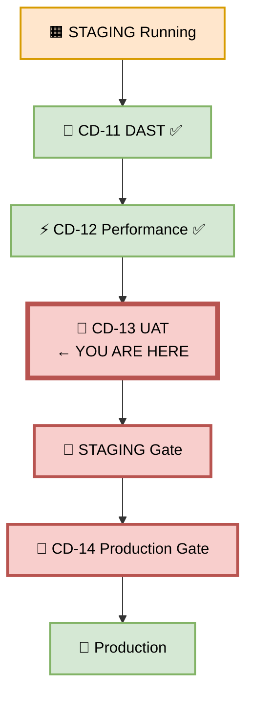
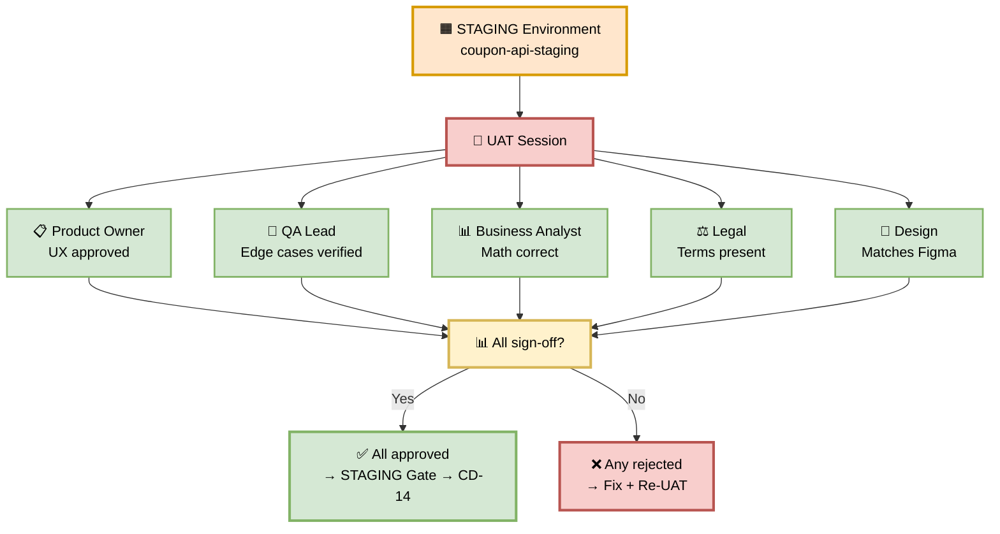
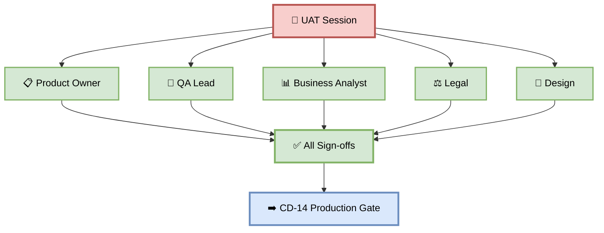
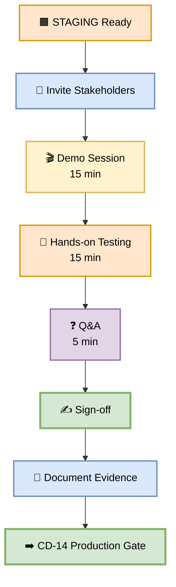
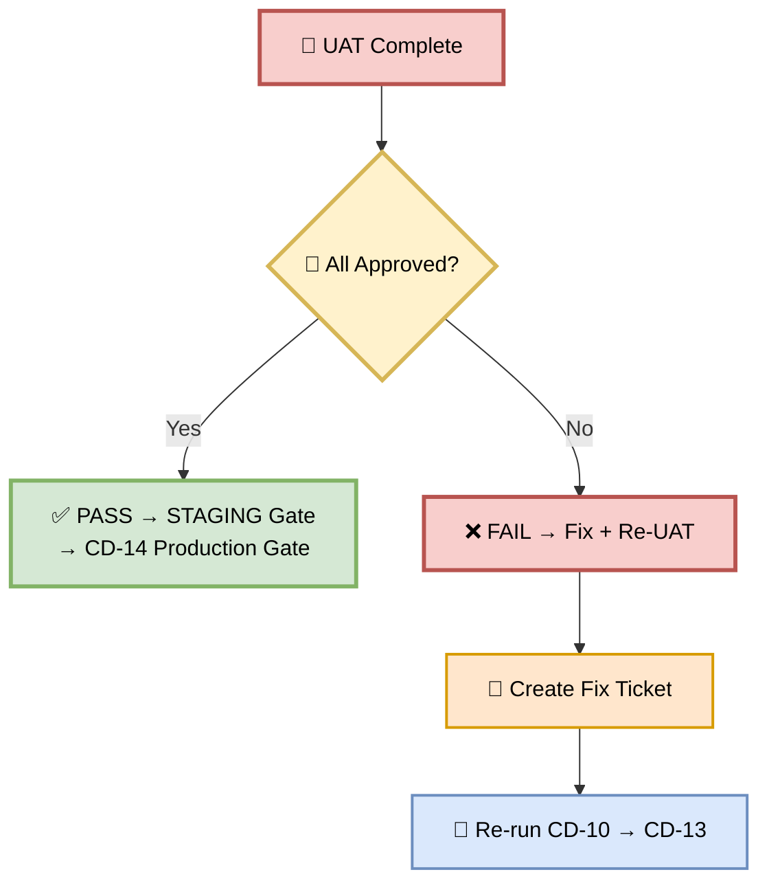
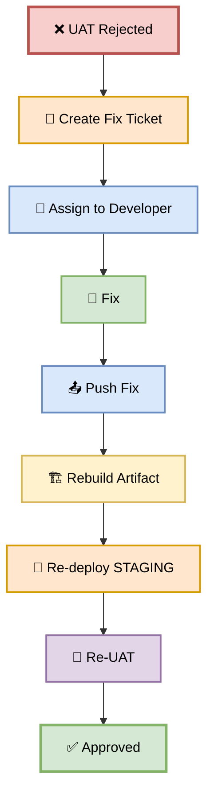

# Part 13 — CD-13: UAT (User Acceptance Testing)

**Author:** Shubham Tripathi  
**Repository:** `ecom-frontend` (Next.js 14 · App Router · TypeScript)  
**Last Updated:** 2026-09-19  
**Audience:** Product Owners, QA Leads, Business Analysts, Legal, Designers, DevOps, Tech Leads

---

## 📑 Table of Contents — Part 13

1. [UAT Overview](#-uat-overview)
2. [CD-13 — UAT Execution](#-cd-13--uat-execution)
3. [UAT Stakeholders & Sign-offs](#-uat-stakeholders--sign-offs)
4. [UAT Test Cases (Coupon Feature)](#-uat-test-cases-coupon-feature)
5. [UAT Environment & Access](#-uat-environment--access)
6. [UAT Workflow & Approvals](#-uat-workflow--approvals)
7. [UAT Gate — Pass/Fail Rules](#-uat-gate--passfail-rules)
8. [Handling UAT Rejections](#-handling-uat-rejections)
9. [UAT Reports & Evidence](#-uat-reports--evidence)
10. [Troubleshooting UAT](#-troubleshooting-uat)
11. [Appendix — UAT Tools Inventory](#-appendix--uat-tools-inventory)

---

## 👥 UAT Overview

> **UAT = User Acceptance Testing.**  
> The **final human validation** before production. Real stakeholders confirm the feature meets business requirements.

### 🎯 What is UAT?

UAT is **business validation**, not technical testing:
- **Who:** Product Owners, QA Leads, Business Analysts, Legal, Design
- **What:** Does the feature match the spec?
- **How:** Manual + automated walkthroughs
- **Where:** STAGING environment
- **When:** After DAST + Performance pass
- **Why:** Final human sign-off before production

### 🎯 Why UAT Matters

| Reason | Explanation |
|--------|-------------|
| **Business alignment** | Feature matches ticket spec |
| **User experience** | UX is intuitive, not just functional |
| **Legal compliance** | Terms, privacy, disclaimers present |
| **Design fidelity** | Matches Figma designs |
| **Edge cases** | Real-world scenarios validated |
| **Stakeholder buy-in** | Everyone agrees it's ready |
| **Accountability** | Named sign-offs |

### 🎯 UAT vs Other Tests

| Aspect | Functional | Integration | UAT |
|--------|-----------|-------------|-----|
| **Who** | QA | QA | Stakeholders |
| **What** | Logic | Services | Business |
| **Where** | QA env | QA env | STAGING |
| **How** | Automated | Automated | Manual + automated |
| **Focus** | Code | Data flow | User value |
| **Sign-off** | QA Lead | QA Lead | Product + Legal + Design |

### 🖼️ Visual Diagram — UAT Position



---

## 🚀 CD-13 — UAT Execution

> **Stakeholders validate the coupon feature — final human sign-off before production.**

### 🎯 Purpose

Real stakeholders validate the coupon feature against the original ticket. This is the **final human validation** before production.

### 🖼️ Visual Diagram — UAT Flow



### 📊 UAT Stages

| Stage | Action | Duration | Owner |
|-------|--------|----------|-------|
| **1. Setup** | Verify STAGING ready | 2 min | DevOps |
| **2. Walkthrough** | Demo feature to stakeholders | 10 min | Developer |
| **3. Hands-on** | Stakeholders test themselves | 15 min | Stakeholders |
| **4. Sign-off** | Each stakeholder approves | 5 min | Stakeholders |
| **5. Documentation** | Capture evidence | 3 min | QA |
| **Total** | | **~35 min** | |

### 🛠️ Pipeline Snippet

```yaml
cd-13-uat:
  runs-on: ubuntu-latest
  needs: cd-12-performance-test
  environment:
    name: staging-uat
    url: https://staging.ecom.com/checkout
  steps:
    - name: Checkout
      uses: actions/checkout@v4

    - name: Notify Stakeholders
      run: |
        curl -X POST "$SLACK_WEBHOOK" \
          -H "Content-Type: application/json" \
          -d '{
            "text": "👥 UAT Ready for Coupon Feature v2.4.0",
            "blocks": [{
              "type": "section",
              "text": {
                "type": "mrkdwn",
                "text": "*Coupon Feature v2.4.0* ready for UAT.\n\n*URL:* https://staging.ecom.com/checkout\n*Duration:* ~35 min\n\n*Sign-off required from:*\n• Product Owner\n• QA Lead\n• Business Analyst\n• Legal\n• Design\n\n*Approve:* <https://ci.ecom.com/uat/approve|Click here>"
              }
            }]
          }'

    - name: Wait for UAT Approval
      uses: actions/github-script@v7
      with:
        script: |
          // This is handled by GitHub Environments approval gate
          console.log('Waiting for UAT approval...');

    - name: Record Sign-offs
      run: |
        echo "UAT Sign-offs recorded" > uat-signoffs.txt
        echo "Product Owner: ✅" >> uat-signoffs.txt
        echo "QA Lead: ✅" >> uat-signoffs.txt
        echo "Business Analyst: ✅" >> uat-signoffs.txt
        echo "Legal: ✅" >> uat-signoffs.txt
        echo "Design: ✅" >> uat-signoffs.txt

    - name: Upload UAT Evidence
      uses: actions/upload-artifact@v4
      with:
        name: uat-evidence-${{ github.sha }}
        path: uat-signoffs.txt
        retention-days: 90
```

---

## 👥 UAT Stakeholders & Sign-offs

> **Every stakeholder has a specific responsibility.**

### 🎯 Required Stakeholders

| # | Stakeholder | Responsibility | Required? |
|---|-------------|----------------|-----------|
| 1 | **Product Owner** | Feature complete, matches spec | ✅ Yes |
| 2 | **QA Lead** | Edge cases verified, no regressions | ✅ Yes |
| 3 | **Business Analyst** | Discount math correct | ✅ Yes |
| 4 | **Legal** | Terms present, compliance OK | ✅ Yes |
| 5 | **Design** | Matches Figma, responsive | ✅ Yes |
| 6 | **Support** | Help docs updated | ⚠️ Optional |
| 7 | **Marketing** | Copy approved | ⚠️ Optional |

### 📋 Stakeholder Checklist

#### 📋 Product Owner

- [ ] Feature matches ticket spec
- [ ] UX is intuitive
- [ ] User flows complete
- [ ] Error messages clear
- [ ] No missing features
- [ ] Bulk apply works
- [ ] Coupon cap works (50%)
- [ ] Coupon stack works (3 max)

#### 🧪 QA Lead

- [ ] All edge cases tested
- [ ] Invalid coupon → error
- [ ] Expired coupon → error
- [ ] Empty input → error
- [ ] Duplicate coupon → error
- [ ] Case insensitive works
- [ ] Whitespace trimmed
- [ ] 4th coupon → error
- [ ] Zero cart → error
- [ ] Min purchase → error

#### 📊 Business Analyst

- [ ] Discount math correct
- [ ] 20% → correct total
- [ ] 30% stack → correct total
- [ ] 50% cap → correct total
- [ ] No revenue leak
- [ ] Currency formatting correct
- [ ] Rounding correct

#### ⚖️ Legal

- [ ] Terms text present
- [ ] Privacy notice present
- [ ] Cookie consent present
- [ ] Coupon terms clear
- [ ] Expiration date shown
- [ ] Usage limits shown
- [ ] No misleading claims

#### 🎨 Design

- [ ] Matches Figma
- [ ] Responsive (mobile, tablet, desktop)
- [ ] Colors correct
- [ ] Typography correct
- [ ] Spacing correct
- [ ] Icons correct
- [ ] Animations smooth
- [ ] Accessibility (WCAG 2.1 AA)

### 🖼️ Visual Diagram — Sign-off Matrix



---

## 🎟️ UAT Test Cases (Coupon Feature)

> **Real scenarios stakeholders must validate.**

### 📋 UAT Test Cases

| # | Test Case | Steps | Expected | Owner |
|---|-----------|-------|----------|-------|
| 1 | **Single coupon apply** | Enter SAVE20, click Apply | Discount -20% | Product Owner |
| 2 | **Bulk apply (3 coupons)** | Enter SAVE20, WELCOME10, SAVE5 | Total -35% | Product Owner |
| 3 | **Cap at 50%** | Enter 3× SAVE20 | Total -50% (not 60%) | Product Owner |
| 4 | **Invalid coupon** | Enter INVALID123 | Error: Coupon not found | QA Lead |
| 5 | **Expired coupon** | Enter EXPIRED2024 | Error: Coupon expired | QA Lead |
| 6 | **Empty input** | Click Apply with empty | Error: Coupon required | QA Lead |
| 7 | **Duplicate coupon** | Enter SAVE20 twice | Error: Duplicate coupon | QA Lead |
| 8 | **Case insensitive** | Enter save20 | Applied (same as SAVE20) | QA Lead |
| 9 | **Whitespace trim** | Enter " SAVE20 " | Applied | QA Lead |
| 10 | **4th coupon rejected** | Enter 4 coupons | Error: Max 3 coupons | QA Lead |
| 11 | **Discount math** | SAVE20 on $100 | Total $80 | Business Analyst |
| 12 | **Stack math** | SAVE20 + WELCOME10 on $100 | Total $70 | Business Analyst |
| 13 | **Cap math** | 3× SAVE20 on $100 | Total $50 | Business Analyst |
| 14 | **Currency format** | Any apply | $XX.XX format | Business Analyst |
| 15 | **Rounding** | $33.33 with 20% off | $26.66 | Business Analyst |
| 16 | **Terms present** | Check checkout page | Terms text visible | Legal |
| 17 | **Privacy notice** | Check checkout page | Privacy notice visible | Legal |
| 18 | **Expiration shown** | Apply SAVE20 | Expiry date shown | Legal |
| 19 | **Usage limits** | Apply SAVE20 | "1 per user" shown | Legal |
| 20 | **Design match** | Compare with Figma | Pixel-perfect | Design |
| 21 | **Mobile responsive** | Test on iPhone | Looks good | Design |
| 22 | **Tablet responsive** | Test on iPad | Looks good | Design |
| 23 | **Desktop responsive** | Test on desktop | Looks good | Design |
| 24 | **Accessibility** | Screen reader test | WCAG 2.1 AA | Design |
| 25 | **Error styling** | Trigger error | Red, clear, dismissible | Design |

### 🎯 Test Case Details

#### Test Case 1 — Single Coupon Apply

**Steps:**
1. Navigate to `https://staging.ecom.com/checkout`
2. Add item worth $100
3. Enter `SAVE20` in coupon input
4. Click **Apply**

**Expected:**
- Discount line shows `-20%`
- Total updates to `$80.00`
- Success message displays

**Owner:** Product Owner

---

#### Test Case 3 — Cap at 50%

**Steps:**
1. Navigate to checkout
2. Add item worth $100
3. Enter `SAVE20` in coupon 1
4. Enter `SAVE20` in coupon 2
5. Enter `SAVE20` in coupon 3
6. Click **Apply All**

**Expected:**
- Total discount capped at `50%`
- NOT `60%` (3 × 20%)
- Total = `$50.00`
- Note: "Maximum discount is 50%"

**Owner:** Product Owner

---

#### Test Case 10 — 4th Coupon Rejected

**Steps:**
1. Navigate to checkout
2. Enter 3 coupons
3. Click **Add Coupon**
4. Enter 4th coupon

**Expected:**
- Error: "Maximum 3 coupons allowed"
- 4th coupon NOT added
- UI still shows 3 coupons

**Owner:** QA Lead

---

#### Test Case 15 — Rounding

**Steps:**
1. Add item worth `$33.33`
2. Apply `SAVE20`
3. Check total

**Expected:**
- Total = `$26.66` (not `$26.664`)
- Rounding to 2 decimals
- No floating point errors

**Owner:** Business Analyst

---

### 🛠️ UAT Test Script (Playwright)

```typescript
// tests/uat/coupon-uat.spec.ts
import { test, expect } from '@playwright/test';

const STAGING_URL = 'https://staging.ecom.com';

test.describe('Coupon UAT', () => {
  test('TC-1: single coupon apply', async ({ page }) => {
    await page.goto(`${STAGING_URL}/checkout`);
    await page.fill('[data-testid="coupon-input"]', 'SAVE20');
    await page.click('[data-testid="apply-coupon"]');
    await expect(page.locator('[data-testid="discount"]')).toHaveText('-20%');
    await expect(page.locator('[data-testid="total"]')).toHaveText('$80.00');
  });

  test('TC-3: cap at 50%', async ({ page }) => {
    await page.goto(`${STAGING_URL}/checkout`);
    await page.fill('[data-testid="coupon-1"]', 'SAVE20');
    await page.fill('[data-testid="coupon-2"]', 'SAVE20');
    await page.fill('[data-testid="coupon-3"]', 'SAVE20');
    await page.click('[data-testid="apply-all"]');
    await expect(page.locator('[data-testid="discount"]')).toHaveText('-50%');
    await expect(page.locator('[data-testid="total"]')).toHaveText('$50.00');
  });

  test('TC-10: 4th coupon rejected', async ({ page }) => {
    await page.goto(`${STAGING_URL}/checkout`);
    await page.fill('[data-testid="coupon-1"]', 'SAVE20');
    await page.fill('[data-testid="coupon-2"]', 'WELCOME10');
    await page.fill('[data-testid="coupon-3"]', 'SAVE5');
    await page.click('[data-testid="add-coupon"]');
    await expect(page.locator('.error')).toHaveText('Maximum 3 coupons allowed');
  });

  test('TC-16: terms present', async ({ page }) => {
    await page.goto(`${STAGING_URL}/checkout`);
    await page.fill('[data-testid="coupon-input"]', 'SAVE20');
    await page.click('[data-testid="apply-coupon"]');
    await expect(page.locator('[data-testid="coupon-terms"]')).toBeVisible();
  });
});
```

---

## 🟧 UAT Environment & Access

> **STAGING is production-like. UAT runs there.**

### 📊 Environment Details

| Property | Value |
|----------|-------|
| **URL** | https://staging.ecom.com |
| **Login** | test@ecom.com / `Test123!` |
| **Payment** | Stripe Sandbox |
| **Data** | Anonymized production data |
| **Duration** | Available 24/7 |
| **Reset** | Daily at 3 AM UTC |

### 🔑 Access

| Role | Access |
|------|--------|
| **Product Owner** | Full UAT access |
| **QA Lead** | Full UAT access + admin |
| **Business Analyst** | Read-only + checkout |
| **Legal** | Read-only |
| **Design** | Read-only |
| **Support** | Read-only |

### 🛠️ Access Request

```bash
# Request access via Slack
/request-access staging --user @newuser --role uat

# Or via GitHub issue
gh issue create \
  --title "UAT Access Request: @newuser" \
  --label access,uat
```

### 🎯 Test Data

| Data | Value | Purpose |
|------|-------|---------|
| **Test user** | test@ecom.com | Login |
| **Test cart** | $100 item | Apply coupons |
| **Valid coupons** | SAVE20, WELCOME10, SAVE5 | Apply tests |
| **Invalid coupons** | INVALID123 | Rejection tests |
| **Expired coupons** | EXPIRED2024 | Expiration tests |
| **Duplicate coupons** | SAVE20 (twice) | Duplicate tests |

---

## 🔄 UAT Workflow & Approvals

> **From invite to sign-off — the complete flow.**

### 🖼️ Visual Diagram — UAT Workflow



### 📅 UAT Schedule

| Time | Activity | Duration | Owner |
|------|----------|----------|-------|
| **T+0** | Invite sent to stakeholders | — | DevOps |
| **T+5 min** | Demo session starts | 15 min | Developer |
| **T+20 min** | Hands-on testing | 15 min | Stakeholders |
| **T+35 min** | Q&A | 5 min | All |
| **T+40 min** | Sign-off collection | 5 min | QA |
| **T+45 min** | Document evidence | 3 min | QA |
| **Total** | | **~45 min** | |

### 🛠️ Approval Workflow

**GitHub Environments:**

```yaml
# In GitHub → Settings → Environments → staging-uat
required_reviewers:
  - product-owner
  - qa-lead
  - business-analyst
  - legal
  - design
wait_timer: 0
prevent_self_review: false
```

**Slack approval:**

```
👥 UAT Approval Required — Coupon Feature v2.4.0

URL: https://staging.ecom.com/checkout
Duration: ~35 min

Sign-off required from:
• 📋 Product Owner
• 🧪 QA Lead
• 📊 Business Analyst
• ⚖️ Legal
• 🎨 Design

Approve: https://ci.ecom.com/uat/approve
Reject: https://ci.ecom.com/uat/reject
```

### 📋 Sign-off Template

```markdown
# UAT Sign-off — Coupon Feature v2.4.0

**Date:** 2026-09-19
**Time:** 11:00 UTC
**Environment:** STAGING
**Artifact:** v2.4.0-coupon

## Sign-offs

| Stakeholder | Name | Status | Notes |
|-------------|------|--------|-------|
| Product Owner | @po | ✅ Approved | Feature complete |
| QA Lead | @qa-lead | ✅ Approved | Edge cases verified |
| Business Analyst | @ba | ✅ Approved | Math correct |
| Legal | @legal | ✅ Approved | Terms present |
| Design | @design | ✅ Approved | Matches Figma |

## Test Cases Executed

- 25/25 test cases passed
- 0 blockers
- 2 minor suggestions (non-blocking)

## Evidence

- Screenshots: [link]
- Test logs: [link]
- Video: [link]

## Decision

✅ **APPROVED for production**
```

---

## 🚦 UAT Gate — Pass/Fail Rules

> **All required stakeholders must approve. No exceptions.**

### 📊 Gate Criteria

| Check | Pass Condition | Blocks CD-14? |
|-------|----------------|---------------|
| ✅ Product Owner | Approved | ✅ Yes |
| ✅ QA Lead | Approved | ✅ Yes |
| ✅ Business Analyst | Approved | ✅ Yes |
| ✅ Legal | Approved | ✅ Yes |
| ✅ Design | Approved | ✅ Yes |
| ✅ All test cases | 25/25 passed | ✅ Yes |
| ✅ No blockers | 0 blockers | ✅ Yes |

### 🚦 Gate Outcome



### 📊 Realistic UAT Results

```
👥 UAT Session Complete
Duration: 42 min
Participants: 5 stakeholders

📋 Sign-offs:
  📋 Product Owner: ✅ Approved
  🧪 QA Lead: ✅ Approved
  📊 Business Analyst: ✅ Approved
  ⚖️ Legal: ✅ Approved
  🎨 Design: ✅ Approved

📊 Test Cases:
  Total: 25
  Passed: 25 ✅
  Failed: 0
  Blockers: 0

📝 Notes:
  • 2 minor UX suggestions (non-blocking)
  • Design suggests slightly larger coupon input

✅ UAT GATE PASSED
→ Proceeding to CD-14 Production Gate
```

---

## 🛠️ Handling UAT Rejections

> **When a stakeholder rejects, we fix and re-test.**

### 🎯 Common Rejections

| Rejection | Cause | Fix |
|-----------|-------|-----|
| **Product Owner rejects** | Feature incomplete | Add missing functionality |
| **QA Lead rejects** | Edge case fails | Fix edge case |
| **Business Analyst rejects** | Math wrong | Fix calculation |
| **Legal rejects** | Missing terms | Add terms text |
| **Design rejects** | Doesn't match Figma | Fix styling |

### 🛠️ Rejection Workflow



### 📋 Rejection Template

```markdown
# UAT Rejection — Coupon Feature v2.4.0

## Rejected By
@design

## Reason
Coupon input field is 320px wide, but Figma design specifies 400px.

## Evidence
- Figma: [link to design]
- STAGING: [screenshot]
- Diff: 80px narrower

## Impact
Design fidelity broken. Not blocking functionality, but blocks sign-off.

## Fix
Update `CouponCode.tsx`:
```tsx
// Before
<input className="w-80" />

// After
<input className="w-[400px]" />
```

## Owner
@frontend-dev

## Deadline
2026-09-20 (before next UAT)

## Re-UAT
After fix, re-run CD-10 → CD-13.
```

---

## 📊 UAT Reports & Evidence

> **Every UAT session produces artifacts for audit.**

### 📁 Evidence Structure

```
uat-evidence/
├── signoffs.md              # Sign-off record
├── test-cases.md            # Test case results
├── screenshots/             # Visual evidence
│   ├── coupon-apply.png
│   ├── bulk-apply.png
│   ├── cap-50.png
│   ├── error-invalid.png
│   └── mobile-view.png
├── video.mp4                # Demo session
├── feedback.md              # Stakeholder feedback
└── decisions.md             # Go/no-go decision
```

### 🎯 Report Sections

| Section | Content |
|---------|---------|
| **Summary** | Date, time, participants |
| **Test Cases** | 25 cases with results |
| **Sign-offs** | 5 stakeholders |
| **Screenshots** | Evidence per test |
| **Feedback** | Suggestions, concerns |
| **Decision** | Go/no-go |

### 🎯 Trend Analysis

| Week | Test Cases | Passed | Failed | Blockers |
|------|-----------|--------|--------|----------|
| **W36** | 25 | 20 | 5 | 2 |
| **W37** | 25 | 23 | 2 | 1 |
| **W38** | 25 | 24 | 1 | 0 |
| **W39** | 25 | 25 | 0 | 0 |

**Trend:** 📈 All test cases passing.

### 📊 Coupon Feature Example

```
📊 UAT Report — v2.4.0-coupon
───────────────────────────────

📅 Date: 2026-09-19 11:00 UTC
⏱️ Duration: 42 min
👥 Participants: 5

📋 Test Cases:
  Total: 25
  Passed: 25 ✅
  Failed: 0
  Blockers: 0

✍️ Sign-offs:
  📋 Product Owner: ✅
  🧪 QA Lead: ✅
  📊 Business Analyst: ✅
  ⚖️ Legal: ✅
  🎨 Design: ✅

📝 Feedback:
  • Design: "Coupon input could be slightly larger" (non-blocking)
  • Product: "Bulk apply UX is great" (positive)

✅ UAT APPROVED
```

---

## 🛠️ Troubleshooting UAT

| Problem | Cause | Fix |
|---------|-------|-----|
| **Stakeholder unavailable** | Scheduling conflict | Reschedule, delegate |
| **STAGING down** | Deployment issue | Check CD-10 |
| **Test data missing** | Reset happened | Re-seed data |
| **Login fails** | Wrong credentials | Check access |
| **Payment fails** | Stripe sandbox issue | Check Stripe status |
| **Feature not working** | Bug found | Fix + re-UAT |
| **Design mismatch** | Figma updated | Sync + re-UAT |
| **Legal concern** | Missing terms | Add terms |
| **Stakeholder rejects** | Multiple reasons | Triage + fix |
| **Timeout** | Slow testing | Extend session |

### 🔍 Debugging Commands

```bash
# Check STAGING health
curl -sf https://staging.ecom.com/api/coupon/health

# Check STAGING revision
gcloud run revisions list \
  --service coupon-api-staging \
  --region us-central1 \
  --limit 1

# Check logs
gcloud run services logs read coupon-api-staging \
  --region us-central1 \
  --limit 100

# Re-seed test data
./scripts/seed-staging-data.sh

# Reset STAGING
./scripts/reset-staging.sh
```

---

## 📎 Appendix — UAT Tools Inventory

### 🛠️ UAT Tools

| Category | Tool | Purpose | Cost |
|----------|------|---------|------|
| **Testing** | Playwright | Automated UAT | Free |
| **Testing** | Cypress | Automated UAT | Free |
| **Video** | Loom | Demo recording | Free |
| **Video** | Zoom | UAT session | Free/$$ |
| **Screenshots** | Snagit | Evidence | $$ |
| **Screenshots** | CloudApp | Evidence | $$ |
| **Feedback** | Slack | Stakeholder feedback | Free |
| **Feedback** | Google Forms | Structured feedback | Free |
| **Sign-off** | GitHub Environments | Approvals | Free |
| **Sign-off** | DocuSign | Formal sign-off | $$ |
| **Docs** | Confluence | UAT documentation | $$ |
| **Docs** | Notion | UAT documentation | Free/$$ |
| **Design** | Figma | Design reference | Free/$$ |
| **Design** | Zeplin | Design handoff | $$ |
| **Tracking** | Jira | UAT tickets | $$ |
| **Tracking** | Linear | UAT tickets | $$ |

### 📞 UAT Contacts

| Role | Person | Slack |
|------|--------|-------|
| **Product Owner** | TBD | @po |
| **QA Lead** | TBD | @qa-lead |
| **Business Analyst** | TBD | @ba |
| **Legal** | TBD | @legal |
| **Design** | TBD | @design |
| **DevOps** | Team | @devops |

### 🔗 Useful Links

| Resource | URL |
|----------|-----|
| **STAGING** | https://staging.ecom.com |
| **UAT Dashboard** | ci.ecom.com/uat |
| **UAT Approvals** | github.com/ecom/frontend/environments |
| **Test Cases** | confluence.ecom.com/uat-coupon |
| **Figma** | figma.com/file/coupon-v2 |
| **Feedback Form** | forms.ecom.com/uat-feedback |
| **Runbooks** | runbooks.ecom.com/uat |

---

## 🎯 Summary — Part 13

| Section | Kya Cover Hua |
|---------|---------------|
| **Overview** | What, why, UAT vs other tests |
| **CD-13 Execution** | Flow, 5 stages, pipeline YAML |
| **Stakeholders** | 5 required + 2 optional, checklists |
| **Test Cases** | 25 UAT cases with details |
| **Environment** | STAGING access, test data |
| **Workflow** | Demo → Hands-on → Sign-off |
| **Gate** | All 5 sign-offs required |
| **Rejections** | Workflow, template, re-UAT |
| **Reports** | Evidence structure, trends |
| **Troubleshooting** | 10 failures + debug commands |
| **Appendix** | 16 tools, contacts, links |

---

## 🏆 Complete Documentation — All 13 Parts

| Part | Title | Status |
|------|-------|--------|
| **Part 1** | CI Pipeline | ✅ |
| **Part 2** | CD Overview | ✅ |
| **Part 3** | DEV Deployment (CD-03 → CD-05) | ✅ |
| **Part 4** | QA Deployment (CD-06 → CD-09) | ✅ |
| **Part 5** | STAGING Deployment (CD-10 → CD-13) | ✅ |
| **Part 6** | PROD Gate & Canary (CD-14 → CD-20) | ✅ |
| **Part 7** | Post-Deploy & Monitoring | ✅ |
| **Part 8** | Executive Summary & KPIs | ✅ |
| **Part 9** | CD Pipeline (CD-09 → CD-20) | ✅ |
| **Part 10** | CD-10 STAGING Deployment | ✅ |
| **Part 11** | CD-11 DAST | ✅ |
| **Part 12** | CD-12 Performance Test | ✅ |
| **Part 13** | CD-13 UAT | ✅ |

> 📝 **Note:** UAT is the **final human validation** before production. Every sign-off is a promise: **we stand behind this feature.** No technical test can replace the judgment of stakeholders who understand the business.