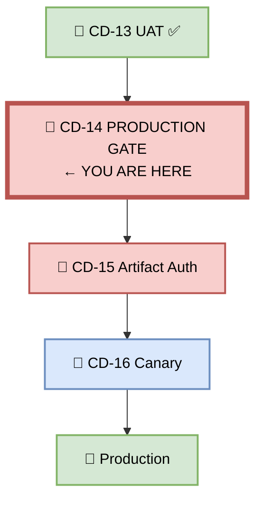
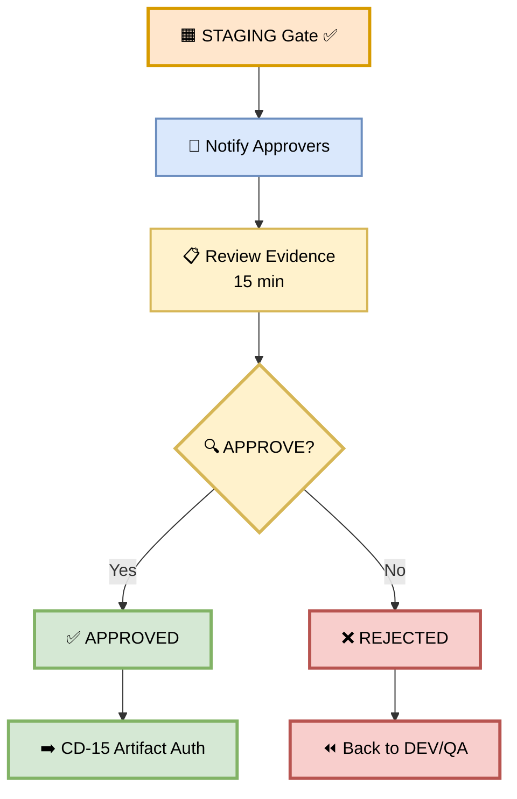
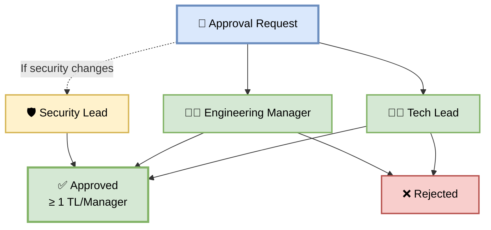
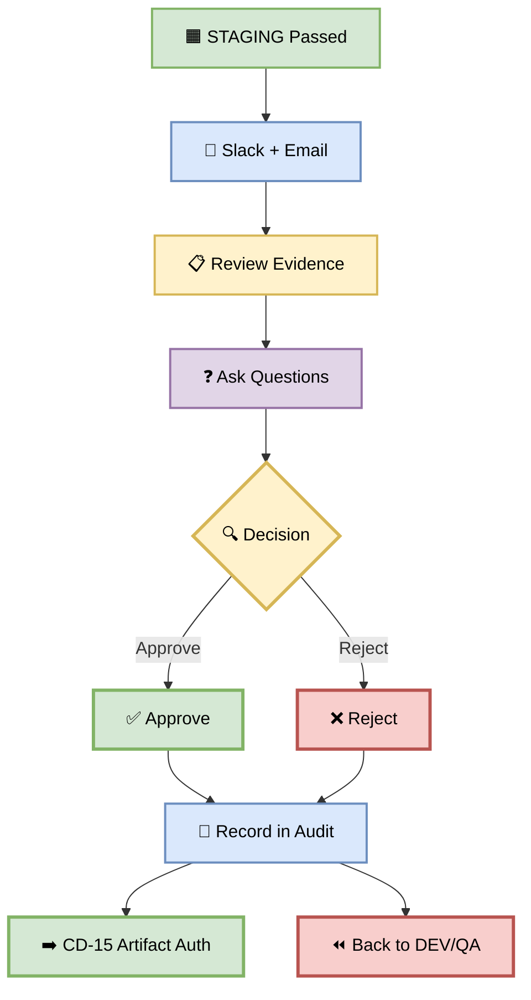
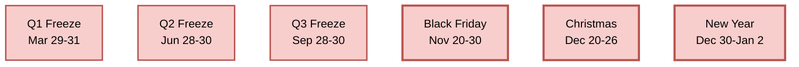
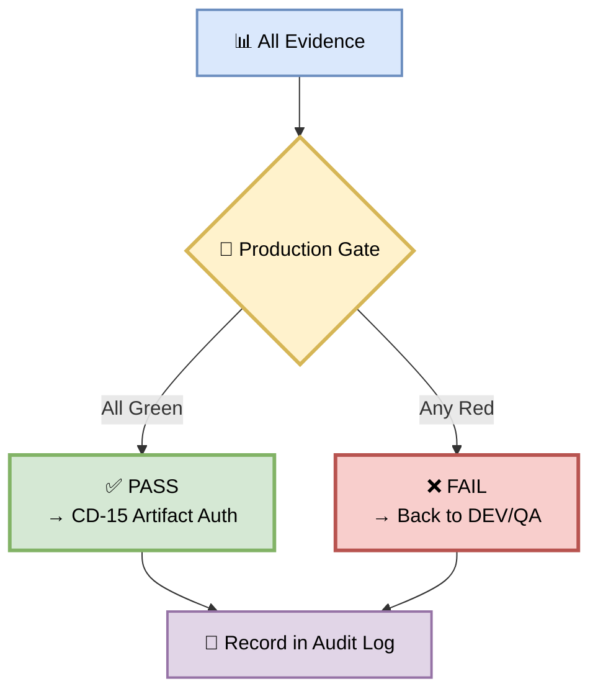
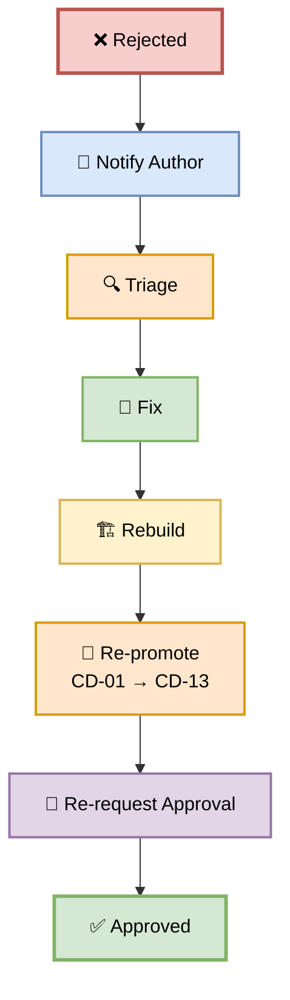
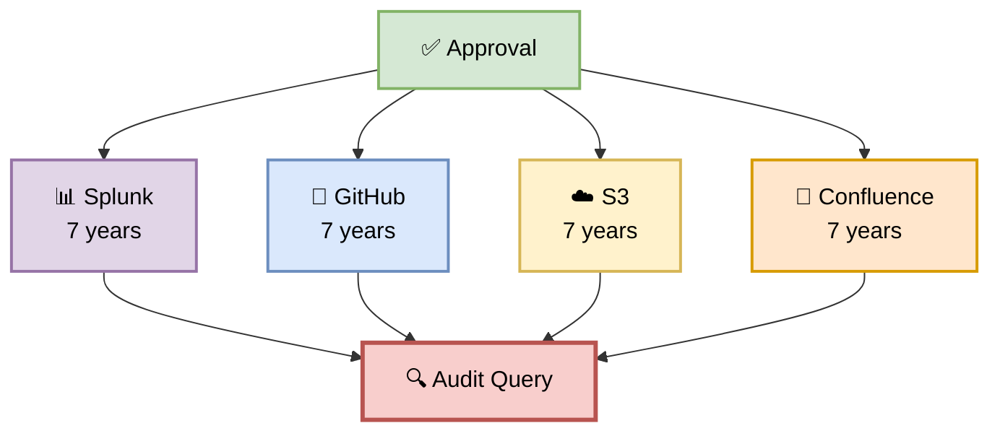

# Part 14 — CD-14: Production Gate

**Author:** Shubham Tripathi  
**Repository:** `ecom-frontend` (Next.js 14 · App Router · TypeScript)  
**Last Updated:** 2026-09-19  
**Audience:** Tech Leads, Engineering Managers, Release Managers, Security Leads, DevOps, SRE

---

## 📑 Table of Contents — Part 14

1. [Production Gate Overview](#-production-gate-overview)
2. [CD-14 — Production Gate Execution](#-cd-14--production-gate-execution)
3. [Who Can Approve](#-who-can-approve)
4. [Evidence Review Checklist](#-evidence-review-checklist)
5. [Approval Workflow](#-approval-workflow)
6. [Approval Notifications](#-approval-notifications)
7. [Risk Assessment](#-risk-assessment)
8. [Deploy Windows & Freeze Periods](#-deploy-windows--freeze-periods)
9. [Production Gate — Pass/Fail Rules](#-production-gate--passfail-rules)
10. [Handling Rejections](#-handling-rejections)
11. [Audit & Compliance](#-audit--compliance)
12. [Troubleshooting](#-troubleshooting)
13. [Appendix — Production Gate Tools Inventory](#-appendix--production-gate-tools-inventory)

---

## 🚦 Production Gate Overview

> **The Production Gate is the final human checkpoint before production.**  
> It ensures that only verified, signed, and business-approved artifacts reach real users.

### 🎯 What is the Production Gate?

The Production Gate is a **manual approval step** in the CD pipeline:
- **Who:** Tech Lead + Engineering Manager
- **What:** Review all evidence and approve/reject
- **When:** After UAT (CD-13) passes, before Binary Auth (CD-15)
- **Why:** Human judgment for irreversible actions
- **How:** GitHub Environments approval + Slack notification

### 🎯 Why a Manual Gate?

| Reason | Explanation |
|--------|-------------|
| **Irreversibility** | Production affects real users and revenue |
| **Business context** | Timing matters (holidays, campaigns, incidents) |
| **Accountability** | Named approval = clear ownership |
| **Risk management** | Human judgment on complex changes |
| **Compliance** | SOC 2, PCI-DSS require human approval |
| **Blast radius** | Catch what automation misses |

### 🎯 Production Gate vs Other Gates

| Gate | Environment | Approval | Type |
|------|-------------|----------|------|
| **QA Gate** | QA | Automatic | Automated |
| **STAGING Gate** | STAGING | Automatic | Automated |
| **Production Gate** | GATE | **Manual** | Human |
| **Binary Auth** | GATE | Automatic | Cryptographic |

### 🖼️ Visual Diagram — Production Gate Position



---

## 🚀 CD-14 — Production Gate Execution

> **Manual approval — human judgment for irreversible actions.**

### 🎯 Purpose

A **Tech Lead or Engineering Manager** reviews the entire promotion evidence and approves or rejects the production deployment.

### 🖼️ Visual Diagram — Gate Flow



### 📊 Gate Stages

| Stage | Action | Duration | Owner |
|-------|--------|----------|-------|
| **1. Notification** | Slack + Email sent | Instant | CI |
| **2. Review** | Approvers review evidence | 5–15 min | TL + Manager |
| **3. Decision** | Approve or reject | Instant | Approvers |
| **4. Audit** | Log approval | Instant | CI |
| **Total** | | **~15 min** | |

### 🛠️ Pipeline Snippet

```yaml
cd-14-production-gate:
  runs-on: ubuntu-latest
  needs: cd-13-uat
  environment:
    name: production-approval
    url: https://ci.ecom.com/production/approval/${{ github.sha }}
  steps:
    - name: Checkout
      uses: actions/checkout@v4

    - name: Prepare Approval Context
      run: |
        cat > approval-context.json <<EOF
        {
          "artifact": "gcr.io/ecom/frontend:${{ github.ref_name }}-coupon",
          "digest": "${{ env.ARTIFACT_DIGEST }}",
          "commit": "${{ github.sha }}",
          "author": "${{ github.actor }}",
          "ticket": "FEAT-1043",
          "staging_url": "${{ env.STAGING_SERVICE_URL }}",
          "uat_signoffs": 5,
          "dast_findings": 0,
          "perf_p99_ms": 340,
          "requested_at": "$(date -u +%Y-%m-%dT%H:%M:%SZ)"
        }
        EOF

    - name: Notify Approvers
      run: |
        curl -X POST "$SLACK_WEBHOOK" \
          -H "Content-Type: application/json" \
          -d @- <<EOF
        {
          "text": "🚦 Production Deployment Awaiting Approval",
          "blocks": [
            {
              "type": "header",
              "text": {"type": "plain_text", "text": "🚦 Production Gate — Approval Required"}
            },
            {
              "type": "section",
              "fields": [
                {"type": "mrkdwn", "text": "*Artifact:*\n\`v2.4.0-coupon\`"},
                {"type": "mrkdwn", "text": "*Ticket:*\nFEAT-1043"},
                {"type": "mrkdwn", "text": "*Author:*\n@${{ github.actor }}"},
                {"type": "mrkdwn", "text": "*Commit:*\n\`${{ github.sha }}\`"}
              ]
            },
            {
              "type": "section",
              "text": {
                "type": "mrkdwn",
                "text": "*Evidence:*\n✅ DAST: 0 High/Critical\n✅ Performance: P99 340ms\n✅ UAT: 5/5 sign-offs\n✅ Regression: 247/247"
              }
            },
            {
              "type": "actions",
              "elements": [
                {
                  "type": "button",
                  "text": {"type": "plain_text", "text": "✅ Approve"},
                  "style": "primary",
                  "url": "https://ci.ecom.com/production/approve/${{ github.sha }}"
                },
                {
                  "type": "button",
                  "text": {"type": "plain_text", "text": "❌ Reject"},
                  "style": "danger",
                  "url": "https://ci.ecom.com/production/reject/${{ github.sha }}"
                }
              ]
            }
          ]
        }
        EOF

    - name: Wait for Approval
      run: |
        echo "Waiting for approval from GitHub Environment..."
        # GitHub Environment gate handles the wait

    - name: Record Approval
      run: |
        cat > approval-record.json <<EOF
        {
          "artifact": "v2.4.0-coupon",
          "approved_by": "${{ github.actor }}",
          "approved_at": "$(date -u +%Y-%m-%dT%H:%M:%SZ)",
          "environment": "production-approval",
          "run_id": "${{ github.run_id }}"
        }
        EOF

    - name: Upload Approval Record
      uses: actions/upload-artifact@v4
      with:
        name: approval-record-${{ github.sha }}
        path: approval-record.json
        retention-days: 365  # 1 year for audit
```

---

## 👥 Who Can Approve

> **Not everyone can approve production. Only trusted roles.**

### 🎯 Approver Roles

| Role | Approver | Required? | Notes |
|------|----------|-----------|-------|
| **Tech Lead** | @tech-lead | ✅ Yes | Primary approver |
| **Engineering Manager** | @eng-manager | ✅ Yes | Co-approver |
| **Security Lead** | @security-lead | ⚠️ Conditional | For security changes |
| **Release Manager** | @release-manager | ⚠️ Optional | For complex releases |
| **CTO** | @cto | ⚠️ Emergency | Break-glass only |

### 📋 Approval Rules

| Rule | Value |
|------|-------|
| **Minimum approvals** | 1 (TL OR Manager) |
| **Preferred** | 2 (TL + Manager) |
| **Timeout** | 24 hours |
| **Auto-reject on timeout** | Yes |
| **Self-approval** | ❌ Not allowed |
| **Author can approve own** | ❌ No |
| **Rejection reason** | ✅ Required |

### 🎯 Approver Responsibilities

**Tech Lead:**
- Review technical correctness
- Assess blast radius
- Check rollback plan
- Verify test coverage
- Approve or reject

**Engineering Manager:**
- Review business context
- Check timing (no conflicts)
- Assess team readiness
- Verify stakeholder sign-offs
- Approve or reject

**Security Lead (if applicable):**
- Review security findings
- Verify no new vulnerabilities
- Check secrets handling
- Approve or escalate

### 🖼️ Visual Diagram — Approval Hierarchy



---

## 📋 Evidence Review Checklist

> **Approvers review 6 categories of evidence.**

### 🎯 The 6 Evidence Categories

| # | Category | Evidence | Pass Condition |
|---|----------|----------|----------------|
| 1 | **Build** | Artifact digest, CI run | Signed, matches digest |
| 2 | **Quality** | Lint, tests, coverage | All green, ≥ thresholds |
| 3 | **Security** | DAST, SCA, secrets | 0 Critical/High |
| 4 | **Performance** | Load test, P99 | All thresholds met |
| 5 | **Business** | UAT, sign-offs | 5/5 approvals |
| 6 | **Rollback** | Plan, previous version | < 60 sec, warm |

### 📊 Review Checklist

#### 1️⃣ Build Evidence

- [ ] Artifact digest matches CD-09 verified digest
- [ ] Commit SHA matches ticket
- [ ] Build pipeline green
- [ ] No rebuilds since STAGING
- [ ] SBOM present

#### 2️⃣ Quality Evidence

- [ ] Lint: 0 errors
- [ ] TypeScript: 0 errors
- [ ] Unit tests: 247/247 pass
- [ ] Coverage: ≥ 80% lines, ≥ 70% branches
- [ ] SonarQube: Quality Gate passed

#### 3️⃣ Security Evidence

- [ ] DAST: 0 Critical, 0 High
- [ ] SCA: 0 Critical, 0 High
- [ ] Secret scan: 0 secrets
- [ ] Container scan: 0 Critical
- [ ] IAC scan: 0 Critical
- [ ] Binary Auth: signature valid

#### 4️⃣ Performance Evidence

- [ ] Throughput: ≥ 10K/min
- [ ] P50: < 200ms
- [ ] P95: < 500ms
- [ ] P99: < 2000ms
- [ ] Error rate: < 1%
- [ ] No memory leaks

#### 5️⃣ Business Evidence

- [ ] UAT: 5/5 sign-offs
- [ ] Test cases: 25/25 passed
- [ ] Product Owner approved
- [ ] Legal approved
- [ ] Design approved
- [ ] No blockers

#### 6️⃣ Rollback Evidence

- [ ] Rollback plan documented
- [ ] Previous version warm
- [ ] Auto-rollback configured
- [ ] DB migration reversible
- [ ] Feature flag ready (if applicable)

### 🛠️ Approval Dashboard

```typescript
// Approval context API
GET /api/production/approval/:sha

// Response:
{
  "artifact": "v2.4.0-coupon",
  "digest": "sha256:abc123...",
  "commit": "a1b2c3d",
  "author": "frontend-dev",
  "ticket": "FEAT-1043",
  "staging_url": "https://staging.ecom.com",
  "evidence": {
    "build": { "status": "✅", "digest_match": true },
    "quality": { "status": "✅", "tests": "247/247", "coverage": "87%" },
    "security": { "status": "✅", "dast": "0 High", "sca": "0 High" },
    "performance": { "status": "✅", "p99_ms": 340, "throughput": "12.4K/min" },
    "business": { "status": "✅", "uat_signoffs": "5/5" },
    "rollback": { "status": "✅", "time_sec": 37 }
  },
  "risk": "🟢 Low",
  "requested_at": "2026-09-19T11:00:00Z",
  "expires_at": "2026-09-20T11:00:00Z"
}
```

---

## 🔄 Approval Workflow

> **From notification to record — the complete flow.**

### 🖼️ Visual Diagram — Approval Workflow



### 🛠️ Approval Commands

**Approve via CLI:**

```bash
gh api \
  --method POST \
  /repos/ecom/frontend/actions/runs/$RUN_ID/approve \
  -f comment="Approved: all evidence reviewed. Proceeding."
```

**Approve via Slack:**

```
/approve production v2.4.0-coupon
```

**Approve via Dashboard:**

```
https://ci.ecom.com/production/approve/a1b2c3d
```

**Reject via CLI:**

```bash
gh api \
  --method POST \
  /repos/ecom/frontend/actions/runs/$RUN_ID/reject \
  -f comment="Rejected: performance regression on bulk apply. Fix and re-request."
```

---

## 📬 Approval Notifications

> **Every approval request goes to multiple channels.**

### 🎯 Notification Channels

| Channel | Audience | Urgency |
|---------|----------|---------|
| **Slack #releases** | TL, Manager | High |
| **Slack DM** | TL, Manager | High |
| **Email** | TL, Manager | Medium |
| **PagerDuty** | On-call (if urgent) | Critical |

### 🎯 Slack Notification Template

```
🚦 Production Deployment Awaiting Approval

📦 Artifact: v2.4.0-coupon
🎫 Ticket: FEAT-1043 (Bulk Coupon Apply)
👤 Author: @frontend-dev
🔗 Commit: a1b2c3d

📊 Evidence Summary:
✅ Build: Signed, digest verified
✅ Quality: 247/247 tests, 87% coverage
✅ Security: 0 Critical/High
✅ Performance: P99 340ms, 12.4K/min
✅ UAT: 5/5 sign-offs
✅ Rollback: < 60 sec

⚠️ Risk: 🟢 Low
⏰ Expires: 24 hours

👉 Approve: https://ci.ecom.com/production/approve/a1b2c3d
👉 Reject: https://ci.ecom.com/production/reject/a1b2c3d

@tech-lead @eng-manager please review.
```

### 🎯 Email Template

```
Subject: 🚦 Production Approval Required — Coupon Feature v2.4.0

Hi @tech-lead,

A production deployment is awaiting your approval.

Artifact: v2.4.0-coupon
Ticket: FEAT-1043
Author: frontend-dev

All evidence is green:
- Build: Signed, digest verified
- Quality: 247/247 tests passing
- Security: 0 Critical/High findings
- Performance: P99 340ms (target: < 2000ms)
- UAT: 5/5 stakeholder sign-offs

Risk: Low
Rollback: < 60 sec auto-rollback available
Expires: 2026-09-20 11:00 UTC

Review & Approve:
https://ci.ecom.com/production/approve/a1b2c3d

Thanks,
CI/CD Pipeline
```

### 🎯 Reminder Cadence

| Time | Action |
|------|--------|
| **T+0** | Initial notification |
| **T+15 min** | Slack reminder |
| **T+1 hour** | DM reminder |
| **T+4 hours** | Escalate to Manager |
| **T+12 hours** | Escalate to CTO |
| **T+24 hours** | Auto-reject |

---

## 🎯 Risk Assessment

> **Not all changes are equal. Risk determines process.**

### 🎯 Risk Levels

| Level | Criteria | Approval Required | Deploy Window |
|-------|----------|-------------------|---------------|
| 🟢 **Low** | Docs, tests, minor UI | 1 (TL) | Any time |
| 🟡 **Medium** | New features, refactors | 1 (TL) | Business hours |
| 🟠 **High** | DB schema, auth, payment | 2 (TL + Manager) | Business hours + notice |
| 🔴 **Critical** | Breaking changes, migrations | 3 (TL + Manager + Security) | Scheduled window |

### 🎯 Risk Factors

**Increases Risk:**
- Large diff size (> 500 lines)
- Multiple services affected
- DB schema changes
- Auth or payment changes
- New external dependencies
- Changes to infrastructure
- Deploy outside business hours
- Deploy near holidays

**Decreases Risk:**
- Small diff (< 100 lines)
- Additive changes only
- Feature-flagged
- Well-tested (high coverage)
- Similar to previous deploys
- Deploy during business hours

### 📊 Coupon Feature Risk Assessment

```
🟢 Risk Level: LOW

Rationale:
  ✅ Additive feature (new endpoint, no breaking changes)
  ✅ Fully tested (87% coverage, 25 UAT cases)
  ✅ Feature-flagged (can disable instantly)
  ✅ Similar to previous deploys
  ✅ Business hours deploy
  ✅ Not near holidays
  ✅ Rollback plan verified

Risk Score: 0.12 / 1.0
Recommendation: Proceed with canary
```

### 🛠️ Risk Scoring Script

```typescript
async function calculateRisk(deploy: Deploy): Promise<RiskScore> {
  let score = 0;

  // Diff size
  if (deploy.diffLines > 500) score += 0.2;
  if (deploy.diffLines > 1000) score += 0.2;

  // Services affected
  if (deploy.servicesAffected > 1) score += 0.15;

  // Schema changes
  if (deploy.hasSchemaChange) score += 0.25;

  // Auth/payment changes
  if (deploy.affectsAuth || deploy.affectsPayment) score += 0.3;

  // Test coverage delta
  if (deploy.coverageDelta < 0) score += 0.1;

  // Time of day
  if (deploy.hour < 9 || deploy.hour > 18) score += 0.1;

  // Day of week
  if (deploy.dayOfWeek === 'Friday') score += 0.1;

  // Near holidays
  if (isNearHoliday(deploy.date)) score += 0.15;

  return {
    score: Math.min(score, 1.0),
    level: score < 0.3 ? 'LOW' : score < 0.6 ? 'MEDIUM' : 'HIGH',
    factors: getRiskFactors(deploy)
  };
}
```

---

## 📅 Deploy Windows & Freeze Periods

> **When you can deploy matters as much as what you deploy.**

### 🎯 Deploy Windows

| Window | Time (UTC) | Days | Risk Level |
|--------|-----------|------|------------|
| **Preferred** | 14:00–16:00 | Tue–Thu | 🟢 Low |
| **Acceptable** | 10:00–18:00 | Mon–Fri | 🟡 Medium |
| **Discouraged** | 18:00–22:00 | Mon–Thu | 🟠 High |
| **Forbidden** | 22:00–10:00 | Any | 🔴 Critical |
| **Forbidden** | All day | Fri, Sat, Sun | 🔴 Critical |

### 🎯 Freeze Periods

| Period | Dates | Reason |
|--------|-------|--------|
| **End of quarter** | Last 3 days of quarter | Financial close |
| **Black Friday** | Nov 20–30 | Peak traffic |
| **Cyber Monday** | Dec 1–3 | Peak traffic |
| **Christmas** | Dec 20–26 | Peak traffic |
| **New Year** | Dec 30–Jan 2 | Skeleton crew |
| **Major campaigns** | Varies | Marketing events |

### 📊 Freeze Calendar



### 🚨 Emergency Override

In case of **critical production bug**, a freeze can be overridden:

1. **Request:** Page on-call + TL
2. **Approve:** TL + Manager (both required)
3. **Document:** Reason + rollback plan
4. **Deploy:** Hotfix with maximum caution
5. **Postmortem:** Within 48 hours

---

## 🚦 Production Gate — Pass/Fail Rules

> **All evidence must be green. No exceptions.**

### 📊 Gate Criteria

| # | Category | Pass Condition | Blocks CD-15? |
|---|----------|----------------|---------------|
| 1 | **Build** | Signed, digest verified | ✅ Yes |
| 2 | **Quality** | All green, coverage met | ✅ Yes |
| 3 | **Security** | 0 Critical/High | ✅ Yes |
| 4 | **Performance** | All thresholds met | ✅ Yes |
| 5 | **Business** | 5/5 UAT sign-offs | ✅ Yes |
| 6 | **Rollback** | Plan + warm version | ✅ Yes |
| 7 | **Manual Approval** | ≥ 1 TL/Manager | ✅ Yes |
| 8 | **Timing** | Within deploy window | ✅ Yes |
| 9 | **No Freeze** | Not in freeze period | ✅ Yes |
| 10 | **Audit** | Approval logged | ✅ Yes |

### 🚦 Gate Outcome



### 📊 Realistic Gate Results

```
🚦 Production Gate — Approval Request
─────────────────────────────────────────────

📦 Artifact: v2.4.0-coupon
🎫 Ticket: FEAT-1043
👤 Author: @frontend-dev

📊 Evidence:
  ✅ Build: Signed, digest verified
  ✅ Quality: 247/247 tests, 87% coverage
  ✅ Security: 0 Critical/High
  ✅ Performance: P99 340ms, 12.4K/min
  ✅ UAT: 5/5 sign-offs
  ✅ Rollback: < 60 sec

🎯 Risk: 🟢 Low (0.12)
⏰ Deploy window: Tue 14:00-16:00 UTC
📅 Freeze: None

👤 Awaiting approval from: @tech-lead

✅ APPROVED by @tech-lead at 14:12 UTC
✅ APPROVED by @eng-manager at 14:15 UTC

→ Proceeding to CD-15 Artifact Authorization
```

---

## 🛠️ Handling Rejections

> **When a rejection happens, we learn and improve.**

### 🎯 Common Rejection Reasons

| Reason | Frequency | Fix |
|--------|-----------|-----|
| **Insufficient test coverage** | 30% | Add tests |
| **Security concern** | 20% | Fix vulnerability |
| **Timing issue** | 15% | Reschedule |
| **Incomplete UAT** | 15% | Complete sign-offs |
| **Risk too high** | 10% | Break into smaller changes |
| **Missing evidence** | 5% | Provide documentation |
| **Business concern** | 5% | Address stakeholder |

### 🛠️ Rejection Workflow



### 📋 Rejection Template

```markdown
# Production Gate Rejection — v2.4.0-coupon

## Rejected By
@tech-lead

## Reason
Performance regression on bulk apply endpoint. P99 was 2,400ms (target: < 2,000ms).

## Evidence
- k6 report: [link]
- Grafana: [link]
- Traces: [link]

## Impact
Bulk apply is a key feature. Slow performance will impact user experience.

## Fix Required
1. Add index on `coupons.code`
2. Optimize bulk apply query
3. Re-run performance test

## Owner
@backend-dev

## Deadline
2026-09-20 (before next production window)

## Re-approval Process
After fix:
1. Rebuild artifact
2. Re-run CD-01 → CD-13
3. Request approval again
```

---

## 📝 Audit & Compliance

> **Every approval is logged for 7 years.**

### 🎯 Audit Trail

| Artifact | Content | Retention |
|----------|---------|-----------|
| **Approval record** | Who, when, what | 7 years |
| **Evidence bundle** | All test results | 7 years |
| **Slack log** | Notifications + responses | 1 year |
| **Email log** | Notification emails | 7 years |
| **GitHub log** | Environment approvals | 7 years |
| **Splunk log** | All API calls | 7 years |

### 🎯 Compliance Requirements

| Standard | Requirement | Our Implementation |
|----------|-------------|---------------------|
| **SOC 2** | Human approval for prod | Manual gate |
| **PCI-DSS** | Change approval | TL + Manager sign-off |
| **ISO 27001** | Access control | RBAC on approvers |
| **GDPR** | Data protection | No PII in evidence |

### 🛠️ Audit Log Format

```json
{
  "event": "production_gate_approval",
  "timestamp": "2026-09-19T14:12:00Z",
  "artifact": "v2.4.0-coupon",
  "digest": "sha256:abc123...",
  "commit": "a1b2c3d",
  "author": "frontend-dev",
  "ticket": "FEAT-1043",
  "approved_by": "tech-lead@ecom.com",
  "approval_method": "github_environment",
  "run_id": "12345678",
  "evidence": {
    "build": "verified",
    "quality": "247/247",
    "security": "0 High",
    "performance": "P99 340ms",
    "uat": "5/5",
    "rollback": "< 60 sec"
  },
  "risk_score": 0.12,
  "deploy_window": "Tue 14:00-16:00 UTC",
  "notes": "All evidence green. Low risk. Proceed with canary."
}
```

### 🖼️ Visual Diagram — Audit Trail



---

## 🛠️ Troubleshooting

| Problem | Cause | Fix |
|---------|-------|-----|
| **Approval timeout** | No approver action | Re-trigger, ping approver |
| **Approver unavailable** | PTO, sick leave | Delegate to backup |
| **Slack notification failed** | Webhook issue | Retry, use email |
| **Evidence missing** | Pipeline step skipped | Re-run pipeline |
| **Digest mismatch** | Wrong artifact | Re-run CD-01 → CD-09 |
| **Risk score high** | Large change | Break into smaller PRs |
| **Freeze period active** | Timing issue | Wait or override |
| **Multiple approvers needed** | High risk | Coordinate approvals |
| **Approval record missing** | Log issue | Check Splunk |

### 🔍 Debugging Commands

```bash
# Check approval status
gh api /repos/ecom/frontend/actions/runs/$RUN_ID

# Check environment approvals
gh api /repos/ecom/frontend/environments/production-approval

# Check audit log
gcloud logging read \
  'resource.type="github_actions" AND jsonPayload.event="production_gate_approval"' \
  --limit 10

# Check Splunk
splunk search 'event=production_gate_approval artifact=v2.4.0-coupon'

# Re-trigger approval
gh workflow run cd-pipeline.yml \
  -f stage=production-gate \
  -f artifact=v2.4.0-coupon

# Manually approve (emergency only)
gh api --method POST \
  /repos/ecom/frontend/actions/runs/$RUN_ID/approve \
  -f comment="Emergency approval: $REASON"
```

---

## 📎 Appendix — Production Gate Tools Inventory

### 🛠️ Tool Stack

| Category | Tool | Purpose | Cost |
|----------|------|---------|------|
| **Approval** | GitHub Environments | Native approval | Free |
| **Approval** | Slack | Notifications | Free |
| **Approval** | PagerDuty | Escalation | $$ |
| **Notification** | Slack | Team alerts | Free |
| **Notification** | SendGrid | Email | Free tier |
| **Audit** | Splunk | Log aggregation | $$$ |
| **Audit** | Cloud Logging | GCP audit | Free tier |
| **Audit** | S3 | Long-term storage | $ |
| **Evidence** | GitHub Actions | CI/CD artifacts | Free tier |
| **Evidence** | Grafana | Dashboards | Free |
| **Evidence** | Confluence | Documentation | $$ |
| **Risk** | Custom ML | Risk scoring | Free |
| **Risk** | Datadog | Anomaly detection | $$$ |
| **Compliance** | Vanta | Compliance automation | $$$ |
| **Compliance** | Drata | Compliance automation | $$$ |

### 📞 Production Gate Contacts

| Role | Person | Slack | Backup |
|------|--------|-------|--------|
| **Tech Lead** | TBD | @tech-lead | @senior-dev |
| **Engineering Manager** | TBD | @eng-manager | @director |
| **Security Lead** | TBD | @security-lead | @ciso |
| **Release Manager** | TBD | @release-manager | @devops-lead |
| **CTO** | TBD | @cto | — |
| **On-call** | Rotation | @oncall | — |

### 🔗 Useful Links

| Resource | URL |
|----------|-----|
| **Approval Dashboard** | ci.ecom.com/production/approval |
| **GitHub Environments** | github.com/ecom/frontend/settings/environments |
| **Slack Channel** | ecom.slack.com/#releases |
| **Audit Log** | splunk.ecom.com/production-approval |
| **Risk Dashboard** | grafana.ecom.com/d/risk |
| **Freeze Calendar** | calendar.ecom.com/freeze |
| **Runbooks** | runbooks.ecom.com/production-gate |

---

## 🎯 Summary — Part 14

| Section | Kya Cover Hua |
|---------|---------------|
| **Overview** | What, why, position in pipeline |
| **CD-14 Execution** | 4 stages, ~15 min, pipeline YAML |
| **Approvers** | 5 roles, rules, responsibilities |
| **Evidence Checklist** | 6 categories, 30+ checks |
| **Approval Workflow** | Flow, commands, templates |
| **Notifications** | Slack, Email, reminders |
| **Risk Assessment** | 4 levels, scoring, factors |
| **Deploy Windows** | Windows, freeze periods |
| **Gate Rules** | 10 criteria, pass/fail |
| **Rejections** | Workflow, template, re-approval |
| **Audit** | Trail, compliance, log format |
| **Troubleshooting** | 9 failures + debug commands |
| **Appendix** | 15 tools, contacts, links |

---

## 🏆 Complete Documentation — All 14 Parts

| Part | Title | Status |
|------|-------|--------|
| **Part 1** | CI Pipeline | ✅ |
| **Part 2** | CD Overview | ✅ |
| **Part 3** | DEV Deployment (CD-03 → CD-05) | ✅ |
| **Part 4** | QA Deployment (CD-06 → CD-09) | ✅ |
| **Part 5** | STAGING Deployment (CD-10 → CD-13) | ✅ |
| **Part 6** | PROD Gate & Canary (CD-14 → CD-20) | ✅ |
| **Part 7** | Post-Deploy & Monitoring | ✅ |
| **Part 8** | Executive Summary & KPIs | ✅ |
| **Part 9** | CD Pipeline (CD-09 → CD-20) | ✅ |
| **Part 10** | CD-10 STAGING Deployment | ✅ |
| **Part 11** | CD-11 DAST | ✅ |
| **Part 12** | CD-12 Performance Test | ✅ |
| **Part 13** | CD-13 UAT | ✅ |
| **Part 14** | CD-14 Production Gate | ✅ |

> 📝 **Note:** The Production Gate is the **last line of defense before production**. Human judgment catches what automation misses. Every approval is a promise: **we stand behind this change.**