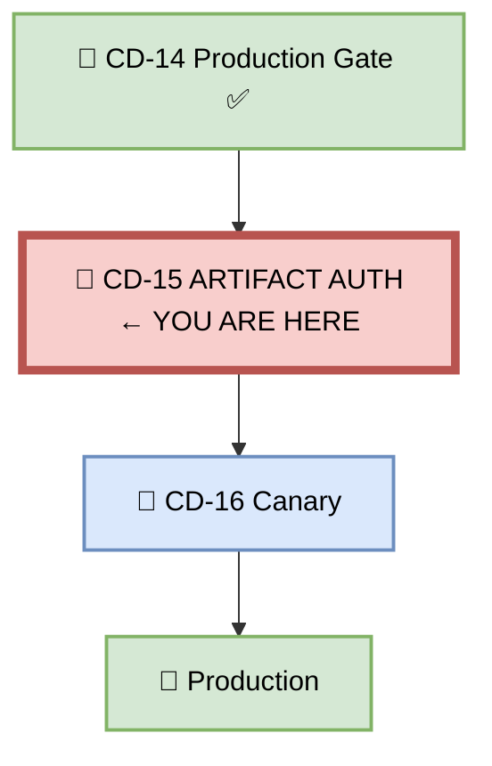
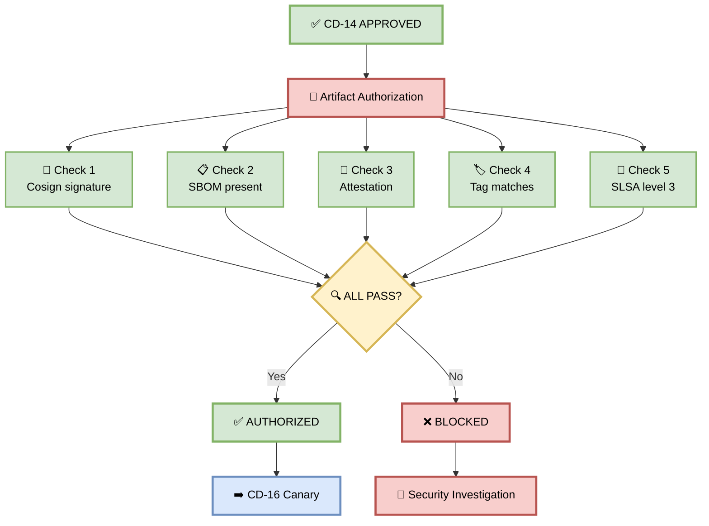
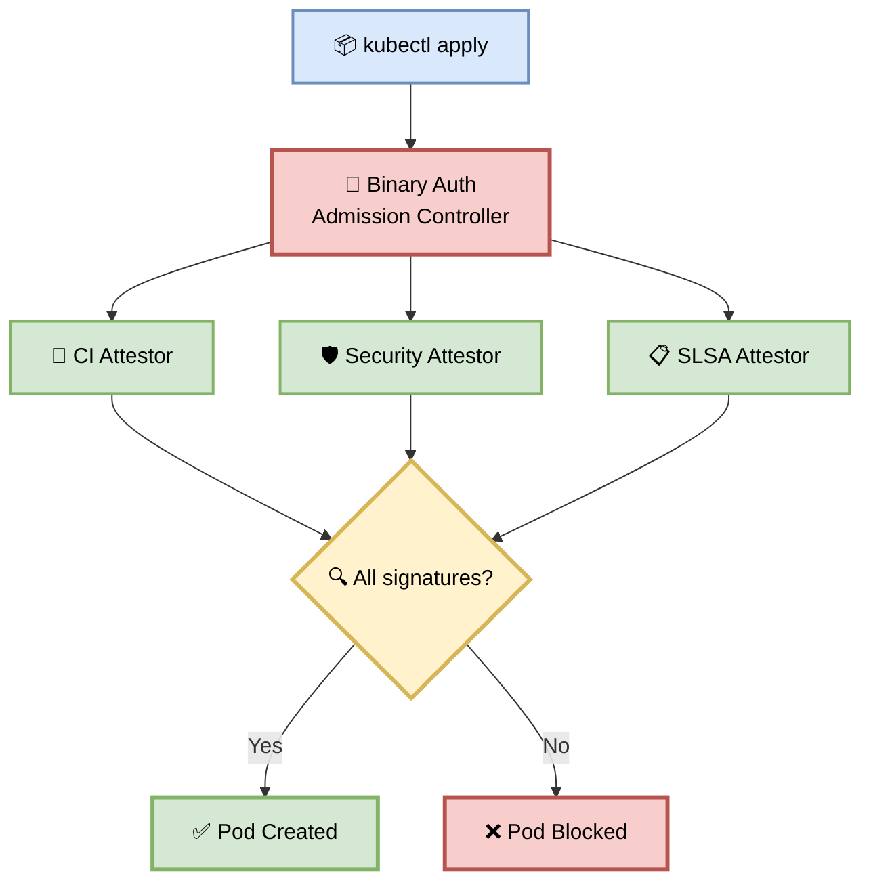
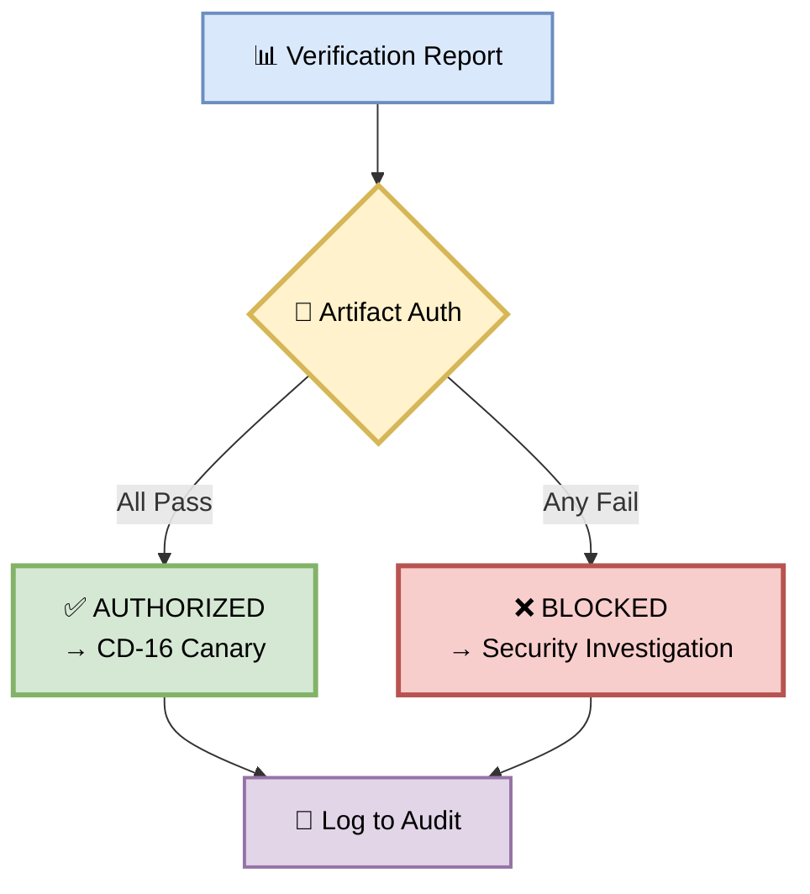
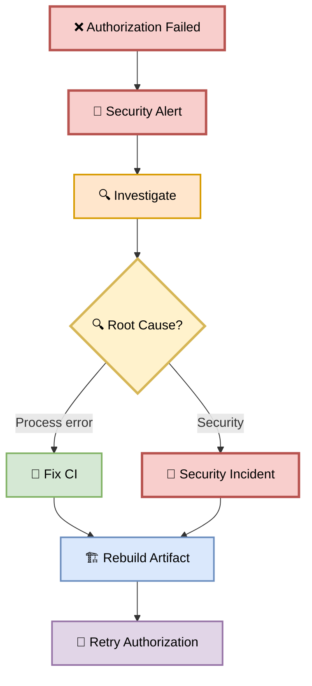
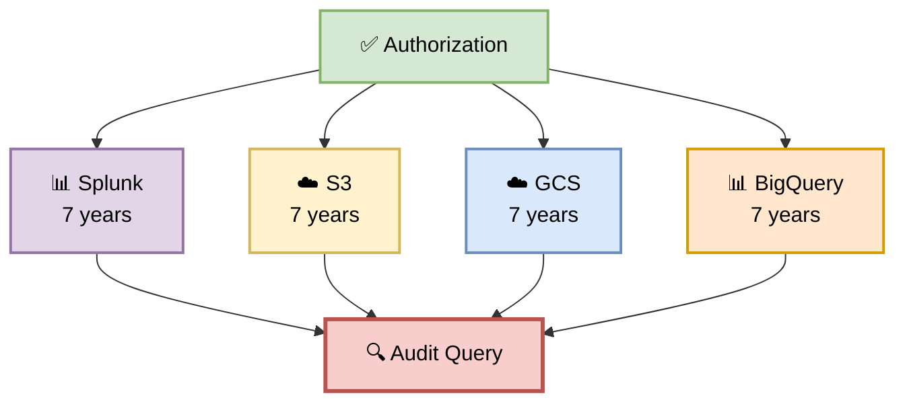

# Part 15 — CD-15: Artifact Authorization (Binary Authorization)

**Author:** Shubham Tripathi  
**Repository:** `ecom-frontend` (Next.js 14 · App Router · TypeScript)  
**Last Updated:** 2026-09-19  
**Audience:** Security Engineers, DevOps, SRE, Release Managers, CISO, Compliance

---

## 📑 Table of Contents — Part 15

1. [Artifact Authorization Overview](#-artifact-authorization-overview)
2. [CD-15 — Artifact Authorization Execution](#-cd-15--artifact-authorization-execution)
3. [The 5 Verification Checks](#-the-5-verification-checks)
4. [Binary Authorization Policy](#-binary-authorization-policy)
5. [SBOM Verification](#-sbom-verification)
6. [Provenance & SLSA](#-provenance--slsa)
7. [Signature Verification (Cosign)](#-signature-verification-cosign)
8. [Tag & Digest Verification](#-tag--digest-verification)
9. [Artifact Authorization Gate — Pass/Fail Rules](#-artifact-authorization-gate--passfail-rules)
10. [Handling Authorization Failures](#-handling-authorization-failures)
11. [Audit & Compliance](#-audit--compliance)
12. [Troubleshooting](#-troubleshooting)
13. [Appendix — Artifact Authorization Tools Inventory](#-appendix--artifact-authorization-tools-inventory)

---

## 🔐 Artifact Authorization Overview

> **Even after human approval, we verify the artifact cryptographically.**  
> No unsigned image ever reaches production.

### 🎯 What is Artifact Authorization?

Artifact Authorization is an **automated cryptographic verification** step:
- **Who:** GCP Binary Authorization + Cosign + SLSA
- **What:** Verifies signature, SBOM, attestation, tag
- **When:** After Production Gate (CD-14), before Canary (CD-16)
- **Why:** Prevent unsigned/tampered images from deploying
- **How:** Admission controller at deploy time + CI verification

### 🎯 Why Artifact Authorization?

| Reason | Explanation |
|--------|-------------|
| **Supply chain security** | Prevent tampered images |
| **Non-repudiation** | Prove build origin |
| **Compliance** | SLSA, SOC 2, PCI-DSS |
| **Audit trail** | Every artifact traceable |
| **Zero trust** | Never trust, always verify |
| **Blast radius** | Limit to signed artifacts only |
| **Insurance** | Prevent unknown code |

### 🎯 Human Approval vs Artifact Authorization

| Aspect | CD-14 (Human) | CD-15 (Cryptographic) |
|--------|---------------|----------------------|
| **Who** | Tech Lead / Manager | Binary Auth + Cosign |
| **What** | Business decision | Technical verification |
| **How** | Click "Approve" | Verify signature |
| **When** | Before CD-15 | After CD-14 |
| **Bypass** | Manual review | Impossible |
| **Audit** | Human intent | Cryptographic proof |

### 🖼️ Visual Diagram — Artifact Authorization Position



---

## 🚀 CD-15 — Artifact Authorization Execution

> **5 cryptographic checks before production deploy.**

### 🎯 Purpose

After human approval (CD-14), the pipeline performs **5 independent cryptographic verifications** to ensure the artifact is:
- Signed by our CI
- Built from our source
- Includes a complete SBOM
- Has valid provenance
- Matches the expected tag

### 🖼️ Visual Diagram — Authorization Flow



### 📊 Authorization Stages

| Stage | Check | Duration | Owner |
|-------|-------|----------|-------|
| **1. Signature** | Cosign verify | ~10 sec | CI |
| **2. SBOM** | Download + validate | ~10 sec | CI |
| **3. Attestation** | Verify provenance | ~10 sec | CI |
| **4. Tag** | Match expected | ~5 sec | CI |
| **5. SLSA** | Verify level 3 | ~20 sec | CI |
| **Total** | | **~1 min** | |

### 🛠️ Pipeline Snippet

```yaml
cd-15-artifact-authorization:
  runs-on: ubuntu-latest
  needs: cd-14-production-gate
  steps:
    - name: Checkout
      uses: actions/checkout@v4

    - name: Install Cosign
      uses: sigstore/cosign-installer@v3
      with:
        cosign-release: 'v2.2.0'

    - name: Install SLSA Verifier
      run: |
        wget https://github.com/slsa-framework/slsa-verifier/releases/download/v2.4.0/slsa-verifier-linux-amd64
        chmod +x slsa-verifier-linux-amd64
        sudo mv slsa-verifier-linux-amd64 /usr/local/bin/slsa-verifier

    - name: CD-15 Check 1 — Cosign Signature
      run: |
        cosign verify \
          --key gcpkms://projects/ecom-prod/locations/global/keyRings/ci/cryptoKeys/cosign \
          "gcr.io/ecom-prod/frontend:${{ env.ARTIFACT_TAG }}"

    - name: CD-15 Check 2 — SBOM Present
      run: |
        cosign download sbom \
          "gcr.io/ecom-prod/frontend:${{ env.ARTIFACT_TAG }}" > sbom.json
        [ -s sbom.json ] || (echo "❌ SBOM missing"; exit 1)
        jq -e '.bomFormat == "CycloneDX"' sbom.json > /dev/null

    - name: CD-15 Check 3 — Attestation
      run: |
        cosign verify-attestation \
          --type slsaprovenance \
          --key gcpkms://projects/ecom-prod/locations/global/keyRings/ci/cryptoKeys/cosign \
          "gcr.io/ecom-prod/frontend:${{ env.ARTIFACT_TAG }}"

    - name: CD-15 Check 4 — Tag Matches
      run: |
        EXPECTED="${{ env.ARTIFACT_TAG }}"
        ACTUAL=$(gcloud artifacts docker tags list \
          "gcr.io/ecom-prod/frontend:${EXPECTED}" \
          --format="value(tag)")
        [ "$EXPECTED" == "$ACTUAL" ] || (echo "❌ Tag mismatch"; exit 1)

    - name: CD-15 Check 5 — SLSA Level 3
      run: |
        slsa-verifier verify-image \
          "gcr.io/ecom-prod/frontend:${{ env.ARTIFACT_TAG }}" \
          --source-uri github.com/ecom/frontend \
          --source-tag "${{ env.ARTIFACT_TAG }}"

    - name: Record Authorization
      run: |
        cat > authorization-record.json <<EOF
        {
          "artifact": "${{ env.ARTIFACT_TAG }}",
          "digest": "${{ env.ARTIFACT_DIGEST }}",
          "checks": {
            "cosign_signature": "verified",
            "sbom": "present",
            "attestation": "verified",
            "tag": "matched",
            "slsa_level": 3
          },
          "authorized_at": "$(date -u +%Y-%m-%dT%H:%M:%SZ)",
          "run_id": "${{ github.run_id }}"
        }
        EOF

    - name: Upload Authorization Record
      uses: actions/upload-artifact@v4
      with:
        name: authorization-record-${{ github.sha }}
        path: authorization-record.json
        retention-days: 365

    - name: Notify
      run: |
        curl -X POST "$SLACK_WEBHOOK" \
          -d '{"text":"🔐 Artifact Authorized: '"${{ env.ARTIFACT_TAG }}"'\n→ Proceeding to Canary"}'
```

---

## 🔍 The 5 Verification Checks

> **Every check is independent. All must pass.**

### 1️⃣ Check 1 — Cosign Signature

**What:** Verifies the artifact was signed by our CI.

**Why:** Prevents unsigned or unauthorized images.

**Command:**

```bash
cosign verify \
  --key gcpkms://projects/ecom-prod/locations/global/keyRings/ci/cryptoKeys/cosign \
  gcr.io/ecom-prod/frontend:v2.4.0-coupon
```

**Expected output:**

```
✓ Verified signature for gcr.io/ecom-prod/frontend:v2.4.0-coupon
✓ Signed by: CI Pipeline (ci@ecom-prod.iam.gserviceaccount.com)
✓ Timestamp: 2026-09-19T10:32:00Z
✓ Certificate: valid
```

**Fail scenarios:**

| Error | Cause | Action |
|-------|-------|--------|
| `no matching signatures` | Not signed | Re-run Official CI |
| `signature invalid` | Tampered | Security investigation |
| `key not found` | Wrong KMS key | Verify KMS config |
| `certificate expired` | Old signature | Re-sign artifact |

---

### 2️⃣ Check 2 — SBOM Present

**What:** Verifies a Software Bill of Materials exists.

**Why:** Full dependency list for CVE response.

**Command:**

```bash
cosign download sbom gcr.io/ecom-prod/frontend:v2.4.0-coupon > sbom.json

# Validate SBOM
jq -e '.bomFormat == "CycloneDX"' sbom.json > /dev/null
jq -e '.specVersion == "1.5"' sbom.json > /dev/null
jq '.components | length' sbom.json
```

**Expected output:**

```
✓ SBOM found: CycloneDX 1.5
✓ 247 components listed
✓ No tampering detected
✓ All components have PURLs
```

**Fail scenarios:**

| Error | Cause | Action |
|-------|-------|--------|
| `no SBOM attestation` | SBOM skipped | Re-run Official CI |
| `invalid format` | Wrong tool | Fix SBOM generation |
| `0 components` | Empty SBOM | Investigate |
| `missing PURLs` | Incomplete SBOM | Fix generator |

---

### 3️⃣ Check 3 — Attestation

**What:** Verifies the build provenance attestation.

**Why:** Proves the image was built by our CI from our source.

**Command:**

```bash
cosign verify-attestation \
  --type slsaprovenance \
  --key gcpkms://projects/ecom-prod/locations/global/keyRings/ci/cryptoKeys/cosign \
  gcr.io/ecom-prod/frontend:v2.4.0-coupon
```

**Expected output:**

```json
{
  "payloadType": "application/vnd.in-toto+json",
  "payload": {
    "_type": "https://in-toto.io/Statement/v0.1",
    "subject": [{
      "name": "gcr.io/ecom-prod/frontend",
      "digest": { "sha256": "abc123..." }
    }],
    "predicateType": "https://slsa.dev/provenance/v0.2",
    "predicate": {
      "builder": { "id": "https://github.com/actions/runner" },
      "buildType": "https://github.com/actions/workflow",
      "invocation": {
        "configSource": {
          "uri": "git+https://github.com/ecom/frontend@refs/heads/main",
          "digest": { "sha1": "a1b2c3d..." }
        }
      }
    }
  },
  "signatures": [{
    "keyid": "gcpkms://...",
    "sig": "MEUCIQ..."
  }]
}
```

**Fail scenarios:**

| Error | Cause | Action |
|-------|-------|--------|
| `no matching attestations` | Missing | Re-run Official CI |
| `signature invalid` | Tampered | Security investigation |
| `wrong source URI` | Not our repo | Block + investigate |
| `untrusted builder` | Not our CI | Block + investigate |

---

### 4️⃣ Check 4 — Tag Matches

**What:** Verifies the tag matches the expected release.

**Why:** Prevents unauthorized tag usage.

**Command:**

```bash
EXPECTED_TAG="v2.4.0-coupon"
ACTUAL_TAG=$(gcloud artifacts docker tags list \
  gcr.io/ecom-prod/frontend:${EXPECTED_TAG} \
  --format="value(tag)")

if [ "$EXPECTED_TAG" != "$ACTUAL_TAG" ]; then
  echo "❌ Tag mismatch"
  exit 1
fi
```

**Expected output:**

```
✓ Expected: v2.4.0-coupon
✓ Actual:   v2.4.0-coupon
✓ Tag matches release
```

**Tag pattern rules:**

| Pattern | Allowed | Example |
|---------|---------|---------|
| `v*.*.*` | ✅ Yes | v2.4.0 |
| `v*.*.*-*` | ✅ Yes | v2.4.0-coupon |
| `latest` | ❌ No (prod) | — |
| `dev-*` | ❌ No (prod) | — |
| `test-*` | ❌ No (prod) | — |

**Fail scenarios:**

| Error | Cause | Action |
|-------|-------|--------|
| `Tag mismatch` | Wrong tag | Block deploy |
| `Tag not found` | Doesn't exist | Check registry |
| `latest tag` | Unauthorized | Block + investigate |
| `dev tag` | Wrong env | Block |

---

### 5️⃣ Check 5 — SLSA Level 3

**What:** Verifies the artifact meets SLSA Level 3.

**Why:** Highest supply chain security standard.

**Command:**

```bash
slsa-verifier verify-image \
  gcr.io/ecom-prod/frontend:v2.4.0-coupon \
  --source-uri github.com/ecom/frontend \
  --source-tag v2.4.0-coupon
```

**Expected output:**

```
✓ SLSA level 3 verified
✓ Build provenance valid
✓ Non-falsifiable
✓ Isolated build
✓ Ephemeral environment
```

**SLSA levels:**

| Level | Requirement | Status |
|-------|-------------|--------|
| **SLSA 1** | Documented build | ✅ |
| **SLSA 2** | Signed provenance | ✅ |
| **SLSA 3** | Hardened build, non-falsifiable | ✅ |
| **SLSA 4** | Hermetic, two-party review | 🟡 In progress |

**Fail scenarios:**

| Error | Cause | Action |
|-------|-------|--------|
| `SLSA level < 3` | Weak build | Fix build pipeline |
| `No provenance` | Missing | Re-run Official CI |
| `Invalid source` | Wrong repo | Block + investigate |
| `Build not isolated` | Weak CI | Fix CI config |

---

## 🚦 Binary Authorization Policy

> **GCP Binary Authorization enforces at deploy time — even if CI is bypassed.**

### 🎯 Policy Structure

```yaml
name: production-policy
description: "Require signed images from CI for production"

# Global evaluation mode
globalPolicyEvaluationMode: ENABLE

# Admission whitelist
admissionWhitelistPatterns:
  - namePattern: "gcr.io/ecom-prod/frontend:*"
  - namePattern: "gcr.io/ecom-prod/cart-api:*"
  - namePattern: "gcr.io/ecom-prod/checkout-api:*"

# Cluster-specific rules
clusterAdmissionRules:
  us-central1.prod-cluster:
    evaluationMode: REQUIRE_ATTESTATION
    enforcementMode: ENFORCED_BLOCK_AND_AUDIT_LOG
    requireAttestationsBy:
      - projects/ecom-prod/attestors/ci-attestor
      - projects/ecom-prod/attestors/security-attestor
      - projects/ecom-prod/attestors/slsa-attestor
    allowlistPatterns:
      - namePattern: "gcr.io/ecom-prod/frontend:v*.*.*"
```

### 🎯 Attestors

| Attestor | Purpose | Signer |
|----------|---------|--------|
| **ci-attestor** | CI built the artifact | CI service account |
| **security-attestor** | Security team approved | Security SA |
| **slsa-attestor** | SLSA Level 3 verified | SLSA verifier |

### 🎯 Enforcement Modes

| Mode | Behavior |
|------|----------|
| **ENFORCED_BLOCK_AND_AUDIT_LOG** | Block + audit (production) |
| **DRYRUN_AUDIT_LOG_ONLY** | Log only (testing) |
| **DISABLED** | No enforcement (dev) |

### 🖼️ Visual Diagram — Binary Auth Enforcement



### 🛠️ Enforce Policy

```bash
# Set policy
gcloud container binauthz policy import policy.yaml

# Verify policy
gcloud container binauthz policy export

# Test enforcement
kubectl run test --image=nginx:latest  # Should fail
```

---

## 📋 SBOM Verification

> **Every artifact has a complete dependency list.**

### 🎯 What is SBOM?

**SBOM = Software Bill of Materials**
- Complete list of all dependencies
- Versions, licenses, PURLs
- Format: CycloneDX or SPDX
- Used for CVE response

### 🎯 SBOM Content (Coupon Feature)

```json
{
  "bomFormat": "CycloneDX",
  "specVersion": "1.5",
  "metadata": {
    "timestamp": "2026-09-19T10:32:00Z",
    "component": {
      "name": "ecom-frontend",
      "version": "v2.4.0-coupon",
      "type": "application"
    }
  },
  "components": [
    {
      "type": "library",
      "name": "next",
      "version": "14.2.0",
      "purl": "pkg:npm/next@14.2.0",
      "licenses": [{ "license": { "id": "MIT" } }]
    },
    {
      "type": "library",
      "name": "react",
      "version": "18.3.0",
      "purl": "pkg:npm/react@18.3.0",
      "licenses": [{ "license": { "id": "MIT" } }]
    },
    {
      "type": "library",
      "name": "axios",
      "version": "1.7.0",
      "purl": "pkg:npm/axios@1.7.0",
      "licenses": [{ "license": { "id": "MIT" } }]
    },
    {
      "type": "library",
      "name": "coupon-validator",
      "version": "1.0.0",
      "purl": "pkg:npm/coupon-validator@1.0.0"
    }
  ]
}
```

### 🎯 SBOM Use Cases

| Use Case | How |
|----------|-----|
| **CVE response** | Query SBOM for affected versions |
| **License compliance** | Audit licenses |
| **Dependency tracking** | Know what's in production |
| **Supply chain** | Verify no unknown deps |
| **Audit** | Prove compliance |

### 🛠️ SBOM Query Example

```bash
# When a new CVE drops (e.g., axios@1.6.0)
curl -X POST https://api.ecom.com/sbom/query \
  -d '{"package": "axios", "affected_versions": ["<1.7.0"]}'

# Response: Which images are affected?
# → v2.3.9-coupon (uses axios 1.6.0) ❌
# → v2.4.0-coupon (uses axios 1.7.0) ✅
```

---

## 🔗 Provenance & SLSA

> **Cryptographic proof that this artifact came from our CI.**

### 🎯 What is Provenance?

Provenance is **signed metadata** describing:
- **Who** built the artifact
- **What** source code was used
- **When** it was built
- **How** it was built
- **Where** it was built

### 🎯 SLSA Levels

| Level | Requirement | Our Status |
|-------|-------------|------------|
| **SLSA 1** | Documented build process | ✅ |
| **SLSA 2** | Signed provenance | ✅ |
| **SLSA 3** | Hardened build, non-falsifiable | ✅ |
| **SLSA 4** | Hermetic + two-party review | 🟡 In progress |

### 🎯 Our SLSA Level 3 Implementation

| Requirement | Implementation |
|-------------|----------------|
| **Isolated build** | GitHub Actions ephemeral runners |
| **Signed provenance** | Cosign + KMS |
| **Non-falsifiable** | HSM-backed keys |
| **Source verified** | Signed commits + tags |
| **Builder identity** | Service account + OIDC |
| **Reproducible** | Locked dependencies |

### 🛠️ Provenance Example

```json
{
  "_type": "https://in-toto.io/Statement/v0.1",
  "subject": [{
    "name": "gcr.io/ecom-prod/frontend",
    "digest": { "sha256": "abc123..." }
  }],
  "predicateType": "https://slsa.dev/provenance/v0.2",
  "predicate": {
    "builder": {
      "id": "https://github.com/actions/runner"
    },
    "buildType": "https://github.com/actions/workflow",
    "invocation": {
      "configSource": {
        "uri": "git+https://github.com/ecom/frontend@refs/heads/main",
        "digest": { "sha1": "a1b2c3d..." },
        "entryPoint": ".github/workflows/ci.yml"
      },
      "environment": {
        "github_actor": "frontend-dev",
        "github_run_id": "12345678"
      }
    },
    "metadata": {
      "buildStartedOn": "2026-09-19T10:30:00Z",
      "buildFinishedOn": "2026-09-19T10:35:00Z",
      "completeness": {
        "parameters": true,
        "environment": true,
        "materials": true
      },
      "reproducible": false
    },
    "materials": [{
      "uri": "git+https://github.com/ecom/frontend@refs/heads/main",
      "digest": { "sha1": "a1b2c3d..." }
    }]
  }
}
```

---

## 🔏 Signature Verification (Cosign)

> **Cosign signs and verifies container images.**

### 🎯 What is Cosign?

Cosign is a **container signing tool** from Sigstore:
- Signs container images
- Verifies signatures
- Works with KMS (HSM-backed keys)
- Integrates with admission controllers

### 🎯 Signing Keys

| Key | Storage | Purpose |
|-----|---------|---------|
| **Cosign key** | GCP KMS | Sign artifacts |
| **Root key** | HSM | Sign cosign key |
| **Attestation key** | GCP KMS | Sign attestations |
| **SBOM key** | GCP KMS | Sign SBOMs |

### 🎯 Signing During Build

```bash
# After Docker build
cosign sign \
  --key gcpkms://projects/ecom-prod/locations/global/keyRings/ci/cryptoKeys/cosign \
  gcr.io/ecom-prod/frontend:v2.4.0-coupon

# Attach SBOM
cosign attest \
  --key gcpkms://... \
  --type cyclonedx \
  --predicate sbom.json \
  gcr.io/ecom-prod/frontend:v2.4.0-coupon

# Attach provenance
cosign attest \
  --key gcpkms://... \
  --type slsaprovenance \
  --predicate provenance.json \
  gcr.io/ecom-prod/frontend:v2.4.0-coupon
```

### 🎯 Verification During Deploy

```bash
cosign verify \
  --key gcpkms://... \
  gcr.io/ecom-prod/frontend:v2.4.0-coupon

# Output:
# ✓ Verified signature
# ✓ Signed by: ci@ecom-prod.iam.gserviceaccount.com
# ✓ Timestamp: 2026-09-19T10:32:00Z
```

### 🎯 Key Rotation

| Key Type | Rotation | Method |
|----------|----------|--------|
| **Cosign key** | 2 years | KMS rotate |
| **Root key** | 5 years | Manual ceremony |
| **Attestation key** | 2 years | KMS rotate |
| **SBOM key** | 2 years | KMS rotate |

---

## 🏷️ Tag & Digest Verification

> **Digest is truth. Tags are hints.**

### 🎯 Digest vs Tag

| Aspect | Digest | Tag |
|--------|--------|-----|
| **Format** | `sha256:abc123...` | `v2.4.0-coupon` |
| **Immutability** | ✅ Immutable | ❌ Mutable |
| **Uniqueness** | ✅ Always unique | ❌ Reusable |
| **Verification** | ✅ Trustworthy | ⚠️ Needs verification |
| **Usage in PROD** | ✅ Required | ⚠️ Advisory |

### 🎯 Deployment by Digest

```yaml
# ❌ Bad — tag only
image: gcr.io/ecom-prod/frontend:v2.4.0-coupon

# ✅ Good — digest pinned
image: gcr.io/ecom-prod/frontend@sha256:abc123...
```

**Why:** Tags can be overwritten. Digests are immutable.

### 🎯 Tag Verification

```bash
# Get digest for tag
docker pull gcr.io/ecom-prod/frontend:v2.4.0-coupon
DIGEST=$(docker inspect gcr.io/ecom-prod/frontend:v2.4.0-coupon \
  --format='{{index .RepoDigests 0}}')

# Verify it matches expected
EXPECTED="sha256:abc123..."
ACTUAL=$(echo "$DIGEST" | cut -d'@' -f2)

[ "$EXPECTED" == "$ACTUAL" ] || exit 1
```

### 🎯 Tag Policy

| Tag Pattern | Allowed in PROD? | Purpose |
|-------------|------------------|---------|
| `v*.*.*` | ✅ Yes | Release |
| `v*.*.*-*` | ✅ Yes | Release with suffix |
| `latest` | ❌ No | Dev only |
| `dev-*` | ❌ No | Dev only |
| `test-*` | ❌ No | Test only |
| `hotfix-*` | ⚠️ Emergency | Break-glass only |

---

## 🚦 Artifact Authorization Gate — Pass/Fail Rules

> **All 5 checks must pass. No exceptions.**

### 📊 Gate Criteria

| # | Check | Pass Condition | Blocks CD-16? |
|---|-------|----------------|---------------|
| 1 | **Cosign signature** | ✅ Verified | ✅ Yes |
| 2 | **SBOM present** | ✅ Valid CycloneDX | ✅ Yes |
| 3 | **Attestation** | ✅ Valid provenance | ✅ Yes |
| 4 | **Tag matches** | ✅ Matches release | ✅ Yes |
| 5 | **SLSA level 3** | ✅ Verified | ✅ Yes |
| 6 | **Binary Auth policy** | ✅ Compliant | ✅ Yes |

### 🚦 Gate Outcome



### 📊 Realistic Authorization Results

```
🔐 Artifact Authorization — v2.4.0-coupon
─────────────────────────────────────────────

✅ Check 1: Cosign signature
   ✓ Verified
   ✓ Signed by: ci@ecom-prod.iam.gserviceaccount.com
   ✓ Timestamp: 2026-09-19T10:32:00Z

✅ Check 2: SBOM
   ✓ CycloneDX 1.5
   ✓ 247 components
   ✓ All have PURLs

✅ Check 3: Attestation
   ✓ SLSA provenance valid
   ✓ Source: github.com/ecom/frontend@a1b2c3d
   ✓ Builder: GitHub Actions

✅ Check 4: Tag
   ✓ Expected: v2.4.0-coupon
   ✓ Actual: v2.4.0-coupon

✅ Check 5: SLSA Level 3
   ✓ Level 3 verified
   ✓ Non-falsifiable
   ✓ Isolated build

✅ Check 6: Binary Auth policy
   ✓ Compliant with production-policy

🎉 ARTIFACT AUTHORIZED
→ Proceeding to CD-16 Canary
```

---

## 🛠️ Handling Authorization Failures

> **When authorization fails, investigate immediately.**

### 🎯 Failure Scenarios

| Failure | Severity | Action |
|---------|----------|--------|
| **Signature invalid** | 🔴 Critical | Security investigation |
| **SBOM missing** | 🟠 High | Re-run Official CI |
| **Attestation invalid** | 🔴 Critical | Security investigation |
| **Tag mismatch** | 🟠 High | Verify release process |
| **SLSA < 3** | 🟠 High | Fix build pipeline |
| **Binary Auth denied** | 🔴 Critical | Investigate + fix policy |

### 🛠️ Failure Workflow



### 📋 Security Investigation Template

```markdown
# Security Investigation — Artifact Auth Failure

## Failure
Cosign signature verification failed for `v2.4.0-coupon`.

## Evidence
- Error: `no matching signatures`
- Artifact digest: sha256:abc123...
- CI run: [link]
- Signature log: [link]

## Investigation
1. Check CI logs — signature step skipped?
2. Check KMS logs — key access denied?
3. Check Registry logs — image tampered?
4. Check source repo — commits tampered?

## Findings
TBD

## Actions
- [ ] Block production deployment
- [ ] Rotate signing keys
- [ ] Rebuild artifact from clean source
- [ ] Update postmortem

## Owner
@security-lead

## Deadline
2026-09-20
```

---

## 📝 Audit & Compliance

> **Every authorization is logged for 7 years.**

### 🎯 Audit Trail

| Artifact | Content | Retention |
|----------|---------|-----------|
| **Authorization record** | All 5 check results | 7 years |
| **Signature log** | Cosign signatures | 7 years |
| **SBOM** | Dependency list | 7 years |
| **Attestation** | Build provenance | 7 years |
| **Policy eval** | Binary Auth decisions | 7 years |
| **Splunk log** | All API calls | 7 years |

### 🎯 Compliance Requirements

| Standard | Requirement | Our Implementation |
|----------|-------------|---------------------|
| **SLSA** | Level 3+ | ✅ Level 3 |
| **SOC 2** | Signed artifacts | ✅ Cosign |
| **PCI-DSS** | Change verification | ✅ Binary Auth |
| **ISO 27001** | Supply chain security | ✅ SLSA + SBOM |
| **NIST 800-190** | Container security | ✅ Policy enforcement |

### 🛠️ Audit Log Format

```json
{
  "event": "artifact_authorization",
  "timestamp": "2026-09-19T14:20:00Z",
  "artifact": "v2.4.0-coupon",
  "digest": "sha256:abc123...",
  "checks": {
    "cosign_signature": {
      "status": "passed",
      "signer": "ci@ecom-prod.iam.gserviceaccount.com",
      "timestamp": "2026-09-19T10:32:00Z"
    },
    "sbom": {
      "status": "passed",
      "format": "CycloneDX",
      "components": 247
    },
    "attestation": {
      "status": "passed",
      "type": "slsaprovenance",
      "source": "github.com/ecom/frontend@a1b2c3d"
    },
    "tag": {
      "status": "passed",
      "expected": "v2.4.0-coupon",
      "actual": "v2.4.0-coupon"
    },
    "slsa_level": {
      "status": "passed",
      "level": 3
    },
    "binary_auth": {
      "status": "passed",
      "policy": "production-policy"
    }
  },
  "result": "AUTHORIZED",
  "run_id": "12345678"
}
```

### 🖼️ Visual Diagram — Audit Trail



---

## 🛠️ Troubleshooting

| Problem | Cause | Fix |
|---------|-------|-----|
| **Cosign not installed** | Missing binary | Install cosign |
| **Key not found** | Wrong KMS path | Verify KMS |
| **Signature invalid** | Tampered | Investigate |
| **SBOM missing** | Build skipped | Re-run CI |
| **SBOM invalid format** | Wrong tool | Fix generator |
| **Attestation invalid** | Wrong source | Investigate |
| **Tag mismatch** | Wrong release | Verify tag |
| **SLSA verifier fails** | Old version | Upgrade verifier |
| **Binary Auth denies** | Policy mismatch | Update policy |
| **Digest not found** | Registry issue | Check registry |
| **Network timeout** | Registry slow | Retry |

### 🔍 Debugging Commands

```bash
# Check cosign installation
cosign version

# Check KMS key
gcloud kms keys describe cosign \
  --keyring=ci --location=global

# Manually verify signature
cosign verify \
  --key gcpkms://... \
  --verbose \
  gcr.io/ecom-prod/frontend:v2.4.0-coupon

# Download and inspect SBOM
cosign download sbom gcr.io/ecom-prod/frontend:v2.4.0-coupon | jq .

# Verify attestation manually
cosign verify-attestation \
  --type slsaprovenance \
  --key gcpkms://... \
  gcr.io/ecom-prod/frontend:v2.4.0-coupon | jq .

# Check binary auth policy
gcloud container binauthz policy export

# Test policy evaluation
gcloud container binauthz policy evaluate \
  --image=gcr.io/ecom-prod/frontend:v2.4.0-coupon

# Check registry tags
gcloud artifacts docker tags list \
  gcr.io/ecom-prod/frontend:v2.4.0-coupon

# Get image digest
crane digest gcr.io/ecom-prod/frontend:v2.4.0-coupon
```

### 🎯 Quick Verification Checklist

- [ ] Cosign installed and version correct
- [ ] KMS key accessible
- [ ] Image exists in registry
- [ ] Tag exists and matches
- [ ] SBOM attached
- [ ] Attestation attached
- [ ] Binary Auth policy loaded
- [ ] Source repo accessible
- [ ] Network to registry OK
- [ ] Service account has permissions

---

## 📎 Appendix — Artifact Authorization Tools Inventory

### 🛠️ Tool Stack

| Category | Tool | Purpose | Cost |
|----------|------|---------|------|
| **Signing** | Cosign | Container signing | Free |
| **Signing** | Sigstore | Signing infra | Free |
| **Signing** | Notation | Alternative signing | Free |
| **KMS** | GCP KMS | Key management | $ |
| **KMS** | AWS KMS | Key management | $ |
| **SBOM** | Syft | SBOM generation | Free |
| **SBOM** | CycloneDX | SBOM format | Free |
| **SBOM** | SPDX | SBOM format | Free |
| **Provenance** | SLSA | Provenance standard | Free |
| **Provenance** | in-toto | Attestation framework | Free |
| **Verification** | slsa-verifier | SLSA verification | Free |
| **Policy** | GCP Binary Auth | Admission control | Free |
| **Policy** | OPA Gatekeeper | Policy enforcement | Free |
| **Policy** | Kyverno | Kubernetes policy | Free |
| **Registry** | GCP Artifact Registry | Container registry | $ |
| **Registry** | Harbor | Self-hosted registry | Free |
| **Registry** | ECR | AWS registry | $ |
| **Audit** | Splunk | Log aggregation | $$$ |
| **Audit** | Cloud Logging | GCP audit | Free tier |

### 📞 Artifact Authorization Contacts

| Role | Person | Slack |
|------|--------|-------|
| **Security Lead** | TBD | @security-lead |
| **CISO** | TBD | @ciso |
| **DevOps** | Team | @devops |
| **SRE** | Team | @sre |
| **On-call Security** | Rotation | @security-oncall |
| **Compliance** | TBD | @compliance |

### 🔗 Useful Links

| Resource | URL |
|----------|-----|
| **Cosign Docs** | docs.sigstore.dev/cosign |
| **SLSA Spec** | slsa.dev |
| **CycloneDX** | cyclonedx.org |
| **Binary Auth** | cloud.google.com/binary-authorization |
| **Artifact Registry** | console.cloud.google.com/artifacts |
| **KMS Console** | console.cloud.google.com/security/kms |
| **Security Dashboard** | security.ecom.com |
| **Runbooks** | runbooks.ecom.com/artifact-auth |

---

## 🎯 Summary — Part 15

| Section | Kya Cover Hua |
|---------|---------------|
| **Overview** | What, why, position in pipeline |
| **CD-15 Execution** | 5 checks, ~1 min, pipeline YAML |
| **5 Checks** | Cosign, SBOM, attestation, tag, SLSA |
| **Binary Auth Policy** | Attestors, enforcement modes |
| **SBOM** | Structure, use cases, CVE response |
| **Provenance** | SLSA levels, our Level 3 |
| **Cosign** | Signing, verification, key rotation |
| **Tag & Digest** | Immutability, digest pinning |
| **Gate Rules** | 6 criteria, pass/fail |
| **Failures** | Workflow, investigation template |
| **Audit** | Trail, compliance, log format |
| **Troubleshooting** | 11 failures + debug commands |
| **Appendix** | 19 tools, contacts, links |

---

## 🏆 Complete Documentation — All 15 Parts

| Part | Title | Status |
|------|-------|--------|
| **Part 1** | CI Pipeline | ✅ |
| **Part 2** | CD Overview | ✅ |
| **Part 3** | DEV Deployment (CD-03 → CD-05) | ✅ |
| **Part 4** | QA Deployment (CD-06 → CD-09) | ✅ |
| **Part 5** | STAGING Deployment (CD-10 → CD-13) | ✅ |
| **Part 6** | PROD Gate & Canary (CD-14 → CD-20) | ✅ |
| **Part 7** | Post-Deploy & Monitoring | ✅ |
| **Part 8** | Executive Summary & KPIs | ✅ |
| **Part 9** | CD Pipeline (CD-09 → CD-20) | ✅ |
| **Part 10** | CD-10 STAGING Deployment | ✅ |
| **Part 11** | CD-11 DAST | ✅ |
| **Part 12** | CD-12 Performance Test | ✅ |
| **Part 13** | CD-13 UAT | ✅ |
| **Part 14** | CD-14 Production Gate | ✅ |
| **Part 15** | CD-15 Artifact Authorization | ✅ |

> 📝 **Note:** Artifact Authorization is the **cryptographic guarantee** that only verified, signed images reach production. **Trust is earned through math, not promises.**