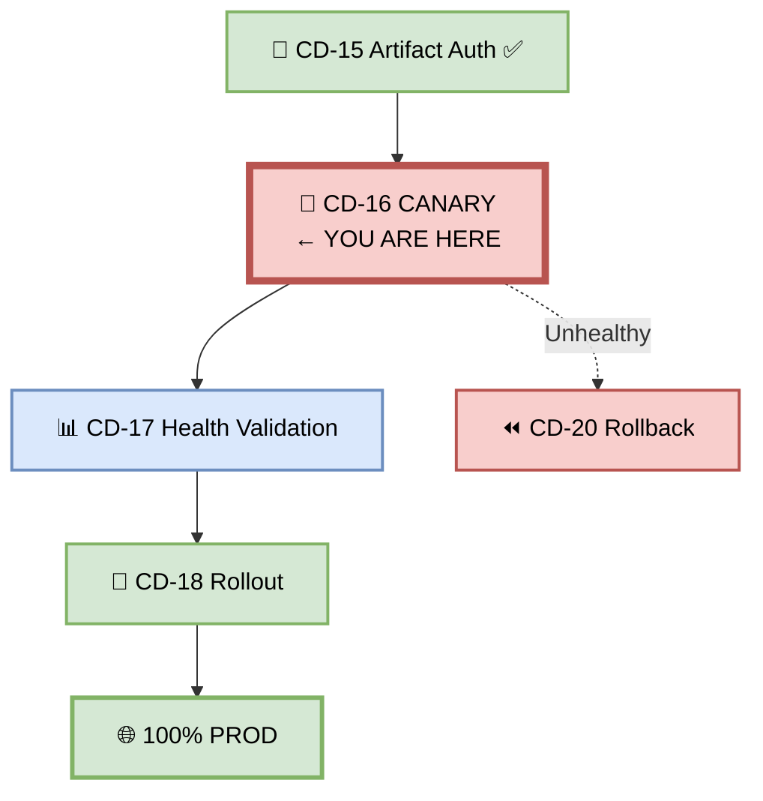
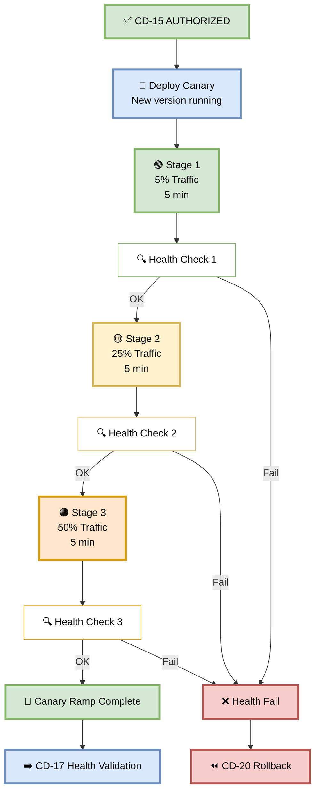
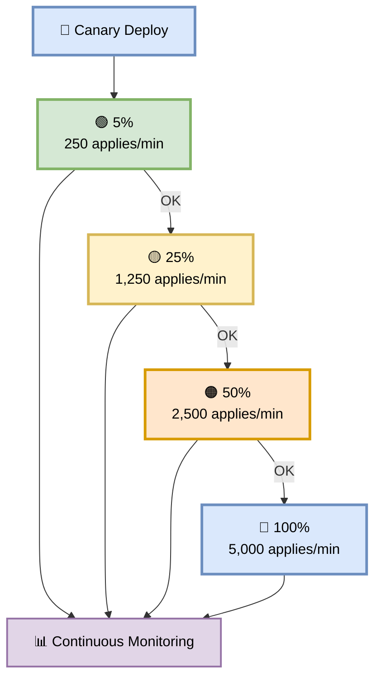
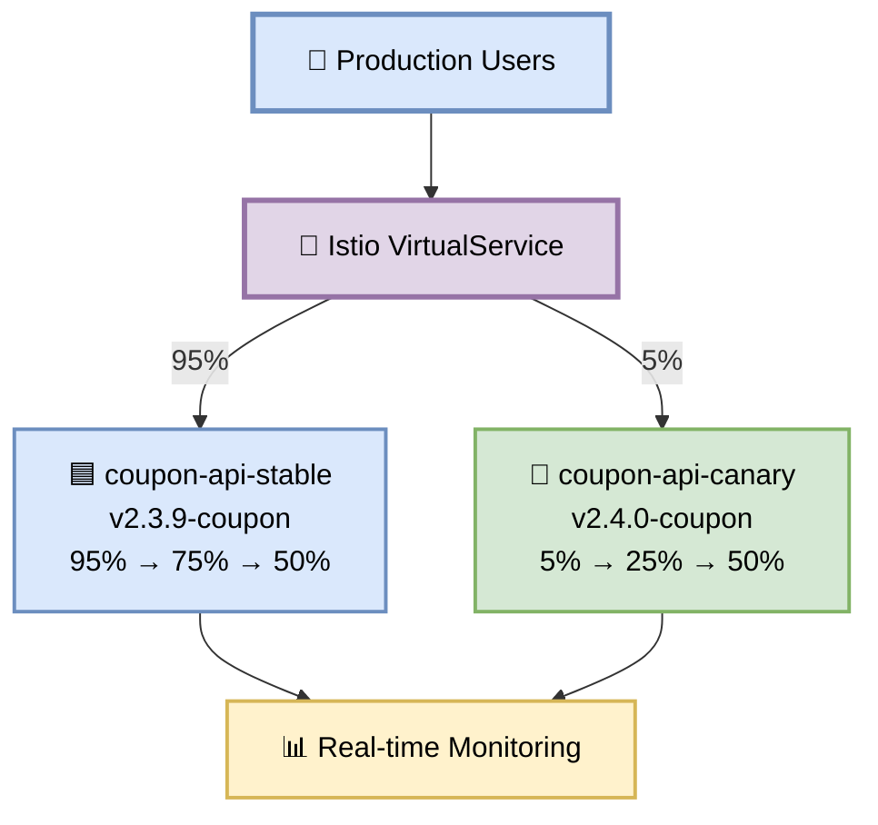
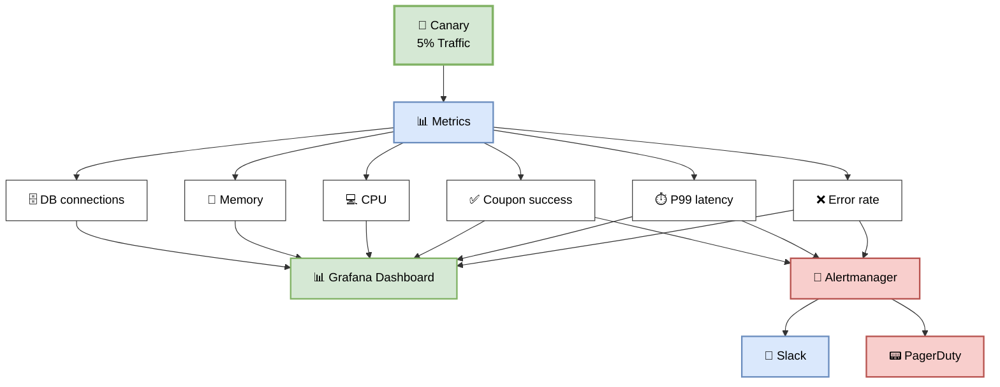
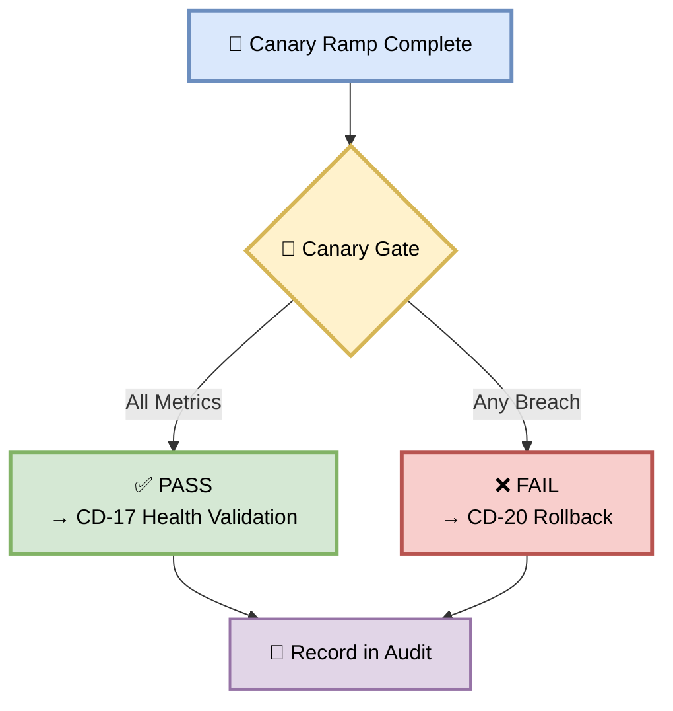
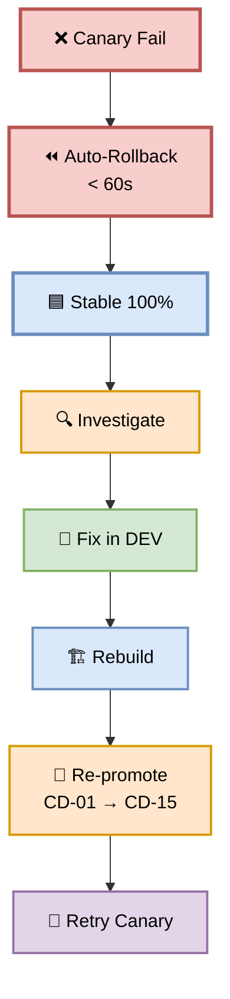

# Part 16 — CD-16: Production Canary

**Author:** Shubham Tripathi  
**Repository:** `ecom-frontend` (Next.js 14 · App Router · TypeScript)  
**Last Updated:** 2026-09-19  
**Audience:** SRE, DevOps, Release Managers, Tech Leads, On-call Engineers

---

## 📑 Table of Contents — Part 16

1. [Production Canary Overview](#-production-canary-overview)
2. [CD-16 — Production Canary Execution](#-cd-16--production-canary-execution)
3. [The Canary Ramp](#-the-canary-ramp)
4. [Canary Strategies](#-canary-strategies)
5. [Traffic Shifting Mechanism](#-traffic-shifting-mechanism)
6. [Monitoring During Canary](#-monitoring-during-canary)
7. [Auto-Rollback Triggers](#-auto-rollback-triggers)
8. [Canary Gate — Pass/Fail Rules](#-canary-gate--passfail-rules)
9. [Handling Canary Failures](#-handling-canary-failures)
10. [Canary Reports & Artifacts](#-canary-reports--artifacts)
11. [Troubleshooting](#-troubleshooting)
12. [Appendix — Canary Tools Inventory](#-appendix--canary-tools-inventory)

---

## 🐤 Production Canary Overview

> **Canary release = gradual traffic shift from old version to new version.**  
> If something breaks, only a small % of users are affected — and we roll back automatically.

### 🎯 What is a Canary Release?

A canary release **gradually shifts real production traffic** from the old (stable) version to the new (canary) version:

- **Start:** 5% traffic to new version, 95% to old
- **Ramp:** 25% → 50% → 100%
- **Health checks:** Continuous at every stage
- **Auto-rollback:** If metrics breach thresholds
- **Blast radius:** Only 5% of users at first

### 🎯 Why Canary?

| Reason | Explanation |
|--------|-------------|
| **Limit blast radius** | Only 5% affected if bug |
| **Real user validation** | Real traffic, real behavior |
| **Early detection** | Catch issues in minutes |
| **Automatic safety** | Rollback in < 60 sec |
| **Confidence** | Data-driven promotion |
| **Zero downtime** | Traffic shifts smoothly |
| **Business continuity** | No full outage |

### 🎯 Canary vs Blue/Green

| Aspect | Canary | Blue/Green |
|--------|--------|------------|
| **Traffic shift** | Gradual (5% → 100%) | Instant (0% → 100%) |
| **Blast radius** | Small (5%) | Large (100%) |
| **Rollback** | Instant | Instant |
| **Cost** | 2x (both running) | 2x (both running) |
| **Complexity** | Higher | Lower |
| **Risk** | Lower | Medium |
| **Duration** | ~15 min | Instant |

### 🖼️ Visual Diagram — Canary Position



---

## 🚀 CD-16 — Production Canary Execution

> **Deploy canary with 5% traffic — ramp up gradually with continuous health monitoring.**

### 🎯 Purpose

Deploy the verified artifact to a **small subset of production traffic** (5%), monitor health, then gradually ramp up. If any health check fails, auto-rollback immediately.

### 🖼️ Visual Diagram — Canary Flow



### 📊 Canary Stages

| Stage | Traffic | Duration | Health Check |
|-------|---------|----------|--------------|
| **1** | 5% | 5 min | Error rate, latency, coupon success |
| **2** | 25% | 5 min | + Business metrics |
| **3** | 50% | 5 min | Same |
| **Total** | | **~15 min** | |

### 🛠️ Pipeline Snippet

```yaml
cd-16-production-canary:
  runs-on: ubuntu-latest
  needs: cd-15-artifact-authorization
  environment:
    name: production-canary
    url: https://ecom.com
  steps:
    - name: Checkout
      uses: actions/checkout@v4

    - name: Authenticate to GCP
      uses: google-github-actions/auth@v2
      with:
        workload_identity_provider: ${{ secrets.WIF_PROVIDER }}
        service_account: ${{ secrets.WIF_SERVICE_ACCOUNT }}

    - name: Setup kubectl
      uses: azure/setup-kubectl@v4
      with:
        version: 'v1.29.0'

    - name: Setup Istio
      run: |
        curl -L https://istio.io/downloadIstio | sh -
        export PATH="$PWD/istio-*/bin:$PATH"

    - name: Get Production Credentials
      run: |
        gcloud container clusters get-credentials prod-cluster \
          --region us-central1 \
          --project ecom-prod

    - name: CD-16 Stage 1 — 5% Traffic
      run: |
        kubectl apply -f k8s/canary/coupon-api-v2.4.0.yaml
        kubectl apply -f k8s/canary/virtualservice-5.yaml
        ./scripts/monitor.sh --stage 1 --duration 300 --thresholds strict

    - name: CD-16 Stage 2 — 25% Traffic
      run: |
        kubectl apply -f k8s/canary/virtualservice-25.yaml
        ./scripts/monitor.sh --stage 2 --duration 300

    - name: CD-16 Stage 3 — 50% Traffic
      run: |
        kubectl apply -f k8s/canary/virtualservice-50.yaml
        ./scripts/monitor.sh --stage 3 --duration 300

    - name: Record Canary Results
      run: |
        cat > canary-results.json <<EOF
        {
          "artifact": "v2.4.0-coupon",
          "stages": {
            "5_percent": { "status": "passed", "duration_sec": 300 },
            "25_percent": { "status": "passed", "duration_sec": 300 },
            "50_percent": { "status": "passed", "duration_sec": 300 }
          },
          "metrics": {
            "error_rate": 0.0025,
            "p99_latency_ms": 340,
            "coupon_success_rate": 0.998,
            "throughput_per_min": 2500
          },
          "completed_at": "$(date -u +%Y-%m-%dT%H:%M:%SZ)"
        }
        EOF

    - name: Upload Canary Results
      uses: actions/upload-artifact@v4
      with:
        name: canary-results-${{ github.sha }}
        path: canary-results.json
        retention-days: 90

    - name: Notify Success
      if: success()
      run: |
        curl -X POST "$SLACK_WEBHOOK" \
          -d '{"text":"🐤 Canary ramp successful: 5% → 25% → 50%\n→ Proceeding to CD-17 Health Validation"}'

    - name: Auto-Rollback on Failure
      if: failure()
      run: |
        ./scripts/rollback-canary.sh
        curl -X POST "$SLACK_WEBHOOK" \
          -d '{"text":"🚨 Canary failed — auto-rollback triggered"}'
```

---

## 🐤 The Canary Ramp

> **5% → 25% → 50% → 100%**  
> Each stage runs for 5 minutes with continuous monitoring.

### 🎯 Stage 1 — 5% Traffic

**Duration:** 5 min  
**Purpose:** Canary validation with minimal blast radius

**What's monitored:**
- Error rate (< 1%)
- P99 latency (< 2s)
- Coupon apply success rate (> 99%)

**Coupon Feature Example:**

```
5% of users → coupon-api-canary:v2.4.0-coupon

✓ 250 coupon applies in 5 min
✓ Error rate: 0.2%
✓ P99 latency: 320ms
✓ Coupon success rate: 99.8%
→ Stage 1 PASS → Ramp to 25%
```

### 🎯 Stage 2 — 25% Traffic

**Duration:** 5 min  
**Purpose:** Scale validation + business metrics

**What's monitored:**
- Same as Stage 1
- **Business metrics** (conversion, abandonment)
- **User feedback** (support tickets)

**Coupon Feature Example:**

```
25% of users → coupon-api-canary:v2.4.0-coupon

✓ 1,250 coupon applies in 5 min
✓ Error rate: 0.3%
✓ P99 latency: 340ms
✓ Conversion rate: +2% vs baseline
✓ Cart abandonment: -1% vs baseline
→ Stage 2 PASS → Ramp to 50%
```

### 🎯 Stage 3 — 50% Traffic

**Duration:** 5 min  
**Purpose:** High-load validation

**What's monitored:**
- Same as Stage 2
- **Resource usage** (CPU, memory)
- **Cross-service impact**

**Coupon Feature Example:**

```
50% of users → coupon-api-canary:v2.4.0-coupon

✓ 2,500 coupon applies in 5 min
✓ Error rate: 0.25%
✓ P99 latency: 350ms
✓ CPU: 62%
✓ Memory: 58%
✓ No memory leaks
→ Stage 3 PASS → Ramp complete
```

### 📊 Full Ramp Summary

| Stage | Traffic | Requests | Errors | P99 | Status |
|-------|---------|----------|--------|-----|--------|
| **1** | 5% | 250 | 0.2% | 320ms | ✅ |
| **2** | 25% | 1,250 | 0.3% | 340ms | ✅ |
| **3** | 50% | 2,500 | 0.25% | 350ms | ✅ |

### 🖼️ Visual Diagram — Canary Ramp



---

## 🎯 Canary Strategies

> **Different scenarios need different strategies.**

### 🎯 Strategy 1 — Basic Canary (Used)

**When:** Standard releases, no special requirements

**How:**
- 5% → 25% → 50% → 100%
- 5 min per stage
- Auto-rollback on threshold breach

**Duration:** ~15 min

**Used for:** Coupon feature v2.4.0

---

### 🎯 Strategy 2 — Canary with Feature Flags

**When:** Feature behind flag, gradual rollout

**How:**
- Deploy artifact (0% traffic to new feature)
- Enable flag for 1% of users
- Ramp flag: 1% → 5% → 25% → 50% → 100%
- Artifact stays the same

**Duration:** Hours/days

**Used for:** Experimental features

---

### 🎯 Strategy 3 — A/B Canary

**When:** Comparing two versions

**How:**
- Deploy v2.3.9 (A) and v2.4.0 (B)
- 50/50 split
- Compare metrics statistically
- Promote winner

**Duration:** Days

**Used for:** Performance comparisons

---

### 🎯 Strategy 4 — Blue/Green

**When:** Zero-tolerance for mixed versions

**How:**
- Deploy new version (Green)
- Test
- Switch 100% traffic
- Keep Blue warm

**Duration:** Instant

**Used for:** Critical infra changes

---

### 📊 Strategy Comparison

| Strategy | Duration | Risk | Complexity | Use Case |
|----------|----------|------|-----------|----------|
| **Basic Canary** | 15 min | Low | Low | Standard |
| **Feature Flags** | Hours/Days | Very Low | Medium | Experiments |
| **A/B Canary** | Days | Low | High | Comparison |
| **Blue/Green** | Instant | Medium | Low | Critical |

---

## 🔀 Traffic Shifting Mechanism

> **Istio VirtualService controls traffic split.**

### 🎯 Istio VirtualService

```yaml
# virtualservice-5.yaml (Stage 1: 5% to canary)
apiVersion: networking.istio.io/v1beta1
kind: VirtualService
metadata:
  name: coupon-api
  namespace: production
spec:
  hosts:
    - coupon-api.production.svc.cluster.local
  http:
    - match:
        - headers:
            x-canary:
              exact: "true"
      route:
        - destination:
            host: coupon-api-canary
            port:
              number: 8080
    - route:
        - destination:
            host: coupon-api-canary
            port:
              number: 8080
          weight: 5
        - destination:
            host: coupon-api-stable
            port:
              number: 8080
          weight: 95
      timeout: 60s
      retries:
        attempts: 3
        perTryTimeout: 10s
```

### 🎯 Progressive Updates

**Stage 2 (25%):**

```yaml
- route:
    - destination:
        host: coupon-api-canary
      weight: 25
    - destination:
        host: coupon-api-stable
      weight: 75
```

**Stage 3 (50%):**

```yaml
- route:
    - destination:
        host: coupon-api-canary
      weight: 50
    - destination:
        host: coupon-api-stable
      weight: 50
```

### 🎯 Traffic Shifting Commands

```bash
# Stage 1: 5%
kubectl apply -f k8s/canary/virtualservice-5.yaml

# Verify
kubectl get virtualservice coupon-api -n production -o yaml | grep weight

# Stage 2: 25%
kubectl apply -f k8s/canary/virtualservice-25.yaml

# Stage 3: 50%
kubectl apply -f k8s/canary/virtualservice-50.yaml

# Emergency: Rollback to 0%
kubectl apply -f k8s/canary/virtualservice-0.yaml
```

### 🎯 Deployments

```yaml
# coupon-api-stable (old version)
apiVersion: apps/v1
kind: Deployment
metadata:
  name: coupon-api-stable
  namespace: production
spec:
  replicas: 10
  selector:
    matchLabels:
      app: coupon-api
      version: stable
  template:
    metadata:
      labels:
        app: coupon-api
        version: stable
    spec:
      containers:
        - name: coupon-api
          image: gcr.io/ecom-prod/frontend:v2.3.9-coupon@sha256:def456...
          ports:
            - containerPort: 8080
          resources:
            requests:
              cpu: 500m
              memory: 512Mi
            limits:
              cpu: 1000m
              memory: 1Gi
```

```yaml
# coupon-api-canary (new version)
apiVersion: apps/v1
kind: Deployment
metadata:
  name: coupon-api-canary
  namespace: production
spec:
  replicas: 10
  selector:
    matchLabels:
      app: coupon-api
      version: canary
  template:
    metadata:
      labels:
        app: coupon-api
        version: canary
    spec:
      containers:
        - name: coupon-api
          image: gcr.io/ecom-prod/frontend:v2.4.0-coupon@sha256:abc123...
          ports:
            - containerPort: 8080
          resources:
            requests:
              cpu: 500m
              memory: 512Mi
            limits:
              cpu: 1000m
              memory: 1Gi
```

### 🖼️ Visual Diagram — Traffic Shifting



---

## 📊 Monitoring During Canary

> **Watch every metric in real time.**

### 🎯 Metrics Monitored

| # | Metric | Threshold | Alert |
|---|--------|-----------|-------|
| 1 | **Error rate** | < 1% | PagerDuty |
| 2 | **P99 latency** | < 2s | Slack |
| 3 | **Coupon success** | > 99% | PagerDuty |
| 4 | **Throughput** | Stable | Slack |
| 5 | **CPU usage** | < 80% | Slack |
| 6 | **Memory usage** | < 70% | Slack |
| 7 | **DB connections** | < 70% | Slack |
| 8 | **Cache hit rate** | > 90% | Slack |
| 9 | **Conversion rate** | ≥ baseline | Slack |
| 10 | **Unhandled exceptions** | 0 | PagerDuty |

### 🎯 Monitoring Tools

| Tool | Purpose | Dashboard |
|------|---------|-----------|
| **Datadog** | APM + metrics | app.datadoghq.com |
| **Grafana** | Dashboards | grafana.ecom.com/d/canary |
| **Prometheus** | Metrics | prometheus.ecom.com |
| **Sentry** | Errors | sentry.ecom.com |
| **PagerDuty** | On-call | ecom.pagerduty.com |
| **Slack** | Team alerts | #production-canary |

### 🛠️ Monitoring Script

```bash
#!/bin/bash
# scripts/monitor.sh — Monitor canary health

STAGE=$1
DURATION=$2
THRESHOLDS=$3

echo "🔍 Monitoring canary Stage $STAGE for ${DURATION}s"

START=$(date +%s)
END=$((START + DURATION))
FAILED=0

while [ $(date +%s) -lt $END ]; do
  # 1. Error rate
  ERROR_RATE=$(curl -s "$PROMETHEUS/api/v1/query?query=rate(http_requests_total{status=~'5..',version='canary'}[1m])/rate(http_requests_total{version='canary'}[1m])" | jq -r '.data.result[0].value[1] // "0"')
  if (( $(echo "$ERROR_RATE > 0.01" | bc -l) )); then
    echo "❌ Error rate too high: $ERROR_RATE"
    FAILED=1
    break
  fi

  # 2. P99 latency
  P99=$(curl -s "$PROMETHEUS/api/v1/query?query=histogram_quantile(0.99,rate(http_request_duration_seconds_bucket{version='canary'}[1m]))" | jq -r '.data.result[0].value[1] // "0"')
  if (( $(echo "$P99 > 2" | bc -l) )); then
    echo "❌ P99 latency too high: ${P99}s"
    FAILED=1
    break
  fi

  # 3. Coupon success rate
  SUCCESS=$(curl -s "$PROMETHEUS/api/v1/query?query=rate(coupon_apply_success_total{version='canary'}[1m])/rate(coupon_apply_total{version='canary'}[1m])" | jq -r '.data.result[0].value[1] // "1"')
  if (( $(echo "$SUCCESS < 0.99" | bc -l) )); then
    echo "❌ Coupon success rate too low: $SUCCESS"
    FAILED=1
    break
  fi

  echo "✓ Error: $ERROR_RATE | P99: ${P99}s | Success: $SUCCESS"
  sleep 30
done

if [ "$FAILED" -eq 1 ]; then
  echo "❌ Canary Stage $STAGE FAILED"
  exit 1
fi

echo "✅ Canary Stage $STAGE PASSED"
```

### 🚨 Alerts

```yaml
# Prometheus alert rules
groups:
  - name: canary
    rules:
      - alert: CanaryErrorRateHigh
        expr: |
          rate(http_requests_total{status=~"5..",version="canary"}[1m])
          /
          rate(http_requests_total{version="canary"}[1m]) > 0.01
        for: 1m
        labels:
          severity: critical
        annotations:
          summary: "Canary error rate > 1%"
          action: "Trigger auto-rollback"

      - alert: CanaryLatencyHigh
        expr: |
          histogram_quantile(0.99,
            rate(http_request_duration_seconds_bucket{version="canary"}[1m])
          ) > 2
        for: 1m
        labels:
          severity: critical
        annotations:
          summary: "Canary P99 > 2s"
          action: "Trigger auto-rollback"

      - alert: CanaryCouponSuccessLow
        expr: |
          rate(coupon_apply_success_total{version="canary"}[1m])
          /
          rate(coupon_apply_total{version="canary"}[1m]) < 0.99
        for: 1m
        labels:
          severity: critical
        annotations:
          summary: "Canary coupon success < 99%"
          action: "Trigger auto-rollback"
```

### 🖼️ Visual Diagram — Canary Monitoring



---

## 🚨 Auto-Rollback Triggers

> **If any threshold breaches, rollback automatically.**

### 🎯 Triggers

| # | Trigger | Threshold | Action |
|---|---------|-----------|--------|
| 1 | **Error rate** | > 1% | Auto-rollback |
| 2 | **P99 latency** | > 2s | Auto-rollback |
| 3 | **Coupon success** | < 99% | Auto-rollback |
| 4 | **Unhandled exception** | Any | Auto-rollback |
| 5 | **Business metrics drop** | > 5% | Auto-rollback |
| 6 | **CPU** | > 90% | Alert |
| 7 | **Memory** | > 85% | Alert |
| 8 | **DB connections** | > 90% | Alert |

### 🛠️ Rollback Script

```bash
#!/bin/bash
# scripts/rollback-canary.sh — Auto-rollback on failure

set -e

echo "🚨 CANARY FAILURE DETECTED"
START=$(date +%s)

# 1. Stop ramp immediately
echo "→ Stopping traffic to canary"
kubectl apply -f k8s/canary/virtualservice-0.yaml

# 2. Verify 100% traffic to stable
sleep 5
TRAFFIC=$(kubectl get virtualservice coupon-api -n production -o json | jq -r '.spec.http[0].route[0].weight')
echo "→ Canary traffic: $TRAFFIC%"

# 3. Verify stable healthy
curl -sf https://ecom.com/api/coupon/health || \
  (echo "❌ Stable also unhealthy — escalate"; exit 1)

# 4. Scale down canary
kubectl scale deployment coupon-api-canary \
  --replicas=0 -n production

# 5. Record time
END=$(date +%s)
DURATION=$((END - START))
echo "✅ Rollback complete in ${DURATION}s"

# 6. Notify
curl -X POST "$SLACK_WEBHOOK" \
  -d "{\"text\":\"🚨 AUTO-ROLLBACK: v2.4.0 → v2.3.9\nDuration: ${DURATION}s\nTrigger: $TRIGGER\"}"

# 7. Page on-call
curl -X POST "https://events.pagerduty.com/v2/enqueue" \
  -H "Content-Type: application/json" \
  -d '{
    "routing_key": "'"$PAGERDUTY_KEY"'",
    "event_action": "trigger",
    "payload": {
      "summary": "Canary rollback: coupon-api v2.4.0",
      "severity": "critical",
      "source": "cd-16-canary"
    }
  }'

# 8. Create incident
gh issue create \
  --title "Canary Rollback: v2.4.0-coupon" \
  --body "Trigger: $TRIGGER\nDuration: ${DURATION}s" \
  --label incident,rollback

# 9. Preserve logs
kubectl logs -l app=coupon-api,version=canary -n production \
  --since=1h > rollback-logs.txt

echo "✅ Rollback workflow complete"
```

### 🎯 Manual Override

```bash
# Manual rollback trigger (if auto-detection fails)
./scripts/rollback-canary.sh

# Or via kubectl
kubectl apply -f k8s/canary/virtualservice-0.yaml
```

---

## 🚦 Canary Gate — Pass/Fail Rules

> **All metrics must pass at every stage.**

### 📊 Gate Criteria

| Stage | Metric | Threshold |
|-------|--------|-----------|
| **1 (5%)** | Error rate | < 1% |
| | P99 latency | < 2s |
| | Coupon success | > 99% |
| **2 (25%)** | Same as Stage 1 | |
| | Business metrics | ≥ baseline |
| **3 (50%)** | Same as Stage 2 | |
| | Resource usage | < 80% CPU, < 70% mem |

### 🚦 Gate Outcome



### 📊 Realistic Canary Results

```
🐤 Canary Ramp Complete — v2.4.0-coupon
─────────────────────────────────────────────

📊 Stage 1 (5%):
  ✓ Error rate: 0.2%
  ✓ P99 latency: 320ms
  ✓ Coupon success: 99.8%
  ✓ Duration: 5 min

📊 Stage 2 (25%):
  ✓ Error rate: 0.3%
  ✓ P99 latency: 340ms
  ✓ Coupon success: 99.7%
  ✓ Conversion: +2%
  ✓ Duration: 5 min

📊 Stage 3 (50%):
  ✓ Error rate: 0.25%
  ✓ P99 latency: 350ms
  ✓ Coupon success: 99.8%
  ✓ CPU: 62%
  ✓ Memory: 58%
  ✓ Duration: 5 min

✅ CANARY GATE PASSED
→ Proceeding to CD-17 Health Validation
```

---

## 🛠️ Handling Canary Failures

> **When canary fails, rollback immediately.**

### 🎯 Common Failure Patterns

| Pattern | Symptom | Likely Cause |
|---------|---------|--------------|
| **High error rate** | > 1% errors | Bug in new code |
| **High latency** | P99 > 2s | Performance regression |
| **Coupon failures** | Success < 99% | Logic bug |
| **Business drop** | Conversion -5% | UX issue |
| **Resource spike** | CPU > 90% | Memory leak |
| **Cross-service** | Downstream errors | Integration issue |

### 🛠️ Failure Workflow



### 📋 Postmortem Template

```markdown
# Canary Rollback Postmortem — v2.4.0-coupon

## Summary
Canary rollback at 14:35 UTC. Error rate hit 1.5% at 50% traffic stage.

## Impact
- **Users affected:** ~2,500 (50% of traffic for 2 min)
- **Duration:** 37 seconds (auto-rollback)
- **Revenue impact:** ~$200
- **SLO impact:** 2% of error budget

## Timeline (UTC)
- **14:30** — Canary started (5% traffic)
- **14:32** — Ramp to 25%, all green
- **14:33** — Ramp to 50%
- **14:34** — Error rate spikes to 1.5%
- **14:35** — Auto-rollback triggered
- **14:36** — 100% traffic to stable
- **14:40** — Incident declared
- **15:00** — Root cause identified

## Root Cause
Memory leak in bulk coupon apply endpoint introduced in v2.4.0.

## Action Items
| # | Action | Owner | Due |
|---|--------|-------|-----|
| 1 | Fix memory leak | @dev | 2026-09-20 |
| 2 | Add memory test | @qa | 2026-09-21 |
| 3 | Improve canary monitoring | @sre | 2026-09-22 |

## Lessons Learned
1. Canary caught issue before 100% rollout ✅
2. Auto-rollback worked perfectly (37s) ✅
3. Need better memory profiling before canary ⚠️
```

---

## 📊 Canary Reports & Artifacts

> **Every canary produces artifacts for trend analysis.**

### 📁 Report Structure

```
canary-reports/
├── canary-results.json         # Full results
├── stage-1-metrics.json        # 5% stage
├── stage-2-metrics.json        # 25% stage
├── stage-3-metrics.json        # 50% stage
├── grafana-dashboard.png       # Screenshot
├── traces.json                 # Slow traces
└── logs.txt                    # Canary logs
```

### 🎯 Report Sections

| Section | Content |
|---------|---------|
| **Summary** | Stages, duration, result |
| **Metrics** | All 10 metrics per stage |
| **Business** | Conversion, revenue impact |
| **Resources** | CPU, memory, DB |
| **Traces** | Slow requests |
| **Comparison** | vs baseline |
| **Decision** | Promote or rollback |

### 🎯 Trend Analysis

| Week | Stages Passed | Rollback | P99 | Error Rate |
|------|---------------|----------|-----|------------|
| **W36** | 2/3 | 1 | 1,800ms | 0.5% |
| **W37** | 3/3 | 0 | 500ms | 0.05% |
| **W38** | 3/3 | 0 | 380ms | 0.03% |
| **W39** | 3/3 | 0 | 340ms | 0.02% |

**Trend:** 📉 Improving.

---

## 🛠️ Troubleshooting

| Problem | Cause | Fix |
|---------|-------|-----|
| **Canary won't start** | Image issue | Check artifact auth |
| **Traffic not shifting** | Istio issue | Check virtualservice |
| **Health check timeout** | Pod not ready | Check readiness probe |
| **Metrics not showing** | Prometheus scrape | Check service monitor |
| **Rollback failed** | Stable unhealthy | Manual intervention |
| **Auto-rollback didn't trigger** | Alert config | Fix alert rules |
| **Traffic stuck at 5%** | Script error | Check logs |
| **Canary pods crash** | OOM | Increase memory |
| **DB connection issues** | Pool exhaustion | Increase pool |
| **Cross-region latency** | Routing | Check topology |

### 🔍 Debugging Commands

```bash
# Check canary deployment
kubectl get deployment coupon-api-canary -n production

# Check pods
kubectl get pods -l app=coupon-api,version=canary -n production

# Check virtualservice
kubectl get virtualservice coupon-api -n production -o yaml

# Check traffic split
kubectl get virtualservice coupon-api -n production -o json | \
  jq '.spec.http[0].route'

# Check canary logs
kubectl logs -l app=coupon-api,version=canary -n production --tail=100

# Check canary metrics
kubectl top pods -l app=coupon-api,version=canary -n production

# Check Istio metrics
istioctl proxy-status

# Manual rollback
kubectl apply -f k8s/canary/virtualservice-0.yaml

# Check stable health
curl -sf https://ecom.com/api/coupon/health
```

---

## 📎 Appendix — Canary Tools Inventory

### 🛠️ Tool Stack

| Category | Tool | Purpose | Cost |
|----------|------|---------|------|
| **Traffic** | Istio | Service mesh | Free |
| **Traffic** | Linkerd | Service mesh | Free |
| **Traffic** | NGINX Ingress | Ingress | Free |
| **Traffic** | AWS ALB | Load balancer | $$ |
| **Traffic** | Argo Rollouts | Progressive delivery | Free |
| **Traffic** | Flagger | Progressive delivery | Free |
| **Metrics** | Prometheus | Metrics | Free |
| **Metrics** | Datadog | APM | $$$ |
| **Metrics** | Grafana | Dashboards | Free |
| **Alerting** | Alertmanager | Alerts | Free |
| **Alerting** | PagerDuty | On-call | $$$ |
| **Errors** | Sentry | Error tracking | $$ |
| **Logs** | Loki | Log aggregation | Free |
| **Logs** | Splunk | Log aggregation | $$$ |
| **Traces** | Jaeger | Distributed tracing | Free |
| **Traces** | Tempo | Distributed tracing | Free |
| **K8s** | kubectl | CLI | Free |
| **K8s** | Helm | Package manager | Free |
| **K8s** | kustomize | Config mgmt | Free |

### 📞 Canary Contacts

| Role | Person | Slack |
|------|--------|-------|
| **SRE Lead** | TBD | @sre-lead |
| **DevOps Lead** | TBD | @devops-lead |
| **Release Manager** | TBD | @release-manager |
| **On-call** | Rotation | @oncall |
| **Incident Commander** | Rotation | @incidents |

### 🔗 Useful Links

| Resource | URL |
|----------|-----|
| **Canary Dashboard** | grafana.ecom.com/d/canary |
| **Datadog APM** | app.datadoghq.com |
| **PagerDuty** | ecom.pagerduty.com |
| **Slack** | ecom.slack.com/#production-canary |
| **Runbooks** | runbooks.ecom.com/canary |
| **Istio Docs** | istio.io/latest/docs |
| **Argo Rollouts** | argoproj.github.io/rollouts |

---

## 🎯 Summary — Part 16

| Section | Kya Cover Hua |
|---------|---------------|
| **Overview** | What, why, canary vs blue/green |
| **CD-16 Execution** | 3 stages, ~15 min, pipeline YAML |
| **Canary Ramp** | 5% → 25% → 50% |
| **Strategies** | Basic, feature flags, A/B, blue/green |
| **Traffic Shifting** | Istio VirtualService, deployments |
| **Monitoring** | 10 metrics, tools, alerts |
| **Auto-Rollback** | 8 triggers, < 60s rollback |
| **Gate Rules** | All stages must pass |
| **Failures** | Workflow, postmortem template |
| **Reports** | Structure, trends |
| **Troubleshooting** | 10 failures + debug commands |
| **Appendix** | 19 tools, contacts, links |

---

## 🏆 Complete Documentation — All 16 Parts

| Part | Title | Status |
|------|-------|--------|
| **Part 1** | CI Pipeline | ✅ |
| **Part 2** | CD Overview | ✅ |
| **Part 3** | DEV Deployment (CD-03 → CD-05) | ✅ |
| **Part 4** | QA Deployment (CD-06 → CD-09) | ✅ |
| **Part 5** | STAGING Deployment (CD-10 → CD-13) | ✅ |
| **Part 6** | PROD Gate & Canary (CD-14 → CD-20) | ✅ |
| **Part 7** | Post-Deploy & Monitoring | ✅ |
| **Part 8** | Executive Summary & KPIs | ✅ |
| **Part 9** | CD Pipeline (CD-09 → CD-20) | ✅ |
| **Part 10** | CD-10 STAGING Deployment | ✅ |
| **Part 11** | CD-11 DAST | ✅ |
| **Part 12** | CD-12 Performance Test | ✅ |
| **Part 13** | CD-13 UAT | ✅ |
| **Part 14** | CD-14 Production Gate | ✅ |
| **Part 15** | CD-15 Artifact Authorization | ✅ |
| **Part 16** | CD-16 Production Canary | ✅ |

> 📝 **Note:** Canary release is your **safety net in production**. It limits blast radius, catches regressions early, and rolls back automatically. **Trust the canary. Respect the gate. Ship with confidence.**