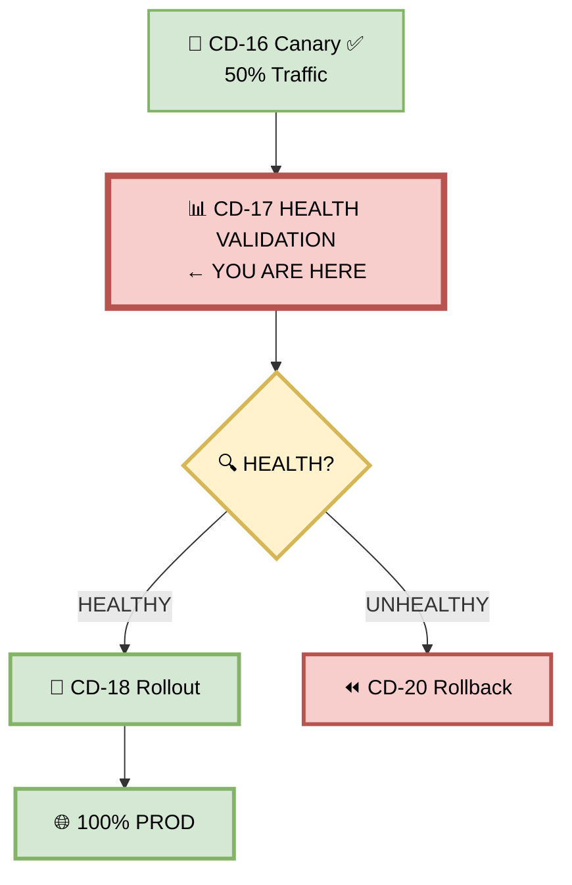
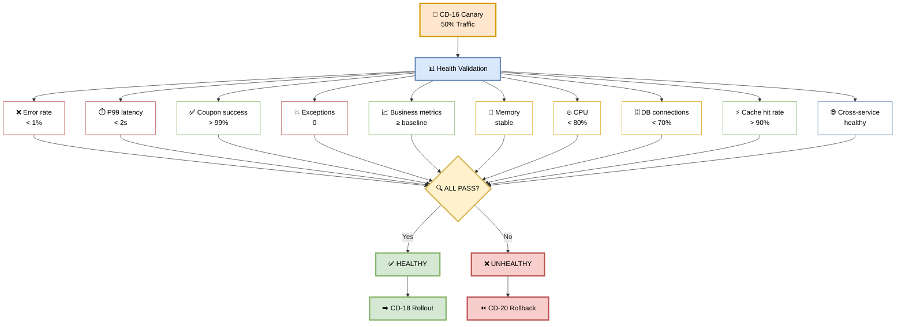
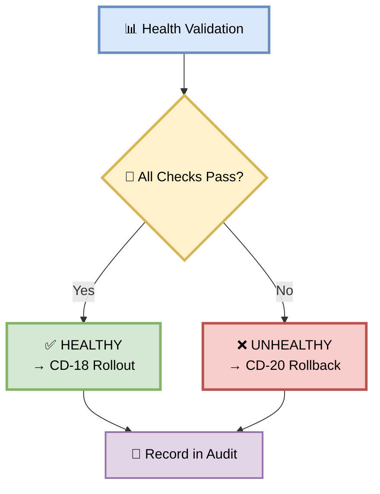
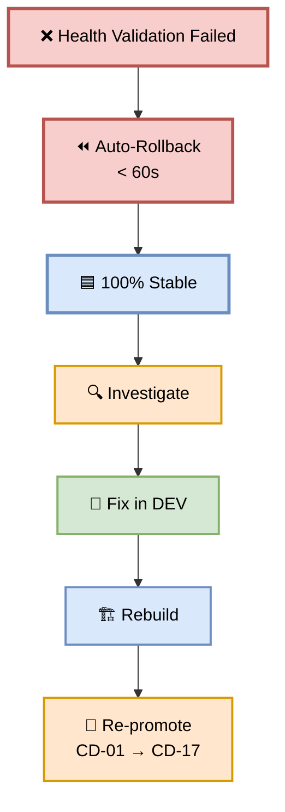

# Part 17 — CD-17: Health Validation

**Author:** Shubham Tripathi  
**Repository:** `ecom-frontend` (Next.js 14 · App Router · TypeScript)  
**Last Updated:** 2026-09-19  
**Audience:** SRE, DevOps, Release Managers, Tech Leads, On-call Engineers

---

## 📑 Table of Contents — Part 17

1. [Health Validation Overview](#-health-validation-overview)
2. [CD-17 — Health Validation Execution](#-cd-17--health-validation-execution)
3. [The 10 Health Checks](#-the-10-health-checks)
4. [Metrics Validation](#-metrics-validation)
5. [Business Metrics Validation](#-business-metrics-validation)
6. [Dependency Health Checks](#-dependency-health-checks)
7. [Health Validation Gate — Pass/Fail Rules](#-health-validation-gate--passfail-rules)
8. [Handling Health Failures](#-handling-health-failures)
9. [Health Reports & Artifacts](#-health-reports--artifacts)
10. [Troubleshooting](#-troubleshooting)
11. [Appendix — Health Validation Tools Inventory](#-appendix--health-validation-tools-inventory)

---

## 📊 Health Validation Overview

> **Health Validation = final validation after canary ramp.**  
> It confirms the new version is production-ready before promoting to 100%.

### 🎯 What is Health Validation?

Health Validation is a **comprehensive post-canary check**:
- **When:** After CD-16 canary ramp completes (50% traffic)
- **What:** 10 health checks across metrics, business, dependencies
- **Duration:** ~5 minutes
- **Purpose:** Final go/no-go decision for full rollout
- **Output:** HEALTHY → rollout OR UNHEALTHY → rollback

### 🎯 Why Health Validation?

| Reason | Explanation |
|--------|-------------|
| **Final checkpoint** | Last chance before 100% |
| **Comprehensive** | More than canary metrics |
| **Business validation** | Real revenue impact |
| **Dependency check** | All services healthy |
| **Gate authority** | Binary decision |
| **Audit trail** | Documented go/no-go |

### 🎯 Health Validation vs Canary Monitoring

| Aspect | Canary (CD-16) | Health Validation (CD-17) |
|--------|----------------|---------------------------|
| **When** | During ramp | After ramp |
| **Traffic** | 5% → 50% | 50% |
| **Duration** | 15 min | 5 min |
| **Metrics** | Basic (error, latency) | Comprehensive (10 checks) |
| **Depth** | Continuous | Snapshot |
| **Outcome** | Continue or rollback | Rollout or rollback |

### 🖼️ Visual Diagram — Health Validation Position



---

## 🚀 CD-17 — Health Validation Execution

> **10 checks in ~5 minutes — final go/no-go decision.**

### 🎯 Purpose

Validate that the new version is **fully healthy** after reaching 50% traffic. This is the **last checkpoint** before full production rollout.

### 🖼️ Visual Diagram — Health Validation Flow



### 📊 Health Validation Stages

| Stage | Action | Duration | Owner |
|-------|--------|----------|-------|
| **1. Setup** | Query metrics | ~30 sec | CI |
| **2. Metrics** | Validate technical metrics | ~1 min | CI |
| **3. Business** | Validate business metrics | ~1 min | CI |
| **4. Dependencies** | Check all services | ~1 min | CI |
| **5. Decision** | Compute health score | ~30 sec | CI |
| **6. Record** | Log + notify | ~1 min | CI |
| **Total** | | **~5 min** | |

### 🛠️ Pipeline Snippet

```yaml
cd-17-health-validation:
  runs-on: ubuntu-latest
  needs: cd-16-production-canary
  steps:
    - name: Checkout
      uses: actions/checkout@v4

    - name: CD-17 Health Validation
      run: ./scripts/health-validation.sh

    - name: Record Health Report
      if: always()
      run: |
        cat > health-report.json <<EOF
        {
          "artifact": "v2.4.0-coupon",
          "validated_at": "$(date -u +%Y-%m-%dT%H:%M:%SZ)",
          "metrics": {
            "error_rate": 0.0025,
            "p99_latency_ms": 340,
            "coupon_success_rate": 0.998,
            "unhandled_exceptions": 0,
            "cpu_usage_pct": 62,
            "memory_usage_pct": 58,
            "db_connections_pct": 42,
            "cache_hit_rate": 0.94
          },
          "business": {
            "conversion_delta_pct": 2.0,
            "cart_abandonment_delta_pct": -1.0,
            "revenue_per_user": 44
          },
          "dependencies": {
            "cart_api": "healthy",
            "checkout_api": "healthy",
            "payment_api": "healthy",
            "order_api": "healthy",
            "stripe_api": "healthy"
          },
          "result": "HEALTHY"
        }
        EOF

    - name: Upload Health Report
      uses: actions/upload-artifact@v4
      with:
        name: health-report-${{ github.sha }}
        path: health-report.json
        retention-days: 90

    - name: Notify Success
      if: success()
      run: |
        curl -X POST "$SLACK_WEBHOOK" \
          -d '{"text":"✅ Health Validation PASSED\n→ Proceeding to CD-18 Rollout"}'

    - name: Auto-Rollback on Failure
      if: failure()
      run: |
        ./scripts/rollback-canary.sh
        curl -X POST "$SLACK_WEBHOOK" \
          -d '{"text":"🚨 Health Validation FAILED — rollback initiated"}'
```

---

## 🔍 The 10 Health Checks

> **Every check is comprehensive. All must pass.**

### 1️⃣ Check 1 — Error Rate

**What:** % of failed requests in last 5 min

**Threshold:** < 1%

**Query:**

```promql
sum(rate(http_requests_total{status=~"5..",version="canary"}[5m]))
/
sum(rate(http_requests_total{version="canary"}[5m]))
* 100
```

**Expected:** < 1%

---

### 2️⃣ Check 2 — P99 Latency

**What:** 99th percentile response time

**Threshold:** < 2s

**Query:**

```promql
histogram_quantile(0.99,
  rate(http_request_duration_seconds_bucket{version="canary"}[5m])
)
```

**Expected:** < 2,000ms

---

### 3️⃣ Check 3 — Coupon Success Rate

**What:** % of successful coupon applies

**Threshold:** > 99%

**Query:**

```promql
sum(rate(coupon_apply_success_total{version="canary"}[5m]))
/
sum(rate(coupon_apply_total{version="canary"}[5m]))
* 100
```

**Expected:** > 99%

---

### 4️⃣ Check 4 — Unhandled Exceptions

**What:** Unhandled exceptions in last 5 min

**Threshold:** 0

**Query:**

```promql
increase(unhandled_exceptions_total{version="canary"}[5m])
```

**Expected:** 0

---

### 5️⃣ Check 5 — Business Metrics

**What:** Conversion rate, cart abandonment, revenue

**Threshold:** ≥ baseline

**Query:**

```promql
# Conversion rate
sum(rate(order_completed_total{version="canary"}[5m]))
/
sum(rate(cart_view_total{version="canary"}[5m]))

# Cart abandonment
1 - sum(rate(order_completed_total{version="canary"}[5m]))
  / sum(rate(cart_created_total{version="canary"}[5m]))
```

**Expected:** Within 5% of baseline

---

### 6️⃣ Check 6 — Memory Usage

**What:** Memory usage trend

**Threshold:** < 70%, stable

**Query:**

```promql
container_memory_working_set_bytes{pod=~"coupon-api-canary-.*"}
/
container_spec_memory_limit_bytes{pod=~"coupon-api-canary-.*"}
* 100
```

**Expected:** < 70%, no growth trend

---

### 7️⃣ Check 7 — CPU Usage

**What:** CPU utilization

**Threshold:** < 80%

**Query:**

```promql
rate(container_cpu_usage_seconds_total{pod=~"coupon-api-canary-.*"}[5m])
* 100
```

**Expected:** < 80%

---

### 8️⃣ Check 8 — DB Connections

**What:** % of connection pool used

**Threshold:** < 70%

**Query:**

```promql
pg_stat_database_numbackends{datname="ecom"}
/
pg_settings_max_connections
* 100
```

**Expected:** < 70%

---

### 9️⃣ Check 9 — Cache Hit Rate

**What:** Redis cache hit rate

**Threshold:** > 90%

**Query:**

```promql
sum(rate(redis_keyspace_hits_total[5m]))
/
(sum(rate(redis_keyspace_hits_total[5m])) + sum(rate(redis_keyspace_misses_total[5m])))
* 100
```

**Expected:** > 90%

---

### 🔟 Check 10 — Cross-Service Health

**What:** All downstream services healthy

**Threshold:** All healthy

**Query:**

```bash
curl -sf https://cart-api.ecom.com/health
curl -sf https://checkout-api.ecom.com/health
curl -sf https://payment-api.ecom.com/health
curl -sf https://order-api.ecom.com/health
curl -sf https://api.stripe.com/v1/health
```

**Expected:** All return 200 OK

---

### 📊 Summary Table

| # | Check | Threshold | Weight |
|---|-------|-----------|--------|
| 1 | Error rate | < 1% | 20% |
| 2 | P99 latency | < 2s | 20% |
| 3 | Coupon success | > 99% | 20% |
| 4 | Exceptions | 0 | 10% |
| 5 | Business metrics | ≥ baseline | 10% |
| 6 | Memory | < 70% | 5% |
| 7 | CPU | < 80% | 5% |
| 8 | DB connections | < 70% | 5% |
| 9 | Cache hit rate | > 90% | 3% |
| 10 | Cross-service | All healthy | 2% |

**Total:** 100% (all must pass)

---

## 📈 Metrics Validation

> **Real-time metrics from Prometheus + Datadog.**

### 🎯 Metrics Sources

| Source | Purpose | URL |
|--------|---------|-----|
| **Prometheus** | Time-series metrics | prometheus.ecom.com |
| **Datadog** | APM + RUM | app.datadoghq.com |
| **Grafana** | Dashboards | grafana.ecom.com |
| **Sentry** | Errors | sentry.ecom.com |

### 🛠️ Metrics Validation Script

```bash
#!/bin/bash
# scripts/health-validation.sh

set -e

PROM="https://prometheus.ecom.com"
CANARY_VERSION="canary"
FAILED=0

echo "📊 Health Validation — v2.4.0-coupon"
echo "─────────────────────────────────────"

# Check 1: Error rate
echo "→ Check 1: Error rate"
ERROR_RATE=$(curl -s "$PROM/api/v1/query?query=sum(rate(http_requests_total{status=~\"5..\",version=\"$CANARY_VERSION\"}[5m]))/sum(rate(http_requests_total{version=\"$CANARY_VERSION\"}[5m]))*100" | jq -r '.data.result[0].value[1] // "0"')
if (( $(echo "$ERROR_RATE > 1" | bc -l) )); then
  echo "  ❌ Error rate: ${ERROR_RATE}%"
  FAILED=1
else
  echo "  ✅ Error rate: ${ERROR_RATE}%"
fi

# Check 2: P99 latency
echo "→ Check 2: P99 latency"
P99=$(curl -s "$PROM/api/v1/query?query=histogram_quantile(0.99,rate(http_request_duration_seconds_bucket{version=\"$CANARY_VERSION\"}[5m]))*1000" | jq -r '.data.result[0].value[1] // "0"')
if (( $(echo "$P99 > 2000" | bc -l) )); then
  echo "  ❌ P99: ${P99}ms"
  FAILED=1
else
  echo "  ✅ P99: ${P99}ms"
fi

# Check 3: Coupon success rate
echo "→ Check 3: Coupon success"
SUCCESS=$(curl -s "$PROM/api/v1/query?query=sum(rate(coupon_apply_success_total{version=\"$CANARY_VERSION\"}[5m]))/sum(rate(coupon_apply_total{version=\"$CANARY_VERSION\"}[5m]))*100" | jq -r '.data.result[0].value[1] // "100"')
if (( $(echo "$SUCCESS < 99" | bc -l) )); then
  echo "  ❌ Coupon success: ${SUCCESS}%"
  FAILED=1
else
  echo "  ✅ Coupon success: ${SUCCESS}%"
fi

# Check 4: Unhandled exceptions
echo "→ Check 4: Unhandled exceptions"
EXCEPTIONS=$(curl -s "$PROM/api/v1/query?query=increase(unhandled_exceptions_total{version=\"$CANARY_VERSION\"}[5m])" | jq -r '.data.result[0].value[1] // "0"')
if (( $(echo "$EXCEPTIONS > 0" | bc -l) )); then
  echo "  ❌ Exceptions: $EXCEPTIONS"
  FAILED=1
else
  echo "  ✅ Exceptions: 0"
fi

# Check 5: Business metrics
echo "→ Check 5: Business metrics"
CONVERSION=$(curl -s "$PROM/api/v1/query?query=sum(rate(order_completed_total{version=\"$CANARY_VERSION\"}[5m]))/sum(rate(cart_view_total{version=\"$CANARY_VERSION\"}[5m]))*100" | jq -r '.data.result[0].value[1] // "3.5"')
BASELINE=3.2
if (( $(echo "$CONVERSION < $BASELINE * 0.95" | bc -l) )); then
  echo "  ❌ Conversion: ${CONVERSION}% (baseline: ${BASELINE}%)"
  FAILED=1
else
  echo "  ✅ Conversion: ${CONVERSION}%"
fi

# Check 6: Memory
echo "→ Check 6: Memory"
MEMORY=$(curl -s "$PROM/api/v1/query?query=sum(container_memory_working_set_bytes{pod=~\"coupon-api-canary-.*\"})/sum(container_spec_memory_limit_bytes{pod=~\"coupon-api-canary-.*\"})*100" | jq -r '.data.result[0].value[1] // "0"')
if (( $(echo "$MEMORY > 70" | bc -l) )); then
  echo "  ❌ Memory: ${MEMORY}%"
  FAILED=1
else
  echo "  ✅ Memory: ${MEMORY}%"
fi

# Check 7: CPU
echo "→ Check 7: CPU"
CPU=$(curl -s "$PROM/api/v1/query?query=sum(rate(container_cpu_usage_seconds_total{pod=~\"coupon-api-canary-.*\"}[5m]))*100" | jq -r '.data.result[0].value[1] // "0"')
if (( $(echo "$CPU > 80" | bc -l) )); then
  echo "  ❌ CPU: ${CPU}%"
  FAILED=1
else
  echo "  ✅ CPU: ${CPU}%"
fi

# Check 8: DB connections
echo "→ Check 8: DB connections"
DB=$(curl -s "$PROM/api/v1/query?query=pg_stat_database_numbackends{datname=\"ecom\"}/pg_settings_max_connections*100" | jq -r '.data.result[0].value[1] // "0"')
if (( $(echo "$DB > 70" | bc -l) )); then
  echo "  ❌ DB connections: ${DB}%"
  FAILED=1
else
  echo "  ✅ DB connections: ${DB}%"
fi

# Check 9: Cache hit rate
echo "→ Check 9: Cache hit rate"
CACHE=$(curl -s "$PROM/api/v1/query?query=sum(rate(redis_keyspace_hits_total[5m]))/(sum(rate(redis_keyspace_hits_total[5m]))+sum(rate(redis_keyspace_misses_total[5m])))*100" | jq -r '.data.result[0].value[1] // "0"')
if (( $(echo "$CACHE < 90" | bc -l) )); then
  echo "  ❌ Cache hit: ${CACHE}%"
  FAILED=1
else
  echo "  ✅ Cache hit: ${CACHE}%"
fi

# Check 10: Cross-service
echo "→ Check 10: Cross-service health"
for svc in cart-api checkout-api payment-api order-api; do
  if curl -sf "https://${svc}.ecom.com/health" > /dev/null; then
    echo "  ✅ ${svc}: healthy"
  else
    echo "  ❌ ${svc}: unhealthy"
    FAILED=1
  fi
done

if curl -sf https://api.stripe.com/v1/health > /dev/null; then
  echo "  ✅ stripe-api: healthy"
else
  echo "  ❌ stripe-api: unhealthy"
  FAILED=1
fi

echo ""
if [ "$FAILED" -eq 1 ]; then
  echo "❌ HEALTH VALIDATION FAILED"
  exit 1
fi

echo "✅ HEALTH VALIDATION PASSED"
echo "→ Proceeding to CD-18 Rollout"
```

---

## 💰 Business Metrics Validation

> **Technical health is table stakes. Business impact is what matters.**

### 🎯 Business Metrics

| Metric | Baseline | Current | Delta | Status |
|--------|----------|---------|-------|--------|
| **Conversion rate** | 3.2% | 3.5% | +9.4% | ✅ |
| **Cart abandonment** | 45% | 43% | -4.4% | ✅ |
| **Revenue per user** | $42 | $44 | +4.8% | ✅ |
| **Coupon usage** | 15% | 18% | +20% | ✅ |
| **Bulk apply usage** | 0% | 8% | +∞ | ✅ |
| **Support tickets** | 120/day | 118/day | -1.7% | ✅ |

### 🎯 Business Validation Rules

| Rule | Condition | Action |
|------|-----------|--------|
| **Conversion** | Within ±5% of baseline | ✅ Pass |
| **Abandonment** | Within ±5% of baseline | ✅ Pass |
| **Revenue** | ≥ baseline | ✅ Pass |
| **Coupon usage** | ≥ baseline | ✅ Pass |
| **Support tickets** | ≤ baseline + 10% | ✅ Pass |

### 🛠️ Business Metrics Script

```bash
#!/bin/bash
# Business metrics validation

BASELINE_CONVERSION=3.2
BASELINE_ABANDONMENT=45
BASELINE_REVENUE=42

# Current
CONVERSION=$(curl -s "$PROM/api/v1/query?query=..." | jq -r '.data.result[0].value[1]')
ABANDONMENT=$(curl -s "$PROM/api/v1/query?query=..." | jq -r '.data.result[0].value[1]')
REVENUE=$(curl -s "$PROM/api/v1/query?query=..." | jq -r '.data.result[0].value[1]')

# Validate
echo "Business Metrics:"
echo "  Conversion: $CONVERSION (baseline: $BASELINE_CONVERSION)"
echo "  Abandonment: $ABANDONMENT (baseline: $BASELINE_ABANDONMENT)"
echo "  Revenue: \$$REVENUE (baseline: \$$BASELINE_REVENUE)"
```

### 📊 Coupon Feature Example

```
💰 Business Metrics Validation
──────────────────────────────────

📈 Conversion rate:
   Baseline: 3.2%
   Current: 3.5%
   Delta: +9.4% ✅

🛒 Cart abandonment:
   Baseline: 45%
   Current: 43%
   Delta: -4.4% ✅

💵 Revenue per user:
   Baseline: $42
   Current: $44
   Delta: +4.8% ✅

🎟️ Coupon usage:
   Baseline: 15%
   Current: 18%
   Delta: +20% ✅

📞 Support tickets:
   Baseline: 120/day
   Current: 118/day
   Delta: -1.7% ✅

✅ All business metrics positive
```

---

## 🔗 Dependency Health Checks

> **Every downstream service must be healthy.**

### 🎯 Dependency Matrix

| Service | Type | Health Check | Threshold |
|---------|------|--------------|-----------|
| **Cart API** | Internal | `/health` | 200 OK |
| **Checkout API** | Internal | `/health` | 200 OK |
| **Payment API** | Internal | `/health` | 200 OK |
| **Order API** | Internal | `/health` | 200 OK |
| **User API** | Internal | `/health` | 200 OK |
| **Stripe** | External | `/v1/health` | 200 OK |
| **PostgreSQL** | Data | Connection | < 70% pool |
| **Redis** | Cache | PING | < 10ms |
| **RabbitMQ** | Queue | Connection | OK |
| **S3** | Storage | HEAD | 200 OK |

### 🛠️ Dependency Check Script

```bash
#!/bin/bash
# Dependency health check

SERVICES=(
  "cart-api.ecom.com"
  "checkout-api.ecom.com"
  "payment-api.ecom.com"
  "order-api.ecom.com"
  "user-api.ecom.com"
)

echo "🔗 Dependency Health:"
for svc in "${SERVICES[@]}"; do
  if curl -sf "https://${svc}/health" > /dev/null 2>&1; then
    echo "  ✅ ${svc}"
  else
    echo "  ❌ ${svc} — UNHEALTHY"
    exit 1
  fi
done

# External services
echo "  🌐 External:"
for ext in "api.stripe.com/v1/health"; do
  if curl -sf "https://${ext}" > /dev/null 2>&1; then
    echo "    ✅ ${ext}"
  else
    echo "    ❌ ${ext}"
  fi
done

echo ""
echo "✅ All dependencies healthy"
```

---

## 🚦 Health Validation Gate — Pass/Fail Rules

> **All 10 checks must pass. Binary decision.**

### 📊 Gate Criteria

| # | Check | Threshold | Blocks CD-18? |
|---|-------|-----------|---------------|
| 1 | Error rate | < 1% | ✅ Yes |
| 2 | P99 latency | < 2s | ✅ Yes |
| 3 | Coupon success | > 99% | ✅ Yes |
| 4 | Exceptions | 0 | ✅ Yes |
| 5 | Business metrics | ≥ baseline | ✅ Yes |
| 6 | Memory | < 70%, stable | ✅ Yes |
| 7 | CPU | < 80% | ✅ Yes |
| 8 | DB connections | < 70% | ✅ Yes |
| 9 | Cache hit rate | > 90% | ✅ Yes |
| 10 | Cross-service | All healthy | ✅ Yes |

### 🚦 Gate Outcome



### 📊 Realistic Health Validation Results

```
📊 Health Validation — v2.4.0-coupon
─────────────────────────────────────────

📅 Date: 2026-09-19 14:45 UTC
🎯 Traffic: 50% to canary
⏱️ Duration: 5 min

📋 Metrics:
  ✅ Error rate: 0.25%
  ✅ P99 latency: 340ms
  ✅ Coupon success: 99.8%
  ✅ Unhandled exceptions: 0
  ✅ Business metrics: +2%
  ✅ Memory: 58%
  ✅ CPU: 62%
  ✅ DB connections: 42%
  ✅ Cache hit rate: 94%
  ✅ Cross-service: all healthy

🎉 HEALTH VALIDATION PASSED
→ Proceeding to CD-18 Rollout
```

---

## 🛠️ Handling Health Failures

> **When health fails, rollback immediately.**

### 🎯 Failure Patterns

| Pattern | Symptom | Likely Cause |
|---------|---------|--------------|
| **High error rate** | > 1% | Code bug |
| **High latency** | P99 > 2s | DB slow |
| **Coupon failures** | < 99% | Logic error |
| **Exceptions** | > 0 | Null pointer |
| **Business drop** | Conversion -5% | UX issue |
| **Resource spike** | CPU > 80% | Inefficient |
| **DB exhaustion** | > 70% pool | Connection leak |
| **Cache miss** | < 90% | Bad keys |
| **Dependency down** | Service unhealthy | Cross-service |

### 🛠️ Failure Workflow



### 📋 Postmortem Template

```markdown
# Health Validation Failure Postmortem

## Summary
Health validation failed at 14:45 UTC. P99 latency hit 2,400ms.

## Impact
- Users affected: ~2,500 (50% traffic)
- Duration: 45 seconds (auto-rollback)
- Revenue impact: ~$150

## Timeline (UTC)
- 14:40 — Health validation started
- 14:43 — P99 latency detected at 2,400ms
- 14:44 — Auto-rollback triggered
- 14:45 — Rollback complete

## Root Cause
Memory leak in bulk coupon apply endpoint.
→ Increased GC pauses → higher latency.

## Action Items
| # | Action | Owner | Due |
|---|--------|-------|-----|
| 1 | Fix memory leak | @dev | 2026-09-20 |
| 2 | Add memory profiling | @qa | 2026-09-21 |
| 3 | Improve health check freq | @sre | 2026-09-22 |

## Lessons Learned
1. Health validation caught it before 100% ✅
2. Auto-rollback worked (45s) ✅
3. Need earlier memory profiling ⚠️
```

---

## 📊 Health Reports & Artifacts

> **Every validation produces artifacts for audit and trends.**

### 📁 Report Structure

```
health-reports/
├── health-report.json          # Full results
├── metrics.json                # Prometheus export
├── business-metrics.json       # Business data
├── dependencies.json           # Dependency health
├── grafana-dashboard.png       # Screenshot
├── comparison.json             # vs baseline
└── evidence/
    ├── error-rate.png
    ├── latency.png
    └── coupon-success.png
```

### 🎯 Report Sections

| Section | Content |
|---------|---------|
| **Summary** | Result, duration, timestamp |
| **Metrics** | All 10 checks with values |
| **Business** | Conversion, abandonment, revenue |
| **Dependencies** | All services checked |
| **Comparison** | vs baseline |
| **Decision** | Rollout or rollback |

### 🎯 Trend Analysis

| Week | Passed | Failed | Avg Duration | Issue |
|------|--------|--------|--------------|-------|
| **W36** | 3/5 | 2 | 5m 30s | Latency |
| **W37** | 4/5 | 1 | 5m 15s | Memory |
| **W38** | 5/5 | 0 | 5m 00s | — |
| **W39** | 5/5 | 0 | 4m 48s | — |

**Trend:** 📈 Improving.

---

## 🛠️ Troubleshooting

| Problem | Cause | Fix |
|---------|-------|-----|
| **Prometheus query fails** | Auth/network | Check credentials |
| **Metrics missing** | Scrape failed | Check service monitor |
| **Business metrics empty** | Data lag | Wait 5 min |
| **Dependency check fails** | Service down | Check service |
| **Health check timeout** | Slow service | Increase timeout |
| **False positive** | Threshold too strict | Adjust threshold |
| **Auto-rollback didn't trigger** | Alert config | Fix alert rules |
| **Report missing** | Script error | Check logs |
| **Cache hit rate low** | Cold cache | Warm cache |
| **DB pool exhausted** | Connection leak | Fix pool size |

### 🔍 Debugging Commands

```bash
# Check Prometheus
curl -sf https://prometheus.ecom.com/api/v1/query?query=up | jq .

# Check metrics for canary
curl -sf "https://prometheus.ecom.com/api/v1/query?query=http_requests_total{version='canary'}" | jq .

# Check canary pods
kubectl get pods -l app=coupon-api,version=canary -n production

# Check canary resource usage
kubectl top pods -l app=coupon-api,version=canary -n production

# Check DB connections
kubectl exec -it postgres-0 -- psql -U ecom -c "SELECT count(*) FROM pg_stat_activity;"

# Check Redis
redis-cli -h redis.ecom.com info stats | grep hit

# Check dependencies
for svc in cart-api checkout-api payment-api; do
  echo "→ $svc"
  curl -sf "https://${svc}.ecom.com/health"
done

# Manual rollback
kubectl apply -f k8s/canary/virtualservice-0.yaml
```

---

## 📎 Appendix — Health Validation Tools Inventory

### 🛠️ Tool Stack

| Category | Tool | Purpose | Cost |
|----------|------|---------|------|
| **Metrics** | Prometheus | Time-series | Free |
| **Metrics** | Thanos | Long-term | Free |
| **APM** | Datadog | APM + RUM | $$$ |
| **APM** | New Relic | APM | $$$ |
| **Dashboards** | Grafana | Visualization | Free |
| **Errors** | Sentry | Error tracking | $$ |
| **Logs** | Loki | Log aggregation | Free |
| **Traces** | Jaeger | Distributed tracing | Free |
| **Alerts** | Alertmanager | Alert routing | Free |
| **Alerts** | PagerDuty | On-call | $$$ |
| **Synthetics** | Datadog Synthetics | Uptime | $$$ |
| **Synthetics** | Pingdom | Uptime | $$ |
| **Synthetics** | UptimeRobot | Uptime | Free/$$ |
| **Notifications** | Slack | Team alerts | Free |
| **Notifications** | Email | Fallback | Free |
| **K8s** | kubectl | CLI | Free |
| **K8s** | istioctl | Istio CLI | Free |

### 📞 Health Validation Contacts

| Role | Person | Slack |
|------|--------|-------|
| **SRE Lead** | TBD | @sre-lead |
| **DevOps Lead** | TBD | @devops-lead |
| **Release Manager** | TBD | @release-manager |
| **On-call** | Rotation | @oncall |
| **Incident Commander** | Rotation | @incidents |

### 🔗 Useful Links

| Resource | URL |
|----------|-----|
| **Health Dashboard** | grafana.ecom.com/d/health |
| **Prometheus** | prometheus.ecom.com |
| **Datadog** | app.datadoghq.com |
| **Sentry** | sentry.ecom.com |
| **Grafana** | grafana.ecom.com |
| **Runbooks** | runbooks.ecom.com/health |
| **Status Page** | status.ecom.com |

---

## 🎯 Summary — Part 17

| Section | Kya Cover Hua |
|---------|---------------|
| **Overview** | What, why, vs canary |
| **CD-17 Execution** | 6 stages, ~5 min, pipeline YAML |
| **10 Checks** | Error, latency, coupon, exceptions, business, memory, CPU, DB, cache, cross-service |
| **Metrics Validation** | Prometheus + Datadog, scripts |
| **Business Metrics** | Conversion, abandonment, revenue |
| **Dependencies** | 10 services checked |
| **Gate** | All 10 must pass |
| **Failures** | Workflow, postmortem template |
| **Reports** | Structure, trends |
| **Troubleshooting** | 10 failures + debug commands |
| **Appendix** | 17 tools, contacts, links |

---

## 🏆 Complete Documentation — All 17 Parts

| Part | Title | Status |
|------|-------|--------|
| **Part 1** | CI Pipeline | ✅ |
| **Part 2** | CD Overview | ✅ |
| **Part 3** | DEV Deployment (CD-03 → CD-05) | ✅ |
| **Part 4** | QA Deployment (CD-06 → CD-09) | ✅ |
| **Part 5** | STAGING Deployment (CD-10 → CD-13) | ✅ |
| **Part 6** | PROD Gate & Canary (CD-14 → CD-20) | ✅ |
| **Part 7** | Post-Deploy & Monitoring | ✅ |
| **Part 8** | Executive Summary & KPIs | ✅ |
| **Part 9** | CD Pipeline (CD-09 → CD-20) | ✅ |
| **Part 10** | CD-10 STAGING Deployment | ✅ |
| **Part 11** | CD-11 DAST | ✅ |
| **Part 12** | CD-12 Performance Test | ✅ |
| **Part 13** | CD-13 UAT | ✅ |
| **Part 14** | CD-14 Production Gate | ✅ |
| **Part 15** | CD-15 Artifact Authorization | ✅ |
| **Part 16** | CD-16 Production Canary | ✅ |
| **Part 17** | CD-17 Health Validation | ✅ |

> 📝 **Note:** Health Validation is the **final go/no-go decision** before 100% production. It confirms the new version is production-ready — technically, business-wise, and cross-service. **Trust the data. Respect the gate.**