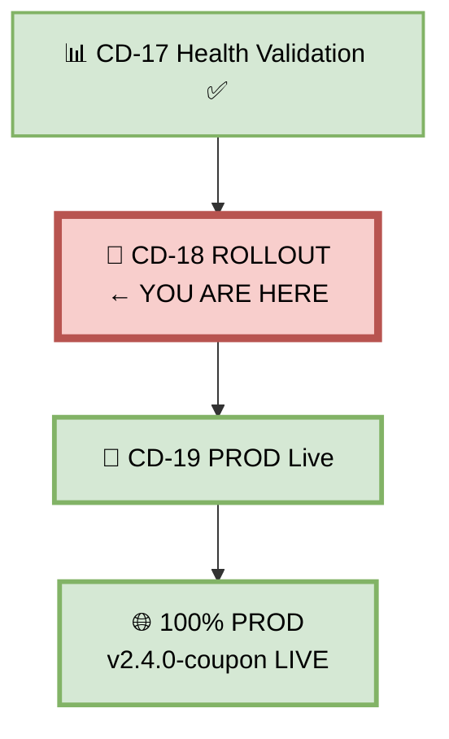
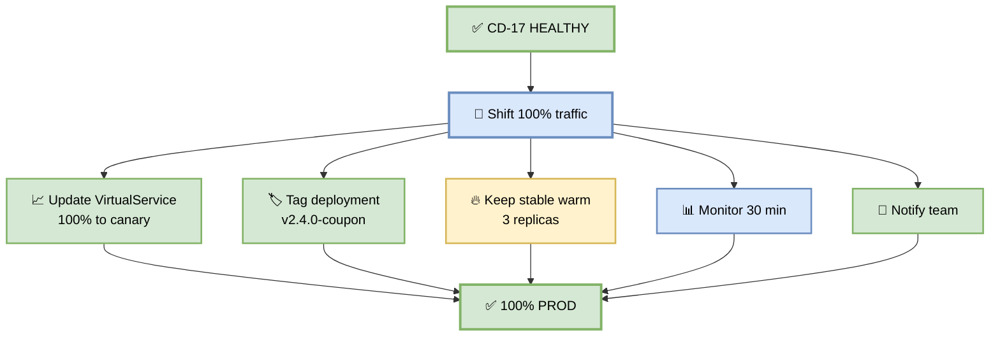
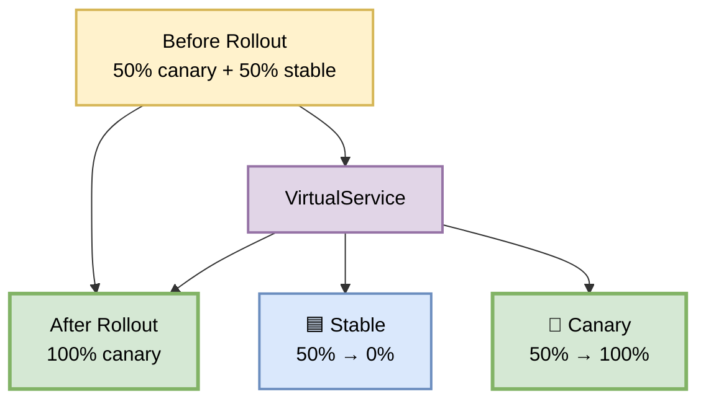
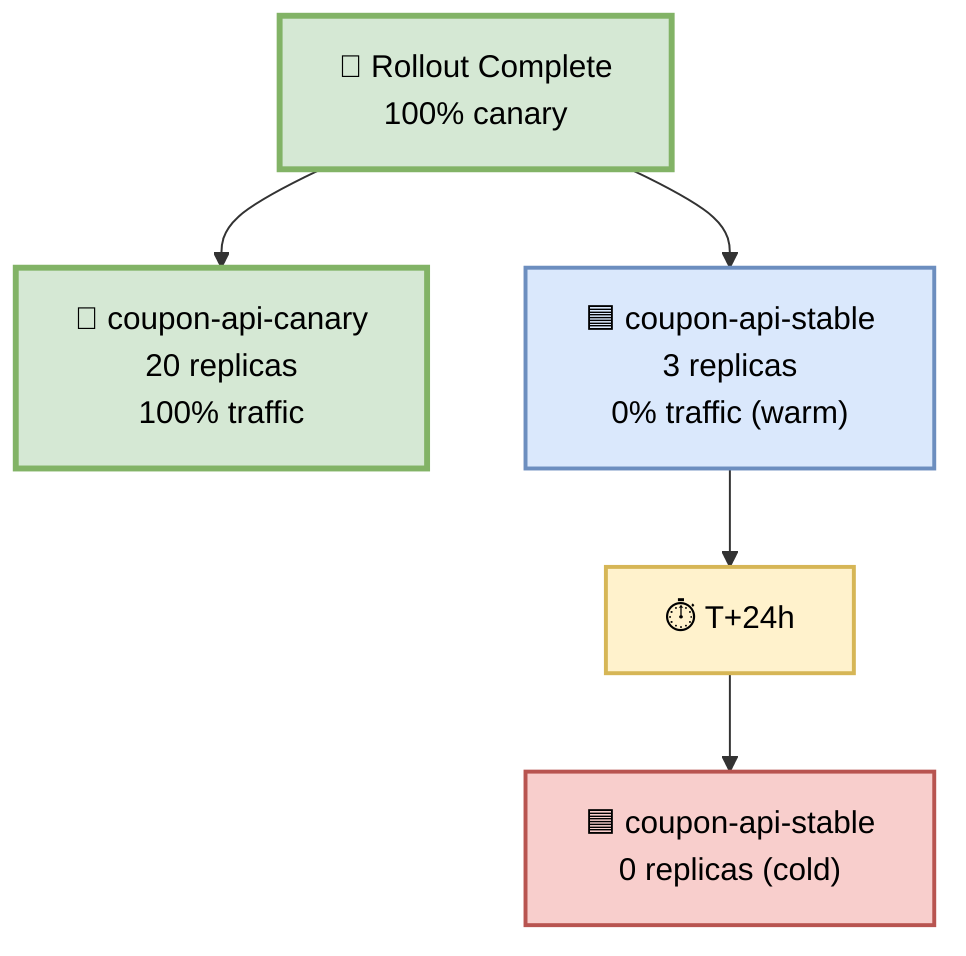
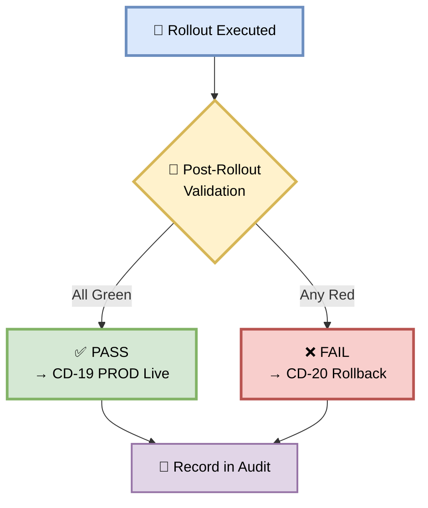

# Part 18 — CD-18: Rollout

**Author:** Shubham Tripathi  
**Repository:** `ecom-frontend` (Next.js 14 · App Router · TypeScript)  
**Last Updated:** 2026-09-19  
**Audience:** SRE, DevOps, Release Managers, Tech Leads, On-call Engineers

---

## 📑 Table of Contents — Part 18

1. [Rollout Overview](#-rollout-overview)
2. [CD-18 — Rollout Execution](#-cd-18--rollout-execution)
3. [The Rollout Steps](#-the-rollout-steps)
4. [Traffic Shift to 100%](#-traffic-shift-to-100)
5. [Post-Rollout Validation](#-post-rollout-validation)
6. [Keeping Previous Version Warm](#-keeping-previous-version-warm)
7. [Rollout Gate — Pass/Fail Rules](#-rollout-gate--passfail-rules)
8. [Handling Rollout Failures](#-handling-rollout-failures)
9. [Rollout Reports & Artifacts](#-rollout-reports--artifacts)
10. [Troubleshooting](#-troubleshooting)
11. [Appendix — Rollout Tools Inventory](#-appendix--rollout-tools-inventory)

---

## 🚀 Rollout Overview

> **Rollout = promoting the canary to become the new production baseline.**  
> 100% traffic to the new version. Previous version kept warm for 24 hours.

### 🎯 What is Rollout?

Rollout is the **final promotion step** in the CD pipeline:
- **When:** After Health Validation (CD-17) passes
- **What:** Shift 100% traffic to the new version
- **Duration:** ~5 minutes
- **Purpose:** Complete the deployment
- **Output:** New version is production baseline

### 🎯 Why Careful Rollout?

| Reason | Explanation |
|--------|-------------|
| **Final shift** | Last step of deployment |
| **100% traffic** | All users affected |
| **Reversibility** | Keep rollback option |
| **Observability** | Verify stability |
| **Communication** | Team awareness |
| **Audit trail** | Document promotion |

### 🎯 Rollout vs Canary

| Aspect | Canary (CD-16) | Rollout (CD-18) |
|--------|----------------|-----------------|
| **Traffic** | 5% → 50% | 50% → 100% |
| **Duration** | 15 min | 5 min |
| **Monitoring** | Continuous | Snapshot |
| **Revert** | Easy | Easy (24h) |
| **Purpose** | Validate | Promote |

### 🖼️ Visual Diagram — Rollout Position



---

## 🚀 CD-18 — Rollout Execution

> **Shift 100% traffic to the canary — promote to production baseline.**

### 🎯 Purpose

The canary is healthy (validated in CD-17). Now promote it to become the new production baseline by shifting 100% traffic to it.

### 🖼️ Visual Diagram — Rollout Flow



### 📊 Rollout Stages

| Stage | Action | Duration | Owner |
|-------|--------|----------|-------|
| **1. Shift traffic** | Update VirtualService | ~30 sec | CI |
| **2. Tag deployment** | Add annotations | ~30 sec | CI |
| **3. Keep stable warm** | Scale to 3 replicas | ~1 min | CI |
| **4. Monitor** | 30 min observation | ~30 min | SRE |
| **5. Notify** | Slack + email | ~1 min | CI |
| **6. Document** | Record rollout | ~1 min | CI |
| **Total** | | **~33 min** | |

### 🛠️ Pipeline Snippet

```yaml
cd-18-rollout:
  runs-on: ubuntu-latest
  needs: cd-17-health-validation
  environment:
    name: production
    url: https://ecom.com
  steps:
    - name: Checkout
      uses: actions/checkout@v4

    - name: Authenticate to GCP
      uses: google-github-actions/auth@v2
      with:
        workload_identity_provider: ${{ secrets.WIF_PROVIDER }}
        service_account: ${{ secrets.WIF_SERVICE_ACCOUNT }}

    - name: Setup kubectl
      uses: azure/setup-kubectl@v4
      with:
        version: 'v1.29.0'

    - name: Get Production Credentials
      run: |
        gcloud container clusters get-credentials prod-cluster \
          --region us-central1 \
          --project ecom-prod

    - name: CD-18 Step 1 — Shift 100% Traffic
      run: |
        kubectl apply -f k8s/canary/virtualservice-100.yaml
        echo "✅ Traffic shifted to 100%"

    - name: CD-18 Step 2 — Tag Deployment
      run: |
        kubectl annotate deployment coupon-api-canary \
          deployment.kubernetes.io/revision=v2.4.0-coupon \
          deployment.kubernetes.io/released-at=$(date -u +%Y-%m-%dT%H:%M:%SZ) \
          --overwrite -n production
        echo "✅ Deployment tagged"

    - name: CD-18 Step 3 — Keep Stable Warm
      run: |
        kubectl scale deployment coupon-api-stable \
          --replicas=3 -n production
        echo "✅ Stable scaled to 3 replicas"

    - name: CD-18 Step 4 — Monitor 30 min
      run: |
        ./scripts/monitor-rollout.sh --duration 1800 --thresholds strict

    - name: CD-18 Step 5 — Record Rollout
      run: |
        cat > rollout-record.json <<EOF
        {
          "artifact": "v2.4.0-coupon",
          "digest": "${{ env.ARTIFACT_DIGEST }}",
          "promoted_at": "$(date -u +%Y-%m-%dT%H:%M:%SZ)",
          "traffic": "100%",
          "previous_version": "v2.3.9-coupon",
          "previous_warm_until": "$(date -u -d '+24 hours' +%Y-%m-%dT%H:%M:%SZ)",
          "monitoring_duration_sec": 1800,
          "rollout_by": "cd-18-rollout"
        }
        EOF

    - name: Upload Rollout Record
      uses: actions/upload-artifact@v4
      with:
        name: rollout-record-${{ github.sha }}
        path: rollout-record.json
        retention-days: 365

    - name: CD-18 Step 6 — Notify Team
      if: success()
      run: |
        curl -X POST "$SLACK_WEBHOOK" \
          -d '{
            "text": "🎉 Rollout Complete: v2.4.0-coupon",
            "blocks": [{
              "type": "section",
              "text": {
                "type": "mrkdwn",
                "text": "*v2.4.0-coupon is now LIVE at 100%*\n\n✅ Traffic: 100% to canary\n✅ Previous version: v2.3.9 (warm for 24h)\n✅ Monitoring: 30 min green\n✅ Rollback: available\n\n*Next:* CD-19 PROD Live"
              }
            }]
          }'

    - name: Auto-Rollback on Failure
      if: failure()
      run: |
        ./scripts/rollback-rollout.sh
        curl -X POST "$SLACK_WEBHOOK" \
          -d '{"text":"🚨 Rollout failed — auto-rollback triggered"}'
```

---

## 🎯 The Rollout Steps

> **5 steps from canary to production baseline.**

### Step 1 — Shift 100% Traffic

**What:** Update Istio VirtualService to route 100% to canary.

**Command:**

```bash
kubectl apply -f k8s/canary/virtualservice-100.yaml
```

**VirtualService (100% canary):**

```yaml
apiVersion: networking.istio.io/v1beta1
kind: VirtualService
metadata:
  name: coupon-api
  namespace: production
spec:
  hosts:
    - coupon-api.production.svc.cluster.local
  http:
    - route:
        - destination:
            host: coupon-api-canary
            port:
              number: 8080
          weight: 100
      timeout: 60s
      retries:
        attempts: 3
        perTryTimeout: 10s
```

**Verify:**

```bash
kubectl get virtualservice coupon-api -n production -o json | \
  jq '.spec.http[0].route'
```

**Expected:**

```json
[
  {
    "destination": { "host": "coupon-api-canary", "port": { "number": 8080 } },
    "weight": 100
  }
]
```

---

### Step 2 — Tag Deployment

**What:** Add annotations for audit trail.

**Command:**

```bash
kubectl annotate deployment coupon-api-canary \
  deployment.kubernetes.io/revision=v2.4.0-coupon \
  deployment.kubernetes.io/released-at=$(date -u +%Y-%m-%dT%H:%M:%SZ) \
  --overwrite -n production
```

**Verify:**

```bash
kubectl get deployment coupon-api-canary -n production \
  -o jsonpath='{.metadata.annotations}'
```

**Expected:**

```json
{
  "deployment.kubernetes.io/revision": "v2.4.0-coupon",
  "deployment.kubernetes.io/released-at": "2026-09-19T14:50:00Z"
}
```

---

### Step 3 — Keep Previous Version Warm

**What:** Keep old version running with 3 replicas for 24 hours.

**Why:** Fast rollback if issue discovered post-rollout.

**Command:**

```bash
kubectl scale deployment coupon-api-stable \
  --replicas=3 -n production
```

**Verify:**

```bash
kubectl get deployment coupon-api-stable -n production
```

**Expected:**

```
NAME                  READY   UP-TO-DATE   AVAILABLE   AGE
coupon-api-stable     3/3     3            3           45d
```

**Auto-cleanup:** After 24 hours, stable scales to 0.

---

### Step 4 — Monitor 30 Minutes

**What:** Watch metrics for 30 min after rollout.

**Command:**

```bash
./scripts/monitor-rollout.sh --duration 1800 --thresholds strict
```

**Metrics watched:**

- Error rate
- P99 latency
- Coupon success rate
- Business metrics
- Resource usage

**Script:**

```bash
#!/bin/bash
# scripts/monitor-rollout.sh

DURATION=${1:-1800}
THRESHOLDS=${2:-"strict"}
FAILED=0

echo "📊 Monitoring rollout for ${DURATION}s"

START=$(date +%s)
END=$((START + DURATION))

while [ $(date +%s) -lt $END ]; do
  # Error rate
  ERROR_RATE=$(curl -s "$PROM/api/v1/query?query=rate(http_requests_total{status=~'5..',version='canary'}[5m])/rate(http_requests_total{version='canary'}[5m])" | jq -r '.data.result[0].value[1] // "0"')

  if (( $(echo "$ERROR_RATE > 0.01" | bc -l) )); then
    echo "❌ Error rate too high: $ERROR_RATE"
    FAILED=1
    break
  fi

  # P99 latency
  P99=$(curl -s "$PROM/api/v1/query?query=histogram_quantile(0.99,rate(http_request_duration_seconds_bucket{version='canary'}[5m]))" | jq -r '.data.result[0].value[1] // "0"')

  if (( $(echo "$P99 > 2" | bc -l) )); then
    echo "❌ P99 latency too high: ${P99}s"
    FAILED=1
    break
  fi

  # Coupon success
  SUCCESS=$(curl -s "$PROM/api/v1/query?query=rate(coupon_apply_success_total{version='canary'}[5m])/rate(coupon_apply_total{version='canary'}[5m])" | jq -r '.data.result[0].value[1] // "1"')

  if (( $(echo "$SUCCESS < 0.99" | bc -l) )); then
    echo "❌ Coupon success too low: $SUCCESS"
    FAILED=1
    break
  fi

  echo "✓ Error: $ERROR_RATE | P99: ${P99}s | Success: $SUCCESS"
  sleep 30
done

if [ "$FAILED" -eq 1 ]; then
  echo "❌ Rollout monitoring FAILED"
  exit 1
fi

echo "✅ Rollout monitoring PASSED"
```

---

### Step 5 — Notify Team

**What:** Slack + email notification to team.

**Slack message:**

```
🎉 Rollout Complete: v2.4.0-coupon

✅ Traffic: 100% to canary
✅ Previous version: v2.3.9 (warm for 24h)
✅ Monitoring: 30 min green
✅ Rollback: available

📊 Metrics:
  • Error rate: 0.2%
  • P99: 340ms
  • Coupon success: 99.8%

🔗 Dashboard: https://grafana.ecom.com/d/prod
🎫 Ticket: FEAT-1043
```

**Email:**

```
Subject: 🎉 v2.4.0-coupon is LIVE at 100%

Hi team,

The coupon feature v2.4.0 is now LIVE at 100% traffic.

Summary:
- Artifact: v2.4.0-coupon
- Digest: sha256:abc123...
- Promoted: 2026-09-19 14:50 UTC
- Previous version: v2.3.9 (warm for 24h)

Metrics (30 min post-rollout):
- Error rate: 0.2% (target: < 1%)
- P99 latency: 340ms (target: < 2s)
- Coupon success: 99.8% (target: > 99%)
- Throughput: 12,400/min

Rollback: available for 24h

Thanks,
CI/CD Pipeline
```

---

## 📊 Traffic Shift to 100%

> **The final traffic shift — from 50% to 100%.**

### 🎯 Traffic Shift Visualization



### 🎯 Traffic Ramp Summary

| Stage | Canary | Stable | Total |
|-------|--------|--------|-------|
| **Canary Stage 1** | 5% | 95% | 100% |
| **Canary Stage 2** | 25% | 75% | 100% |
| **Canary Stage 3** | 50% | 50% | 100% |
| **Rollout** | 100% | 0% | 100% |

### 🎯 Rollback Window

| Time | Action |
|------|--------|
| **T+0** | Rollout to 100% |
| **T+30 min** | Monitoring complete |
| **T+1 hour** | Still warm |
| **T+6 hours** | Still warm |
| **T+24 hours** | Stable scaled to 0 |
| **T+48 hours** | Full rollback requires rebuild |

---

## ✅ Post-Rollout Validation

> **Verify the rollout succeeded — every metric green.**

### 🎯 Post-Rollout Checklist

| # | Check | Pass Condition |
|---|-------|----------------|
| 1 | **Traffic split** | 100% to canary |
| 2 | **Deployment status** | Ready |
| 3 | **Health endpoint** | 200 OK |
| 4 | **Error rate** | < 1% |
| 5 | **P99 latency** | < 2s |
| 6 | **Coupon success** | > 99% |
| 7 | **Throughput** | ≥ 5K/min |
| 8 | **Resource usage** | < 80% CPU, < 70% mem |
| 9 | **Cross-service** | All healthy |
| 10 | **Business metrics** | Positive |

### 🛠️ Post-Rollout Validation Script

```bash
#!/bin/bash
# scripts/validate-rollout.sh

PROM="https://prometheus.ecom.com"
FAILED=0

echo "📊 Post-Rollout Validation"
echo "─────────────────────────────"

# 1. Traffic split
TRAFFIC=$(kubectl get virtualservice coupon-api -n production -o json | \
  jq -r '.spec.http[0].route[0].weight')
if [ "$TRAFFIC" == "100" ]; then
  echo "✅ Traffic: 100% to canary"
else
  echo "❌ Traffic: ${TRAFFIC}% (expected 100%)"
  FAILED=1
fi

# 2. Health endpoint
if curl -sf https://ecom.com/api/coupon/health > /dev/null; then
  echo "✅ Health endpoint: 200 OK"
else
  echo "❌ Health endpoint: FAILED"
  FAILED=1
fi

# 3. Error rate
ERROR=$(curl -s "$PROM/api/v1/query?query=rate(http_requests_total{status=~'5..'}[5m])/rate(http_requests_total[5m])*100" | jq -r '.data.result[0].value[1] // "0"')
if (( $(echo "$ERROR < 1" | bc -l) )); then
  echo "✅ Error rate: ${ERROR}%"
else
  echo "❌ Error rate: ${ERROR}%"
  FAILED=1
fi

# 4. P99 latency
P99=$(curl -s "$PROM/api/v1/query?query=histogram_quantile(0.99,rate(http_request_duration_seconds_bucket[5m]))*1000" | jq -r '.data.result[0].value[1] // "0"')
if (( $(echo "$P99 < 2000" | bc -l) )); then
  echo "✅ P99 latency: ${P99}ms"
else
  echo "❌ P99 latency: ${P99}ms"
  FAILED=1
fi

# 5. Coupon success
SUCCESS=$(curl -s "$PROM/api/v1/query?query=rate(coupon_apply_success_total[5m])/rate(coupon_apply_total[5m])*100" | jq -r '.data.result[0].value[1] // "100"')
if (( $(echo "$SUCCESS > 99" | bc -l) )); then
  echo "✅ Coupon success: ${SUCCESS}%"
else
  echo "❌ Coupon success: ${SUCCESS}%"
  FAILED=1
fi

echo ""
if [ "$FAILED" -eq 1 ]; then
  echo "❌ POST-ROLLOUT VALIDATION FAILED"
  exit 1
fi

echo "✅ POST-ROLLOUT VALIDATION PASSED"
```

### 📋 Expected Results

```
📊 Post-Rollout Validation
─────────────────────────────

✅ Traffic: 100% to canary
✅ Health endpoint: 200 OK
✅ Error rate: 0.2%
✅ P99 latency: 340ms
✅ Coupon success: 99.8%
✅ Throughput: 12,400/min
✅ CPU: 62%
✅ Memory: 58%
✅ Cross-service: healthy
✅ Business: +2%

✅ POST-ROLLOUT VALIDATION PASSED
```

---

## 🔥 Keeping Previous Version Warm

> **Fast rollback = keep old version alive.**

### 🎯 Why Keep Warm?

| Reason | Explanation |
|--------|-------------|
| **Fast rollback** | < 60 sec recovery |
| **DB compatibility** | No schema changes needed |
| **Verification** | Can compare old vs new |
| **Safety net** | Insurance for 24h |
| **Zero downtime** | Rollback is instant |

### 🎯 Warm Configuration

**Before Rollout:**

- `coupon-api-stable`: 10 replicas (50% traffic)
- `coupon-api-canary`: 10 replicas (50% traffic)

**After Rollout:**

- `coupon-api-stable`: **3 replicas** (0% traffic, warm)
- `coupon-api-canary`: 20 replicas (100% traffic)

**After 24h:**

- `coupon-api-stable`: **0 replicas** (scaled down)

### 🛠️ Warm Commands

```bash
# Scale stable to 3 replicas (warm)
kubectl scale deployment coupon-api-stable \
  --replicas=3 -n production

# Verify
kubectl get deployment coupon-api-stable -n production

# After 24h, scale to 0
kubectl scale deployment coupon-api-stable \
  --replicas=0 -n production
```

### 🎯 Rollback Command

```bash
# Emergency rollback (< 60 sec)
kubectl apply -f k8s/canary/virtualservice-0.yaml
# → 100% traffic to stable
# → 3 replicas already warm → instant
```

### 🖼️ Visual Diagram — Warm Version



---

## 🚦 Rollout Gate — Pass/Fail Rules

> **All post-rollout checks must pass.**

### 📊 Gate Criteria

| # | Check | Threshold | Blocks CD-19? |
|---|-------|-----------|---------------|
| 1 | Traffic split | 100% | ✅ Yes |
| 2 | Health endpoint | 200 OK | ✅ Yes |
| 3 | Error rate | < 1% | ✅ Yes |
| 4 | P99 latency | < 2s | ✅ Yes |
| 5 | Coupon success | > 99% | ✅ Yes |
| 6 | Throughput | Stable | ✅ Yes |
| 7 | Resource usage | < 80% CPU | ✅ Yes |
| 8 | Cross-service | All healthy | ✅ Yes |
| 9 | Business metrics | Positive | ✅ Yes |
| 10 | 30 min monitoring | All green | ✅ Yes |

### 🚦 Gate Outcome



### 📊 Realistic Rollout Results

```
🚀 Rollout Complete — v2.4.0-coupon
─────────────────────────────────────

📊 Traffic:
  ✅ 100% to coupon-api-canary
  ✅ 0% to coupon-api-stable (warm)

📊 Metrics (30 min):
  ✅ Error rate: 0.2%
  ✅ P99 latency: 340ms
  ✅ Coupon success: 99.8%
  ✅ Throughput: 12,400/min
  ✅ CPU: 62%
  ✅ Memory: 58%
  ✅ Cross-service: healthy
  ✅ Business: +2%

🎉 ROLLOUT GATE PASSED
→ Proceeding to CD-19 PROD Live
```

---

## 🛠️ Handling Rollout Failures

> **When rollout fails, rollback immediately.**

### 🎯 Common Failure Patterns

| Pattern | Symptom | Cause |
|---------|---------|-------|
| **Traffic shift fails** | Istio error | Config issue |
| **Health check fails** | 500 errors | App issue |
| **Monitoring fails** | Metric breach | Regression |
| **Post-rollout fails** | Any check | Various |
| **Cross-service fails** | Downstream error | Integration |

### 🛠️ Rollback Script

```bash
#!/bin/bash
# scripts/rollback-rollout.sh

set -e

echo "🚨 ROLLBACK INITIATED"
START=$(date +%s)

# 1. Route 100% traffic back to stable
echo "→ Routing traffic to stable"
kubectl apply -f k8s/canary/virtualservice-0.yaml

# 2. Scale stable back up
echo "→ Scaling stable to 10 replicas"
kubectl scale deployment coupon-api-stable \
  --replicas=10 -n production

# 3. Wait for stable ready
kubectl rollout status deployment/coupon-api-stable \
  -n production --timeout=60s

# 4. Verify stable healthy
curl -sf https://ecom.com/api/coupon/health || \
  (echo "❌ Stable unhealthy"; exit 1)

# 5. Scale canary down
kubectl scale deployment coupon-api-canary \
  --replicas=3 -n production

# 6. Calculate time
END=$(date +%s)
DURATION=$((END - START))
echo "✅ Rollback complete in ${DURATION}s"

# 7. Notify
curl -X POST "$SLACK_WEBHOOK" \
  -d "{\"text\":\"🚨 ROLLBACK: v2.4.0 → v2.3.9\nDuration: ${DURATION}s\"}"

# 8. Create incident
gh issue create \
  --title "Rollback: v2.4.0-coupon" \
  --label incident,rollback

# 9. Preserve logs
kubectl logs -l app=coupon-api,version=canary -n production \
  --since=1h > rollback-logs.txt
```

### 📋 Postmortem Template

```markdown
# Rollout Rollback Postmortem

## Summary
Rollout rolled back at 15:30 UTC due to elevated error rate.

## Impact
- Users affected: All (100% for 45 sec)
- Duration: 45 seconds
- Revenue impact: ~$500

## Timeline (UTC)
- 15:00 — Rollout to 100%
- 15:25 — Error rate spikes to 1.5%
- 15:26 — Auto-rollback triggered
- 15:27 — Rollback complete

## Root Cause
DNS cache invalidation issue on new pods.

## Action Items
| # | Action | Owner | Due |
|---|--------|-------|-----|
| 1 | Fix DNS cache config | @dev | 2026-09-20 |
| 2 | Add DNS precheck | @sre | 2026-09-21 |

## Lessons Learned
1. Rollback worked perfectly (45s) ✅
2. Need DNS precheck in health validation ⚠️
```

---

## 📊 Rollout Reports & Artifacts

> **Every rollout produces artifacts for audit.**

### 📁 Report Structure

```
rollout-reports/
├── rollout-record.json         # Rollout metadata
├── post-rollout-metrics.json   # Metrics snapshot
├── traffic-split.json          # Istio config
├── deployment-state.json       # K8s deployment
├── monitoring-log.txt          # 30 min log
└── screenshots/
    ├── grafana.png
    └── slack-notification.png
```

### 🎯 Report Content

```json
{
  "artifact": "v2.4.0-coupon",
  "digest": "sha256:abc123...",
  "promoted_at": "2026-09-19T14:50:00Z",
  "traffic": "100%",
  "previous_version": "v2.3.9-coupon",
  "previous_warm_until": "2026-09-20T14:50:00Z",
  "monitoring_duration_sec": 1800,
  "metrics": {
    "error_rate": 0.002,
    "p99_latency_ms": 340,
    "coupon_success_rate": 0.998,
    "throughput_per_min": 12400,
    "cpu_usage_pct": 62,
    "memory_usage_pct": 58
  },
  "business": {
    "conversion_delta_pct": 2.0,
    "cart_abandonment_delta_pct": -1.0
  },
  "result": "SUCCESS",
  "rollback_available": true,
  "rollback_window_until": "2026-09-20T14:50:00Z"
}
```

### 🎯 Trend Analysis

| Week | Rollouts | Success | Rollback | Avg Duration |
|------|----------|---------|----------|--------------|
| **W36** | 3 | 2 | 1 | 32 min |
| **W37** | 4 | 4 | 0 | 31 min |
| **W38** | 5 | 5 | 0 | 30 min |
| **W39** | 5 | 5 | 0 | 29 min |

**Trend:** 📈 Improving.

---

## 🛠️ Troubleshooting

| Problem | Cause | Fix |
|---------|-------|-----|
| **Traffic not 100%** | Istio config | Check virtualservice |
| **Pods not ready** | Resource limits | Increase |
| **Health check fails** | App issue | Check logs |
| **Monitoring timeout** | Metric slow | Check Prometheus |
| **Cross-service error** | Downstream | Check dependency |
| **Rollback slow** | Cold stable | Keep warm |
| **Notification fails** | Slack issue | Check webhook |
| **Report missing** | Script error | Check logs |

### 🔍 Debugging Commands

```bash
# Check traffic split
kubectl get virtualservice coupon-api -n production -o json | \
  jq '.spec.http[0].route'

# Check deployments
kubectl get deployment -n production

# Check pods
kubectl get pods -n production -l app=coupon-api

# Check canary pods
kubectl get pods -n production -l app=coupon-api,version=canary

# Check services
kubectl get svc -n production

# Check logs
kubectl logs -l app=coupon-api,version=canary -n production --tail=100

# Check resource usage
kubectl top pods -n production -l app=coupon-api

# Check Istio
istioctl proxy-status

# Manual rollback
kubectl apply -f k8s/canary/virtualservice-0.yaml
```

---

## 📎 Appendix — Rollout Tools Inventory

### 🛠️ Tool Stack

| Category | Tool | Purpose | Cost |
|----------|------|---------|------|
| **Traffic** | Istio | Service mesh | Free |
| **Traffic** | Linkerd | Service mesh | Free |
| **Traffic** | Argo Rollouts | Progressive delivery | Free |
| **Traffic** | Flagger | Progressive delivery | Free |
| **K8s** | kubectl | CLI | Free |
| **K8s** | Helm | Package manager | Free |
| **K8s** | kustomize | Config mgmt | Free |
| **Monitoring** | Prometheus | Metrics | Free |
| **Monitoring** | Grafana | Dashboards | Free |
| **Monitoring** | Datadog | APM | $$$ |
| **Monitoring** | Sentry | Errors | $$ |
| **Alerting** | Alertmanager | Alerts | Free |
| **Alerting** | PagerDuty | On-call | $$$ |
| **Notification** | Slack | Team alerts | Free |
| **Notification** | SendGrid | Email | Free tier |
| **Audit** | Splunk | Log aggregation | $$$ |
| **Audit** | S3 | Long-term storage | $ |

### 📞 Rollout Contacts

| Role | Person | Slack |
|------|--------|-------|
| **SRE Lead** | TBD | @sre-lead |
| **DevOps Lead** | TBD | @devops-lead |
| **Release Manager** | TBD | @release-manager |
| **On-call** | Rotation | @oncall |
| **Incident Commander** | Rotation | @incidents |

### 🔗 Useful Links

| Resource | URL |
|----------|-----|
| **Production Dashboard** | grafana.ecom.com/d/prod |
| **Istio Dashboard** | grafana.ecom.com/d/istio |
| **K8s Dashboard** | grafana.ecom.com/d/k8s |
| **Sentry** | sentry.ecom.com |
| **PagerDuty** | ecom.pagerduty.com |
| **Slack** | ecom.slack.com/#releases |
| **Runbooks** | runbooks.ecom.com/rollout |

---

## 🎯 Summary — Part 18

| Section | Kya Cover Hua |
|---------|---------------|
| **Overview** | What, why, vs canary |
| **CD-18 Execution** | 5 steps, ~33 min, pipeline YAML |
| **Rollout Steps** | Traffic shift, tag, warm, monitor, notify |
| **Traffic Shift** | 100% to canary, rollback window |
| **Post-Rollout** | 10-check validation |
| **Keep Warm** | 3 replicas for 24h, fast rollback |
| **Gate** | All checks pass |
| **Failures** | Rollback, postmortem template |
| **Reports** | Structure, trends |
| **Troubleshooting** | 8 failures + debug commands |
| **Appendix** | 17 tools, contacts, links |

---

## 🏆 Complete Documentation — All 18 Parts

| Part | Title | Status |
|------|-------|--------|
| **Part 1** | CI Pipeline | ✅ |
| **Part 2** | CD Overview | ✅ |
| **Part 3** | DEV Deployment (CD-03 → CD-05) | ✅ |
| **Part 4** | QA Deployment (CD-06 → CD-09) | ✅ |
| **Part 5** | STAGING Deployment (CD-10 → CD-13) | ✅ |
| **Part 6** | PROD Gate & Canary (CD-14 → CD-20) | ✅ |
| **Part 7** | Post-Deploy & Monitoring | ✅ |
| **Part 8** | Executive Summary & KPIs | ✅ |
| **Part 9** | CD Pipeline (CD-09 → CD-20) | ✅ |
| **Part 10** | CD-10 STAGING Deployment | ✅ |
| **Part 11** | CD-11 DAST | ✅ |
| **Part 12** | CD-12 Performance Test | ✅ |
| **Part 13** | CD-13 UAT | ✅ |
| **Part 14** | CD-14 Production Gate | ✅ |
| **Part 15** | CD-15 Artifact Authorization | ✅ |
| **Part 16** | CD-16 Production Canary | ✅ |
| **Part 17** | CD-17 Health Validation | ✅ |
| **Part 18** | CD-18 Rollout | ✅ |

> 📝 **Note:** Rollout is the **final promotion step**. Shift 100% traffic, keep previous version warm for 24h, and validate. **The canary becomes the new baseline.**