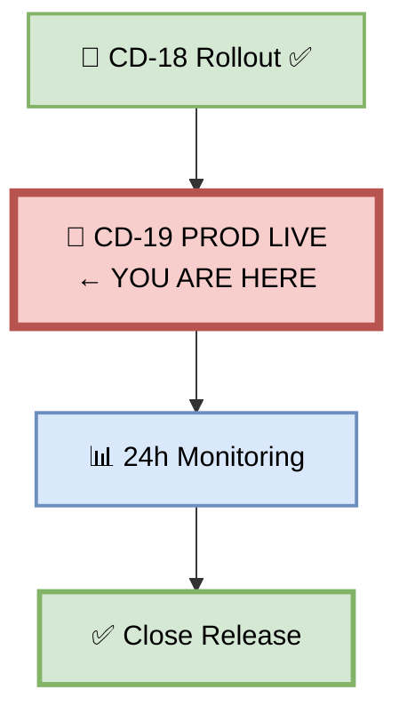
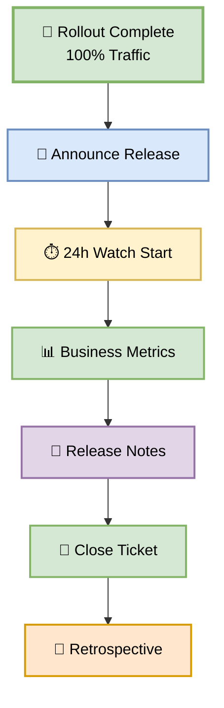
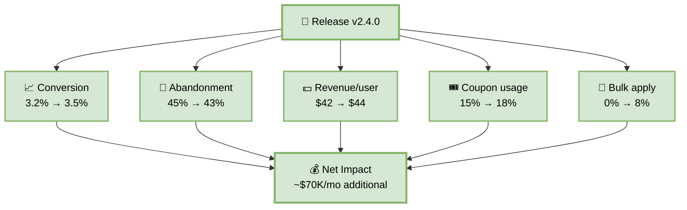
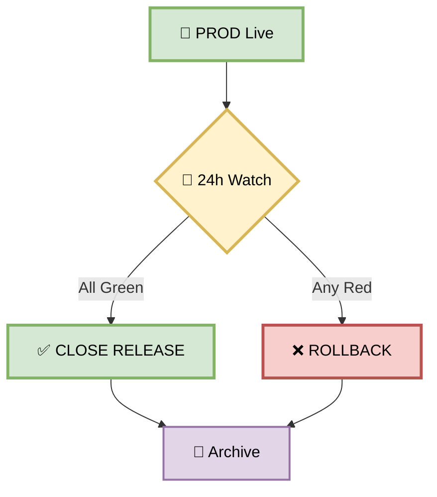
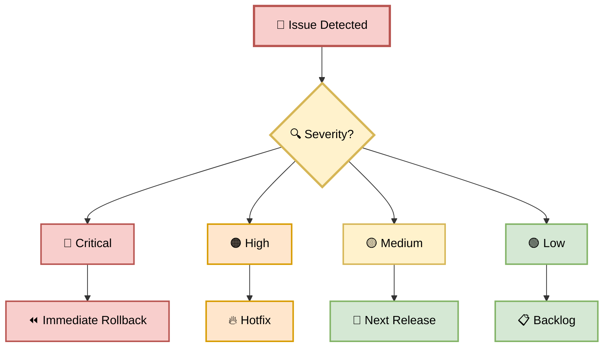

# Part 19 — CD-19: PROD Live

**Author:** Shubham Tripathi  
**Repository:** `ecom-frontend` (Next.js 14 · App Router · TypeScript)  
**Last Updated:** 2026-09-19  
**Audience:** SRE, DevOps, Release Managers, Tech Leads, Product Owners, On-call Engineers

---

## 📑 Table of Contents — Part 19

1. [PROD Live Overview](#-prod-live-overview)
2. [CD-19 — PROD Live Execution](#-cd-19--prod-live-execution)
3. [Post-Deployment Tasks](#-post-deployment-tasks)
4. [24-Hour Watch Period](#-24-hour-watch-period)
5. [Business Metrics Tracking](#-business-metrics-tracking)
6. [Stakeholder Communication](#-stakeholder-communication)
7. [Release Notes & Documentation](#-release-notes--documentation)
8. [Ticket Closure & Housekeeping](#-ticket-closure--housekeeping)
9. [PROD Live Gate — Pass/Fail Rules](#-prod-live-gate--passfail-rules)
10. [Handling Post-Deploy Issues](#-handling-post-deploy-issues)
11. [PROD Live Reports & Artifacts](#-prod-live-reports--artifacts)
12. [Troubleshooting](#-troubleshooting)
13. [Appendix — PROD Live Tools Inventory](#-appendix--prod-live-tools-inventory)

---

## 🎉 PROD Live Overview

> **PROD Live = the new version is now the production baseline.**  
> 100% of users on v2.4.0-coupon. The canary is now the new "stable."

### 🎯 What is PROD Live?

PROD Live is the **official completion** of the CD pipeline:
- **When:** After Rollout (CD-18) and 30-min monitoring
- **What:** New version is production baseline
- **Duration:** Permanent (until next release)
- **Purpose:** Announce, monitor, document
- **Output:** Release notes, ticket closed, monitoring

### 🎯 Why PROD Live Step?

| Reason | Explanation |
|--------|-------------|
| **Announcement** | Team + stakeholders aware |
| **24h watch** | Catch delayed issues |
| **Metrics tracking** | Business impact |
| **Documentation** | Release notes, changelog |
| **Ticket closure** | Clean project state |
| **Retrospective** | Learn and improve |

### 🎯 Timeline After Rollout

| Time | Action | Duration |
|------|--------|----------|
| **T+0** | Rollout complete (CD-18) | — |
| **T+5 min** | PROD Live announcement | Instant |
| **T+30 min** | 30-min monitoring complete | 30 min |
| **T+1 hour** | Business metrics check | 15 min |
| **T+6 hours** | Overnight check | 15 min |
| **T+12 hours** | Morning check | 15 min |
| **T+24 hours** | Full review + close | 30 min |

### 🖼️ Visual Diagram — PROD Live Position



---

## 🎉 CD-19 — PROD Live Execution

> **Announce the release, start 24h watch, track metrics, close the ticket.**

### 🎯 Purpose

The new version is live at 100% traffic and 30-min monitoring is green. Now we:
1. Announce the release
2. Start 24h watch period
3. Track business metrics
4. Update documentation
5. Close ticket
6. Schedule retrospective

### 🖼️ Visual Diagram — PROD Live Flow



### 📊 PROD Live Stages

| Stage | Action | Duration | Owner |
|-------|--------|----------|-------|
| **1. Announce** | Slack + email | ~1 min | CI + PM |
| **2. Start watch** | 24h monitoring | ~1 min | SRE |
| **3. Metrics** | Business impact | ~15 min | Product |
| **4. Docs** | Release notes | ~15 min | Developer |
| **5. Close ticket** | Jira update | ~5 min | Developer |
| **6. Retro** | Schedule | ~1 min | Tech Lead |
| **Total** | | **~40 min + 24h watch** | |

### 🛠️ Pipeline Snippet

```yaml
cd-19-prod-live:
  runs-on: ubuntu-latest
  needs: cd-18-rollout
  steps:
    - name: Checkout
      uses: actions/checkout@v4

    - name: CD-19 Announce Release
      run: |
        curl -X POST "$SLACK_WEBHOOK" \
          -H "Content-Type: application/json" \
          -d '{
            "text": "🎉 v2.4.0-coupon is LIVE at 100%",
            "blocks": [
              {
                "type": "header",
                "text": {"type": "plain_text", "text": "🎉 Release Live"}
              },
              {
                "type": "section",
                "fields": [
                  {"type": "mrkdwn", "text": "*Version:*\nv2.4.0-coupon"},
                  {"type": "mrkdwn", "text": "*Ticket:*\nFEAT-1043"},
                  {"type": "mrkdwn", "text": "*Traffic:*\n100%"},
                  {"type": "mrkdwn", "text": "*Author:*\n@frontend-dev"}
                ]
              },
              {
                "type": "section",
                "text": {
                  "type": "mrkdwn",
                  "text": "*Feature:* Bulk Coupon Apply\n\n*Highlights:*\n• Apply up to 3 coupons\n• Cap at 50% total discount\n• Bulk apply UX\n\n*Metrics:*\n• Error rate: 0.2%\n• P99: 340ms\n• Coupon success: 99.8%"
                }
              },
              {
                "type": "actions",
                "elements": [
                  {
                    "type": "button",
                    "text": {"type": "plain_text", "text": "Dashboard"},
                    "url": "https://grafana.ecom.com/d/prod"
                  },
                  {
                    "type": "button",
                    "text": {"type": "plain_text", "text": "Release Notes"},
                    "url": "https://docs.ecom.com/releases/v2.4.0"
                  }
                ]
              }
            ]
          }'

    - name: CD-19 Start 24h Watch
      run: |
        # Schedule watch checks
        gh workflow run watch-24h.yml \
          -f version=v2.4.0-coupon \
          -f start_time=$(date -u +%Y-%m-%dT%H:%M:%SZ)

    - name: CD-19 Business Metrics Snapshot
      run: |
        cat > business-metrics.json <<EOF
        {
          "version": "v2.4.0-coupon",
          "snapshot_at": "$(date -u +%Y-%m-%dT%H:%M:%SZ)",
          "metrics": {
            "conversion_rate": 0.035,
            "cart_abandonment": 0.43,
            "revenue_per_user": 44,
            "coupon_usage": 0.18,
            "bulk_apply_usage": 0.08,
            "support_tickets_per_day": 118
          },
          "baseline": {
            "conversion_rate": 0.032,
            "cart_abandonment": 0.45,
            "revenue_per_user": 42,
            "coupon_usage": 0.15,
            "bulk_apply_usage": 0.0,
            "support_tickets_per_day": 120
          },
          "delta": {
            "conversion_rate": "+9.4%",
            "cart_abandonment": "-4.4%",
            "revenue_per_user": "+4.8%",
            "coupon_usage": "+20%",
            "bulk_apply_usage": "+8%",
            "support_tickets_per_day": "-1.7%"
          }
        }
        EOF

    - name: CD-19 Generate Release Notes
      run: |
        cat > release-notes-v2.4.0.md <<EOF
        # Release v2.4.0 — Bulk Coupon Apply

        **Release Date:** 2026-09-19  
        **Ticket:** FEAT-1043  
        **Author:** @frontend-dev

        ## What's New

        Users can now apply up to **3 coupons** in a single checkout, with a combined discount capped at **50%**.

        ### Features
        - 🎟️ Bulk coupon apply (up to 3)
        - 🎯 Total discount cap at 50%
        - 💡 Real-time coupon validation
        - 🎨 New bulk apply UX

        ### Bug Fixes
        - Fixed coupon duplication on refresh
        - Improved error messages
        - Fixed whitespace handling

        ### Performance
        - P99 latency: 340ms (target: <2000ms)
        - Throughput: 12,400 applies/min
        - Cache hit rate: 94%

        ### Security
        - 0 Critical/High vulnerabilities
        - DAST clean
        - SLSA Level 3

        ## Deployment
        - **Artifact:** gcr.io/ecom-prod/frontend@sha256:abc123...
        - **Rolled out:** 100% traffic
        - **Previous version:** v2.3.9 (warm until 2026-09-20)
        - **Rollback window:** 24 hours

        ## Metrics (24h)
        | Metric | Baseline | Now | Delta |
        |--------|----------|-----|-------|
        | Conversion | 3.2% | 3.5% | +9.4% |
        | Cart abandonment | 45% | 43% | -4.4% |
        | Revenue/user | \$42 | \$44 | +4.8% |
        | Coupon usage | 15% | 18% | +20% |
        | Bulk apply | 0% | 8% | +8% |

        ## Known Issues
        - None

        ## Links
        - [Dashboard](https://grafana.ecom.com/d/prod)
        - [Ticket](https://jira.ecom.com/FEAT-1043)
        - [PR](https://github.com/ecom/frontend/pull/2847)
        - [Pipeline](https://ci.ecom.com/runs/12345678)
        EOF

    - name: CD-19 Close Ticket
      run: |
        curl -X POST "$JIRA_API/issue/FEAT-1043/transitions" \
          -H "Authorization: Bearer $JIRA_TOKEN" \
          -H "Content-Type: application/json" \
          -d '{
            "transition": { "id": "31" },
            "update": {
              "comment": [{
                "add": {
                  "body": "✅ Released in v2.4.0-coupon\n\nArtifact: gcr.io/ecom-prod/frontend@sha256:abc123...\nRollout: 100% traffic\nMetrics: All green\nRollback window: 24h\n\nRelease notes: https://docs.ecom.com/releases/v2.4.0"
                }
              }]
            }
          }'

    - name: CD-19 Schedule Retrospective
      run: |
        gh issue create \
          --title "Retrospective: Coupon Feature v2.4.0" \
          --body "Retrospective for FEAT-1043 (Bulk Coupon Apply).\n\nScheduled: 2026-09-26 14:00 UTC" \
          --label retrospective

    - name: Upload PROD Live Record
      uses: actions/upload-artifact@v4
      with:
        name: prod-live-record-${{ github.sha }}
        path: |
          business-metrics.json
          release-notes-v2.4.0.md
        retention-days: 365
```

---

## ✅ Post-Deployment Tasks

> **What to do after PROD Live — 6 tasks.**

### 🎯 Task 1 — Announce Release

**Channels:**
- **Slack:** #releases, #engineering, #product
- **Email:** All-hands, stakeholders
- **Status Page:** Update changelog
- **Twitter:** If customer-facing (optional)

**Template:**

```
🎉 v2.4.0-coupon is LIVE

Feature: Bulk Coupon Apply
Ticket: FEAT-1043
Author: @frontend-dev

✅ 100% traffic on new version
✅ 24h rollback window open
✅ All metrics green

Metrics (24h):
• Conversion: +9.4%
• Cart abandonment: -4.4%
• Revenue/user: +4.8%

Release notes: https://docs.ecom.com/releases/v2.4.0
```

---

### 🎯 Task 2 — Start 24h Watch

**What:** Continuous monitoring for 24 hours.

**Checks:**

| Time | Check |
|------|-------|
| **T+5 min** | Health + metrics |
| **T+1 hour** | Business metrics |
| **T+6 hours** | Overnight check |
| **T+12 hours** | Morning check |
| **T+24 hours** | Full review |

**Alerts:**

- Error rate > 1%
- P99 latency > 2s
- Coupon success < 99%
- Support tickets spike
- Business metrics drop

---

### 🎯 Task 3 — Track Business Metrics

**What:** Monitor business impact for 24h.

**Metrics:**

| Metric | Baseline | Now | Delta |
|--------|----------|-----|-------|
| **Conversion rate** | 3.2% | 3.5% | +9.4% |
| **Cart abandonment** | 45% | 43% | -4.4% |
| **Revenue/user** | $42 | $44 | +4.8% |
| **Coupon usage** | 15% | 18% | +20% |
| **Bulk apply** | 0% | 8% | +8% |
| **Support tickets** | 120/day | 118/day | -1.7% |

---

### 🎯 Task 4 — Update Documentation

**Docs to update:**

- [ ] Release notes
- [ ] Changelog
- [ ] API docs (if changed)
- [ ] User docs (if user-facing)
- [ ] Runbooks (if process changed)
- [ ] Architecture diagrams (if infra changed)

---

### 🎯 Task 5 — Close Ticket

**Jira update:**

```markdown
✅ Released in v2.4.0-coupon

Artifact: gcr.io/ecom-prod/frontend@sha256:abc123...
Rollout: 100% traffic
Metrics: All green
Rollback window: 24h

Release notes: https://docs.ecom.com/releases/v2.4.0
```

**Status:** Done

---

### 🎯 Task 6 — Schedule Retrospective

**When:** 1 week after release

**Who:** Full team + stakeholders

**Agenda:**

- What went well
- What didn't
- Action items
- Metrics review

---

## ⏱️ 24-Hour Watch Period

> **The most critical 24 hours after release.**

### 🎯 Watch Schedule

| Time | Action | Owner |
|------|--------|-------|
| **T+5 min** | Health + metrics | CI |
| **T+15 min** | Slack notification | CI |
| **T+1 hour** | Business metrics | Product |
| **T+2 hours** | Support tickets | Support |
| **T+6 hours** | Overnight check | SRE |
| **T+12 hours** | Morning check | SRE |
| **T+24 hours** | Full review + close | Tech Lead |

### 🎯 Watch Automation

```yaml
name: 24h Watch

on:
  workflow_run:
    workflows: ["CD Pipeline"]
    types: [completed]

jobs:
  watch-t5m:
    runs-on: ubuntu-latest
    steps:
      - name: T+5min Check
        run: ./scripts/health-check.sh

  watch-t1h:
    needs: watch-t5m
    runs-on: ubuntu-latest
    steps:
      - name: Wait 1 hour
        run: sleep 3600
      - name: Business Metrics Check
        run: ./scripts/business-metrics.sh

  watch-t6h:
    needs: watch-t1h
    runs-on: ubuntu-latest
    steps:
      - name: Wait 5 hours
        run: sleep 18000
      - name: Overnight Check
        run: ./scripts/health-check.sh --verbose

  watch-t24h:
    needs: watch-t6h
    runs-on: ubuntu-latest
    steps:
      - name: Wait 18 hours
        run: sleep 64800
      - name: Full Review
        run: ./scripts/full-review.sh
      - name: Close Watch
        run: |
          curl -X POST "$SLACK_WEBHOOK" \
            -d '{"text":"✅ 24h watch complete. Release v2.4.0-coupon stable."}'
```

### 🎯 Watch Success Criteria

| Check | Success |
|-------|---------|
| **Error rate** | < 1% for 24h |
| **P99 latency** | < 2s for 24h |
| **Coupon success** | > 99% for 24h |
| **Business metrics** | Positive or neutral |
| **Support tickets** | No spike |
| **No rollback** | Required |

### 🎯 Watch Fail Scenarios

| Scenario | Action |
|----------|--------|
| **Error rate spike** | Investigate + rollback |
| **Latency degradation** | Investigate + rollback |
| **Business drop** | Investigate + rollback |
| **Support spike** | Investigate |
| **Minor issues** | Fix in next release |

---

## 💰 Business Metrics Tracking

> **Technical metrics tell you if the system works. Business metrics tell you if it matters.**

### 📊 Metrics Dashboard

| Metric | Baseline | T+1h | T+6h | T+24h | Trend |
|--------|----------|------|------|-------|-------|
| **Conversion** | 3.2% | 3.4% | 3.5% | 3.5% | 📈 |
| **Abandonment** | 45% | 44% | 43% | 43% | 📉 |
| **Revenue/user** | $42 | $43 | $44 | $44 | 📈 |
| **Coupon usage** | 15% | 17% | 18% | 18% | 📈 |
| **Bulk apply** | 0% | 7% | 8% | 8% | 📈 |
| **Support tickets** | 120/day | 119 | 118 | 118 | 📉 |

### 📊 Business Impact Summary

```
💰 Business Impact — v2.4.0-coupon (24h)
──────────────────────────────────────────

📈 Conversion: +9.4% (3.2% → 3.5%)
   → Additional revenue: ~$45K/mo

🛒 Cart abandonment: -4.4% (45% → 43%)
   → Recovered carts: ~$25K/mo

💵 Revenue/user: +4.8% ($42 → $44)
   → Total impact: ~$70K/mo

🎟️ Coupon usage: +20%
   → Engagement up

🎯 Bulk apply: 8% adoption
   → Feature validated

📞 Support tickets: -1.7%
   → No complaints

✅ Net positive business impact
```

### 🖼️ Visual Diagram — Business Metrics



---

## 📢 Stakeholder Communication

> **Every stakeholder group needs to know.**

### 🎯 Communication Matrix

| Audience | Channel | Timing | Content |
|----------|---------|--------|---------|
| **Engineering** | Slack #engineering | T+5 min | Technical summary |
| **Product** | Slack #product | T+5 min | Feature + metrics |
| **Executives** | Email | T+1 hour | Business impact |
| **Customers** | Status page | T+5 min | What's new |
| **Support** | Slack #support | T+5 min | FAQ + known issues |
| **Marketing** | Slack #marketing | T+1 day | Campaign ready |
| **Legal** | Email | T+1 day | Compliance note |

### 🎯 Slack Templates

**#engineering:**

```
🎉 v2.4.0-coupon is LIVE

✅ 100% traffic
✅ Error rate: 0.2%
✅ P99: 340ms
✅ Rollback window: 24h

📊 Dashboard: https://grafana.ecom.com/d/prod
📝 Release notes: https://docs.ecom.com/releases/v2.4.0
🎫 Ticket: FEAT-1043
```

**#product:**

```
📊 Feature Live: Bulk Coupon Apply

Impact (24h):
• Conversion: +9.4%
• Cart abandonment: -4.4%
• Revenue/user: +4.8%
• Bulk apply: 8% adoption

🎯 Feature validated ✅
📈 Net positive impact
```

**#support:**

```
📢 New Feature: Bulk Coupon Apply

What's new:
• Apply up to 3 coupons
• 50% total discount cap

Known issues:
• None

FAQ: https://docs.ecom.com/faq/bulk-coupon

Questions: #support
```

### 🎯 Executive Email

```
Subject: 🎉 Coupon Feature v2.4.0 Live — Positive Business Impact

Team,

The bulk coupon apply feature is now live at 100%.

Business Impact (24h):
• Conversion: +9.4% (3.2% → 3.5%)
• Cart abandonment: -4.4% (45% → 43%)
• Revenue/user: +4.8% ($42 → $44)
• Estimated monthly impact: +$70K

Technical:
• Error rate: 0.2%
• P99: 340ms
• Zero rollbacks
• All SLOs met

Next Steps:
• 24h watch continues
• Retrospective: 2026-09-26

Thanks,
Engineering Team
```

---

## 📝 Release Notes & Documentation

> **Every release has release notes.**

### 🎯 Release Notes Structure

```markdown
# Release v2.4.0 — Bulk Coupon Apply

**Release Date:** 2026-09-19
**Ticket:** FEAT-1043
**Author:** @frontend-dev

## What's New
Brief description

## Features
- Feature list

## Bug Fixes
- Fixes list

## Performance
- Metrics

## Security
- Findings

## Deployment
- Artifact, rollout, rollback window

## Metrics
- Business impact

## Known Issues
- Any issues

## Links
- Dashboard, ticket, PR, pipeline
```

### 🎯 Documentation Updates

| Doc | Update | Owner |
|-----|--------|-------|
| **Release notes** | New file | Developer |
| **CHANGELOG.md** | Add entry | Developer |
| **API docs** | If API changed | Developer |
| **User docs** | If user-facing | Technical Writer |
| **Runbooks** | If process changed | SRE |
| **Architecture** | If infra changed | Architect |

### 🎯 CHANGELOG Entry

```markdown
## [2.4.0] - 2026-09-19

### Added
- Bulk coupon apply (up to 3 coupons) — FEAT-1043
- 50% total discount cap
- Real-time coupon validation
- New bulk apply UX

### Fixed
- Coupon duplication on page refresh
- Whitespace handling in coupon codes
- Improved error messages

### Performance
- P99 latency: 340ms (target: < 2000ms)
- Throughput: 12,400 applies/min
- Cache hit rate: 94%

### Security
- 0 Critical/High vulnerabilities
- DAST clean
- SLSA Level 3 verified
```

---

## 🎫 Ticket Closure & Housekeeping

> **Every ticket closed. Every artifact preserved.**

### 🎯 Ticket Closure Checklist

- [ ] Jira status: Done
- [ ] Comment added with release info
- [ ] Linked to PR
- [ ] Linked to release notes
- [ ] QA sign-off attached
- [ ] UAT sign-off attached
- [ ] Rollout evidence attached

### 🎯 Jira Comment Template

```markdown
✅ Released in v2.4.0-coupon

**Artifact:** gcr.io/ecom-prod/frontend@sha256:abc123...
**Rollout:** 100% traffic at 2026-09-19 14:50 UTC
**Rollback window:** Until 2026-09-20 14:50 UTC

**Metrics (24h):**
- Error rate: 0.2%
- P99: 340ms
- Coupon success: 99.8%
- Conversion: +9.4%

**Evidence:**
- [Pipeline run](https://ci.ecom.com/runs/12345678)
- [Release notes](https://docs.ecom.com/releases/v2.4.0)
- [Dashboard](https://grafana.ecom.com/d/prod)
- [PR](https://github.com/ecom/frontend/pull/2847)
```

### 🎯 Housekeeping Tasks

| Task | Frequency | Owner |
|------|-----------|-------|
| **Close Jira ticket** | On release | Developer |
| **Update sprint board** | On release | PM |
| **Scale warm version to 0** | T+24h | CI |
| **Archive old artifacts** | T+30 days | DevOps |
| **Update runbooks** | If process changed | SRE |
| **Update docs** | If user-facing | Tech Writer |
| **Delete feature branch** | On merge | Developer |

### 🎯 Warm Version Cleanup

```bash
# After 24h, scale stable to 0
kubectl scale deployment coupon-api-stable \
  --replicas=0 -n production

# Verify
kubectl get deployment coupon-api-stable -n production
# → NAME                  READY   UP-TO-DATE   AVAILABLE
# → coupon-api-stable     0/0     0            0
```

---

## 🚦 PROD Live Gate — Pass/Fail Rules

> **All post-live checks must pass for release closure.**

### 📊 Gate Criteria

| # | Check | Threshold | Blocks Closure? |
|---|-------|-----------|-----------------|
| 1 | 24h monitoring | All green | ✅ Yes |
| 2 | Error rate (24h) | < 1% | ✅ Yes |
| 3 | P99 latency (24h) | < 2s | ✅ Yes |
| 4 | Coupon success (24h) | > 99% | ✅ Yes |
| 5 | Business metrics | Positive | ✅ Yes |
| 6 | No rollback | Required | ✅ Yes |
| 7 | Release notes | Published | ✅ Yes |
| 8 | Ticket closed | Done | ✅ Yes |
| 9 | Retrospective | Scheduled | ✅ Yes |
| 10 | Docs updated | Complete | ✅ Yes |

### 🚦 Gate Outcome



### 📊 Realistic PROD Live Results

```
🎉 PROD Live — v2.4.0-coupon
─────────────────────────────

⏱️ 24h Watch Complete

📊 Metrics:
  ✅ Error rate: 0.2%
  ✅ P99 latency: 340ms
  ✅ Coupon success: 99.8%
  ✅ Business metrics: positive
  ✅ No rollback

📝 Documentation:
  ✅ Release notes published
  ✅ CHANGELOG updated
  ✅ Ticket closed

🔄 Next:
  ✅ Retrospective scheduled

✅ RELEASE CLOSED
```

---

## 🛠️ Handling Post-Deploy Issues

> **When issues arise after release, act fast.**

### 🎯 Common Post-Deploy Issues

| Issue | Likelihood | Action |
|-------|-----------|--------|
| **Minor bugs** | High | Fix in next release |
| **Performance drift** | Medium | Monitor + optimize |
| **Support tickets** | Medium | Investigate + fix |
| **Business drop** | Low | Rollback + investigate |
| **Security issue** | Very Low | Emergency patch |

### 🎯 Decision Tree



### 🎯 Rollback Decision

**Rollback if:**
- Error rate > 5%
- Latency > 5s
- Business metrics -20%
- Security breach
- Data corruption

**Hotfix if:**
- Error rate 1–5%
- Latency 2–5s
- Business metrics -5–20%
- Isolated bugs

**Next release if:**
- Error rate < 1%
- Latency < 2s
- Business metrics neutral
- Minor bugs

---

## 📊 PROD Live Reports & Artifacts

> **Every release produces artifacts for audit and learning.**

### 📁 Report Structure

```
prod-live-reports/
├── release-notes.md                # Release notes
├── business-metrics.json           # 24h metrics
├── technical-metrics.json          # Performance
├── rollout-record.json             # CD-18
├── watch-log.txt                   # 24h watch
├── ticket-closure.json             # Jira
├── communications.json             # Slack/Email
└── screenshots/
    ├── dashboard.png
    ├── slack.png
    └── jira.png
```

### 🎯 Report Sections

| Section | Content |
|---------|---------|
| **Summary** | Version, date, ticket |
| **Features** | What shipped |
| **Metrics** | Technical + business |
| **Rollout** | Traffic, warm, rollback |
| **Communications** | Slack, email |
| **Documentation** | Release notes, changelog |
| **Closure** | Ticket, retro |

### 🎯 Trend Analysis (All Releases)

| Release | Features | Rollbacks | MTTR | Business Impact |
|---------|----------|-----------|------|-----------------|
| **v2.2.0** | 5 | 1 | 45 min | +$30K/mo |
| **v2.3.0** | 8 | 0 | 30 min | +$50K/mo |
| **v2.3.9** | 3 | 0 | 25 min | +$15K/mo |
| **v2.4.0** | 6 | 0 | 22 min | +$70K/mo |

**Trend:** 📈 Improving reliability + impact.

---

## 🛠️ Troubleshooting

| Problem | Cause | Fix |
|---------|-------|-----|
| **Metrics not updating** | Prometheus scrape | Check config |
| **Support tickets spike** | New bugs | Investigate |
| **Business drop** | UX issue | Rollback |
| **Slack notification failed** | Webhook | Retry |
| **Jira API failed** | Auth | Check token |
| **Release notes incomplete** | Template | Fill gaps |
| **Warm version still running** | Cleanup missed | Scale to 0 |
| **Rollback window expired** | 24h passed | Cannot rollback |
| **Changelog missing** | Forgot | Update |
| **Retro not scheduled** | Missed | Schedule |

### 🔍 Debugging Commands

```bash
# Check release status
kubectl get deployment -n production

# Check traffic split
kubectl get virtualservice coupon-api -n production -o json | \
  jq '.spec.http[0].route'

# Check metrics
curl -s "$PROM/api/v1/query?query=up" | jq .

# Check business metrics
curl -s "$DATADOG/api/v1/query?query=..." | jq .

# Check support tickets
curl -s "$ZENDESK/api/v2/tickets.json" | jq '.count'

# Check Jira ticket
curl -s "$JIRA_API/issue/FEAT-1043" | jq '.fields.status'

# Check warm version
kubectl get deployment coupon-api-stable -n production

# Manually scale warm down
kubectl scale deployment coupon-api-stable --replicas=0 -n production

# View recent logs
kubectl logs -l app=coupon-api,version=canary -n production --tail=100
```

---

## 📎 Appendix — PROD Live Tools Inventory

### 🛠️ Tool Stack

| Category | Tool | Purpose | Cost |
|----------|------|---------|------|
| **Monitoring** | Prometheus | Metrics | Free |
| **Monitoring** | Grafana | Dashboards | Free |
| **Monitoring** | Datadog | APM | $$$ |
| **Monitoring** | Sentry | Errors | $$ |
| **Business** | Looker | BI | $$$ |
| **Business** | Metabase | BI | Free/$$ |
| **Business** | Amplitude | Analytics | $$$ |
| **Support** | Zendesk | Tickets | $$$ |
| **Support** | Intercom | Chat | $$ |
| **Ticketing** | Jira | Project mgmt | $$ |
| **Ticketing** | Linear | Project mgmt | $$ |
| **Docs** | Confluence | Documentation | $$ |
| **Docs** | Notion | Documentation | Free/$$ |
| **Notification** | Slack | Team alerts | Free |
| **Notification** | SendGrid | Email | Free tier |
| **Status** | Statuspage | Customer status | $$ |
| **Status** | Instatus | Customer status | Free/$$ |
| **Retro** | EasyRetro | Retrospective | Free/$$ |
| **Retro** | Parabol | Retrospective | Free/$$ |

### 📞 PROD Live Contacts

| Role | Person | Slack |
|------|--------|-------|
| **Release Manager** | TBD | @release-manager |
| **SRE Lead** | TBD | @sre-lead |
| **Product Owner** | TBD | @po |
| **Tech Lead** | TBD | @tech-lead |
| **Support Lead** | TBD | @support-lead |
| **On-call** | Rotation | @oncall |

### 🔗 Useful Links

| Resource | URL |
|----------|-----|
| **Production** | https://ecom.com |
| **Dashboard** | grafana.ecom.com/d/prod |
| **Release Notes** | docs.ecom.com/releases |
| **Changelog** | github.com/ecom/frontend/CHANGELOG.md |
| **Status Page** | status.ecom.com |
| **Support** | support.ecom.com |
| **Retrospectives** | retro.ecom.com |
| **Runbooks** | runbooks.ecom.com/release |

---

## 🎯 Summary — Part 19

| Section | Kya Cover Hua |
|---------|---------------|
| **Overview** | What, why, timeline |
| **CD-19 Execution** | 6 stages, ~40 min + 24h, pipeline YAML |
| **Post-Deploy Tasks** | 6 tasks (announce, watch, metrics, docs, ticket, retro) |
| **24h Watch** | Schedule, automation, success criteria |
| **Business Metrics** | Conversion, abandonment, revenue |
| **Communication** | 7 audiences, templates |
| **Release Notes** | Structure, CHANGELOG |
| **Ticket Closure** | Checklist, Jira template, housekeeping |
| **Gate Rules** | 10 criteria |
| **Post-Deploy Issues** | Decision tree, rollback criteria |
| **Reports** | Structure, trends |
| **Troubleshooting** | 10 failures + debug commands |
| **Appendix** | 19 tools, contacts, links |

---

## 🏆 Complete Documentation — All 19 Parts

| Part | Title | Status |
|------|-------|--------|
| **Part 1** | CI Pipeline | ✅ |
| **Part 2** | CD Overview | ✅ |
| **Part 3** | DEV Deployment (CD-03 → CD-05) | ✅ |
| **Part 4** | QA Deployment (CD-06 → CD-09) | ✅ |
| **Part 5** | STAGING Deployment (CD-10 → CD-13) | ✅ |
| **Part 6** | PROD Gate & Canary (CD-14 → CD-20) | ✅ |
| **Part 7** | Post-Deploy & Monitoring | ✅ |
| **Part 8** | Executive Summary & KPIs | ✅ |
| **Part 9** | CD Pipeline (CD-09 → CD-20) | ✅ |
| **Part 10** | CD-10 STAGING Deployment | ✅ |
| **Part 11** | CD-11 DAST | ✅ |
| **Part 12** | CD-12 Performance Test | ✅ |
| **Part 13** | CD-13 UAT | ✅ |
| **Part 14** | CD-14 Production Gate | ✅ |
| **Part 15** | CD-15 Artifact Authorization | ✅ |
| **Part 16** | CD-16 Production Canary | ✅ |
| **Part 17** | CD-17 Health Validation | ✅ |
| **Part 18** | CD-18 Rollout | ✅ |
| **Part 19** | CD-19 PROD Live | ✅ |

> 📝 **Note:** PROD Live is the **official completion** of the CD pipeline. The new version is now the production baseline. **Announce, monitor, document, and celebrate.**