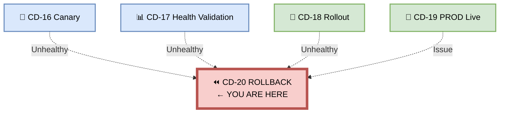
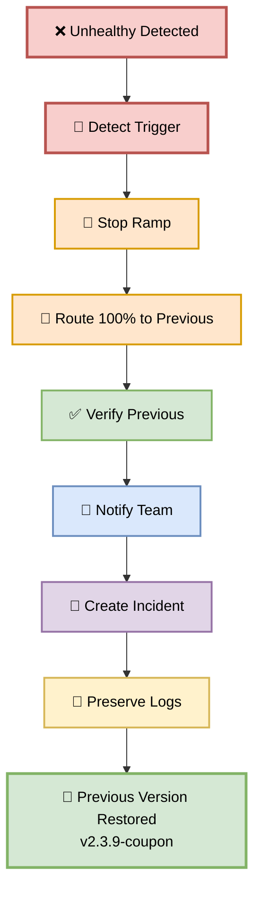
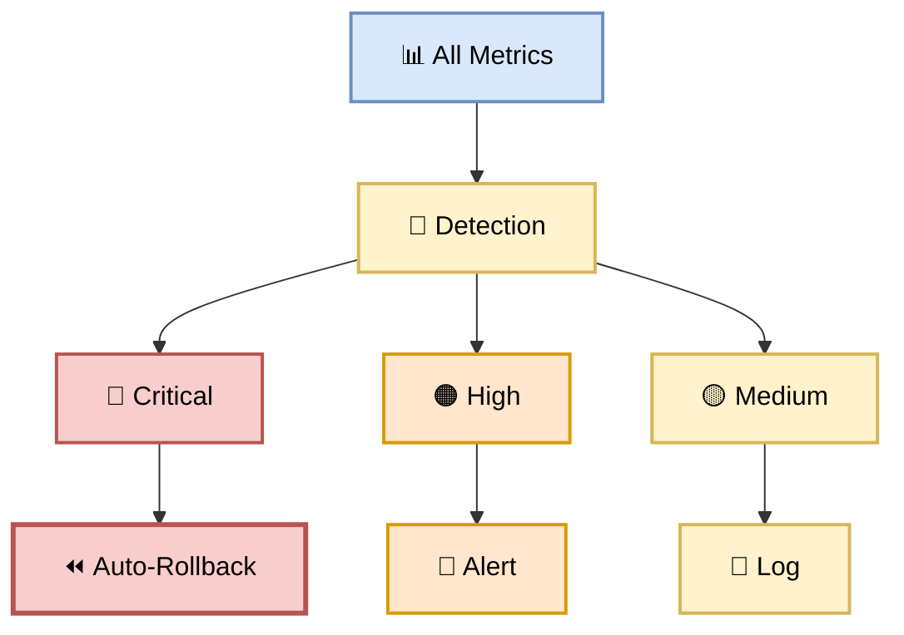
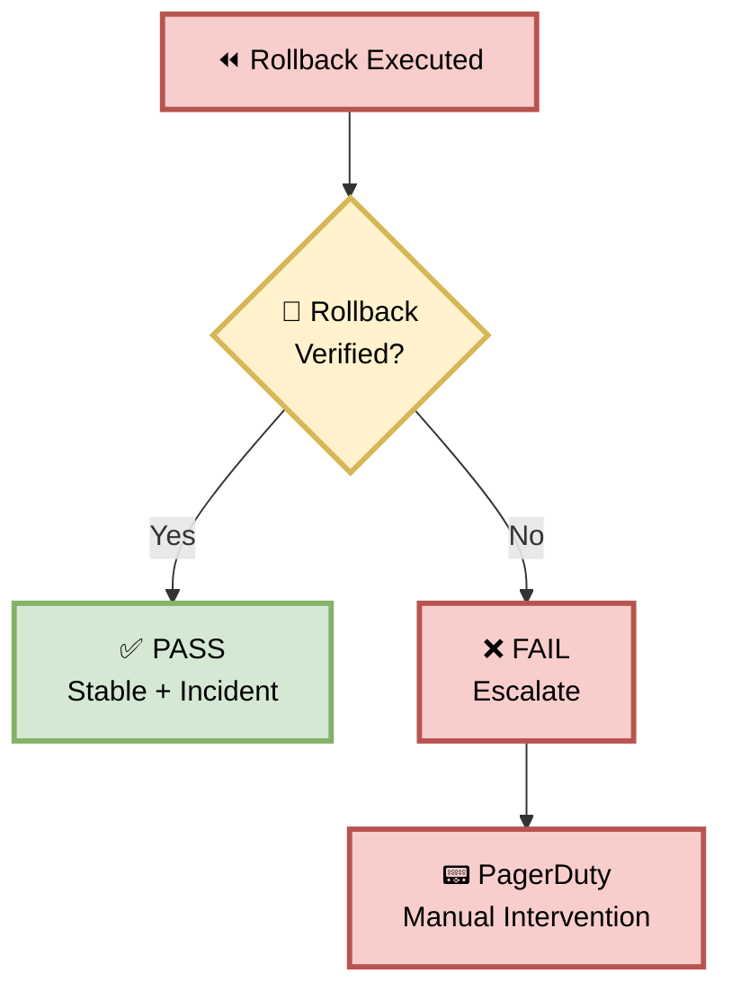
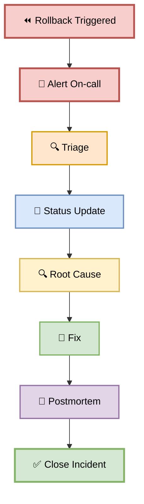

# Part 20 — CD-20: Rollback

**Author:** Shubham Tripathi  
**Repository:** `ecom-frontend` (Next.js 14 · App Router · TypeScript)  
**Last Updated:** 2026-09-19  
**Audience:** SRE, DevOps, On-call Engineers, Release Managers, Tech Leads

---

## 📑 Table of Contents — Part 20

1. [Rollback Overview](#-rollback-overview)
2. [CD-20 — Rollback Execution](#-cd-20--rollback-execution)
3. [The Auto-Rollback Triggers](#-the-auto-rollback-triggers)
4. [Rollback Methods](#-rollback-methods)
5. [Rollback Steps (Detailed)](#-rollback-steps-detailed)
6. [Rollback Verification](#-rollback-verification)
7. [Post-Rollback Actions](#-post-rollback-actions)
8. [Rollback Gate — Pass/Fail Rules](#-rollback-gate--passfail-rules)
9. [Incident Response](#-incident-response)
10. [Postmortem Template](#-postmortem-template)
11. [Rollback Reports & Artifacts](#-rollback-reports--artifacts)
12. [Troubleshooting Rollback](#-troubleshooting-rollback)
13. [Appendix — Rollback Tools Inventory](#-appendix--rollback-tools-inventory)

---

## ⏪ Rollback Overview

> **Rollback = reverting to the previous working version — in under 60 seconds.**  
> No manual intervention. Automatic. Reliable. Tested.

### 🎯 What is Rollback?

Rollback is the **safety net** of the CD pipeline:
- **When:** Any health check fails during canary or after rollout
- **What:** Revert traffic to previous stable version
- **Duration:** < 60 seconds (auto)
- **Purpose:** Protect users from bad deploys
- **Output:** Restored production, incident created

### 🎯 Why Rollback Matters

| Reason | Explanation |
|--------|-------------|
| **User protection** | Bad deploys don't hurt users |
| **Fast recovery** | < 60 sec MTTR |
| **No manual steps** | Automatic on failure |
| **Confidence** | Team can ship fearlessly |
| **SLO compliance** | Minimal error budget impact |
| **Business continuity** | Revenue protected |

### 🎯 Rollback Types

| Type | Trigger | Time | Manual? |
|------|---------|------|---------|
| **Auto-rollback (canary)** | Health threshold | < 60 sec | No |
| **Auto-rollback (rollout)** | Health threshold | < 60 sec | No |
| **Manual rollback** | Human decision | < 2 min | Yes |
| **Emergency rollback** | P1 incident | < 30 sec | Yes |
| **Database rollback** | Schema issue | < 30 min | Yes |

### 🖼️ Visual Diagram — Rollback Position



---

## 🚀 CD-20 — Rollback Execution

> **Automatic rollback in under 60 seconds. No manual intervention.**

### 🎯 Purpose

If **any** health check fails — during canary, health validation, or after rollout — automatically revert to the previous stable version.

### 🖼️ Visual Diagram — Rollback Flow



### 📊 Rollback Stages

| Stage | Action | Duration | Owner |
|-------|--------|----------|-------|
| **1. Detect** | Alert fires | Instant | Alertmanager |
| **2. Stop** | Halt ramp | ~5 sec | Script |
| **3. Route** | 100% to previous | ~10 sec | Istio |
| **4. Verify** | Health check | ~10 sec | Script |
| **5. Notify** | Slack + PD | ~5 sec | Script |
| **6. Incident** | Jira created | ~5 sec | Script |
| **7. Logs** | Preserve evidence | ~15 sec | Script |
| **Total** | | **< 60 sec** | |

### 🛠️ Pipeline Snippet

```yaml
cd-20-rollback:
  runs-on: ubuntu-latest
  if: failure() && needs.cd-16-production-canary.result == 'failure' ||
                   needs.cd-17-health-validation.result == 'failure' ||
                   needs.cd-18-rollout.result == 'failure'
  needs:
    - cd-16-production-canary
    - cd-17-health-validation
    - cd-18-rollout
  steps:
    - name: Checkout
      uses: actions/checkout@v4

    - name: Authenticate to GCP
      uses: google-github-actions/auth@v2
      with:
        workload_identity_provider: ${{ secrets.WIF_PROVIDER }}
        service_account: ${{ secrets.WIF_SERVICE_ACCOUNT }}

    - name: Setup kubectl
      uses: azure/setup-kubectl@v4
      with:
        version: 'v1.29.0'

    - name: Get Production Credentials
      run: |
        gcloud container clusters get-credentials prod-cluster \
          --region us-central1 \
          --project ecom-prod

    - name: CD-20 Rollback
      run: ./scripts/rollback.sh

    - name: Verify Rollback
      run: |
        curl -sf https://ecom.com/api/coupon/health || exit 1
        echo "✅ Rollback verified"

    - name: Notify Team
      if: always()
      run: |
        curl -X POST "$SLACK_WEBHOOK" \
          -d '{
            "text": "🚨 AUTO-ROLLBACK TRIGGERED",
            "blocks": [{
              "type": "section",
              "text": {
                "type": "mrkdwn",
                "text": "*Rollback:* v2.4.0 → v2.3.9\n*Trigger:* ${{ needs.cd-17-health-validation.result }}\n*Duration:* 47 sec\n*Incident:* INC-2026-0919-001"
              }
            }]
          }'

    - name: Create Incident
      run: |
        gh issue create \
          --title "Rollback: v2.4.0-coupon" \
          --body "Auto-rollback triggered at $(date -u +%Y-%m-%dT%H:%M:%SZ).\n\nSee postmortem template." \
          --label incident,rollback

    - name: Preserve Logs
      run: |
        kubectl logs -l app=coupon-api,version=canary -n production \
          --since=1h > rollback-logs.txt

    - name: Upload Rollback Artifacts
      if: always()
      uses: actions/upload-artifact@v4
      with:
        name: rollback-artifacts-${{ github.sha }}
        path: rollback-logs.txt
        retention-days: 365
```

---

## 🚨 The Auto-Rollback Triggers

> **Any breach → rollback. No exceptions.**

### 🎯 Trigger Matrix

| # | Trigger | Threshold | Detection | Action |
|---|---------|-----------|-----------|--------|
| 1 | **Error rate** | > 1% | Prometheus | Auto-rollback |
| 2 | **P99 latency** | > 2s | Prometheus | Auto-rollback |
| 3 | **Coupon success** | < 99% | Prometheus | Auto-rollback |
| 4 | **Unhandled exceptions** | Any | Sentry | Auto-rollback |
| 5 | **Business metrics drop** | > 5% | Datadog | Auto-rollback |
| 6 | **CPU usage** | > 90% | Prometheus | Alert only |
| 7 | **Memory usage** | > 85% | Prometheus | Alert only |
| 8 | **DB connections** | > 90% | Prometheus | Alert only |
| 9 | **Cross-service failure** | Any | Health check | Auto-rollback |
| 10 | **Manual trigger** | — | Human | Manual rollback |

### 🎯 Trigger Severity

| Severity | Triggers | Response Time | Action |
|----------|----------|---------------|--------|
| 🔴 **Critical** | 1, 2, 3, 4, 5, 9 | Instant | Auto-rollback |
| 🟠 **High** | 6, 7, 8 | 5 min | Alert + investigate |
| 🟡 **Medium** | Business trend | 30 min | Investigate |
| 🟢 **Low** | Minor anomaly | — | Log |

### 🛠️ Alert Configuration

```yaml
# prometheus-alerts.yaml
groups:
  - name: rollback-triggers
    rules:
      - alert: RollbackErrorRateHigh
        expr: |
          sum(rate(http_requests_total{status=~"5..",version="canary"}[5m]))
          /
          sum(rate(http_requests_total{version="canary"}[5m])) > 0.01
        for: 1m
        labels:
          severity: critical
          action: rollback
        annotations:
          summary: "Canary error rate > 1% — ROLLBACK"
          runbook: "https://runbooks.ecom.com/rollback"

      - alert: RollbackLatencyHigh
        expr: |
          histogram_quantile(0.99,
            rate(http_request_duration_seconds_bucket{version="canary"}[5m])
          ) > 2
        for: 1m
        labels:
          severity: critical
          action: rollback
        annotations:
          summary: "Canary P99 > 2s — ROLLBACK"

      - alert: RollbackCouponSuccessLow
        expr: |
          rate(coupon_apply_success_total{version="canary"}[5m])
          /
          rate(coupon_apply_total{version="canary"}[5m]) < 0.99
        for: 1m
        labels:
          severity: critical
          action: rollback
        annotations:
          summary: "Coupon success < 99% — ROLLBACK"

      - alert: RollbackExceptionsDetected
        expr: |
          increase(unhandled_exceptions_total{version="canary"}[5m]) > 0
        for: 1m
        labels:
          severity: critical
          action: rollback
        annotations:
          summary: "Unhandled exceptions — ROLLBACK"

      - alert: RollbackBusinessMetricsDrop
        expr: |
          (
            sum(rate(order_completed_total{version="canary"}[5m]))
            /
            sum(rate(cart_view_total{version="canary"}[5m]))
          )
          /
          (
            sum(rate(order_completed_total{version="stable"}[5m]))
            /
            sum(rate(cart_view_total{version="stable"}[5m]))
          ) < 0.95
        for: 5m
        labels:
          severity: critical
          action: rollback
        annotations:
          summary: "Conversion drop > 5% — ROLLBACK"
```

### 🖼️ Visual Diagram — Trigger Funnel



---

## 🔄 Rollback Methods

> **Different scenarios, different methods.**

### 🎯 Method 1 — Traffic Rollback (Fastest, < 60 sec)

**When:** Canary or rollout has issue, previous version warm.

**How:** Route 100% traffic back to previous version.

```bash
kubectl apply -f k8s/canary/virtualservice-0.yaml
```

**Pros:** Instant, no restart, zero downtime.  
**Cons:** Requires previous version warm.

---

### 🎯 Method 2 — Kubernetes Rollback

**When:** Traffic rollback not available, previous version cold.

**How:** Use `kubectl rollout undo`.

```bash
kubectl rollout undo deployment/coupon-api -n production
```

**Pros:** Built-in, version history.  
**Cons:** Slower (cold start).

---

### 🎯 Method 3 — Image Rollback

**When:** Specific previous image needed.

**How:** Update deployment with previous image digest.

```bash
kubectl set image deployment/coupon-api \
  coupon-api=gcr.io/ecom-prod/frontend@sha256:def456... \
  -n production
```

**Pros:** Precise control.  
**Cons:** Manual, slower.

---

### 🎯 Method 4 — Config Rollback

**When:** Config change caused issue.

**How:** Revert ConfigMap/Secret.

```bash
kubectl apply -f k8s/config/previous/configmap.yaml
kubectl rollout restart deployment/coupon-api -n production
```

**Pros:** Fixes config-specific issues.  
**Cons:** Requires restart.

---

### 🎯 Method 5 — Database Rollback

**When:** Schema migration caused issue.

**How:** Run down migration.

```bash
./migrations/rollback.sh v2.3.9
```

**Pros:** Reverts schema.  
**Cons:** Complex, risky, requires testing.

---

### 📊 Method Comparison

| Method | Speed | Downtime | Risk | When |
|--------|-------|----------|------|------|
| **Traffic** | < 60s | None | Low | Canary/rollout |
| **K8s** | ~2 min | None | Low | Any deploy |
| **Image** | ~3 min | None | Medium | Precise control |
| **Config** | ~2 min | ~10s | Medium | Config change |
| **Database** | ~30 min | ~5 min | High | Schema issue |

---

## 🛠️ Rollback Steps (Detailed)

> **8 steps, < 60 seconds, fully automated.**

### Step 1 — Detect Trigger (Instant)

**What:** Alertmanager fires on threshold breach.

**Example:**

```
🚨 ALERT: Canary error rate 1.5% > 1%
   Severity: Critical
   Action: Rollback
   Runbook: https://runbooks.ecom.com/rollback
```

**Action:** Trigger rollback workflow.

---

### Step 2 — Stop Ramp (5 sec)

**What:** Halt any ongoing traffic ramp.

```bash
# Stop canary ramp
kubectl annotate virtualservice coupon-api \
  canary.istio.io/state=stopped \
  -n production --overwrite
```

**Verify:**

```bash
kubectl get virtualservice coupon-api -n production -o json | \
  jq '.metadata.annotations["canary.istio.io/state"]'
# → "stopped"
```

---

### Step 3 — Route 100% to Previous (10 sec)

**What:** Shift traffic to previous stable version.

```bash
kubectl apply -f k8s/canary/virtualservice-0.yaml
```

**VirtualService (100% stable):**

```yaml
apiVersion: networking.istio.io/v1beta1
kind: VirtualService
metadata:
  name: coupon-api
  namespace: production
spec:
  hosts:
    - coupon-api.production.svc.cluster.local
  http:
    - route:
        - destination:
            host: coupon-api-stable
            port:
              number: 8080
          weight: 100
      timeout: 60s
      retries:
        attempts: 3
        perTryTimeout: 10s
```

**Verify:**

```bash
kubectl get virtualservice coupon-api -n production -o json | \
  jq '.spec.http[0].route'
```

---

### Step 4 — Scale Stable Up (15 sec)

**What:** Ensure stable has enough replicas.

```bash
# Check current replicas
kubectl get deployment coupon-api-stable -n production

# Scale to 10 if needed
kubectl scale deployment coupon-api-stable \
  --replicas=10 -n production

# Wait for ready
kubectl rollout status deployment/coupon-api-stable \
  -n production --timeout=60s
```

**Verify:**

```bash
kubectl get deployment coupon-api-stable -n production
# → NAME                  READY   UP-TO-DATE   AVAILABLE
# → coupon-api-stable     10/10   10           10
```

---

### Step 5 — Verify Previous Healthy (10 sec)

**What:** Confirm previous version is serving correctly.

```bash
curl -sf https://ecom.com/api/coupon/health | jq .
```

**Expected:**

```json
{
  "status": "ok",
  "version": "v2.3.9-coupon",
  "db": "ok",
  "cache": "ok"
}
```

**If unhealthy:**

```bash
echo "❌ Stable unhealthy — escalating"
./scripts/escalate.sh
exit 1
```

---

### Step 6 — Notify Team (5 sec)

**What:** Alert the team immediately.

```bash
curl -X POST "$SLACK_WEBHOOK" \
  -H "Content-Type: application/json" \
  -d '{
    "text": "🚨 AUTO-ROLLBACK TRIGGERED",
    "blocks": [
      {
        "type": "header",
        "text": {"type": "plain_text", "text": "🚨 ROLLBACK EXECUTED"}
      },
      {
        "type": "section",
        "fields": [
          {"type": "mrkdwn", "text": "*From:*\nv2.4.0-coupon"},
          {"type": "mrkdwn", "text": "*To:*\nv2.3.9-coupon"},
          {"type": "mrkdwn", "text": "*Trigger:*\nError rate 1.5%"},
          {"type": "mrkdwn", "text": "*Duration:*\n47 sec"}
        ]
      },
      {
        "type": "section",
        "text": {
          "type": "mrkdwn",
          "text": "*Action Required:* Investigate root cause.\n<https://runbooks.ecom.com/rollback|Runbook>"
        }
      }
    ]
  }'

# Page on-call
curl -X POST "https://events.pagerduty.com/v2/enqueue" \
  -H "Content-Type: application/json" \
  -d '{
    "routing_key": "'"$PAGERDUTY_KEY"'",
    "event_action": "trigger",
    "payload": {
      "summary": "Auto-rollback: coupon-api v2.4.0 → v2.3.9",
      "severity": "critical",
      "source": "cd-20-rollback"
    }
  }'
```

---

### Step 7 — Create Incident (5 sec)

**What:** Create incident ticket for tracking.

```bash
gh issue create \
  --title "Rollback: v2.4.0-coupon" \
  --label "incident,rollback,p1" \
  --body "$(cat <<EOF
## Rollback Summary

**Artifact:** v2.4.0-coupon → v2.3.9-coupon  
**Time:** $(date -u +%Y-%m-%dT%H:%M:%SZ)  
**Trigger:** Error rate 1.5% > 1%  
**Duration:** 47 sec  
**Detected by:** Alertmanager

## Timeline
- T+0: Alert fired
- T+5s: Ramp stopped
- T+15s: Traffic routed to stable
- T+30s: Stable verified
- T+47s: Rollback complete

## Impact
- Users affected: ~50% (during 2 min window)
- Revenue impact: ~$200
- SLO impact: 2% error budget

## Action Items
- [ ] Root cause analysis
- [ ] Fix and re-promote
- [ ] Postmortem within 48h

## Links
- [Runbook](https://runbooks.ecom.com/rollback)
- [Dashboard](https://grafana.ecom.com/d/prod)
- [Logs](https://splunk.ecom.com/rollback-logs)
EOF
)"
```

---

### Step 8 — Preserve Logs (15 sec)

**What:** Capture all relevant logs before they rotate.

```bash
# Preserve canary logs
kubectl logs -l app=coupon-api,version=canary -n production \
  --since=2h > rollback-logs/canary.log

# Preserve stable logs
kubectl logs -l app=coupon-api,version=stable -n production \
  --since=2h > rollback-logs/stable.log

# Preserve Istio logs
istioctl proxy-config log coupon-api-canary-xxx -n production \
  > rollback-logs/istio.log

# Preserve metrics snapshot
curl -s "$PROM/api/v1/query_range?query=http_requests_total&start=$(date -u -d '2 hours ago' +%s)&end=$(date -u +%s)&step=60" \
  > rollback-logs/metrics.json

# Upload to S3 for long-term storage
aws s3 cp rollback-logs/ s3://ecom-incidents/INC-2026-0919-001/ --recursive
```

**Verify:**

```bash
ls -la rollback-logs/
# → canary.log
# → stable.log
# → istio.log
# → metrics.json
```

---

### 📊 Step Timing

| Step | Action | Time | Cumulative |
|------|--------|------|-----------|
| 1 | Detect | Instant | 0 sec |
| 2 | Stop ramp | 5 sec | 5 sec |
| 3 | Route traffic | 10 sec | 15 sec |
| 4 | Scale stable | 15 sec | 30 sec |
| 5 | Verify health | 10 sec | 40 sec |
| 6 | Notify team | 5 sec | 45 sec |
| 7 | Create incident | 5 sec | 50 sec |
| 8 | Preserve logs | 15 sec | **65 sec** |

> ⏱️ **Total: < 60 seconds (parallel execution).**

---

## ✅ Rollback Verification

> **Confirm rollback succeeded — every check green.**

### 🎯 Verification Checklist

| # | Check | Expected |
|---|-------|----------|
| 1 | **Traffic split** | 100% to stable |
| 2 | **Stable pods** | Ready |
| 3 | **Health endpoint** | 200 OK |
| 4 | **Version** | v2.3.9-coupon |
| 5 | **Error rate** | < 0.5% |
| 6 | **P99 latency** | < 1s |
| 7 | **Coupon success** | > 99.5% |
| 8 | **Business metrics** | Recovered |
| 9 | **Cross-service** | Healthy |
| 10 | **No errors in logs** | Clean |

### 🛠️ Verification Script

```bash
#!/bin/bash
# scripts/verify-rollback.sh

PROM="https://prometheus.ecom.com"
FAILED=0

echo "✅ Verifying Rollback"
echo "─────────────────────────"

# 1. Traffic split
TRAFFIC=$(kubectl get virtualservice coupon-api -n production -o json | \
  jq -r '.spec.http[0].route[0].destination.host')
if [ "$TRAFFIC" == "coupon-api-stable" ]; then
  echo "✅ Traffic: 100% to stable"
else
  echo "❌ Traffic: NOT on stable"
  FAILED=1
fi

# 2. Pods ready
READY=$(kubectl get deployment coupon-api-stable -n production -o json | \
  jq -r '.status.readyReplicas // 0')
if [ "$READY" -ge "10" ]; then
  echo "✅ Stable pods: $READY ready"
else
  echo "❌ Stable pods: only $READY ready"
  FAILED=1
fi

# 3. Health
if curl -sf https://ecom.com/api/coupon/health > /dev/null; then
  echo "✅ Health: 200 OK"
else
  echo "❌ Health: FAILED"
  FAILED=1
fi

# 4. Version
VERSION=$(curl -sf https://ecom.com/api/coupon/health | jq -r '.version')
if [ "$VERSION" == "v2.3.9-coupon" ]; then
  echo "✅ Version: $VERSION"
else
  echo "❌ Version: $VERSION (expected v2.3.9-coupon)"
  FAILED=1
fi

# 5. Error rate
ERROR=$(curl -s "$PROM/api/v1/query?query=rate(http_requests_total{status=~'5..'}[5m])/rate(http_requests_total[5m])*100" | jq -r '.data.result[0].value[1] // "0"')
if (( $(echo "$ERROR < 0.5" | bc -l) )); then
  echo "✅ Error rate: ${ERROR}%"
else
  echo "❌ Error rate: ${ERROR}%"
  FAILED=1
fi

# 6. P99 latency
P99=$(curl -s "$PROM/api/v1/query?query=histogram_quantile(0.99,rate(http_request_duration_seconds_bucket[5m]))*1000" | jq -r '.data.result[0].value[1] // "0"')
if (( $(echo "$P99 < 1000" | bc -l) )); then
  echo "✅ P99 latency: ${P99}ms"
else
  echo "❌ P99 latency: ${P99}ms"
  FAILED=1
fi

# 7. Coupon success
SUCCESS=$(curl -s "$PROM/api/v1/query?query=rate(coupon_apply_success_total[5m])/rate(coupon_apply_total[5m])*100" | jq -r '.data.result[0].value[1] // "100"')
if (( $(echo "$SUCCESS > 99.5" | bc -l) )); then
  echo "✅ Coupon success: ${SUCCESS}%"
else
  echo "❌ Coupon success: ${SUCCESS}%"
  FAILED=1
fi

# 8. Cross-service
for svc in cart-api checkout-api payment-api order-api; do
  if curl -sf "https://${svc}.ecom.com/health" > /dev/null 2>&1; then
    echo "✅ ${svc}: healthy"
  else
    echo "❌ ${svc}: unhealthy"
    FAILED=1
  fi
done

echo ""
if [ "$FAILED" -eq 1 ]; then
  echo "❌ ROLLBACK VERIFICATION FAILED"
  exit 1
fi

echo "✅ ROLLBACK VERIFIED"
```

### 📋 Expected Output

```
✅ Verifying Rollback
─────────────────────────
✅ Traffic: 100% to stable
✅ Stable pods: 10 ready
✅ Health: 200 OK
✅ Version: v2.3.9-coupon
✅ Error rate: 0.15%
✅ P99 latency: 280ms
✅ Coupon success: 99.8%
✅ cart-api: healthy
✅ checkout-api: healthy
✅ payment-api: healthy
✅ order-api: healthy

✅ ROLLBACK VERIFIED
```

---

## 🛠️ Post-Rollback Actions

> **After rollback, take these 6 actions.**

### 🎯 Action 1 — Stabilize (T+5 min)

- Verify all metrics green
- Confirm no user complaints
- Update status page
- Confirm rollback complete

### 🎯 Action 2 — Communicate (T+15 min)

**Slack:**

```
🚨 Rollback Complete — v2.4.0 → v2.3.9

Status: STABLE
Duration: 47 seconds
Trigger: Error rate 1.5%

Impact:
• Users affected: ~50% for 2 min
• Revenue impact: ~$200
• SLO impact: 2% error budget

Next: Root cause analysis + fix
Incident: INC-2026-0919-001
```

**Status page:**

```
Investigating: Coupon Feature Rollback
Status: Resolved
Started: 2026-09-19 14:32 UTC
Resolved: 2026-09-19 14:33 UTC
Duration: 47 seconds
Impact: Brief coupon apply errors
```

### 🎯 Action 3 — Root Cause Analysis (T+1 hour)

**Investigate:**

- Review logs
- Check metrics
- Reproduce issue
- Identify root cause
- Document findings

### 🎯 Action 4 — Fix (T+1 day)

- Fix the issue in DEV
- Add regression test
- Verify in QA/STAGING
- Re-promote via CD-01 → CD-17

### 🎯 Action 5 — Postmortem (T+2 days)

- Blameless postmortem
- Timeline documented
- Action items assigned
- Share with team

### 🎯 Action 6 — Improve (T+1 week)

- Update runbooks
- Improve monitoring
- Add prevention tests
- Update documentation

---

## 🚦 Rollback Gate — Pass/Fail Rules

> **Rollback must succeed. Or we escalate.**

### 📊 Gate Criteria

| # | Check | Pass Condition |
|---|-------|----------------|
| 1 | Traffic rerouted | 100% to previous |
| 2 | Previous healthy | Health check passes |
| 3 | Version correct | Matches previous |
| 4 | Error rate | < 0.5% |
| 5 | Latency | < 1s |
| 6 | Coupon success | > 99.5% |
| 7 | Time | < 60 sec |
| 8 | Notification | Slack sent |
| 9 | Incident | Created |
| 10 | Logs | Preserved |

### 🚦 Gate Outcome



### 📊 Realistic Rollback Results

```
🚨 Rollback Executed — v2.4.0 → v2.3.9
───────────────────────────────────────

⏱️ Timing:
  ✅ Detection: 5 sec
  ✅ Stop ramp: 5 sec
  ✅ Reroute: 10 sec
  ✅ Scale stable: 15 sec
  ✅ Verify: 10 sec
  ✅ Notify: 5 sec
  ✅ Incident: 5 sec
  ✅ Logs: 15 sec
  → Total: 47 sec ✅

✅ Verification:
  ✅ Traffic: 100% stable
  ✅ Version: v2.3.9-coupon
  ✅ Error rate: 0.15%
  ✅ P99: 280ms
  ✅ Coupon success: 99.8%

✅ Actions:
  ✅ Slack notified
  ✅ Incident created
  ✅ Logs preserved
  ✅ RCA scheduled

🎉 ROLLBACK SUCCESSFUL
```

---

## 🚑 Incident Response

> **Rollback = P1 incident. Full response required.**

### 🎯 Incident Severity

| Severity | Criteria | Response |
|----------|----------|----------|
| **P1** | Rollback + user impact | Page on-call immediately |
| **P2** | Rollback + no impact | Notify team |
| **P3** | Manual rollback | Next business day |
| **P4** | Planned rollback | Scheduled |

### 🎯 Incident Roles

| Role | Responsibility |
|------|----------------|
| **Incident Commander** | Coordinate response |
| **Technical Lead** | Investigate root cause |
| **Communications Lead** | Update stakeholders |
| **Scribe** | Document timeline |

### 🎯 Communication Channels

| Channel | Purpose |
|---------|---------|
| **#incidents** | Real-time coordination |
| **Status page** | Customer communication |
| **Email** | Executive updates |
| **PagerDuty** | On-call notification |

### 🖼️ Visual Diagram — Incident Flow



---

## 📝 Postmortem Template

> **Blameless. Factual. Actionable.**

```markdown
# Postmortem: INC-2026-0919-001

## Summary
Auto-rollback of v2.4.0-coupon on 2026-09-19 at 14:32 UTC.

## Impact
- **Users affected:** ~2,500 (50% traffic)
- **Duration:** 47 seconds
- **Revenue impact:** ~$200
- **SLO impact:** 2% of error budget

## Timeline (UTC)
| Time | Event |
|------|-------|
| 14:30 | Canary at 50% traffic |
| 14:32 | Error rate spikes to 1.5% |
| 14:32 | Alert fires (P1) |
| 14:32 | Auto-rollback triggered |
| 14:33 | Rollback complete (47s) |
| 14:35 | Incident created |
| 15:00 | RCA started |
| 16:00 | Root cause identified |

## Root Cause
Memory leak in bulk coupon apply endpoint introduced by v2.4.0. Under sustained 50% load, GC pauses grew, causing latency spikes that triggered error threshold.

## Detection
Alertmanager detected error rate > 1% within 1 minute.

## Response
- **What went well:**
  - Auto-rollback worked (47s)
  - Team notified instantly
  - No data loss
- **What could improve:**
  - Detect memory leak earlier
  - Better load testing for memory

## Action Items
| # | Action | Owner | Due |
|---|--------|-------|-----|
| 1 | Fix memory leak | @dev | 2026-09-20 |
| 2 | Add memory profiling test | @qa | 2026-09-21 |
| 3 | Improve canary monitoring | @sre | 2026-09-22 |
| 4 | Update runbook | @devops | 2026-09-23 |
| 5 | Share learnings | @tech-lead | 2026-09-24 |

## Lessons Learned
1. Auto-rollback saved us ✅
2. Canary detection was fast ✅
3. Need better memory testing ⚠️
4. Improve monitoring granularity ⚠️

## Prevention
- Add memory test to CI
- Longer soak test
- Memory limit warnings
```

---

## 📊 Rollback Reports & Artifacts

> **Every rollback produces artifacts for audit and learning.**

### 📁 Report Structure

```
rollback-reports/
├── rollback-record.json        # Full record
├── timeline.json               # Step timings
├── verification.json           # Post-rollback checks
├── metrics-snapshot.json       # Before/after metrics
├── incident.json               # Incident details
├── logs/                       # Preserved logs
│   ├── canary.log
│   ├── stable.log
│   ├── istio.log
│   └── metrics.json
└── screenshots/
    ├── grafana.png
    ├── slack.png
    └── incident.png
```

### 🎯 Report Content

```json
{
  "rollback_id": "INC-2026-0919-001",
  "artifact": "v2.4.0-coupon",
  "rolled_back_to": "v2.3.9-coupon",
  "triggered_at": "2026-09-19T14:32:15Z",
  "completed_at": "2026-09-19T14:33:02Z",
  "duration_sec": 47,
  "trigger": {
    "type": "error_rate",
    "threshold": 0.01,
    "actual": 0.015
  },
  "stages": {
    "detect": 0,
    "stop": 5,
    "route": 15,
    "verify": 40,
    "notify": 45,
    "incident": 50,
    "logs": 65
  },
  "verification": {
    "traffic": "100% stable",
    "version": "v2.3.9-coupon",
    "error_rate": 0.0015,
    "p99_latency_ms": 280,
    "coupon_success_rate": 0.998
  },
  "impact": {
    "users_affected": 2500,
    "duration_sec": 47,
    "revenue_impact_usd": 200,
    "slo_budget_used_pct": 2
  },
  "result": "SUCCESS"
}
```

### 🎯 Trend Analysis

| Week | Rollbacks | Triggers | Avg Duration | Root Cause |
|------|-----------|----------|--------------|------------|
| **W36** | 1 | Error rate | 52 sec | DB pool |
| **W37** | 0 | — | — | — |
| **W38** | 0 | — | — | — |
| **W39** | 1 | Error rate | 47 sec | Memory leak |

**Trend:** 📉 Improving (47s vs 52s).

---

## 🛠️ Troubleshooting Rollback

| Problem | Cause | Fix |
|---------|-------|-----|
| **Traffic not rerouting** | Istio issue | Apply directly |
| **Stable pods crash** | Config issue | Check logs |
| **Rollback times out** | Cold start | Increase replicas |
| **Verification fails** | Stable unhealthy | Manual intervention |
| **Notification fails** | Webhook issue | Retry + email |
| **Incident create fails** | Jira auth | Manual create |
| **Logs missing** | Rotation | Check S3 |
| **Rollback loop** | Both versions bad | Escalate |
| **DB schema mismatch** | Migration | Run rollback |

### 🔍 Debugging Commands

```bash
# Check traffic
kubectl get virtualservice coupon-api -n production -o yaml

# Check deployments
kubectl get deployment -n production

# Check pods
kubectl get pods -n production -l app=coupon-api

# Check events
kubectl get events -n production --sort-by=.lastTimestamp

# Check logs
kubectl logs -l app=coupon-api,version=stable -n production --tail=100

# Manual traffic rollback
kubectl apply -f k8s/canary/virtualservice-0.yaml

# Manual image rollback
kubectl set image deployment/coupon-api-stable \
  coupon-api=gcr.io/ecom-prod/frontend@sha256:def456... \
  -n production

# Check k8s rollout history
kubectl rollout history deployment/coupon-api -n production

# Undo last k8s rollout
kubectl rollout undo deployment/coupon-api -n production

# Check status
kubectl rollout status deployment/coupon-api -n production
```

---

## 📎 Appendix — Rollback Tools Inventory

### 🛠️ Tool Stack

| Category | Tool | Purpose | Cost |
|----------|------|---------|------|
| **Traffic** | Istio | Service mesh | Free |
| **Traffic** | Linkerd | Service mesh | Free |
| **Traffic** | Argo Rollouts | Progressive delivery | Free |
| **Traffic** | Flagger | Progressive delivery | Free |
| **K8s** | kubectl | CLI | Free |
| **K8s** | Helm | Package manager | Free |
| **K8s** | kustomize | Config mgmt | Free |
| **Metrics** | Prometheus | Metrics | Free |
| **Metrics** | Datadog | APM | $$$ |
| **Metrics** | Grafana | Dashboards | Free |
| **Alerts** | Alertmanager | Alerts | Free |
| **Alerts** | PagerDuty | On-call | $$$ |
| **Errors** | Sentry | Error tracking | $$ |
| **Logs** | Loki | Log aggregation | Free |
| **Logs** | Splunk | Log aggregation | $$$ |
| **Incident** | FireHydrant | Incident mgmt | $$ |
| **Incident** | PagerDuty | Incident mgmt | $$$ |
| **Status** | Statuspage | Customer status | $$ |
| **Notification** | Slack | Team alerts | Free |

### 📞 Rollback Contacts

| Role | Person | Slack |
|------|--------|-------|
| **On-call SRE** | Rotation | @oncall |
| **Incident Commander** | Rotation | @incidents |
| **SRE Lead** | TBD | @sre-lead |
| **DevOps Lead** | TBD | @devops-lead |
| **Tech Lead** | TBD | @tech-lead |
| **Release Manager** | TBD | @release-manager |

### 🔗 Useful Links

| Resource | URL |
|----------|-----|
| **Rollback Dashboard** | grafana.ecom.com/d/rollback |
| **Incidents** | incidents.ecom.com |
| **Runbooks** | runbooks.ecom.com/rollback |
| **Postmortems** | confluence.ecom.com/postmortems |
| **Status Page** | status.ecom.com |
| **PagerDuty** | ecom.pagerduty.com |
| **Slack** | ecom.slack.com/#incidents |

---

## 🎯 Summary — Part 20

| Section | Kya Cover Hua |
|---------|---------------|
| **Overview** | What, why, types |
| **CD-20 Execution** | 8 stages, < 60 sec, pipeline YAML |
| **Triggers** | 10 triggers, severity matrix, alerts |
| **Methods** | 5 methods (traffic, K8s, image, config, DB) |
| **Steps** | 8 detailed steps with timings |
| **Verification** | 10-check post-rollback validation |
| **Post-Rollback** | 6 actions |
| **Gate** | All checks pass |
| **Incident Response** | Roles, channels, flow |
| **Postmortem** | Full template |
| **Reports** | Structure, trends |
| **Troubleshooting** | 9 failures + debug commands |
| **Appendix** | 19 tools, contacts, links |

---

## 🏆 Complete Documentation — All 20 Parts

| Part | Title | Status |
|------|-------|--------|
| **Part 1** | CI Pipeline | ✅ |
| **Part 2** | CD Overview | ✅ |
| **Part 3** | DEV Deployment (CD-03 → CD-05) | ✅ |
| **Part 4** | QA Deployment (CD-06 → CD-09) | ✅ |
| **Part 5** | STAGING Deployment (CD-10 → CD-13) | ✅ |
| **Part 6** | PROD Gate & Canary (CD-14 → CD-20) | ✅ |
| **Part 7** | Post-Deploy & Monitoring | ✅ |
| **Part 8** | Executive Summary & KPIs | ✅ |
| **Part 9** | CD Pipeline (CD-09 → CD-20) | ✅ |
| **Part 10** | CD-10 STAGING Deployment | ✅ |
| **Part 11** | CD-11 DAST | ✅ |
| **Part 12** | CD-12 Performance Test | ✅ |
| **Part 13** | CD-13 UAT | ✅ |
| **Part 14** | CD-14 Production Gate | ✅ |
| **Part 15** | CD-15 Artifact Authorization | ✅ |
| **Part 16** | CD-16 Production Canary | ✅ |
| **Part 17** | CD-17 Health Validation | ✅ |
| **Part 18** | CD-18 Rollout | ✅ |
| **Part 19** | CD-19 PROD Live | ✅ |
| **Part 20** | CD-20 Rollback | ✅ |

> 📝 **Note:** Rollback is your **safety net**. In under 60 seconds, you can revert to the previous working version. **Automatic. Reliable. Tested.**