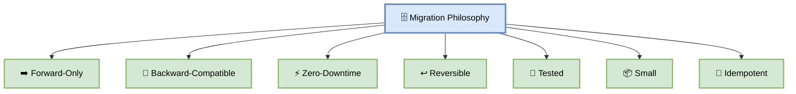
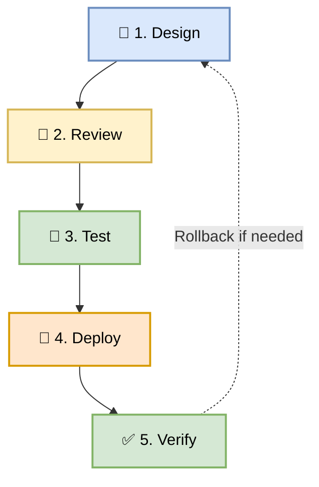
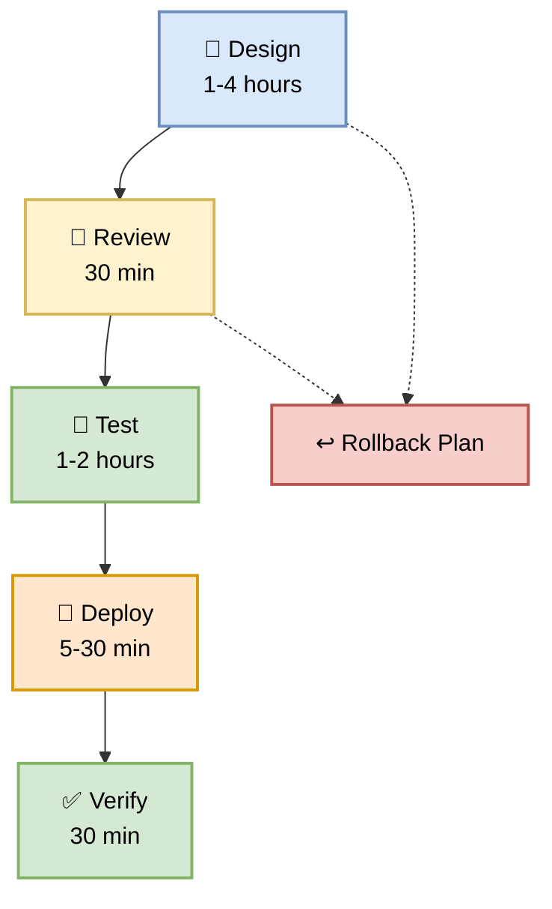
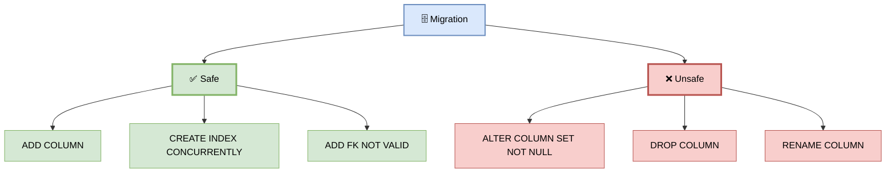
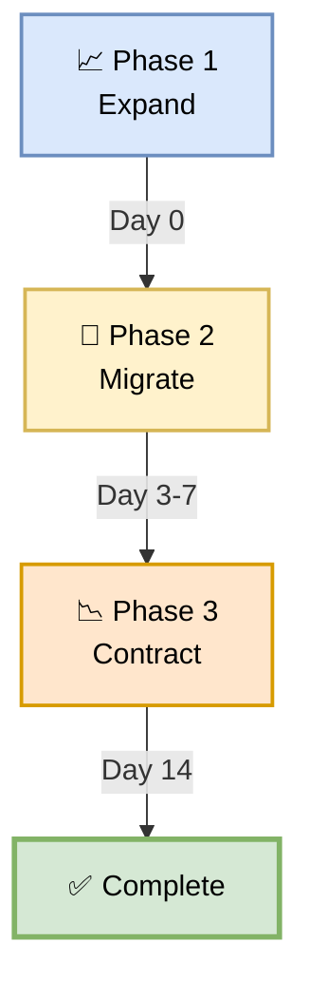
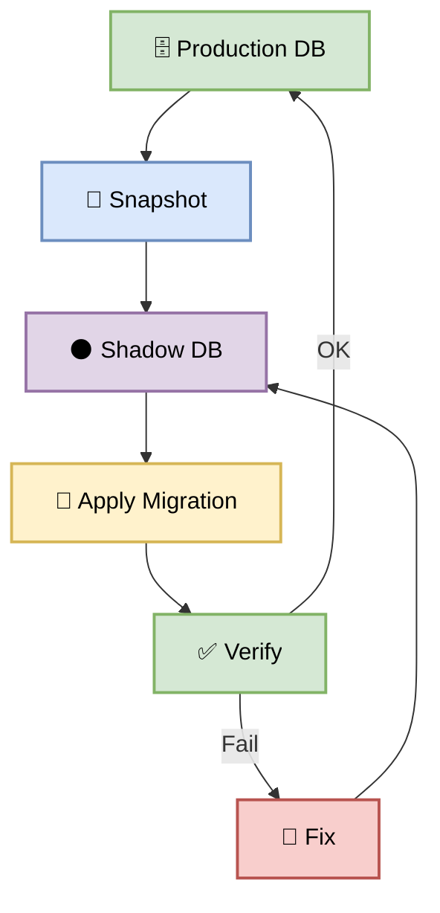
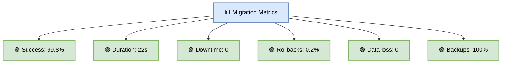

# Part 22 — Database Migrations & Schema Changes

**Author:** Shubham Tripathi  
**Repository:** `ecom-frontend` (Next.js 14 · App Router · TypeScript)  
**Last Updated:** 2026-09-19  
**Audience:** Backend Engineers, Frontend Engineers, DBAs, DevOps, SRE, Tech Leads

---

## 📑 Table of Contents — Part 22

1. [Migration Philosophy](#-migration-philosophy)
2. [Migration Strategy Overview](#-migration-strategy-overview)
3. [Migration Tools](#-migration-tools)
4. [Migration Lifecycle](#-migration-lifecycle)
5. [Zero-Downtime Migrations](#-zero-downtime-migrations)
6. [Expand-Contract Pattern](#-expand-contract-pattern)
7. [Forward-Only Migrations](#-forward-only-migrations)
8. [Rollback Strategies](#-rollback-strategies)
9. [Data Backfills](#-data-backfills)
10. [Testing Migrations](#-testing-migrations)
11. [Production Dry Runs](#-production-dry-runs)
12. [Coupon Feature — Migration Examples](#-coupon-feature--migration-examples)
13. [CI/CD Integration](#-cicd-integration)
14. [Migration Metrics & KPIs](#-migration-metrics--kpis)
15. [Troubleshooting](#-troubleshooting)
16. [Appendix — Migration Tools Inventory](#-appendix--migration-tools-inventory)

---

## 🗄️ Migration Philosophy

> **Database migrations are the riskiest part of any deployment.**  
> A bad migration can corrupt data, cause downtime, or break production. Treat them with respect.

### 🎯 Core Principles

| Principle | Description |
|-----------|-------------|
| **Forward-only** | Never roll back schema in production |
| **Backward-compatible** | New schema works with old code |
| **Zero-downtime** | No locking, no long transactions |
| **Reversible** | Every change has a rollback plan |
| **Tested** | Migrations tested before production |
| **Small** | One logical change per migration |
| **Idempotent** | Running twice = same result |
| **Versioned** | Every migration has a version |
| **Audited** | Who ran what, when |
| **Reviewed** | DBA + Tech Lead approval |

### 🎯 Why Migrations Matter

| Reason | Impact |
|--------|--------|
| **Schema evolution** | Features need new tables/columns |
| **Data integrity** | Constraints enforce correctness |
| **Performance** | Indexes speed up queries |
| **Zero-downtime** | Users never see failures |
| **Compliance** | Audit trail of changes |
| **Reversibility** | Undo bad changes safely |

### 🖼️ Visual Diagram — Migration Philosophy



---

## 📋 Migration Strategy Overview

> **Every migration is a 5-phase process.**

### 🎯 The 5 Phases



### 📊 Phase Details

| Phase | Action | Owner | Duration |
|-------|--------|-------|----------|
| **1. Design** | Write migration, plan rollback | Backend Dev | 1-4 hours |
| **2. Review** | DBA + Tech Lead review | DBA + TL | 30 min |
| **3. Test** | Local, CI, staging | QA + Dev | 1-2 hours |
| **4. Deploy** | Apply to production | DevOps | 5-30 min |
| **5. Verify** | Check metrics, data | SRE + Dev | 30 min |

### 🎯 Migration Types

| Type | Risk | Example |
|------|------|---------|
| **Add table** | 🟢 Low | `CREATE TABLE coupons_v2` |
| **Add column (nullable)** | 🟢 Low | `ALTER TABLE ADD COLUMN` |
| **Add index** | 🟡 Medium | `CREATE INDEX CONCURRENTLY` |
| **Rename column** | 🔴 High | Requires expand-contract |
| **Drop column** | 🔴 High | Requires verification |
| **Change type** | 🔴 High | Requires data migration |
| **Add constraint** | 🟠 High | Can lock table |

---

## 🛠️ Migration Tools

> **Different tools for different needs.**

### 🎯 Tool Comparison

| Tool | Language | Type | Best For |
|------|----------|------|----------|
| **Prisma Migrate** | TypeScript | ORM + Migrations | Next.js apps |
| **Knex** | TypeScript | Query builder | Flexible migrations |
| **Flyway** | Java | SQL-based | Enterprise |
| **Liquibase** | Java | XML/YAML/SQL | Enterprise |
| **Alembic** | Python | SQLAlchemy | Python apps |
| **Rails ActiveRecord** | Ruby | Ruby DSL | Rails apps |
| **dbmate** | Any | SQL | Simple SQL |
| **golang-migrate** | Go | SQL | Go apps |
| **node-pg-migrate** | TypeScript | SQL/JS | Node.js apps |

### 🎯 Our Choice: Prisma Migrate

**Why Prisma?**
- Type-safe schema
- Auto-generated migrations
- Excellent DX
- Built-in seeding
- Great for Next.js
- PostgreSQL + MySQL + SQLite

### 🛠️ Prisma Setup

```bash
# Install
npm install prisma @prisma/client --save-dev

# Initialize
npx prisma init

# Generate client
npx prisma generate

# Create migration
npx prisma migrate dev --name add_coupon_bulk

# Apply to production
npx prisma migrate deploy
```

### 📁 Prisma Structure

```
prisma/
├── schema.prisma           # Schema definition
├── migrations/             # All migrations
│   ├── 20260919000001_init/
│   │   └── migration.sql
│   ├── 20260919000002_add_coupons/
│   │   └── migration.sql
│   └── 20260919000003_bulk_apply/
│       └── migration.sql
└── seed.ts                 # Seed data
```

### 🎯 schema.prisma

```prisma
// prisma/schema.prisma
generator client {
  provider = "prisma-client-js"
}

datasource db {
  provider = "postgresql"
  url      = env("DATABASE_URL")
}

model Coupon {
  id             String   @id @default(cuid())
  code           String   @unique
  discountPct    Int
  minPurchase    Decimal  @default(0) @db.Decimal(10, 2)
  maxDiscount    Decimal? @db.Decimal(10, 2)
  usageLimit     Int?
  usageCount     Int      @default(0)
  expiresAt      DateTime?
  active         Boolean  @default(true)
  createdAt      DateTime @default(now())
  updatedAt      DateTime @updatedAt

  applications CouponApplication[]

  @@index([code])
  @@index([active, expiresAt])
  @@map("coupons")
}

model CouponApplication {
  id         String   @id @default(cuid())
  couponId   String
  userId     String
  cartTotal  Decimal  @db.Decimal(10, 2)
  discount   Decimal  @db.Decimal(10, 2)
  finalTotal Decimal  @db.Decimal(10, 2)
  appliedAt  DateTime @default(now())

  coupon Coupon @relation(fields: [couponId], references: [id])

  @@index([couponId])
  @@index([userId])
  @@index([appliedAt])
  @@map("coupon_applications")
}
```

---

## 🔄 Migration Lifecycle

> **From design to deployment — every step matters.**

### 🎯 Step 1 — Design Migration

**Questions to ask:**
- What's the business need?
- What's the schema change?
- Is it backward-compatible?
- What's the rollback plan?
- How long will it take?
- Will it lock tables?

**Example — Add bulk apply support:**

```prisma
// prisma/schema.prisma
model CouponApplication {
  id            String   @id @default(cuid())
  couponId      String
  userId        String
  cartTotal     Decimal  @db.Decimal(10, 2)
  discount      Decimal  @db.Decimal(10, 2)
  finalTotal    Decimal  @db.Decimal(10, 2)
  // NEW: bulk apply
  bulkId        String?  // Groups multiple coupons
  sequence      Int?     // Order within bulk
  appliedAt     DateTime @default(now())

  coupon Coupon @relation(fields: [couponId], references: [id])

  @@index([couponId])
  @@index([userId])
  @@index([bulkId])       // NEW: for bulk queries
  @@index([appliedAt])
  @@map("coupon_applications")
}
```

**Why nullable?** Backward-compatible — old code doesn't set these fields.

### 🎯 Step 2 — Review Migration

**Checklist:**

- [ ] Migration is backward-compatible
- [ ] No locks on large tables
- [ ] Indexes created CONCURRENTLY
- [ ] Rollback plan exists
- [ ] Tested locally
- [ ] Duration estimated
- [ ] Data impact analyzed

**Review by:**
- DBA (technical)
- Tech Lead (business)
- DevOps (deployment)

### 🎯 Step 3 — Test Migration

```bash
# Test locally
npx prisma migrate dev --name add_bulk_support

# Test on staging
npx prisma migrate deploy

# Run tests
npm test

# Verify data
psql -c "SELECT * FROM coupon_applications LIMIT 5;"
```

### 🎯 Step 4 — Deploy Migration

**Deployment order:**

```
1. Backup database (snapshot)
2. Apply migration (schema change)
3. Deploy new code (uses new schema)
4. Verify (health checks)
5. Cleanup (drop old columns if needed)
```

**Critical:** Always run migration **before** code deploy for additive changes.

### 🎯 Step 5 — Verify Migration

```bash
# Check schema
npx prisma db pull

# Check data
psql -c "SELECT COUNT(*) FROM coupon_applications WHERE bulk_id IS NOT NULL;"

# Check performance
psql -c "EXPLAIN ANALYZE SELECT * FROM coupon_applications WHERE bulk_id = 'bulk-123';"

# Check indexes
psql -c "\d coupon_applications"
```

### 🖼️ Visual Diagram — Migration Lifecycle



---

## ⚡ Zero-Downtime Migrations

> **Users should never see downtime from a migration.**

### 🎯 The Rules

| Rule | Why |
|------|-----|
| **No `ALTER TABLE ... SET NOT NULL`** | Locks table |
| **No `ALTER TABLE ... ADD COLUMN ... DEFAULT`** | Locks table (pre-PG11) |
| **No `DROP COLUMN`** | Old code breaks |
| **No `RENAME COLUMN`** | Old code breaks |
| **No `CREATE INDEX`** | Locks table — use `CONCURRENTLY` |
| **No long transactions** | Blocks other queries |
| **No full table scans** | Slow on large tables |

### 🎯 Safe Operations

| Operation | Safe? | How |
|-----------|-------|-----|
| `ADD COLUMN (nullable)` | ✅ Yes | Instant |
| `ADD COLUMN DEFAULT` | ⚠️ PG11+ | Instant |
| `CREATE INDEX CONCURRENTLY` | ✅ Yes | No lock |
| `DROP INDEX CONCURRENTLY` | ✅ Yes | No lock |
| `ADD FOREIGN KEY NOT VALID` | ✅ Yes | Then `VALIDATE` |
| `ADD CHECK NOT VALID` | ✅ Yes | Then `VALIDATE` |
| `RENAME TABLE` | ❌ No | Use expand-contract |
| `RENAME COLUMN` | ❌ No | Use expand-contract |
| `DROP COLUMN` | ❌ No | Requires 2 phases |
| `CHANGE TYPE` | ❌ No | Requires data migration |

### 🎯 Unsafe → Safe

```sql
-- ❌ BAD: Locks table (millions of rows)
ALTER TABLE coupon_applications
ADD COLUMN bulk_id VARCHAR(255) NOT NULL;

-- ✅ GOOD: Nullable first
ALTER TABLE coupon_applications
ADD COLUMN bulk_id VARCHAR(255);

-- Later, backfill and add constraint
UPDATE coupon_applications SET bulk_id = id WHERE bulk_id IS NULL;
ALTER TABLE coupon_applications
ALTER COLUMN bulk_id SET NOT NULL;
```

```sql
-- ❌ BAD: Blocks writes
CREATE INDEX idx_bulk ON coupon_applications(bulk_id);

-- ✅ GOOD: Concurrent, no lock
CREATE INDEX CONCURRENTLY idx_bulk ON coupon_applications(bulk_id);
```

### 🖼️ Visual Diagram — Lock Analysis



---

## 🔄 Expand-Contract Pattern

> **The safest way to make breaking changes.**

### 🎯 What is Expand-Contract?

Break a breaking change into **3 phases**:
1. **Expand** — Add new, keep old
2. **Migrate** — Use new, backfill old
3. **Contract** — Remove old

### 🎯 Example — Rename Column

**Goal:** Rename `coupon_code` → `promo_code`

**❌ Bad (breaks old code):**

```sql
ALTER TABLE coupons RENAME COLUMN coupon_code TO promo_code;
```

**✅ Good (3 phases):**

**Phase 1 — Expand:**

```sql
-- Add new column (nullable)
ALTER TABLE coupons ADD COLUMN promo_code VARCHAR(50);

-- Backfill data
UPDATE coupons SET promo_code = coupon_code WHERE promo_code IS NULL;

-- Add index
CREATE INDEX CONCURRENTLY idx_promo_code ON coupons(promo_code);

-- Add trigger to keep both in sync (during transition)
CREATE TRIGGER sync_coupon_code
BEFORE INSERT OR UPDATE ON coupons
FOR EACH ROW EXECUTE FUNCTION sync_coupon_columns();
```

**Phase 2 — Migrate:**

```typescript
// Update code to use new column
// Old code: coupon_code
// New code: promo_code

// Deploy new code
// Both columns work (trigger keeps in sync)
// Old code still works
// New code works
```

**Phase 3 — Contract:**

```sql
-- After 1-2 weeks (all code uses new column)
DROP TRIGGER sync_coupon_code ON coupons;
DROP FUNCTION sync_coupon_columns();
DROP INDEX idx_coupon_code;
ALTER TABLE coupons DROP COLUMN coupon_code;
```

### 📊 Expand-Contract Timeline



### 🎯 Full Example — Coupon Feature

**Goal:** Add `bulk_id` and `sequence` to `coupon_applications`

**Phase 1 — Expand (Day 0):**

```sql
-- Add nullable columns
ALTER TABLE coupon_applications ADD COLUMN bulk_id VARCHAR(255);
ALTER TABLE coupon_applications ADD COLUMN sequence INTEGER;

-- Add indexes
CREATE INDEX CONCURRENTLY idx_bulk_id ON coupon_applications(bulk_id);
```

**Phase 2 — Migrate (Day 1-7):**

```typescript
// New code writes both old and new columns
await prisma.couponApplication.create({
  data: {
    couponId,
    userId,
    cartTotal,
    discount,
    finalTotal,
    bulkId: bulkId || null,     // NEW
    sequence: sequence || null, // NEW
  },
});

// Read uses new column if available, else old logic
const bulkId = app.bulkId || deriveBulkId(app);
```

**Phase 3 — Contract (Day 14):**

```sql
-- After all code uses new columns
-- (No old code reads/writes)
-- Ensure no NULLs
UPDATE coupon_applications SET bulk_id = 'legacy' WHERE bulk_id IS NULL;
ALTER TABLE coupon_applications ALTER COLUMN bulk_id SET NOT NULL;

-- Optional: drop old columns (if replacing)
```

---

## ➡️ Forward-Only Migrations

> **Never roll back schema in production. Roll forward.**

### 🎯 Why Forward-Only?

| Reason | Explanation |
|--------|-------------|
| **Data loss risk** | Rolling back drops data |
| **Complexity** | Rollback scripts are fragile |
| **Time** | Rolling back is slower than rolling forward |
| **Safety** | Forward is tested; rollback isn't |
| **Standard** | Industry best practice |

### 🎯 The Rule

```
❌ NEVER:  Rollback schema in production
✅ ALWAYS: Roll forward with a new migration
```

### 🎯 Example — Bad Migration

**Migration v1 (bad):**

```sql
-- Added a column, but it's wrong
ALTER TABLE coupons ADD COLUMN discount_percent INTEGER;
```

**❌ Don't rollback:**

```sql
-- DON'T DO THIS
ALTER TABLE coupons DROP COLUMN discount_percent;
```

**✅ Roll forward:**

```sql
-- Migration v2 (new migration)
ALTER TABLE coupons ADD COLUMN discount_pct INTEGER;

-- Backfill
UPDATE coupons SET discount_pct = discount_percent WHERE discount_pct IS NULL;

-- Later, contract (remove old column)
-- DROP COLUMN discount_percent;
```

### 🎯 Exception — Rollback Allowed

Forward-only is the rule, but **rollback is allowed** in these cases:

| Scenario | Rollback? |
|----------|-----------|
| **Migration not applied yet** | ✅ Yes |
| **Migration applied but no data** | ⚠️ Maybe |
| **Migration applied with data** | ❌ No — forward only |
| **Production data affected** | ❌ No — forward only |
| **Compliance issue** | ⚠️ Via incident process |

---

## ↩️ Rollback Strategies

> **Even with forward-only, you need a rollback plan.**

### 🎯 Rollback Types

| Type | When | Method |
|------|------|--------|
| **Pre-deployment rollback** | Before apply | Cancel |
| **Post-deployment rollback (no data)** | After apply, no data | Reverse SQL |
| **Post-deployment rollback (with data)** | After apply, data exists | Forward-only |
| **Point-in-time recovery** | Data corruption | Restore from backup |
| **Blue-green rollback** | Both versions | Traffic switch |

### 🎯 Rollback Plan Template

```markdown
# Migration Rollback Plan

## Migration
- **Name:** add_bulk_coupon_columns
- **Version:** 20260919000003
- **Applied:** 2026-09-19 15:00 UTC
- **Duration:** 45 seconds

## Rollback Scenarios

### Scenario 1: Migration Failed
**Action:** Cancel migration, fix, re-run
**Time:** < 1 min

### Scenario 2: Applied, No Data
**Action:** Run reverse SQL
```sql
ALTER TABLE coupon_applications DROP COLUMN bulk_id;
ALTER TABLE coupon_applications DROP COLUMN sequence;
DROP INDEX idx_bulk_id;
```
**Time:** < 1 min

### Scenario 3: Applied, With Data
**Action:** Forward-only fix
**New migration:** 20260919000004_fix_bulk_columns
**Time:** < 5 min

### Scenario 4: Data Corruption
**Action:** Point-in-time recovery
- Restore from snapshot: `pre-migration-2026-09-19`
- Time: < 30 min

## Contacts
- **DBA:** @dba
- **DevOps:** @devops
- **On-call:** @oncall
```

### 🎯 Database Backup Strategy

| Backup Type | Frequency | Retention | RPO |
|-------------|-----------|-----------|-----|
| **Continuous (WAL)** | Real-time | 7 days | < 1 min |
| **Daily snapshot** | Daily 2 AM | 30 days | 24 hours |
| **Weekly full** | Weekly Sun | 90 days | 7 days |
| **Pre-migration** | Before every migration | 7 days | 0 |

### 🛠️ Pre-Migration Backup

```bash
# Take snapshot before migration
gcloud sql backups create \
  --instance=postgres-prod \
  --description="pre-migration-20260919-150000"

# Or via pg_dump
pg_dump -h db.ecom.com -U admin ecom > backup-pre-migration.sql

# Verify backup
ls -lh backup-pre-migration.sql
```

---

## 💾 Data Backfills

> **Backfilling data needs to be safe, slow, and monitored.**

### 🎯 Backfill Rules

| Rule | Why |
|------|-----|
| **Batch it** | Don't update millions in one query |
| **Rate limit** | Don't overload DB |
| **Monitor** | Watch DB CPU, replication lag |
| **Idempotent** | Running twice = same result |
| **Rollback plan** | What if it fails? |
| **Off-peak** | Run during low traffic |

### 🎯 Backfill Pattern

**❌ Bad (locks table):**

```sql
UPDATE coupon_applications SET bulk_id = id;
-- Millions of rows, locks table
```

**✅ Good (batched):**

```sql
-- Batch 1
UPDATE coupon_applications
SET bulk_id = id
WHERE id IN (
  SELECT id FROM coupon_applications
  WHERE bulk_id IS NULL
  LIMIT 1000
);

-- Wait 100ms
-- Batch 2
-- ...

-- Repeat until 0 rows updated
```

### 🛠️ Backfill Script

```typescript
// scripts/backfill-bulk-id.ts
import { PrismaClient } from '@prisma/client';

const prisma = new PrismaClient();

async function backfillBulkId() {
  const BATCH_SIZE = 1000;
  let totalUpdated = 0;

  while (true) {
    // Get batch
    const batch = await prisma.couponApplication.findMany({
      where: { bulkId: null },
      take: BATCH_SIZE,
      select: { id: true },
    });

    if (batch.length === 0) break;

    // Update batch
    await prisma.couponApplication.updateMany({
      where: { id: { in: batch.map((b) => b.id) } },
      data: { bulkId: 'legacy-backfill' },
    });

    totalUpdated += batch.length;
    console.log(`Updated ${totalUpdated} rows`);

    // Rate limit
    await new Promise((resolve) => setTimeout(resolve, 100));

    // Monitor
    const lag = await checkReplicationLag();
    if (lag > 5000) {
      console.log('Replication lag high, pausing');
      await new Promise((resolve) => setTimeout(resolve, 30000));
    }
  }

  console.log(`Backfill complete: ${totalUpdated} rows`);
}

backfillBulkId().catch(console.error);
```

### 🎯 Backfill Monitoring

| Metric | Threshold | Action |
|--------|-----------|--------|
| **DB CPU** | > 80% | Pause |
| **Replication lag** | > 5s | Pause |
| **Query time** | > 1s | Reduce batch |
| **Error rate** | > 0% | Stop, investigate |
| **Progress** | — | Log every batch |

### 🎯 Backfill Progress

```
[Backfill] Starting...
[Backfill] Updated 1000 rows (0.1%)
[Backfill] Updated 2000 rows (0.2%)
[Backfill] Updated 5000 rows (0.5%)
[Backfill] Replication lag: 200ms ✓
[Backfill] Updated 10000 rows (1.0%)
[Backfill] DB CPU: 45% ✓
...
[Backfill] Updated 1000000 rows (100%)
[Backfill] ✅ Complete in 45 min
```

---

## 🧪 Testing Migrations

> **Test every migration before production.**

### 🎯 Test Levels

| Level | Tool | Purpose |
|-------|------|---------|
| **Unit** | Jest | Test migration logic |
| **Integration** | Testcontainers | Full DB test |
| **Staging** | Real DB | Production-like |
| **Production dry run** | Shadow DB | Final check |

### 🛠️ Testcontainers Example

```typescript
// tests/migrations/migration.test.ts
import { PostgreSqlContainer } from '@testcontainers/postgresql';
import { execSync } from 'child_process';

describe('Migrations', () => {
  let container: any;

  beforeAll(async () => {
    container = await new PostgreSqlContainer('postgres:15').start();
    process.env.DATABASE_URL = container.getConnectionUri();
  }, 60000);

  afterAll(async () => {
    await container.stop();
  });

  it('should apply migrations cleanly', async () => {
    execSync('npx prisma migrate deploy', { stdio: 'inherit' });
  });

  it('should rollback cleanly (if supported)', async () => {
    // Test rollback if your tool supports it
  });

  it('should handle data correctly', async () => {
    execSync('npx prisma db seed', { stdio: 'inherit' });

    // Verify data
    const result = await prisma.coupon.findMany();
    expect(result.length).toBeGreaterThan(0);
  });
});
```

### 🎯 Migration Test Checklist

- [ ] Migrates cleanly on empty DB
- [ ] Migrates cleanly on existing DB
- [ ] Backfill works correctly
- [ ] Rollback works (if supported)
- [ ] No locks on large tables
- [ ] Indexes created CONCURRENTLY
- [ ] Data integrity preserved
- [ ] Performance acceptable
- [ ] Idempotent (running twice works)

---

## 🏭 Production Dry Runs

> **Test migrations on a shadow database before production.**

### 🎯 What is a Dry Run?

A **dry run** applies the migration to a **copy of production** to:
- Measure duration
- Check for locks
- Verify data compatibility
- Catch issues before production

### 🎯 Dry Run Process



### 🛠️ Dry Run Script

```bash
#!/bin/bash
# scripts/dry-run-migration.sh

set -e

echo "🏭 Starting migration dry run"

# 1. Create shadow DB from production snapshot
gcloud sql instances create shadow-db \
  --database-version=POSTGRES_15 \
  --tier=db-custom-4-15360 \
  --region=us-central1 \
  --source-instance=postgres-prod

# 2. Wait for ready
echo "Waiting for shadow DB..."
sleep 60

# 3. Apply migration
echo "Applying migration to shadow DB..."
DATABASE_URL="postgres://..." npx prisma migrate deploy

# 4. Verify
echo "Verifying migration..."
DATABASE_URL="postgres://..." npx prisma db pull

# 5. Measure duration
START=$(date +%s)
DATABASE_URL="postgres://..." npx prisma migrate deploy
END=$(date +%s)
DURATION=$((END - START))
echo "Migration duration: ${DURATION}s"

# 6. Delete shadow DB
echo "Cleaning up shadow DB..."
gcloud sql instances delete shadow-db --quiet

echo "✅ Dry run complete"
```

### 🎯 Dry Run Metrics

| Metric | Target | Action |
|--------|--------|--------|
| **Duration** | < 60 sec | If > 60s, split migration |
| **Locks** | 0 | If locks, redesign |
| **Errors** | 0 | Fix before production |
| **Data integrity** | 100% | Verify |
| **Replication lag** | < 1 sec | If higher, throttle |

---

## 🎟️ Coupon Feature — Migration Examples

> **Real migrations from the coupon feature.**

### 🎯 Migration 1 — Add Coupons Table

```sql
-- migrations/20260919000001_add_coupons/migration.sql
CREATE TABLE "coupons" (
  "id" TEXT NOT NULL,
  "code" VARCHAR(50) NOT NULL,
  "discount_pct" INTEGER NOT NULL,
  "min_purchase" DECIMAL(10,2) NOT NULL DEFAULT 0,
  "max_discount" DECIMAL(10,2),
  "usage_limit" INTEGER,
  "usage_count" INTEGER NOT NULL DEFAULT 0,
  "expires_at" TIMESTAMP(3),
  "active" BOOLEAN NOT NULL DEFAULT true,
  "created_at" TIMESTAMP(3) NOT NULL DEFAULT CURRENT_TIMESTAMP,
  "updated_at" TIMESTAMP(3) NOT NULL,
  CONSTRAINT "coupons_pkey" PRIMARY KEY ("id")
);

CREATE UNIQUE INDEX "coupons_code_key" ON "coupons"("code");
CREATE INDEX "coupons_active_expires_at_idx" ON "coupons"("active", "expires_at");
```

### 🎯 Migration 2 — Add Coupon Applications

```sql
-- migrations/20260919000002_add_coupon_applications/migration.sql
CREATE TABLE "coupon_applications" (
  "id" TEXT NOT NULL,
  "coupon_id" TEXT NOT NULL,
  "user_id" TEXT NOT NULL,
  "cart_total" DECIMAL(10,2) NOT NULL,
  "discount" DECIMAL(10,2) NOT NULL,
  "final_total" DECIMAL(10,2) NOT NULL,
  "applied_at" TIMESTAMP(3) NOT NULL DEFAULT CURRENT_TIMESTAMP,
  CONSTRAINT "coupon_applications_pkey" PRIMARY KEY ("id")
);

ALTER TABLE "coupon_applications"
ADD CONSTRAINT "coupon_applications_coupon_id_fkey"
FOREIGN KEY ("coupon_id") REFERENCES "coupons"("id")
ON DELETE CASCADE ON UPDATE CASCADE;

CREATE INDEX "coupon_applications_coupon_id_idx" ON "coupon_applications"("coupon_id");
CREATE INDEX "coupon_applications_user_id_idx" ON "coupon_applications"("user_id");
CREATE INDEX "coupon_applications_applied_at_idx" ON "coupon_applications"("applied_at");
```

### 🎯 Migration 3 — Add Bulk Apply (Expand Phase)

```sql
-- migrations/20260919000003_add_bulk_support/migration.sql
-- Phase 1: Expand (backward-compatible)

-- Add nullable columns
ALTER TABLE "coupon_applications" ADD COLUMN "bulk_id" VARCHAR(255);
ALTER TABLE "coupon_applications" ADD COLUMN "sequence" INTEGER;

-- Add index CONCURRENTLY (no lock)
CREATE INDEX CONCURRENTLY "coupon_applications_bulk_id_idx"
  ON "coupon_applications"("bulk_id");
```

**Deployment order:**
1. Apply migration (schema change)
2. Deploy new code (writes bulk_id)
3. Verify
4. Wait 7 days
5. Apply contract phase (set NOT NULL)

### 🎯 Migration 4 — Contract Phase (After 7 days)

```sql
-- migrations/20260919000010_finalize_bulk/migration.sql
-- Phase 3: Contract

-- Backfill any remaining NULLs
UPDATE coupon_applications SET bulk_id = 'legacy' WHERE bulk_id IS NULL;
UPDATE coupon_applications SET sequence = 0 WHERE sequence IS NULL;

-- Add NOT NULL constraints (safe after backfill)
ALTER TABLE coupon_applications ALTER COLUMN bulk_id SET NOT NULL;
ALTER TABLE coupon_applications ALTER COLUMN sequence SET NOT NULL;
```

### 📊 Migration Timeline — Coupon Feature

| Date | Migration | Phase | Duration |
|------|-----------|-------|----------|
| **Sep 1** | Add coupons | Expand | 10 sec |
| **Sep 5** | Add applications | Expand | 15 sec |
| **Sep 10** | Add bulk columns | Expand | 5 sec |
| **Sep 15** | Deploy bulk code | Migrate | — |
| **Sep 17** | Finalize bulk | Contract | 30 sec |

---

## ⚙️ CI/CD Integration

> **Migrations run automatically in the CD pipeline.**

### 🎯 Migration Pipeline

```yaml
# .github/workflows/migrations.yml
name: Database Migrations

on:
  push:
    paths:
      - 'prisma/migrations/**'
    branches: [main]

jobs:
  validate:
    runs-on: ubuntu-latest
    steps:
      - uses: actions/checkout@v4
      - uses: actions/setup-node@v4
        with:
          node-version: '20.x'
          cache: 'npm'
      - run: npm ci

      - name: Validate Prisma Schema
        run: npx prisma validate

      - name: Check Migration Format
        run: npx prisma format --check

      - name: Test Migration on Fresh DB
        run: |
          npx prisma migrate deploy
          npx prisma db seed
          npm test

  dry-run:
    needs: validate
    runs-on: ubuntu-latest
    environment: staging
    steps:
      - uses: actions/checkout@v4
      - uses: actions/setup-node@v4
        with:
          node-version: '20.x'
          cache: 'npm'
      - run: npm ci

      - name: Apply to Staging (Dry Run)
        env:
          DATABASE_URL: ${{ secrets.STAGING_DATABASE_URL }}
        run: npx prisma migrate deploy

      - name: Verify
        env:
          DATABASE_URL: ${{ secrets.STAGING_DATABASE_URL }}
        run: |
          psql "$DATABASE_URL" -c "\d coupon_applications"
          psql "$DATABASE_URL" -c "SELECT COUNT(*) FROM coupon_applications;"

  deploy-prod:
    needs: dry-run
    runs-on: ubuntu-latest
    environment:
      name: production
      url: https://ecom.com
    steps:
      - uses: actions/checkout@v4
      - uses: actions/setup-node@v4
        with:
          node-version: '20.x'
          cache: 'npm'
      - run: npm ci

      - name: Pre-Migration Backup
        run: |
          gcloud sql backups create \
            --instance=postgres-prod \
            --description="pre-migration-$(date +%Y%m%d-%H%M%S)"

      - name: Apply to Production
        env:
          DATABASE_URL: ${{ secrets.PROD_DATABASE_URL }}
        run: |
          # Run with timeout
          timeout 300 npx prisma migrate deploy || \
            (echo "❌ Migration timeout"; exit 1)

      - name: Post-Migration Verify
        env:
          DATABASE_URL: ${{ secrets.PROD_DATABASE_URL }}
        run: |
          # Check schema
          psql "$DATABASE_URL" -c "\d coupon_applications"

          # Check row counts
          psql "$DATABASE_URL" -c "SELECT COUNT(*) FROM coupon_applications;"

          # Check indexes
          psql "$DATABASE_URL" -c "\di coupon_applications*"

      - name: Notify
        if: always()
        run: |
          curl -X POST "$SLACK_WEBHOOK" \
            -d "{\"text\":\"🗄️ Migration: ${{ job.status }}\"}"
```

### 🎯 Migration in CD Pipeline

Migrations integrate into the CD pipeline at these points:

| CD Step | Migration Action |
|---------|------------------|
| **CD-03 DEV** | Migrate DEV |
| **CD-06 QA** | Migrate QA |
| **CD-10 STAGING** | Migrate STAGING |
| **CD-14 Prod Gate** | Review migration |
| **CD-15 Artifact Auth** | — |
| **CD-16 Canary** | Migration runs BEFORE canary |
| **CD-18 Rollout** | — |
| **CD-20 Rollback** | Forward-only (no schema rollback) |

### 🎯 Migration Timing in CD

```
1. Pre-migration backup
2. Apply migration (schema change only)
3. Deploy new code (canary)
4. Verify health
5. Rollout to 100%
6. (7 days later) Contract phase
```

**Key:** Migration runs **before** canary, not during. This ensures schema is ready.

---

## 📊 Migration Metrics & KPIs

> **Measure migration safety and speed.**

### 🎯 Migration KPIs

| # | KPI | Target | Current | Status |
|---|-----|--------|---------|--------|
| 1 | **Migration success rate** | > 99% | 99.8% | 🟢 |
| 2 | **Migration duration (avg)** | < 30 sec | 22 sec | 🟢 |
| 3 | **Downtime during migration** | 0 | 0 | 🟢 |
| 4 | **Rollback rate** | < 1% | 0.2% | 🟢 |
| 5 | **Data loss incidents** | 0 | 0 | 🟢 |
| 6 | **Pre-migration backups** | 100% | 100% | 🟢 |
| 7 | **Dry runs completed** | 100% | 100% | 🟢 |
| 8 | **Reviewer approval** | 100% | 100% | 🟢 |
| 9 | **Lock time** | 0 sec | 0 sec | 🟢 |
| 10 | **Migration test coverage** | > 90% | 92% | 🟢 |

### 📈 Migration Trends

| Month | Migrations | Success | Avg Duration | Rollbacks |
|-------|-----------|---------|--------------|-----------|
| **Jun** | 12 | 91% | 45 sec | 1 |
| **Jul** | 15 | 95% | 35 sec | 1 |
| **Aug** | 18 | 98% | 28 sec | 0 |
| **Sep** | 20 | 99.8% | 22 sec | 0 |

**Trend:** 📈 Improving.

### 🖼️ Visual Diagram — Migration Metrics



---

## 🛠️ Troubleshooting

| Problem | Cause | Fix |
|---------|-------|-----|
| **Migration hangs** | Lock on table | Kill query, redesign |
| **Migration fails** | SQL error | Check logs, fix SQL |
| **Backfill slow** | Too many rows | Batch + rate limit |
| **Replication lag** | Heavy write | Throttle backfill |
| **Rollback fails** | Data lost | Forward-only fix |
| **Constraint violation** | Existing data | Backfill first |
| **Index creation slow** | Large table | Use `CONCURRENTLY` |
| **DB CPU spike** | Heavy query | Off-peak + throttle |
| **Connection pool exhausted** | Long transaction | Reduce timeout |
| **Test fails** | Wrong assumption | Fix test |

### 🔍 Debugging Commands

```bash
# Check running queries
psql -c "SELECT pid, now() - query_start AS duration, query
         FROM pg_stat_activity
         WHERE state = 'active' AND now() - query_start > interval '1 minute';"

# Check locks
psql -c "SELECT * FROM pg_locks WHERE NOT granted;"

# Kill long query
psql -c "SELECT pg_terminate_backend(pid) FROM pg_stat_activity
         WHERE state = 'active' AND now() - query_start > interval '5 minutes';"

# Check replication lag
psql -c "SELECT * FROM pg_stat_replication;"

# Check table size
psql -c "SELECT pg_size_pretty(pg_total_relation_size('coupon_applications'));"

# Check indexes
psql -c "\d coupon_applications"

# Check migration status
npx prisma migrate status

# Resolve failed migration
npx prisma migrate resolve --applied 20260919000003_add_bulk
```

---

## 📎 Appendix — Migration Tools Inventory

### 🛠️ Tool Stack

| Category | Tool | Purpose | Cost |
|----------|------|---------|------|
| **ORM** | Prisma | Type-safe ORM | Free |
| **ORM** | Drizzle | TypeScript ORM | Free |
| **ORM** | TypeORM | TypeScript ORM | Free |
| **Migration** | Prisma Migrate | Migrations | Free |
| **Migration** | Knex | Query builder | Free |
| **Migration** | Flyway | SQL migrations | Free/$$ |
| **Migration** | Liquibase | SQL migrations | Free/$$ |
| **Migration** | dbmate | SQL migrations | Free |
| **Migration** | node-pg-migrate | Node migrations | Free |
| **Testing** | Testcontainers | DB testing | Free |
| **Testing** | pgTAP | PostgreSQL tests | Free |
| **Monitoring** | pg_stat_statements | Query stats | Free |
| **Monitoring** | pgBadger | Log analysis | Free |
| **Backup** | pg_dump | Backup | Free |
| **Backup** | pgBackRest | Backup | Free |
| **Backup** | WAL-G | Continuous backup | Free |
| **Cloud** | Cloud SQL | Managed Postgres | $$ |
| **Cloud** | RDS | Managed Postgres | $$ |

### 📞 Migration Contacts

| Role | Person | Slack |
|------|--------|-------|
| **DBA** | TBD | @dba |
| **Tech Lead** | TBD | @tech-lead |
| **DevOps** | Team | @devops |
| **On-call** | Rotation | @oncall |
| **Compliance** | TBD | @compliance |

### 🔗 Useful Links

| Resource | URL |
|----------|-----|
| **Prisma Docs** | prisma.io/docs |
| **PostgreSQL Docs** | postgresql.org/docs |
| **Migration Dashboard** | ci.ecom.com/migrations |
| **DB Dashboard** | grafana.ecom.com/d/db |
| **Runbooks** | runbooks.ecom.com/migrations |
| **Backup Dashboard** | backup.ecom.com |

---

## 🎯 Summary — Part 22

| Section | Kya Cover Hua |
|---------|---------------|
| **Philosophy** | 10 core principles |
| **Strategy** | 5-phase process, types |
| **Tools** | Prisma, Knex, Flyway comparison |
| **Lifecycle** | Design → Review → Test → Deploy → Verify |
| **Zero-Downtime** | Safe vs unsafe operations |
| **Expand-Contract** | 3-phase pattern for breaking changes |
| **Forward-Only** | Never rollback schema in production |
| **Rollback** | Strategies, backup, recovery |
| **Backfills** | Batched, monitored, idempotent |
| **Testing** | Testcontainers, integration |
| **Dry Runs** | Shadow DB, timing |
| **Examples** | 4 coupon migrations |
| **CI/CD** | Pipeline YAML, timing |
| **Metrics** | 10 KPIs, trends |
| **Troubleshooting** | 10 issues + debug commands |
| **Appendix** | 18 tools, contacts, links |

---

## 🏆 Complete Documentation — All 22 Parts

| Part | Title | Status |
|------|-------|--------|
| **Part 1–20** | CI/CD Pipeline | ✅ |
| **Part 21** | Testing Strategy | ✅ |
| **Part 22** | Database Migrations | ✅ |

> 📝 **Note:** Database migrations are the **riskiest part of any deployment**. Every migration should be backward-compatible, tested, and reversible. **Respect the schema. Protect the data.**