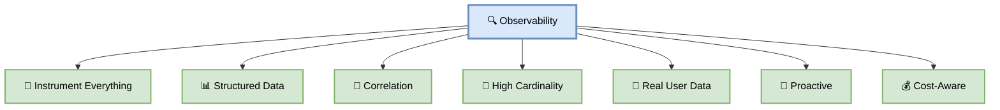
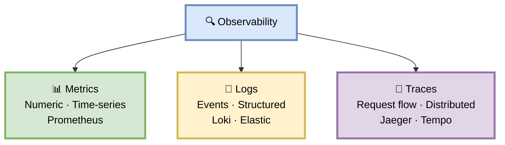
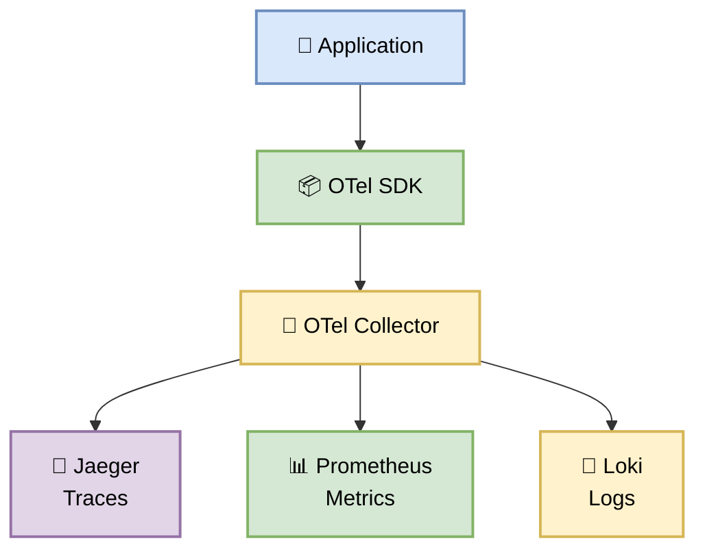
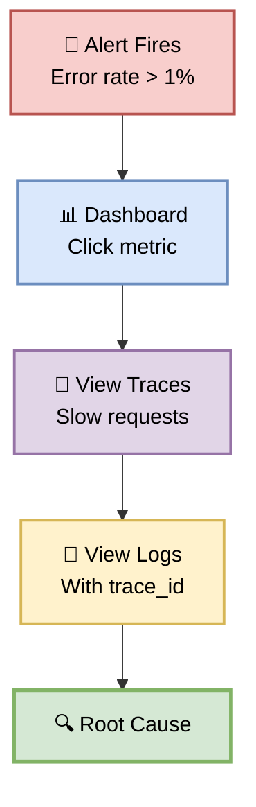
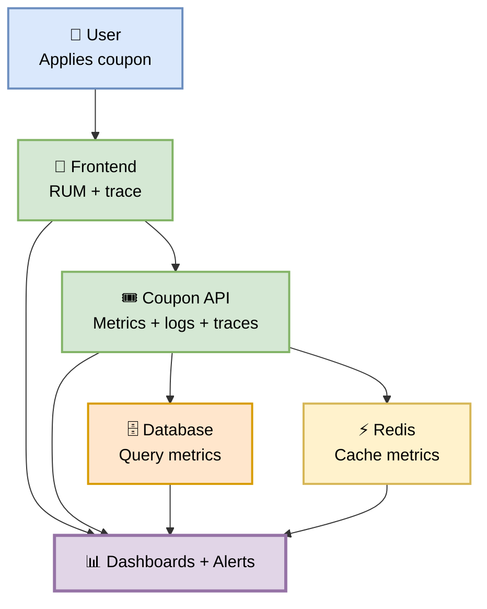

# Part 23 — Observability

**Author:** Shubham Tripathi  
**Repository:** `ecom-frontend` (Next.js 14 · App Router · TypeScript)  
**Last Updated:** 2026-09-19  
**Audience:** SRE, DevOps, Backend Engineers, Frontend Engineers, Tech Leads

---

## 📑 Table of Contents — Part 23

1. [Observability Philosophy](#-observability-philosophy)
2. [The Three Pillars](#-the-three-pillars)
3. [Metrics](#-metrics)
4. [Logging](#-logging)
5. [Distributed Tracing](#-distributed-tracing)
6. [OpenTelemetry](#-opentelemetry)
7. [Dashboards](#-dashboards)
8. [Alerting](#-alerting)
9. [SLOs & SLIs](#-slos--slis)
10. [Correlation (Trace + Log + Metric)](#-correlation-trace--log--metric)
11. [Frontend Observability](#-frontend-observability)
12. [Backend Observability](#-backend-observability)
13. [Infrastructure Observability](#-infrastructure-observability)
14. [Coupon Feature — Full Example](#-coupon-feature--full-example)
15. [Cost Optimization](#-cost-optimization)
16. [Observability Metrics & KPIs](#-observability-metrics--kpis)
17. [Troubleshooting](#-troubleshooting)
18. [Appendix — Observability Tools Inventory](#-appendix--observability-tools-inventory)

---

## 🔍 Observability Philosophy

> **Observability is not monitoring. Monitoring tells you *if* something is wrong. Observability tells you *why*.**  
> You can't fix what you can't see.

### 🎯 Monitoring vs Observability

| Aspect | Monitoring | Observability |
|--------|-----------|---------------|
| **Question** | "Is it broken?" | "Why is it broken?" |
| **Data** | Predefined metrics | Any dimension |
| **Approach** | Known unknowns | Unknown unknowns |
| **Debugging** | Check dashboards | Ask new questions |
| **Setup** | Alerts | Structured data |
| **Team** | Ops | Everyone |

### 🎯 Core Principles

| Principle | Description |
|-----------|-------------|
| **Instrument everything** | Code, infra, network, users |
| **Structured data** | JSON logs, labeled metrics |
| **Correlation** | Trace + log + metric linked |
| **High cardinality** | Any dimension, not just averages |
| **Real user data** | RUM + synthetics |
| **Proactive** | Alert before users complain |
| **Cost-aware** | Sampling, retention tiers |
| **Actionable** | Every alert has a runbook |

### 🖼️ Visual Diagram — Observability Philosophy



---

## 🏛️ The Three Pillars

> **Metrics · Logs · Traces** — together they give you full visibility.

### 🎯 The Three Pillars



### 📊 Pillar Comparison

| Aspect | Metrics | Logs | Traces |
|--------|---------|------|--------|
| **Format** | Numbers | Events | Spans |
| **Storage** | Time-series DB | Log aggregator | Trace DB |
| **Cardinality** | Low-medium | High | High |
| **Cost** | Low | High | Medium |
| **Use for** | Alerts, dashboards | Debugging | Root cause |
| **Retention** | Months | Days-weeks | Days |

### 🎯 When to Use Which

| Question | Use |
|----------|-----|
| "Is error rate up?" | Metrics |
| "Why did this request fail?" | Logs |
| "Where is the latency?" | Traces |
| "What's the root cause?" | All three (correlated) |

---

## 📊 Metrics

> **Metrics are cheap, fast, and perfect for alerts.**

### 🎯 Metric Types

| Type | Description | Example |
|------|-------------|---------|
| **Counter** | Only increases | `http_requests_total` |
| **Gauge** | Can go up/down | `memory_usage_bytes` |
| **Histogram** | Distribution | `http_request_duration_seconds` |
| **Summary** | Quantiles | `rpc_duration_p99` |

### 🎯 Metric Naming Conventions

```
<namespace>_<subsystem>_<name>_<unit>

Examples:
- ecom_http_requests_total
- ecom_coupon_applies_total
- ecom_db_connections_active
- ecom_redis_hits_total
```

### 🎯 The RED Method (Services)

| Metric | Question | Example |
|--------|----------|---------|
| **Rate** | Requests/sec? | `rate(http_requests_total[5m])` |
| **Errors** | Error rate? | `rate(http_requests_total{status=~"5.."}[5m])` |
| **Duration** | Latency? | `histogram_quantile(0.99, rate(http_request_duration_seconds_bucket[5m]))` |

### 🎯 The USE Method (Resources)

| Metric | Question | Example |
|--------|----------|---------|
| **Utilization** | % busy? | `node_cpu_seconds_total{mode="idle"}` |
| **Saturation** | Queue depth? | `node_load1` |
| **Errors** | Error count? | `node_network_receive_errs_total` |

### 🎯 The Four Golden Signals

| Signal | Meaning |
|--------|---------|
| **Latency** | Time to serve request |
| **Traffic** | Demand on system |
| **Errors** | Rate of failed requests |
| **Saturation** | How "full" is your service |

### 🛠️ Custom Metrics — Coupon Feature

```typescript
// src/lib/metrics.ts
import { Counter, Histogram, Gauge } from 'prom-client';

// Counter — total applies
export const couponAppliesTotal = new Counter({
  name: 'ecom_coupon_applies_total',
  help: 'Total coupon applies',
  labelNames: ['status', 'code_type'],
});

// Histogram — apply duration
export const couponApplyDuration = new Histogram({
  name: 'ecom_coupon_apply_duration_seconds',
  help: 'Coupon apply duration',
  labelNames: ['status'],
  buckets: [0.01, 0.05, 0.1, 0.5, 1, 2, 5],
});

// Gauge — active coupons
export const activeCoupons = new Gauge({
  name: 'ecom_coupons_active',
  help: 'Number of active coupons',
});
```

```typescript
// src/features/coupon/apply.ts
export async function applyCoupon(code: string, cartTotal: number) {
  const end = couponApplyDuration.startTimer();

  try {
    const result = await validateAndApply(code, cartTotal);

    couponAppliesTotal.inc({ status: 'success', code_type: result.type });
    return result;
  } catch (err) {
    couponAppliesTotal.inc({ status: 'error', code_type: 'unknown' });
    throw err;
  } finally {
    end({ status: 'success' });
  }
}
```

### 🎯 Key PromQL Queries

```promql
# Request rate
sum(rate(http_requests_total[5m])) by (service)

# Error rate
sum(rate(http_requests_total{status=~"5.."}[5m])) by (service)
/
sum(rate(http_requests_total[5m])) by (service)
* 100

# P99 latency
histogram_quantile(0.99,
  sum(rate(http_request_duration_seconds_bucket[5m])) by (le, service)
)

# Coupon apply success rate
sum(rate(ecom_coupon_applies_total{status="success"}[5m]))
/
sum(rate(ecom_coupon_applies_total[5m]))
* 100

# DB connection usage
pg_stat_database_numbackends{datname="ecom"}
/
pg_settings_max_connections
* 100
```

### 📊 Metric Cardinality

| Label | Cardinality | OK? |
|-------|-------------|-----|
| `service` | 20 | ✅ |
| `status` | 5 | ✅ |
| `method` | 8 | ✅ |
| `user_id` | 1M | ❌ (too high) |
| `trace_id` | ∞ | ❌ (never) |
| `path` (with IDs) | ∞ | ⚠️ (normalize) |

**Rule:** Never use high-cardinality labels (user_id, trace_id) in metrics.

---

## 📝 Logging

> **Logs tell the story of what happened. Make them structured, not just strings.**

### 🎯 Structured Logging

**❌ Bad — unstructured:**

```
Coupon applied for user 12345 code SAVE20 total 100 discount 20
```

**✅ Good — structured JSON:**

```json
{
  "timestamp": "2026-09-19T14:30:00.123Z",
  "level": "INFO",
  "service": "coupon-api",
  "version": "v2.4.0-coupon",
  "trace_id": "abc123def456",
  "span_id": "span789",
  "user_id": "u_98765",
  "event": "coupon_applied",
  "coupon_code": "SAVE20",
  "cart_total": 100.00,
  "discount": 20.00,
  "final_total": 80.00,
  "duration_ms": 45,
  "message": "Coupon applied successfully"
}
```

### 🎯 Log Levels

| Level | When | Example |
|-------|------|---------|
| **ERROR** | Something broke | Payment failed |
| **WARN** | Suspicious | Retry attempt |
| **INFO** | Normal events | Coupon applied |
| **DEBUG** | Development | Request payload |
| **TRACE** | Deep debugging | Function entry |

### 🎯 Logging Library — Pino

```typescript
// src/lib/logger.ts
import pino from 'pino';

export const logger = pino({
  level: process.env.LOG_LEVEL || 'info',
  formatters: {
    level: (label) => ({ level: label }),
  },
  base: {
    service: 'coupon-api',
    version: process.env.APP_VERSION,
    env: process.env.NODE_ENV,
  },
  redact: {
    paths: [
      'password',
      'token',
      'credit_card',
      'req.headers.authorization',
      'req.headers.cookie',
    ],
    censor: '[REDACTED]',
  },
  timestamp: pino.stdTimeFunctions.isoTime,
});
```

### 🎯 Logging in Coupon Feature

```typescript
// src/features/coupon/apply.ts
import { logger } from '@/lib/logger';

export async function applyCoupon(code: string, cartTotal: number) {
  const start = Date.now();
  const log = logger.child({
    coupon_code: code,
    cart_total: cartTotal,
  });

  log.info({ event: 'coupon_apply_started' });

  try {
    const result = await validateAndApply(code, cartTotal);

    log.info({
      event: 'coupon_applied',
      discount: result.discount,
      final_total: result.finalTotal,
      duration_ms: Date.now() - start,
    });

    return result;
  } catch (err) {
    log.error({
      event: 'coupon_apply_failed',
      error: err.message,
      duration_ms: Date.now() - start,
    });
    throw err;
  }
}
```

### 🎯 Log Correlation

Every log line should include:
- `trace_id` (from trace context)
- `span_id` (current span)
- `user_id` (if authenticated)
- `request_id` (unique per request)

```typescript
// Middleware to inject trace context
app.use((req, res, next) => {
  const traceId = req.headers['x-trace-id'] || generateTraceId();
  req.log = logger.child({
    trace_id: traceId,
    request_id: generateRequestId(),
    user_id: req.user?.id,
  });
  res.setHeader('x-trace-id', traceId);
  next();
});
```

### 📊 Log Retention

| Log Type | Hot (searchable) | Warm (S3) | Cold (Archive) |
|----------|------------------|-----------|----------------|
| **Application** | 7 days | 30 days | 1 year |
| **Access** | 7 days | 30 days | 1 year |
| **Audit** | 30 days | 1 year | 7 years |
| **Security** | 30 days | 1 year | 7 years |
| **Debug** | 1 day | — | — |

### 🎯 Log Sampling

For high-volume logs, sample:

```typescript
// Sample 1% of successful requests, 100% of errors
if (Math.random() < 0.01 || result.status === 'error') {
  logger.info({ event: 'coupon_applied', ... });
}
```

---

## 🔗 Distributed Tracing

> **Traces show the full journey of a request across all services.**

### 🎯 What is a Trace?

A **trace** is a tree of **spans**:

```
Trace: abc123
├── Span: HTTP POST /checkout (frontend) — 250ms
│   ├── Span: coupon.apply (frontend) — 45ms
│   │   └── Span: HTTP POST /api/coupon/apply (coupon-api) — 38ms
│   │       ├── Span: validate (coupon-api) — 5ms
│   │       ├── Span: db.query (postgres) — 12ms
│   │       └── Span: cache.set (redis) — 3ms
│   └── Span: cart.update (frontend) — 80ms
```

### 🎯 Span Attributes

```typescript
// Every span has:
{
  traceId: "abc123",
  spanId: "span789",
  parentSpanId: "span456",
  name: "coupon.apply",
  startTime: 1726750200000000,
  endTime: 1726750200045000,
  attributes: {
    "http.method": "POST",
    "http.url": "/api/coupon/apply",
    "http.status_code": 200,
    "coupon.code": "SAVE20",
    "cart.total": 100.00,
    "discount.pct": 20,
  },
  status: "OK",
}
```

### 🛠️ Tracing with OpenTelemetry

```typescript
// src/lib/tracing.ts
import { NodeSDK } from '@opentelemetry/sdk-node';
import { getNodeAutoInstrumentations } from '@opentelemetry/auto-instrumentations-node';
import { OTLPTraceExporter } from '@opentelemetry/exporter-trace-otlp-http';
import { Resource } from '@opentelemetry/resources';
import { SemanticResourceAttributes } from '@opentelemetry/semantic-conventions';

const sdk = new NodeSDK({
  resource: new Resource({
    [SemanticResourceAttributes.SERVICE_NAME]: 'coupon-api',
    [SemanticResourceAttributes.SERVICE_VERSION]: process.env.APP_VERSION,
    [SemanticResourceAttributes.DEPLOYMENT_ENVIRONMENT]: process.env.NODE_ENV,
  }),
  traceExporter: new OTLPTraceExporter({
    url: process.env.OTEL_EXPORTER_OTLP_ENDPOINT,
  }),
  instrumentations: [getNodeAutoInstrumentations()],
});

sdk.start();
```

### 🎯 Manual Spans

```typescript
// src/features/coupon/apply.ts
import { trace } from '@opentelemetry/api';

const tracer = trace.getTracer('coupon-api');

export async function applyCoupon(code: string, cartTotal: number) {
  return tracer.startActiveSpan('coupon.apply', async (span) => {
    span.setAttribute('coupon.code', code);
    span.setAttribute('cart.total', cartTotal);

    try {
      const result = await validateAndApply(code, cartTotal);

      span.setAttribute('discount.pct', result.discountPct);
      span.setAttribute('final.total', result.finalTotal);
      span.setStatus({ code: SpanStatusCode.OK });

      return result;
    } catch (err) {
      span.recordException(err);
      span.setStatus({ code: SpanStatusCode.ERROR });
      throw err;
    } finally {
      span.end();
    }
  });
}
```

### 🎯 Sampling Strategy

| Environment | Sample Rate | Errors |
|-------------|-------------|--------|
| **DEV** | 100% | 100% |
| **QA** | 50% | 100% |
| **STAGING** | 20% | 100% |
| **PROD** | 5% | 100% |

```typescript
// Sampling config
const sampler = new ParentBasedSampler({
  root: new TraceIdRatioBasedSampler(
    process.env.NODE_ENV === 'production' ? 0.05 : 1.0
  ),
});
```

### 🎯 Trace Storage

| Tool | Retention | Cost |
|------|-----------|------|
| **Jaeger** | 7 days | Low |
| **Tempo** | 30 days | Low |
| **Datadog APM** | 15 days | High |
| **New Relic** | 30 days | High |
| **Honeycomb** | 60 days | High |

---

## 🔭 OpenTelemetry

> **OTel is the industry standard for observability instrumentation.**

### 🎯 What is OpenTelemetry?

OpenTelemetry (OTel) is:
- **Vendor-neutral** — works with any backend
- **Standard** — industry-wide adoption
- **Unified** — traces, metrics, logs
- **Open source** — CNCF project

### 🎯 OTel Architecture



### 🎯 OTel Collector Configuration

```yaml
# otel-collector-config.yaml
receivers:
  otlp:
    protocols:
      grpc:
        endpoint: 0.0.0.0:4317
      http:
        endpoint: 0.0.0.0:4318

processors:
  batch:
    timeout: 10s
    send_batch_size: 1024

  memory_limiter:
    check_interval: 1s
    limit_mib: 512

  attributes:
    actions:
      - key: environment
        value: production
        action: upsert

  tail_sampling:
    policies:
      - name: errors
        type: status_code
        status_code:
          status_codes: [ERROR]
      - name: slow
        type: latency
        latency:
          threshold_ms: 1000
      - name: sample-5
        type: probabilistic
        probabilistic:
          sampling_percentage: 5

exporters:
  jaeger:
    endpoint: jaeger:14250
    tls:
      insecure: true

  prometheus:
    endpoint: 0.0.0.0:8889

  loki:
    endpoint: http://loki:3100/loki/api/v1/push

service:
  pipelines:
    traces:
      receivers: [otlp]
      processors: [memory_limiter, tail_sampling, batch]
      exporters: [jaeger]
    metrics:
      receivers: [otlp]
      processors: [memory_limiter, batch]
      exporters: [prometheus]
    logs:
      receivers: [otlp]
      processors: [memory_limiter, batch]
      exporters: [loki]
```

---

## 📊 Dashboards

> **A dashboard should answer a question in 5 seconds.**

### 🎯 The 4 Dashboard Types

| Type | Audience | Purpose |
|------|----------|---------|
| **Service** | SRE, Dev | Health of one service |
| **Overview** | Leadership | Business + technical |
| **Debug** | On-call | Deep dive during incidents |
| **Business** | Product | KPIs, funnels |

### 🎯 Service Dashboard — Coupon API

**Panels:**

1. **Request rate** (by status)
2. **Error rate** (5xx)
3. **Latency** (P50/P95/P99)
4. **Coupon applies/min**
5. **CPU/Memory**
6. **DB connections**
7. **Cache hit rate**
8. **Top endpoints**
9. **Slow queries**
10. **Recent errors**

### 🎯 Grafana Dashboard as Code

```json
{
  "dashboard": {
    "title": "Coupon API — Service",
    "panels": [
      {
        "title": "Request Rate",
        "targets": [{
          "expr": "sum(rate(http_requests_total{service=\"coupon-api\"}[5m])) by (status)"
        }],
        "type": "graph"
      },
      {
        "title": "Error Rate",
        "targets": [{
          "expr": "sum(rate(http_requests_total{service=\"coupon-api\",status=~\"5..\"}[5m])) / sum(rate(http_requests_total{service=\"coupon-api\"}[5m])) * 100"
        }],
        "type": "graph",
        "alert": { "threshold": 1 }
      }
    ]
  }
}
```

---

## 🔔 Alerting

> **Every alert must be actionable. Every alert must have a runbook.**

### 🎯 Alert Types

| Type | Urgency | Example |
|------|---------|---------|
| **Symptom-based** | High | Error rate > 1% |
| **Cause-based** | Low | CPU > 80% |
| **Predictive** | Medium | Disk full in 6h |
| **Business** | High | Orders < 50% baseline |

### 🎯 Alert Severity

| Sev | Response | Channel |
|-----|----------|---------|
| **P1** | 5 min | PagerDuty + Slack |
| **P2** | 30 min | Slack |
| **P3** | 4 hours | Slack |
| **P4** | Next day | Dashboard |

### 🎯 Good Alerts

**❌ Bad:**

```yaml
- alert: HighCPU
  expr: cpu_usage > 80
  for: 1m
```

**Why bad?** No context, no severity, no runbook.

**✅ Good:**

```yaml
- alert: CouponAPIErrorRateHigh
  expr: |
    sum(rate(http_requests_total{service="coupon-api",status=~"5.."}[5m]))
    /
    sum(rate(http_requests_total{service="coupon-api"}[5m]))
    * 100 > 1
  for: 2m
  labels:
    severity: P1
    service: coupon-api
    team: frontend
  annotations:
    summary: "Coupon API error rate > 1%"
    description: "Error rate is {{ $value }}%. SLO breach imminent."
    runbook: "https://runbooks.ecom.com/coupon-error-rate"
    dashboard: "https://grafana.ecom.com/d/coupon-api"
```

### 🎯 Alert Rules — Coupon Feature

```yaml
groups:
  - name: coupon-api
    interval: 30s
    rules:
      - alert: CouponAPIErrorRateHigh
        expr: |
          sum(rate(http_requests_total{service="coupon-api",status=~"5.."}[5m]))
          /
          sum(rate(http_requests_total{service="coupon-api"}[5m])) > 0.01
        for: 2m
        labels: { severity: P1 }
        annotations:
          runbook: "https://runbooks.ecom.com/coupon-error-rate"

      - alert: CouponAPILatencyHigh
        expr: |
          histogram_quantile(0.99,
            sum(rate(http_request_duration_seconds_bucket{service="coupon-api"}[5m])) by (le)
          ) > 2
        for: 5m
        labels: { severity: P2 }

      - alert: CouponApplySuccessRateLow
        expr: |
          sum(rate(ecom_coupon_applies_total{status="success"}[5m]))
          /
          sum(rate(ecom_coupon_applies_total[5m])) < 0.99
        for: 5m
        labels: { severity: P1 }

      - alert: DBConnectionsHigh
        expr: |
          pg_stat_database_numbackends{datname="ecom"}
          /
          pg_settings_max_connections > 0.8
        for: 5m
        labels: { severity: P2 }

      - alert: RedisHitRateLow
        expr: |
          sum(rate(redis_keyspace_hits_total[5m]))
          /
          (sum(rate(redis_keyspace_hits_total[5m])) + sum(rate(redis_keyspace_misses_total[5m])))
          < 0.9
        for: 10m
        labels: { severity: P3 }
```

### 🎯 Alert Fatigue Prevention

| Problem | Fix |
|---------|-----|
| **Too many alerts** | Deduplicate, aggregate |
| **False positives** | Tune thresholds, add `for` |
| **No action** | Remove or add runbook |
| **Ignored** | Reduce volume, rotate |
| **Duplicate** | Group by service |

---

## 🎯 SLOs & SLIs

> **SLOs define "good enough." Error budgets tell you when to stop shipping.**

### 🎯 SLI vs SLO vs SLA

| Term | Meaning | Example |
|------|---------|---------|
| **SLI** | Measurement | % successful requests |
| **SLO** | Target | 99.9% success |
| **SLA** | Contract | 99.5% (money back) |

### 🎯 Our SLOs — Coupon Feature

| Service | SLI | SLO Target | Error Budget (30d) |
|---------|-----|------------|---------------------|
| **Coupon API** | Availability | 99.9% | 43 min |
| **Coupon API** | Latency P99 | < 500ms | 1% requests |
| **Coupon Apply** | Success rate | 99.5% | 0.5% failures |
| **Checkout** | E2E success | 99.0% | 1% failures |
| **Frontend** | LCP P75 | < 2.5s | 5% loads |

### 🎯 SLO Implementation

```promql
# Availability SLI
sum(rate(http_requests_total{service="coupon-api",status!~"5.."}[30d]))
/
sum(rate(http_requests_total{service="coupon-api"}[30d]))

# Error budget consumed
1 - (
  sum(rate(http_requests_total{service="coupon-api",status!~"5.."}[30d]))
  /
  sum(rate(http_requests_total{service="coupon-api"}[30d]))
) / (1 - 0.999)
```

### 🎯 Error Budget Policy

| Budget Left | Action |
|-------------|--------|
| **> 50%** | 🟢 Ship freely |
| **25–50%** | 🟡 Review changes carefully |
| **10–25%** | 🟠 Feature freeze |
| **< 10%** | 🔴 Full reliability focus |

---

## 🔗 Correlation (Trace + Log + Metric)

> **The magic happens when all three pillars are linked.**

### 🎯 How Correlation Works



### 🎯 Correlation IDs

```typescript
// Every request has a trace_id
// Every log includes trace_id
// Every metric is labeled with service (not trace_id)
// Tracing links span to trace

// Log with trace context
logger.info({
  trace_id: ctx.traceId,
  span_id: ctx.spanId,
  event: 'coupon_applied',
  coupon_code: 'SAVE20',
});
```

### 🎯 Example — Debugging an Incident

```
1. Alert: Coupon API error rate 1.5%
2. → Grafana dashboard shows spike at 14:30
3. → Click "traces" in Grafana → Jaeger
4. → Filter by service=coupon-api, duration>1s
5. → See trace abc123 has DB query span taking 3s
6. → Click trace_id → Jump to Loki logs
7. → Log: "DB connection pool exhausted"
8. → Root cause: connection leak in bulk apply
```

---

## 🖥️ Frontend Observability

> **Real user monitoring (RUM) captures what users actually experience.**

### 🎯 Frontend Metrics

| Metric | What | Tool |
|--------|------|------|
| **LCP** | Largest Contentful Paint | Datadog RUM |
| **INP** | Interaction to Next Paint | Datadog RUM |
| **CLS** | Cumulative Layout Shift | Datadog RUM |
| **TTFB** | Time to First Byte | Datadog RUM |
| **JS errors** | Frontend errors | Sentry |
| **API calls** | XHR timing | Datadog RUM |
| **Session** | User journey | Datadog RUM |

### 🛠️ RUM Setup (Datadog)

```typescript
// src/lib/datadog-rum.ts
import { datadogRum } from '@datadog/browser-rum';

datadogRum.init({
  applicationId: process.env.NEXT_PUBLIC_DD_APP_ID,
  clientToken: process.env.NEXT_PUBLIC_DD_CLIENT_TOKEN,
  site: 'datadoghq.com',
  service: 'ecom-frontend',
  env: process.env.NEXT_PUBLIC_ENV,
  version: process.env.NEXT_PUBLIC_VERSION,
  sessionSampleRate: 100,
  sessionReplaySampleRate: 20,
  trackUserInteractions: true,
  trackResources: true,
  trackLongTasks: true,
  defaultPrivacyLevel: 'mask-user-input',
});
```

### 🎯 Custom Frontend Events

```typescript
import { datadogRum } from '@datadog/browser-rum';

// Track coupon apply
datadogRum.addAction('coupon_apply', {
  coupon_code: 'SAVE20',
  cart_total: 100,
  discount: 20,
});
```

### 🎯 Frontend Alerts

```yaml
- alert: FrontendLCPHigh
  expr: |
    histogram_quantile(0.75,
      rate(frontend_lcp_seconds_bucket[10m])
    ) > 2.5
  for: 10m
  labels: { severity: P2 }
```

---

## ⚙️ Backend Observability

> **Every service, every endpoint, every dependency — instrumented.**

### 🎯 Backend Instrumentation

| Layer | What to Instrument |
|-------|---------------------|
| **HTTP** | Requests, latency, errors |
| **DB** | Queries, duration, errors |
| **Cache** | Hits, misses, latency |
| **Queue** | Depth, processing time |
| **External APIs** | Latency, errors |
| **Business logic** | Custom metrics |

### 🎯 Middleware Example

```typescript
// middleware/metrics.ts
export function metricsMiddleware(req, res, next) {
  const start = Date.now();

  res.on('finish', () => {
    const duration = (Date.now() - start) / 1000;

    httpRequestsTotal.inc({
      method: req.method,
      path: normalizePath(req.path),
      status: res.statusCode,
    });

    httpRequestDuration.observe(
      { method: req.method, path: normalizePath(req.path) },
      duration
    );
  });

  next();
}

// Normalize paths (avoid high cardinality)
function normalizePath(path: string): string {
  return path
    .replace(/\/[0-9]+/g, '/:id')
    .replace(/\/[a-f0-9-]{36}/g, '/:uuid');
}
```

---

## 🏗️ Infrastructure Observability

> **Servers, containers, databases, network — all visible.**

### 🎯 Infrastructure Metrics

| Layer | Metrics |
|-------|---------|
| **Kubernetes** | Pod CPU, memory, restarts |
| **Database** | Connections, queries, lag |
| **Cache** | Hit rate, memory, evictions |
| **Network** | Traffic, errors, latency |
| **Storage** | IOPS, throughput, latency |
| **Cost** | Per-service spend |

### 🎯 K8s Metrics

```promql
# Pod restarts
sum(rate(kube_pod_container_status_restarts_total[1h])) by (pod)

# Pod CPU
sum(rate(container_cpu_usage_seconds_total{namespace="production"}[5m])) by (pod)

# Pod memory
sum(container_memory_working_set_bytes{namespace="production"}) by (pod)

# Node CPU
1 - avg(rate(node_cpu_seconds_total{mode="idle"}[5m])) by (instance)
```

---

## 🎟️ Coupon Feature — Full Example

> **End-to-end observability for the coupon feature.**

### 🎯 Instrumented Flow



### 🎯 Coupon Feature — Full Observability

**Metrics:**
- `ecom_coupon_applies_total{status, code_type}`
- `ecom_coupon_apply_duration_seconds{status}`
- `ecom_coupons_active`
- `ecom_coupon_bulk_applies_total`

**Logs:**
- `coupon_apply_started`
- `coupon_applied`
- `coupon_apply_failed`
- `coupon_validation_failed`

**Traces:**
- `coupon.apply`
- `coupon.validate`
- `coupon.discount`
- `db.query`
- `cache.get`

**Alerts:**
- Error rate > 1%
- P99 > 2s
- Success rate < 99%
- Cache hit < 90%

**SLOs:**
- Availability 99.9%
- Latency P99 < 500ms
- Success rate > 99.5%

---

## 💰 Cost Optimization

> **Observability can cost as much as your infrastructure. Optimize it.**

### 🎯 Cost Drivers

| Factor | Cost Impact | Optimization |
|--------|-------------|--------------|
| **Metric cardinality** | High | Reduce labels |
| **Log volume** | High | Sample, filter |
| **Trace volume** | Medium | Sample aggressively |
| **Retention** | High | Tier storage |
| **Custom metrics** | Medium | Reduce |
| **Dashboards** | Low | Delete unused |

### 🎯 Optimization Strategies

| Strategy | Savings |
|----------|---------|
| **Log sampling (5%)** | -60% |
| **Trace sampling (1%)** | -80% |
| **Metric aggregation** | -30% |
| **Retention tiers** | -50% |
| **Cardinality reduction** | -40% |
| **Delete unused dashboards** | -10% |
| **Total** | **~$2K/mo** |

### 🎯 Cardinality Reduction

```promql
# ❌ Bad — high cardinality
http_requests_total{path="/api/coupon/12345"}

# ✅ Good — normalized
http_requests_total{path="/api/coupon/:id"}
```

---

## 📊 Observability Metrics & KPIs

> **Measure observability itself.**

### 🎯 Observability KPIs

| # | KPI | Target | Current | Status |
|---|-----|--------|---------|--------|
| 1 | **MTTD** | < 5 min | 2 min | 🟢 |
| 2 | **MTTR** | < 30 min | 22 min | 🟢 |
| 3 | **Alert noise** | < 10% false | 5% | 🟢 |
| 4 | **Trace sampling** | 5% prod | 5% | 🟢 |
| 5 | **Log sampling** | 5% prod | 5% | 🟢 |
| 6 | **Dashboard count** | < 50 | 42 | 🟢 |
| 7 | **Alert count** | < 100 | 87 | 🟢 |
| 8 | **Runbook coverage** | 100% | 100% | 🟢 |
| 9 | **Observability cost** | < 5% infra | 4.2% | 🟢 |
| 10 | **SLO adherence** | > 99.9% | 99.95% | 🟢 |

---

## 🛠️ Troubleshooting

| Problem | Cause | Fix |
|---------|-------|-----|
| **Metrics missing** | Scrape failed | Check target |
| **High cardinality** | Bad labels | Normalize |
| **Logs missing** | Sampling too low | Increase |
| **Traces missing** | Sampling | Adjust |
| **Alert fatigue** | Too many | Tune |
| **Dashboard slow** | Too many panels | Reduce |
| **OTel not working** | SDK init | Check config |
| **Cost too high** | Volume | Sample more |
| **Correlation broken** | No trace_id | Inject |

---

## 📎 Appendix — Observability Tools Inventory

### 🛠️ Tool Stack

| Category | Tool | Purpose | Cost |
|----------|------|---------|------|
| **Metrics** | Prometheus | Time-series DB | Free |
| **Metrics** | Thanos | Long-term metrics | Free |
| **Metrics** | VictoriaMetrics | Alternative TSDB | Free |
| **Logs** | Loki | Log aggregation | Free |
| **Logs** | Elasticsearch | Full-text search | Free/$$ |
| **Logs** | Splunk | Enterprise logs | $$$ |
| **Traces** | Jaeger | Distributed tracing | Free |
| **Traces** | Tempo | Tracing | Free |
| **Traces** | Zipkin | Tracing | Free |
| **Dashboards** | Grafana | Visualization | Free |
| **APM** | Datadog | Full APM | $$$ |
| **APM** | New Relic | Full APM | $$$ |
| **APM** | Dynatrace | Full APM | $$$ |
| **Errors** | Sentry | Error tracking | Free/$$ |
| **RUM** | Datadog RUM | Real user monitoring | $$$ |
| **RUM** | Sentry | Performance | Free/$$ |
| **Alerts** | Alertmanager | Alert routing | Free |
| **Alerts** | PagerDuty | On-call | $$$ |
| **Standards** | OpenTelemetry | Instrumentation | Free |

### 📞 Observability Contacts

| Role | Person | Slack |
|------|--------|-------|
| **SRE Lead** | TBD | @sre-lead |
| **Observability Lead** | TBD | @obs-lead |
| **On-call** | Rotation | @oncall |
| **DevOps** | Team | @devops |

### 🔗 Useful Links

| Resource | URL |
|----------|-----|
| **Grafana** | grafana.ecom.com |
| **Prometheus** | prometheus.ecom.com |
| **Jaeger** | jaeger.ecom.com |
| **Loki** | loki.ecom.com |
| **Sentry** | sentry.ecom.com |
| **Runbooks** | runbooks.ecom.com |

---

## 🎯 Summary — Part 23

| Section | Kya Cover Hua |
|---------|---------------|
| **Philosophy** | Monitoring vs observability |
| **Three Pillars** | Metrics, logs, traces |
| **Metrics** | Types, RED/USE, PromQL, cardinality |
| **Logging** | Structured, Pino, correlation |
| **Tracing** | Spans, OTel, sampling |
| **OpenTelemetry** | Standard, collector |
| **Dashboards** | 4 types, service dashboard |
| **Alerting** | Severity, good vs bad, rules |
| **SLOs & SLIs** | Targets, error budgets |
| **Correlation** | Trace + log + metric |
| **Frontend** | RUM, Core Web Vitals |
| **Backend** | Middleware, instrumentation |
| **Infrastructure** | K8s, DB, cache |
| **Coupon Example** | Full end-to-end |
| **Cost** | Optimization strategies |
| **Metrics** | 10 KPIs |
| **Troubleshooting** | 9 issues |
| **Appendix** | 19 tools, contacts, links |

---

## 🏆 Complete Documentation — All 23 Parts

| Part | Title | Status |
|------|-------|--------|
| **Part 1–20** | CI/CD Pipeline | ✅ |
| **Part 21** | Testing Strategy | ✅ |
| **Part 22** | Database Migrations | ✅ |
| **Part 23** | Observability | ✅ |

> 📝 **Note:** Observability is not a tool — it's a **practice**. Every log, every metric, every trace should answer a question. **Instrument everything. Correlate everything. Alert on what matters.**