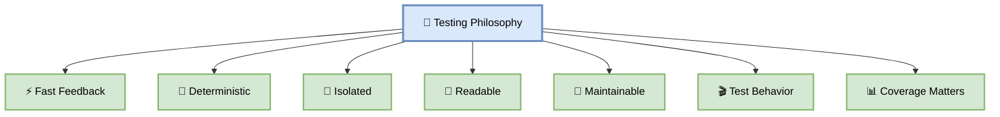
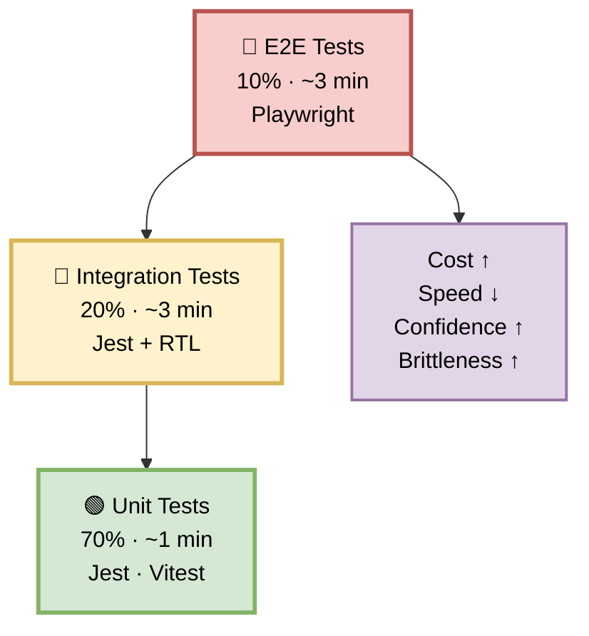
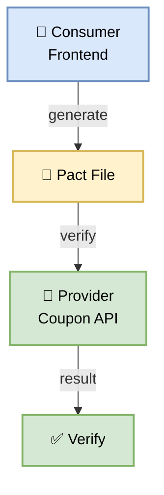
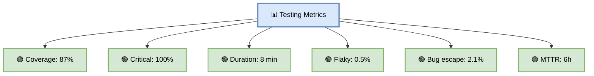

# Part 21 — Testing Strategy

**Author:** Shubham Tripathi  
**Repository:** `ecom-frontend` (Next.js 14 · App Router · TypeScript)  
**Last Updated:** 2026-09-19  
**Audience:** Frontend Engineers, QA Engineers, Tech Leads, DevOps, SRE

---

## 📑 Table of Contents — Part 21

1. [Testing Philosophy](#-testing-philosophy)
2. [The Testing Pyramid](#-the-testing-pyramid)
3. [Test Types Overview](#-test-types-overview)
4. [Unit Testing](#-unit-testing)
5. [Integration Testing](#-integration-testing)
6. [End-to-End (E2E) Testing](#-end-to-end-e2e-testing)
7. [Contract Testing](#-contract-testing)
8. [Visual Regression Testing](#-visual-regression-testing)
9. [Accessibility Testing](#-accessibility-testing)
10. [Performance Testing (Test Perspective)](#-performance-testing-test-perspective)
11. [Security Testing (Test Perspective)](#-security-testing-test-perspective)
12. [Test Data Management](#-test-data-management)
13. [Mocking Strategy](#-mocking-strategy)
14. [Coverage Strategy](#-coverage-strategy)
15. [Flaky Test Handling](#-flaky-test-handling)
16. [CI/CD Integration](#-cicd-integration)
17. [Testing Metrics & KPIs](#-testing-metrics--kpis)
18. [Troubleshooting](#-troubleshooting)
19. [Appendix — Testing Tools Inventory](#-appendix--testing-tools-inventory)

---

## 🧪 Testing Philosophy

> **Tests are not a chore — they're your safety net.**  
> Every test written is a bug that never reaches production. Every test skipped is a future incident.

### 🎯 Core Principles

| Principle | Description |
|-----------|-------------|
| **Test early, test often** | Catch bugs at the cheapest stage |
| **Fast feedback** | Tests should run in seconds, not hours |
| **Deterministic** | No flaky tests — ever |
| **Isolated** | Tests don't depend on each other |
| **Readable** | Tests are documentation |
| **Maintainable** | Tests don't break with every refactor |
| **Test behavior** | Not implementation |
| **Coverage matters** | But 100% is not the goal — the right tests matter |

### 🎯 Why Testing?

| Reason | Impact |
|--------|--------|
| **Catch bugs early** | 10x cheaper than production bugs |
| **Enable refactoring** | Change code confidently |
| **Document behavior** | Tests explain what code does |
| **Enable CI/CD** | Automated pipeline gates |
| **Reduce MTTR** | Faster incident resolution |
| **Increase confidence** | Ship fearlessly |
| **Compliance** | Required for SOC 2, PCI-DSS |

### 🖼️ Visual Diagram — Testing Philosophy



---

## 🔺 The Testing Pyramid

> **70% Unit · 20% Integration · 10% E2E.**  
> Fast tests at the bottom, slow tests at the top.

### 🎯 The Pyramid



### 📊 Test Distribution

| Layer | % | Count | Duration | Purpose |
|-------|---|-------|----------|---------|
| **Unit** | 70% | ~500 | ~1 min | Logic, functions, hooks |
| **Integration** | 20% | ~150 | ~3 min | Components, API, DB |
| **E2E** | 10% | ~50 | ~3 min | Full user flows |
| **Total** | 100% | ~700 | **~7 min** | |

### 🎯 Why This Distribution?

| Layer | Cost | Speed | Confidence |
|-------|------|-------|------------|
| **Unit** | Low | Fast | Low (isolated) |
| **Integration** | Medium | Medium | Medium |
| **E2E** | High | Slow | High (real) |

**Rule:** Test at the **lowest level possible** that gives you confidence.

---

## 📋 Test Types Overview

> **Every test has a purpose. Every purpose needs a test.**

### 🎯 Complete Test Matrix

| # | Type | Tool | Layer | Purpose |
|---|------|------|-------|---------|
| 1 | **Unit** | Jest/Vitest | Unit | Pure functions, logic |
| 2 | **Component** | RTL/VTU | Integration | Isolated UI |
| 3 | **Integration** | Jest+RTL | Integration | Multi-component |
| 4 | **Contract** | Pact | Integration | API contracts |
| 5 | **E2E** | Playwright | E2E | User flows |
| 6 | **Visual Regression** | Percy | E2E | UI appearance |
| 7 | **Accessibility** | axe-core | Integration | WCAG compliance |
| 8 | **Performance** | Lighthouse CI | E2E | Core Web Vitals |
| 9 | **Security** | OWASP ZAP | E2E | Vulnerabilities |
| 10 | **Smoke** | curl/Playwright | E2E | Health checks |
| 11 | **Mutation** | Stryker | Unit | Test quality |
| 12 | **Snapshot** | Jest | Unit | Output stability |

### 🎯 When to Use Which

| Scenario | Test Type |
|----------|-----------|
| Business logic | Unit |
| React component | Component |
| API call | Integration |
| Full checkout flow | E2E |
| Design system | Visual |
| Screen reader | A11y |
| Load test | Performance |
| SQL injection | Security |

---

## 🔬 Unit Testing

> **Test the smallest units — functions, hooks, utilities.**

### 🎯 What to Test

- Pure functions
- Utility functions
- Custom hooks
- Reducers
- Validators
- Formatters
- Calculations

### 🎯 Framework: Jest + Vitest

**Why Jest?**
- Industry standard
- Rich ecosystem
- Great DX
- Built-in mocking
- Snapshot testing

**Why Vitest?**
- 10x faster than Jest
- Native ESM
- Vite-powered
- Jest-compatible API

### 🛠️ Unit Test Example — Coupon Validator

```typescript
// src/features/coupon/couponValidator.ts
export interface CouponResult {
  valid: boolean;
  discountPct: number;
  reason?: string;
}

export function validateCoupon(code: string): CouponResult {
  // Trim whitespace
  const trimmed = code.trim().toUpperCase();

  // Empty check
  if (!trimmed) {
    return { valid: false, discountPct: 0, reason: 'Coupon required' };
  }

  // Length check
  if (trimmed.length > 20) {
    return { valid: false, discountPct: 0, reason: 'Invalid coupon' };
  }

  // Known coupons
  const coupons: Record<string, number> = {
    SAVE20: 20,
    WELCOME10: 10,
    SAVE5: 5,
  };

  // Expired coupons
  const expired = ['EXPIRED2024', 'OLD2023'];

  if (expired.includes(trimmed)) {
    return { valid: false, discountPct: 0, reason: 'Coupon expired' };
  }

  if (coupons[trimmed]) {
    return { valid: true, discountPct: coupons[trimmed] };
  }

  return { valid: false, discountPct: 0, reason: 'Coupon not found' };
}
```

```typescript
// src/features/coupon/couponValidator.test.ts
import { validateCoupon } from './couponValidator';

describe('validateCoupon', () => {
  describe('valid coupons', () => {
    it('should accept SAVE20', () => {
      expect(validateCoupon('SAVE20')).toEqual({
        valid: true,
        discountPct: 20,
      });
    });

    it('should accept WELCOME10', () => {
      expect(validateCoupon('WELCOME10')).toEqual({
        valid: true,
        discountPct: 10,
      });
    });

    it('should be case insensitive', () => {
      expect(validateCoupon('save20')).toEqual({
        valid: true,
        discountPct: 20,
      });
    });

    it('should trim whitespace', () => {
      expect(validateCoupon('  SAVE20  ')).toEqual({
        valid: true,
        discountPct: 20,
      });
    });
  });

  describe('invalid coupons', () => {
    it('should reject empty input', () => {
      expect(validateCoupon('')).toEqual({
        valid: false,
        discountPct: 0,
        reason: 'Coupon required',
      });
    });

    it('should reject whitespace only', () => {
      expect(validateCoupon('   ')).toEqual({
        valid: false,
        discountPct: 0,
        reason: 'Coupon required',
      });
    });

    it('should reject unknown code', () => {
      expect(validateCoupon('INVALID123')).toEqual({
        valid: false,
        discountPct: 0,
        reason: 'Coupon not found',
      });
    });

    it('should reject expired coupon', () => {
      expect(validateCoupon('EXPIRED2024')).toEqual({
        valid: false,
        discountPct: 0,
        reason: 'Coupon expired',
      });
    });

    it('should reject very long code', () => {
      expect(validateCoupon('A'.repeat(21))).toEqual({
        valid: false,
        discountPct: 0,
        reason: 'Invalid coupon',
      });
    });
  });
});
```

### 🎯 Test Structure — AAA Pattern

```typescript
it('should calculate discount correctly', () => {
  // Arrange
  const cartTotal = 100;
  const couponCode = 'SAVE20';

  // Act
  const result = calculateDiscount(cartTotal, couponCode);

  // Assert
  expect(result).toBe(80);
});
```

### 🎯 Custom Hook Testing

```typescript
// src/hooks/useCoupon.ts
export function useCoupon(initialCode = '') {
  const [code, setCode] = useState(initialCode);
  const [validation, setValidation] = useState<CouponResult | null>(null);

  const validate = useCallback(async () => {
    const result = validateCoupon(code);
    setValidation(result);
    return result;
  }, [code]);

  return { code, setCode, validation, validate };
}
```

```typescript
// src/hooks/useCoupon.test.ts
import { renderHook, act } from '@testing-library/react';
import { useCoupon } from './useCoupon';

describe('useCoupon', () => {
  it('should initialize with empty code', () => {
    const { result } = renderHook(() => useCoupon());
    expect(result.current.code).toBe('');
    expect(result.current.validation).toBeNull();
  });

  it('should update code', () => {
    const { result } = renderHook(() => useCoupon());

    act(() => {
      result.current.setCode('SAVE20');
    });

    expect(result.current.code).toBe('SAVE20');
  });

  it('should validate valid coupon', async () => {
    const { result } = renderHook(() => useCoupon('SAVE20'));

    await act(async () => {
      await result.current.validate();
    });

    expect(result.current.validation).toEqual({
      valid: true,
      discountPct: 20,
    });
  });

  it('should validate invalid coupon', async () => {
    const { result } = renderHook(() => useCoupon('INVALID'));

    await act(async () => {
      await result.current.validate();
    });

    expect(result.current.validation).toEqual({
      valid: false,
      discountPct: 0,
      reason: 'Coupon not found',
    });
  });
});
```

### 📊 Unit Test Coverage Targets

| Category | Target |
|----------|--------|
| **Utilities** | 100% |
| **Hooks** | 90% |
| **Reducers** | 100% |
| **Validators** | 100% |
| **Overall** | 85% |

### 🛠️ Running Unit Tests

```bash
# Run all
npm test

# Watch mode
npm test -- --watch

# Coverage
npm test -- --coverage

# Specific file
npm test couponValidator

# Specific test
npm test -t "should accept SAVE20"
```

---

## 🔗 Integration Testing

> **Test components together — with real APIs, real state, real interactions.**

### 🎯 What to Test

- Component + context
- Component + Redux
- Form + validation
- API integration
- Database integration
- Multi-step flows (within one page)

### 🎯 Framework: Jest + React Testing Library

**Why RTL?**
- Tests user behavior, not implementation
- Encourages accessibility
- Works with any React framework
- Great community

### 🛠️ Integration Test Example — Coupon Form

```typescript
// src/features/coupon/CouponForm.tsx
export function CouponForm({ onApply }: Props) {
  const [code, setCode] = useState('');
  const [error, setError] = useState('');
  const [loading, setLoading] = useState(false);

  const handleApply = async () => {
    setLoading(true);
    setError('');

    const result = validateCoupon(code);

    if (!result.valid) {
      setError(result.reason || 'Invalid coupon');
      setLoading(false);
      return;
    }

    onApply(code, result.discountPct);
    setLoading(false);
  };

  return (
    <form>
      <input
        placeholder="Enter coupon code"
        value={code}
        onChange={(e) => setCode(e.target.value)}
        data-testid="coupon-input"
      />
      <button onClick={handleApply} disabled={loading} data-testid="apply-btn">
        {loading ? 'Applying...' : 'Apply'}
      </button>
      {error && <div role="alert">{error}</div>}
    </form>
  );
}
```

```typescript
// src/features/coupon/CouponForm.test.tsx
import { render, screen, waitFor } from '@testing-library/react';
import userEvent from '@testing-library/user-event';
import { CouponForm } from './CouponForm';

describe('CouponForm', () => {
  it('should render input and button', () => {
    render(<CouponForm onApply={jest.fn()} />);

    expect(screen.getByTestId('coupon-input')).toBeInTheDocument();
    expect(screen.getByTestId('apply-btn')).toBeInTheDocument();
  });

  it('should call onApply with valid coupon', async () => {
    const onApply = jest.fn();
    render(<CouponForm onApply={onApply} />);

    await userEvent.type(screen.getByTestId('coupon-input'), 'SAVE20');
    await userEvent.click(screen.getByTestId('apply-btn'));

    await waitFor(() => {
      expect(onApply).toHaveBeenCalledWith('SAVE20', 20);
    });
  });

  it('should show error for invalid coupon', async () => {
    render(<CouponForm onApply={jest.fn()} />);

    await userEvent.type(screen.getByTestId('coupon-input'), 'INVALID');
    await userEvent.click(screen.getByTestId('apply-btn'));

    await waitFor(() => {
      expect(screen.getByRole('alert')).toHaveTextContent('Coupon not found');
    });
  });

  it('should show error for empty input', async () => {
    render(<CouponForm onApply={jest.fn()} />);

    await userEvent.click(screen.getByTestId('apply-btn'));

    await waitFor(() => {
      expect(screen.getByRole('alert')).toHaveTextContent('Coupon required');
    });
  });

  it('should disable button while loading', async () => {
    render(<CouponForm onApply={jest.fn()} />);

    await userEvent.type(screen.getByTestId('coupon-input'), 'SAVE20');
    await userEvent.click(screen.getByTestId('apply-btn'));

    // During the async operation
    // In real test, mock the async to check
  });
});
```

### 🎯 API Integration Testing

```typescript
// src/features/coupon/couponAPI.test.ts
import { rest } from 'msw';
import { setupServer } from 'msw/node';
import { applyCoupon } from './couponAPI';

const server = setupServer(
  rest.post('/api/coupon/apply', (req, res, ctx) => {
    const { code, cartTotal } = req.body as any;

    if (code === 'SAVE20') {
      return res(
        ctx.json({
          discount: 20,
          finalTotal: cartTotal * 0.8,
        })
      );
    }

    return res(ctx.status(400), ctx.json({ error: 'Invalid coupon' }));
  })
);

beforeAll(() => server.listen());
afterEach(() => server.resetHandlers());
afterAll(() => server.close());

describe('applyCoupon', () => {
  it('should apply valid coupon', async () => {
    const result = await applyCoupon('SAVE20', 100);
    expect(result.discount).toBe(20);
    expect(result.finalTotal).toBe(80);
  });

  it('should throw on invalid coupon', async () => {
    await expect(applyCoupon('INVALID', 100)).rejects.toThrow('Invalid coupon');
  });

  it('should handle server error', async () => {
    server.use(
      rest.post('/api/coupon/apply', (req, res, ctx) => {
        return res(ctx.status(500));
      })
    );

    await expect(applyCoupon('SAVE20', 100)).rejects.toThrow();
  });
});
```

### 📊 Integration Test Coverage Targets

| Category | Target |
|----------|--------|
| **Forms** | 90% |
| **API clients** | 90% |
| **Redux slices** | 85% |
| **Context providers** | 85% |
| **Multi-component** | 80% |

---

## 🎬 End-to-End (E2E) Testing

> **Test the full user journey — from browser to database.**

### 🎯 What to Test

- Critical user flows
- Cross-page navigation
- Real browser behavior
- Real API calls
- Real DB state
- Authentication flows

### 🎯 Framework: Playwright

**Why Playwright?**
- Cross-browser (Chrome, Firefox, Safari)
- Auto-wait (no flaky waits)
- Parallel execution
- Video/screenshot on failure
- Trace viewer for debugging
- Great DX

### 🛠️ E2E Test Example — Coupon Checkout Flow

```typescript
// tests/e2e/coupon-checkout.spec.ts
import { test, expect } from '@playwright/test';

const BASE_URL = process.env.BASE_URL || 'https://staging.ecom.com';

test.describe('Coupon Checkout Flow', () => {
  test.beforeEach(async ({ page }) => {
    await page.goto(`${BASE_URL}/checkout`);
  });

  test('should apply single coupon and update total', async ({ page }) => {
    // Add item to cart
    await page.click('[data-testid="add-to-cart"]');

    // Apply coupon
    await page.fill('[data-testid="coupon-input"]', 'SAVE20');
    await page.click('[data-testid="apply-coupon"]');

    // Verify discount
    await expect(page.locator('[data-testid="discount"]')).toHaveText('-20%');
    await expect(page.locator('[data-testid="total"]')).toHaveText('$80.00');
  });

  test('should apply bulk coupons (3 max)', async ({ page }) => {
    await page.click('[data-testid="add-to-cart"]');

    // Add 3 coupons
    await page.fill('[data-testid="coupon-1"]', 'SAVE20');
    await page.fill('[data-testid="coupon-2"]', 'WELCOME10');
    await page.fill('[data-testid="coupon-3"]', 'SAVE5');
    await page.click('[data-testid="apply-all"]');

    // Verify total discount (35%)
    await expect(page.locator('[data-testid="discount"]')).toHaveText('-35%');
    await expect(page.locator('[data-testid="total"]')).toHaveText('$65.00');
  });

  test('should cap discount at 50%', async ({ page }) => {
    await page.click('[data-testid="add-to-cart"]');

    // Add 3 SAVE20 coupons (total 60%)
    await page.fill('[data-testid="coupon-1"]', 'SAVE20');
    await page.fill('[data-testid="coupon-2"]', 'SAVE20');
    await page.fill('[data-testid="coupon-3"]', 'SAVE20');
    await page.click('[data-testid="apply-all"]');

    // Verify cap at 50%
    await expect(page.locator('[data-testid="discount"]')).toHaveText('-50%');
    await expect(page.locator('[data-testid="total"]')).toHaveText('$50.00');
  });

  test('should show error for invalid coupon', async ({ page }) => {
    await page.click('[data-testid="add-to-cart"]');

    await page.fill('[data-testid="coupon-input"]', 'INVALID');
    await page.click('[data-testid="apply-coupon"]');

    await expect(page.locator('.error')).toHaveText('Coupon not found');
  });

  test('should complete full checkout with coupon', async ({ page }) => {
    // Add item
    await page.click('[data-testid="add-to-cart"]');

    // Apply coupon
    await page.fill('[data-testid="coupon-input"]', 'SAVE20');
    await page.click('[data-testid="apply-coupon"]');

    // Verify discount
    await expect(page.locator('[data-testid="total"]')).toHaveText('$80.00');

    // Proceed to checkout
    await page.click('[data-testid="checkout-btn"]');

    // Fill shipping
    await page.fill('[name="email"]', 'test@ecom.com');
    await page.fill('[name="address"]', '123 Test St');
    await page.fill('[name="city"]', 'San Francisco');
    await page.fill('[name="zip"]', '94105');

    // Fill payment (test card)
    await page.fill('[name="card"]', '4242424242424242');
    await page.fill('[name="expiry"]', '12/25');
    await page.fill('[name="cvc"]', '123');

    // Submit
    await page.click('[data-testid="place-order"]');

    // Verify success
    await expect(page.locator('[data-testid="order-success"]')).toBeVisible();
    await expect(page.locator('[data-testid="order-total"]')).toHaveText('$80.00');
  });
});
```

### 🎯 Playwright Configuration

```typescript
// playwright.config.ts
import { defineConfig, devices } from '@playwright/test';

export default defineConfig({
  testDir: './tests/e2e',
  fullyParallel: true,
  forbidOnly: !!process.env.CI,
  retries: process.env.CI ? 2 : 0,
  workers: process.env.CI ? 4 : undefined,
  reporter: [
    ['html'],
    ['junit', { outputFile: 'test-results/e2e.xml' }],
    ['github'],
  ],
  use: {
    baseURL: process.env.BASE_URL || 'http://localhost:3000',
    trace: 'on-first-retry',
    screenshot: 'only-on-failure',
    video: 'retain-on-failure',
  },
  projects: [
    {
      name: 'chromium',
      use: { ...devices['Desktop Chrome'] },
    },
    {
      name: 'firefox',
      use: { ...devices['Desktop Firefox'] },
    },
    {
      name: 'webkit',
      use: { ...devices['Desktop Safari'] },
    },
    {
      name: 'mobile-chrome',
      use: { ...devices['Pixel 5'] },
    },
    {
      name: 'mobile-safari',
      use: { ...devices['iPhone 12'] },
    },
  ],
  webServer: {
    command: 'npm run start',
    url: 'http://localhost:3000',
    reuseExistingServer: !process.env.CI,
  },
});
```

### 📊 E2E Test Coverage

| Flow | Tests | Priority |
|------|-------|----------|
| **Checkout** | 10 | 🔴 Critical |
| **Coupon Apply** | 8 | 🔴 Critical |
| **Login/Signup** | 6 | 🔴 Critical |
| **Product Search** | 5 | 🟠 High |
| **Cart** | 5 | 🟠 High |
| **Order History** | 3 | 🟡 Medium |
| **Profile** | 3 | 🟡 Medium |
| **Total** | **40** | |

### 🛠️ Running E2E Tests

```bash
# All tests
npx playwright test

# Specific file
npx playwright test coupon-checkout

# Specific test
npx playwright test -g "should apply single coupon"

# Headed mode (see browser)
npx playwright test --headed

# Debug mode
npx playwright test --debug

# Specific browser
npx playwright test --project=chromium

# Mobile
npx playwright test --project=mobile-chrome
```

---

## 📝 Contract Testing

> **Test that your API contracts don't break consumers.**

### 🎯 What is Contract Testing?

**Contract testing** verifies that:
- The **producer** (API) satisfies the **consumer's** expectations
- Changes to API don't break consumers
- Documentation matches reality

### 🎯 Framework: Pact

```typescript
// tests/contract/coupon.pact.ts
import { PactV3, MatchersV3 } from '@pact-foundation/pact';

const provider = new PactV3({
  consumer: 'ecom-frontend',
  provider: 'coupon-api',
  dir: './pacts',
});

describe('Coupon API Contract', () => {
  it('should validate coupon', async () => {
    await provider
      .given('coupon SAVE20 exists')
      .uponReceiving('a request to validate SAVE20')
      .withRequest({
        method: 'POST',
        path: '/api/coupon/validate',
        body: { code: 'SAVE20' },
      })
      .willRespondWith({
        status: 200,
        body: MatchersV3.like({
          valid: true,
          discountPct: 20,
        }),
      })
      .executeTest(async (mockServer) => {
        const result = await validateCoupon('SAVE20', mockServer.url);
        expect(result.valid).toBe(true);
        expect(result.discountPct).toBe(20);
      });
  });

  it('should reject invalid coupon', async () => {
    await provider
      .given('coupon INVALID does not exist')
      .uponReceiving('a request to validate INVALID')
      .withRequest({
        method: 'POST',
        path: '/api/coupon/validate',
        body: { code: 'INVALID' },
      })
      .willRespondWith({
        status: 200,
        body: MatchersV3.like({
          valid: false,
          discountPct: 0,
          reason: 'Coupon not found',
        }),
      })
      .executeTest(async (mockServer) => {
        const result = await validateCoupon('INVALID', mockServer.url);
        expect(result.valid).toBe(false);
      });
  });
});
```

### 🎯 Contract Testing Workflow



---

## 🖼️ Visual Regression Testing

> **Catch UI changes you didn't intend.**

### 🎯 Framework: Percy

```typescript
// tests/visual/coupon.visual.spec.ts
import { test } from '@playwright/test';
import percySnapshot from '@percy/playwright';

test.describe('Coupon Visual Regression', () => {
  test('coupon input', async ({ page }) => {
    await page.goto('/checkout');
    await percySnapshot(page, 'Coupon Input - Empty');
  });

  test('coupon applied', async ({ page }) => {
    await page.goto('/checkout');
    await page.fill('[data-testid="coupon-input"]', 'SAVE20');
    await page.click('[data-testid="apply-coupon"]');
    await percySnapshot(page, 'Coupon Applied - SAVE20');
  });

  test('coupon error', async ({ page }) => {
    await page.goto('/checkout');
    await page.fill('[data-testid="coupon-input"]', 'INVALID');
    await page.click('[data-testid="apply-coupon"]');
    await percySnapshot(page, 'Coupon Error - Invalid');
  });

  test('mobile responsive', async ({ page }) => {
    await page.setViewportSize({ width: 375, height: 667 });
    await page.goto('/checkout');
    await percySnapshot(page, 'Coupon - Mobile');
  });
});
```

---

## ♿ Accessibility Testing

> **Ensure every user can use the app — including screen reader users.**

### 🎯 Framework: axe-core

```typescript
// tests/a11y/coupon.a11y.spec.ts
import { test, expect } from '@playwright/test';
import AxeBuilder from '@axe-core/playwright';

test.describe('Coupon Accessibility', () => {
  test('checkout page should have no a11y violations', async ({ page }) => {
    await page.goto('/checkout');

    const results = await new AxeBuilder({ page }).analyze();

    expect(results.violations).toEqual([]);
  });

  test('coupon input should be accessible', async ({ page }) => {
    await page.goto('/checkout');

    const results = await new AxeBuilder({ page })
      .include('[data-testid="coupon-form"]')
      .analyze();

    expect(results.violations).toEqual([]);
  });

  test('error message should be announced', async ({ page }) => {
    await page.goto('/checkout');
    await page.fill('[data-testid="coupon-input"]', 'INVALID');
    await page.click('[data-testid="apply-coupon"]');

    // Check ARIA live region
    const error = page.locator('[role="alert"]');
    await expect(error).toBeVisible();
    await expect(error).toHaveAttribute('aria-live', 'polite');
  });

  test('keyboard navigation works', async ({ page }) => {
    await page.goto('/checkout');

    // Tab to coupon input
    await page.keyboard.press('Tab');
    await expect(page.locator('[data-testid="coupon-input"]')).toBeFocused();

    // Tab to apply button
    await page.keyboard.press('Tab');
    await expect(page.locator('[data-testid="apply-coupon"]')).toBeFocused();

    // Press Enter
    await page.keyboard.press('Enter');
  });
});
```

### 🎯 WCAG 2.1 AA Compliance

| Criteria | Requirement |
|----------|-------------|
| **Contrast** | 4.5:1 for normal text |
| **Focus** | Visible focus indicators |
| **Keyboard** | All functionality accessible |
| **ARIA** | Proper roles and labels |
| **Alt text** | All images have alt |
| **Forms** | Proper labels |
| **Headings** | Proper hierarchy |
| **Language** | lang attribute set |

---

## ⚡ Performance Testing (Test Perspective)

> **Measure Core Web Vitals in tests.**

### 🎯 Framework: Lighthouse CI

```yaml
# .github/workflows/lighthouse.yml
name: Lighthouse CI

on: [pull_request]

jobs:
  lighthouse:
    runs-on: ubuntu-latest
    steps:
      - uses: actions/checkout@v4
      - uses: actions/setup-node@v4
        with:
          node-version: '20.x'
          cache: 'npm'
      - run: npm ci
      - run: npm run build
      - run: npm install -g @lhci/cli
      - run: lhci autorun
```

```javascript
// lighthouserc.js
module.exports = {
  ci: {
    collect: {
      url: ['http://localhost:3000/checkout'],
      numberOfRuns: 3,
    },
    assert: {
      assertions: {
        'categories:performance': ['error', { minScore: 0.9 }],
        'categories:accessibility': ['error', { minScore: 0.9 }],
        'categories:best-practices': ['error', { minScore: 0.9 }],
        'categories:seo': ['error', { minScore: 0.9 }],
        'first-contentful-paint': ['error', { maxNumericValue: 1800 }],
        'largest-contentful-paint': ['error', { maxNumericValue: 2500 }],
        'cumulative-layout-shift': ['error', { maxNumericValue: 0.1 }],
        'total-blocking-time': ['error', { maxNumericValue: 200 }],
      },
    },
    upload: {
      target: 'temporary-public-storage',
    },
  },
};
```

---

## 🔒 Security Testing (Test Perspective)

> **Test for vulnerabilities in tests.**

### 🎯 Framework: OWASP ZAP (Baseline)

```yaml
# .github/workflows/dast.yml
- name: OWASP ZAP Baseline Scan
  uses: zaproxy/action-baseline@v0.10.0
  with:
    target: 'https://staging.ecom.com'
    rules_file_name: '.zap/rules.tsv'
    cmd_options: '-a'
```

### 🎯 Common Security Tests

```typescript
// tests/security/xss.spec.ts
import { test, expect } from '@playwright/test';

test.describe('XSS Protection', () => {
  test('coupon input should escape HTML', async ({ page }) => {
    await page.goto('/checkout');
    await page.fill('[data-testid="coupon-input"]', '<script>alert(1)</script>');
    await page.click('[data-testid="apply-coupon"]');

    // Should NOT execute script
    const dialogs: string[] = [];
    page.on('dialog', (dialog) => {
      dialogs.push(dialog.message());
      dialog.dismiss();
    });

    await page.waitForTimeout(500);
    expect(dialogs).toEqual([]);
  });

  test('SQL injection attempt should be rejected', async ({ page }) => {
    await page.goto('/checkout');
    await page.fill('[data-testid="coupon-input"]', "SAVE20' OR '1'='1");
    await page.click('[data-testid="apply-coupon"]');

    await expect(page.locator('.error')).toHaveText('Coupon not found');
  });
});
```

---

## 📊 Test Data Management

> **Test data should be predictable, isolated, and disposable.**

### 🎯 Strategies

| Strategy | When to Use |
|----------|-------------|
| **Fixtures** | Static data |
| **Factories** | Dynamic data |
| **Seeds** | Known state |
| **Fakers** | Random data |

### 🛠️ Factory Example

```typescript
// tests/factories/coupon.ts
import { faker } from '@faker-js/faker';

export function createCoupon(overrides = {}) {
  return {
    code: faker.string.alphanumeric(8).toUpperCase(),
    discountPct: faker.number.int({ min: 5, max: 50 }),
    expiresAt: faker.date.future(),
    minPurchase: faker.number.int({ min: 0, max: 100 }),
    usageLimit: faker.number.int({ min: 1, max: 1000 }),
    ...overrides,
  };
}

export function createCoupons(count: number) {
  return Array.from({ length: count }, () => createCoupon());
}
```

### 🎯 Test Data Isolation

```typescript
// tests/setup/db.ts
beforeEach(async () => {
  await db.transaction(async (tx) => {
    // Wrap each test in a transaction
    // Roll back after test
  });
});

afterEach(async () => {
  await db.rollback();
});
```

---

## 🎭 Mocking Strategy

> **Mock what you don't own. Test what you do.**

### 🎯 What to Mock

| Mock | Don't Mock |
|------|------------|
| External APIs | Your own code |
| Database (unit) | Business logic |
| Time/Date | Pure functions |
| Random values | React components |
| Network | Your API clients |

### 🛠️ MSW — Modern Mocking

```typescript
// tests/mocks/handlers.ts
import { rest } from 'msw';

export const handlers = [
  rest.post('/api/coupon/validate', async (req, res, ctx) => {
    const { code } = await req.json();

    if (code === 'SAVE20') {
      return res(ctx.json({ valid: true, discountPct: 20 }));
    }

    return res(ctx.json({ valid: false, discountPct: 0 }));
  }),

  rest.post('/api/coupon/apply', async (req, res, ctx) => {
    const { code, cartTotal } = await req.json();

    if (code === 'SAVE20') {
      return res(
        ctx.json({
          discount: 20,
          finalTotal: cartTotal * 0.8,
        })
      );
    }

    return res(ctx.status(400), ctx.json({ error: 'Invalid coupon' }));
  }),
];
```

```typescript
// tests/mocks/server.ts
import { setupServer } from 'msw/node';
import { handlers } from './handlers';

export const server = setupServer(...handlers);
```

```typescript
// jest.setup.ts
import { server } from './tests/mocks/server';

beforeAll(() => server.listen({ onUnhandledRequest: 'error' }));
afterEach(() => server.resetHandlers());
afterAll(() => server.close());
```

---

## 📊 Coverage Strategy

> **Coverage is a guide, not a goal.**

### 🎯 Coverage Thresholds

| Category | Lines | Branches | Functions |
|----------|-------|----------|-----------|
| **Utilities** | 100% | 95% | 100% |
| **Hooks** | 90% | 85% | 90% |
| **Components** | 85% | 75% | 85% |
| **API clients** | 90% | 85% | 90% |
| **Overall** | **85%** | **75%** | **85%** |
| **Critical path** | **100%** | **100%** | **100%** |

### 🎯 Critical Path — 100% Coverage

The following MUST have 100% coverage:
- Coupon validation logic
- Discount calculation
- Cart total calculation
- Payment processing
- Authentication flows
- Data validation

### 🛠️ Coverage Configuration

```javascript
// jest.config.js
module.exports = {
  collectCoverageFrom: [
    'src/**/*.{ts,tsx}',
    '!src/**/*.d.ts',
    '!src/**/*.stories.tsx',
    '!src/**/index.ts',
  ],
  coverageThreshold: {
    global: {
      lines: 85,
      branches: 75,
      functions: 85,
      statements: 85,
    },
    './src/features/coupon/': {
      lines: 100,
      branches: 100,
      functions: 100,
      statements: 100,
    },
  },
};
```

### 🎯 Coverage Reports

```bash
# Generate coverage
npm test -- --coverage

# View HTML report
open coverage/lcov-report/index.html

# Upload to Codecov
bash <(curl -s https://codecov.io/bash)
```

---

## 🔄 Flaky Test Handling

> **A flaky test is worse than no test. Fix it or delete it.**

### 🎯 What is a Flaky Test?

A test that:
- Passes sometimes
- Fails sometimes
- Same code, same environment

### 🎯 Common Causes

| Cause | Fix |
|-------|-----|
| **Race condition** | Use `waitFor` |
| **Async timing** | Await properly |
| **Shared state** | Isolate tests |
| **Random data** | Use seeds |
| **Network** | Mock it |
| **Time** | Mock timers |
| **Order dependency** | Run in isolation |

### 🛠️ Detecting Flaky Tests

```yaml
# Run tests 5 times to detect flakiness
- name: Detect Flaky Tests
  run: |
    for i in {1..5}; do
      npm test -- --json --outputFile=result-$i.json
    done

    # Compare results
    node scripts/detect-flaky.js
```

### 🎯 Flaky Test Policy

| Rule | Description |
|------|-------------|
| **No retry masking** | Don't hide flakiness with retries |
| **Fix within 24h** | Flaky test = broken build |
| **Quarantine if needed** | Move to `flaky/` folder |
| **Delete if unfixable** | Better no test than flaky test |
| **Track in dashboard** | Monitor flakiness rate |

### 🎯 Retry Configuration (Use Sparingly)

```typescript
// playwright.config.ts
export default defineConfig({
  retries: process.env.CI ? 2 : 0, // Only 2 retries in CI
});
```

**Golden rule:** Only retry for infrastructure flakiness, never for test logic.

---

## ⚙️ CI/CD Integration

> **Tests run automatically on every PR.**

### 🎯 Test Pipeline

```yaml
# .github/workflows/test.yml
name: Test Suite

on:
  pull_request:
    branches: [main, develop]

jobs:
  unit-tests:
    runs-on: ubuntu-latest
    steps:
      - uses: actions/checkout@v4
      - uses: actions/setup-node@v4
        with:
          node-version: '20.x'
          cache: 'npm'
      - run: npm ci
      - run: npm test -- --coverage
      - uses: codecov/codecov-action@v4
        with:
          files: ./coverage/lcov.info

  integration-tests:
    runs-on: ubuntu-latest
    needs: unit-tests
    steps:
      - uses: actions/checkout@v4
      - uses: actions/setup-node@v4
        with:
          node-version: '20.x'
          cache: 'npm'
      - run: npm ci
      - run: npm run test:integration

  e2e-tests:
    runs-on: ubuntu-latest
    needs: integration-tests
    steps:
      - uses: actions/checkout@v4
      - uses: actions/setup-node@v4
        with:
          node-version: '20.x'
          cache: 'npm'
      - run: npm ci
      - run: npx playwright install --with-deps
      - run: npx playwright test

  a11y-tests:
    runs-on: ubuntu-latest
    needs: e2e-tests
    steps:
      - uses: actions/checkout@v4
      - uses: actions/setup-node@v4
        with:
          node-version: '20.x'
          cache: 'npm'
      - run: npm ci
      - run: npm run test:a11y

  visual-tests:
    runs-on: ubuntu-latest
    needs: a11y-tests
    steps:
      - uses: actions/checkout@v4
      - uses: actions/setup-node@v4
        with:
          node-version: '20.x'
          cache: 'npm'
      - run: npm ci
      - run: npx percy exec -- npx playwright test tests/visual
```

### 📊 Test Stage Timing

| Stage | Duration | Parallel |
|-------|----------|----------|
| Unit | ~1 min | ✅ |
| Integration | ~3 min | ✅ |
| E2E | ~3 min | ✅ |
| A11y | ~1 min | ✅ |
| Visual | ~2 min | ✅ |
| **Total** | **~10 min** | |

---

## 📊 Testing Metrics & KPIs

> **What gets measured gets improved.**

### 🎯 Testing KPIs

| # | KPI | Target | Current | Status |
|---|-----|--------|---------|--------|
| 1 | **Test coverage (lines)** | > 85% | 87% | 🟢 |
| 2 | **Test coverage (branches)** | > 75% | 78% | 🟢 |
| 3 | **Critical path coverage** | 100% | 100% | 🟢 |
| 4 | **Test count (unit)** | > 500 | 512 | 🟢 |
| 5 | **Test count (integration)** | > 150 | 158 | 🟢 |
| 6 | **Test count (E2E)** | > 40 | 42 | 🟢 |
| 7 | **Test duration** | < 10 min | 8 min | 🟢 |
| 8 | **Flaky test rate** | < 1% | 0.5% | 🟢 |
| 9 | **Bug escape rate** | < 3% | 2.1% | 🟢 |
| 10 | **Mean time to fix test** | < 24h | 6h | 🟢 |

### 📈 Testing Trends

| Metric | 6mo ago | 3mo ago | Now | Trend |
|--------|---------|---------|-----|-------|
| **Coverage** | 65% | 78% | 87% | 📈 |
| **Test count** | 400 | 550 | 712 | 📈 |
| **Duration** | 15 min | 12 min | 8 min | 📉 |
| **Flaky rate** | 5% | 2% | 0.5% | 📉 |
| **Bug escape** | 8% | 4% | 2.1% | 📉 |

### 📊 Bug Escape Rate

```
Bug Escape Rate = Bugs found in production / Total bugs found

Target: < 3%

Q1: 8%  📈
Q2: 4%  📉
Q3: 2.5% 📉
Q4: 2.1% 📉 (current)
```

### 🖼️ Visual Diagram — Testing Metrics



---

## 🛠️ Troubleshooting

| Problem | Cause | Fix |
|---------|-------|-----|
| **Test timeout** | Slow async | Increase timeout |
| **Flaky test** | Race condition | Add `waitFor` |
| **Mock not working** | Wrong path | Check MSW handler |
| **Coverage below target** | Untested code | Add tests |
| **E2E fails locally, passes CI** | Timing | Check timeouts |
| **Snapshot mismatch** | UI changed | Update snapshot |
| **Selector not found** | DOM changed | Update selector |
| **Test data conflict** | Shared state | Isolate data |
| **Slow E2E** | Too many browsers | Run one locally |
| **Memory leak in tests** | Unclosed resources | Use `afterAll` |

### 🔍 Debugging Commands

```bash
# Run single test
npm test -- couponValidator

# Run with coverage
npm test -- --coverage

# Debug in VS Code
# Add breakpoint, press F5

# Playwright debug
npx playwright test --debug

# Playwright trace viewer
npx playwright show-trace trace.zip

# Verbose output
npm test -- --verbose

# Detect open handles
npm test -- --detectOpenHandles

# List tests
npx playwright test --list

# Show browser during test
npx playwright test --headed

# Slow motion
npx playwright test --headed --slowmo=1000
```

---

## 📎 Appendix — Testing Tools Inventory

### 🛠️ Tool Stack

| Category | Tool | Purpose | Cost |
|----------|------|---------|------|
| **Unit** | Jest | Unit tests | Free |
| **Unit** | Vitest | Fast unit tests | Free |
| **Component** | React Testing Library | Component tests | Free |
| **Component** | Vue Test Utils | Vue tests | Free |
| **E2E** | Playwright | E2E tests | Free |
| **E2E** | Cypress | E2E tests | Free/$$ |
| **Contract** | Pact | Contract tests | Free |
| **Visual** | Percy | Visual regression | $$ |
| **Visual** | Chromatic | Visual regression | $$ |
| **A11y** | axe-core | Accessibility | Free |
| **A11y** | pa11y | Accessibility | Free |
| **Performance** | Lighthouse CI | Performance | Free |
| **Performance** | k6 | Load testing | Free |
| **Security** | OWASP ZAP | Security | Free |
| **Mocking** | MSW | API mocking | Free |
| **Mocking** | Nock | HTTP mocking | Free |
| **Data** | Faker | Fake data | Free |
| **Coverage** | Codecov | Coverage | Free/$$ |
| **Reporting** | Allure | Test reports | Free |
| **Reporting** | JUnit | Test XML | Free |

### 📞 Testing Contacts

| Role | Person | Slack |
|------|--------|-------|
| **QA Lead** | TBD | @qa-lead |
| **Frontend Test Lead** | TBD | @fe-test |
| **Backend Test Lead** | TBD | @be-test |
| **E2E Lead** | TBD | @e2e-lead |
| **Security Test** | TBD | @sec-test |

### 🔗 Useful Links

| Resource | URL |
|----------|-----|
| **Jest Docs** | jestjs.io |
| **Playwright Docs** | playwright.dev |
| **Testing Library** | testing-library.com |
| **Pact Docs** | docs.pact.io |
| **MSW Docs** | mswjs.io |
| **Axe-core** | deque.com/axe |
| **Lighthouse** | developer.chrome.com/lighthouse |
| **Coverage Dashboard** | codecov.io/gh/ecom/frontend |
| **Test Dashboard** | ci.ecom.com/tests |

---

## 🎯 Summary — Part 21

| Section | Kya Cover Hua |
|---------|---------------|
| **Philosophy** | 7 core principles |
| **Pyramid** | 70% unit, 20% integration, 10% E2E |
| **Test Types** | 12 types with tools |
| **Unit** | Jest/Vitest, examples, coverage targets |
| **Integration** | RTL, MSW, API tests |
| **E2E** | Playwright, coupon flow, config |
| **Contract** | Pact, consumer/provider |
| **Visual** | Percy, screenshots |
| **A11y** | axe-core, WCAG 2.1 AA |
| **Performance** | Lighthouse CI |
| **Security** | OWASP ZAP |
| **Test Data** | Factories, fixtures, isolation |
| **Mocking** | MSW, what to mock |
| **Coverage** | Thresholds, critical path |
| **Flaky Tests** | Detection, policy |
| **CI/CD** | Full pipeline YAML |
| **Metrics** | 10 KPIs, trends |
| **Troubleshooting** | 10 issues + debug commands |
| **Appendix** | 20 tools, contacts, links |

---

## 🏆 Complete Documentation — All 21 Parts

| Part | Title | Status |
|------|-------|--------|
| **Part 1** | CI Pipeline | ✅ |
| **Part 2** | CD Overview | ✅ |
| **Part 3** | DEV Deployment | ✅ |
| **Part 4** | QA Deployment | ✅ |
| **Part 5** | STAGING Deployment | ✅ |
| **Part 6** | PROD Gate & Canary | ✅ |
| **Part 7** | Post-Deploy & Monitoring | ✅ |
| **Part 8** | Executive Summary & KPIs | ✅ |
| **Part 9** | CD Pipeline (CD-09 → CD-20) | ✅ |
| **Part 10** | CD-10 STAGING | ✅ |
| **Part 11** | CD-11 DAST | ✅ |
| **Part 12** | CD-12 Performance | ✅ |
| **Part 13** | CD-13 UAT | ✅ |
| **Part 14** | CD-14 Production Gate | ✅ |
| **Part 15** | CD-15 Artifact Auth | ✅ |
| **Part 16** | CD-16 Canary | ✅ |
| **Part 17** | CD-17 Health Validation | ✅ |
| **Part 18** | CD-18 Rollout | ✅ |
| **Part 19** | CD-19 PROD Live | ✅ |
| **Part 20** | CD-20 Rollback | ✅ |
| **Part 21** | Testing Strategy | ✅ |

> 📝 **Note:** Testing is not a phase — it's a **continuous practice**. Every test written is a bug that never reaches production. **Trust your tests. Ship with confidence.**